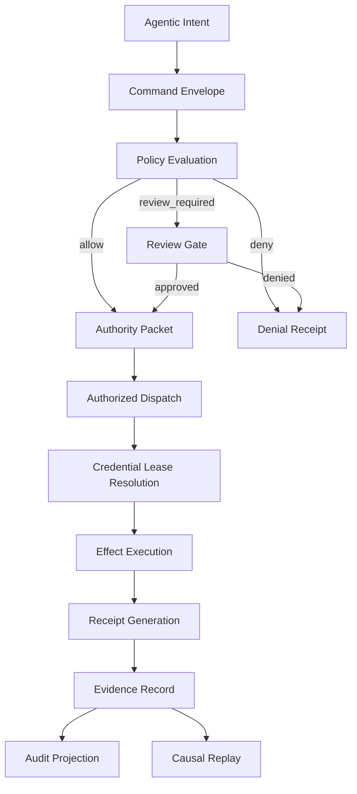

# RFC-0001: GAOP Core Concepts and Architecture

Status: Draft

Version: v1.0

## Abstract

The Governed Agentic Operations Protocol defines a neutral protocol for controlling the consequences of autonomous and semi-autonomous agents. GAOP does not standardize how an agent reasons. GAOP standardizes how an agentic operation becomes authorized, bounded, executed, recorded, and replayed.

The central primitive is the governed effect: a side effect that is traceable to an intent, authorized by a policy decision, constrained by scope, executed through an execution lane, and represented by a durable receipt.

## Normative language

The terms `MUST`, `MUST NOT`, `REQUIRED`, `SHOULD`, `SHOULD NOT`, and `MAY` are to be interpreted as described in RFC 2119 and RFC 8174.

## Scope

GAOP specifies:

1. Protocol vocabulary.
2. Request and authority boundaries.
3. Credential lease semantics.
4. Effect request and receipt semantics.
5. Audit lineage and replay semantics.
6. Human review and compensation semantics.

GAOP does not specify:

1. A programming language.
2. A deployment platform.
3. A workflow engine.
4. A database engine.
5. A specific inference provider.
6. A specific source system or target resource provider.

## Required definitions

### Principal

A principal is an authenticated entity that can request, approve, execute, or observe a governed operation.

Examples include a human operator, a service identity, an automated agent, or a delegated workload identity.

A principal MUST be represented by a stable reference. A principal reference MUST NOT embed raw credentials.

### Tenant

A tenant is an administrative and policy boundary. Every command, authority packet, credential lease, effect request, receipt, and evidence record MUST be associated with exactly one tenant.

### Agentic Intent

An agentic intent is the normalized statement of what an agent or client is attempting to accomplish before specific effects are dispatched.

An intent SHOULD be high-level enough to preserve product meaning and precise enough to evaluate policy. An intent MUST be hashable in canonical form.

### Governed Effect

A governed effect is any externally meaningful consequence produced by an agentic system under GAOP.

Examples include mutating a target resource, reading scoped data, issuing a network request, creating an artifact, initiating a workflow step, or producing a delegated operation request.

A governed effect MUST have an effect receipt.

### Authority Packet

An authority packet is the policy engine output that records whether a requested intent is allowed, denied, or requires human review.

An authority packet MUST include enough cryptographic or deterministic material for an execution layer to verify that it corresponds to the command being executed.

### Credential Lease

A credential lease is a short-lived, scope-bound reference to secret material. A lease MAY travel through workflow state. Materialized secret bytes MUST NOT travel through workflow state.

### Effect Receipt

An effect receipt is the normalized record of an attempted governed effect. It records status, target, hashes, redaction state, timing, execution lane, and relevant evidence references.

An effect receipt MUST NOT persist raw secrets. It SHOULD NOT persist raw provider payloads unless explicitly quarantined under a redaction policy.

### Trace Lineage

Trace lineage is the causal chain connecting input artifacts, command envelopes, authority packets, effect requests, receipts, and audit projections.

Trace lineage MUST support auditor reconstruction of why a governed effect occurred.

### Epistemic Frame

An epistemic frame is the protocol object that records the conditions under which a claim, command, authority decision, effect, receipt, replay result, or audit projection was produced.

An epistemic frame captures system identity, analyzer identity, resource budgets, index completeness, coordination mode, concurrent work, reflexivity state, and external constraint context.

An epistemic frame is not passive metadata. A compliant implementation MAY use it to restrict conclusions, disclose degraded results, prevent unsafe merges, and decide whether two observations are comparable.

### Framed Observation

A framed observation is any protocol-relevant claim whose meaning depends on the conditions of production.

Examples include confidence scores, policy findings, impact analyses, replay conclusions, and audit projections.

### External Constraint

An external constraint is a regulatory, legal, ecosystem, platform, certification, or contractual requirement that affects architecture or execution semantics but may not be encoded directly in local policy bundles.

External constraints MUST be represented separately from local design preferences.

### Policy Bundle

A policy bundle is an immutable set of policy material used to evaluate a command or constrain execution.

Policy bundles MUST be content-addressed or otherwise hash-bound.

### Resource Scope

A resource scope bounds the resources on which an intent or effect may operate. A resource scope may refer to a path prefix, object collection, dataset, queue, endpoint class, account boundary, repository segment, or other implementation-defined resource set.

### Execution Lane

An execution lane is a concrete substrate capable of performing a governed effect. Examples include a connector invocation lane, a script execution lane, a deterministic test lane, or a human-operated lane.

Every execution lane MUST return an effect receipt or a denial receipt.

## Protocol roles

| Role | Responsibility |
|---|---|
| Client | Creates a command envelope representing requested intent. |
| Policy Engine | Evaluates command, tenant, principal, policy bundle, and resource scope. |
| Credential Broker | Issues and materializes short-lived credential leases. |
| Execution Layer | Validates authority and performs or denies effects through execution lanes. |
| Evidence Store | Persists hash-bound records, receipts, and lineage artifacts. |
| Audit Projection | Presents durable evidence in queryable or human-readable form. |
| Review Authority | Approves or denies operations requiring human review. |

## Governance lifecycle



## Protocol invariants

1. A command envelope MUST contain a tenant identifier, actor reference, trace identifier, idempotency key, and requested capability.
2. A policy engine MUST produce an authority packet, denial result, or review gate.
3. An execution layer MUST NOT perform side effects without validating an authority packet or review approval.
4. Credential lease references MAY be persisted; materialized secret values MUST NOT be persisted.
5. Every attempted effect MUST produce a receipt.
6. Every receipt MUST be connectable to a trace lineage record.
7. Permanent evidence MUST be hash-bound.
8. Redaction MUST happen before raw payloads enter permanent audit records.
9. Provider-specific payloads MUST be normalized before becoming protocol receipts.
10. Protocol objects MUST be serializable in a language-neutral representation.
11. Claims, receipts, replay results, and audit projections that depend on system identity, resource limits, coordination state, reflexivity state, or external constraints SHOULD reference an epistemic frame.
12. GAOP-Strict implementations MUST support epistemic frame references as defined in RFC-0008.

## Canonicalization and hashes

GAOP hashes are computed over canonical serialized payloads.

Compliant implementations MUST define and publish the canonicalization method they use. JSON implementations SHOULD use deterministic UTF-8 JSON with sorted object keys, no insignificant whitespace, and stable number/string encoding.

Hash strings SHOULD use this format:

```text
sha256:<lowercase-hex-digest>
```

Implementations MAY support additional algorithms if the algorithm is included in the hash string.

## Core JSON Schema definitions

The following schema defines shared GAOP primitive types.

```json
{
  "$schema": "https://json-schema.org/draft/2020-12/schema",
  "$id": "https://gaop.dev/schemas/v1/core-types.schema.json",
  "title": "GAOP Core Types",
  "type": "object",
  "$defs": {
    "TenantId": {
      "type": "string",
      "minLength": 1,
      "maxLength": 256,
      "pattern": "^[a-zA-Z0-9][a-zA-Z0-9._:-]*$"
    },
    "TraceId": {
      "type": "string",
      "minLength": 16,
      "maxLength": 256,
      "pattern": "^[a-zA-Z0-9][a-zA-Z0-9._:-]*$"
    },
    "StableRef": {
      "type": "string",
      "minLength": 1,
      "maxLength": 2048,
      "pattern": "^[a-zA-Z][a-zA-Z0-9+.-]*://.+$"
    },
    "Hash": {
      "type": "string",
      "pattern": "^[a-z0-9_+-]+:[a-fA-F0-9]{32,}$"
    },
    "Timestamp": {
      "type": "string",
      "format": "date-time"
    },
    "IdempotencyKey": {
      "type": "string",
      "minLength": 8,
      "maxLength": 512,
      "pattern": "^[a-zA-Z0-9][a-zA-Z0-9._:-]*$"
    },
    "CapabilityId": {
      "type": "string",
      "minLength": 1,
      "maxLength": 256,
      "pattern": "^[a-zA-Z0-9][a-zA-Z0-9._:-]*$"
    },
    "Decision": {
      "type": "string",
      "enum": ["allow", "deny", "review_required"]
    },
    "EffectStatus": {
      "type": "string",
      "enum": ["success", "failed", "denied", "timeout", "cancelled", "compensated"]
    },
    "ProtocolVersion": {
      "type": "string",
      "const": "gaop.v1"
    },
    "NonSecretMetadata": {
      "type": "object",
      "additionalProperties": {
        "oneOf": [
          { "type": "string", "maxLength": 4096 },
          { "type": "number" },
          { "type": "integer" },
          { "type": "boolean" },
          { "type": "null" }
        ]
      }
    }
  }
}
```

## Lifecycle rules

1. A command envelope MUST be validated before policy evaluation.
2. A policy evaluation MUST bind the command hash into the authority packet.
3. An authority packet MUST expire or be otherwise bounded.
4. An execution layer MUST reject expired authority packets.
5. A credential lease MUST be scoped to an authority packet or effect request.
6. An effect receipt MUST include enough evidence to distinguish success, denial, failure, timeout, and compensation.
7. Evidence records MUST be append-only from the perspective of the audit trail.
8. Corrections MUST be represented by superseding records, not mutation of historical evidence.

## Compliance levels

| Level | Requirements |
|---|---|
| GAOP-Envelope | Implements command envelopes, authority packets, and effect receipts. |
| GAOP-Evidence | Adds evidence records, trace lineage, and replay hash chains. |
| GAOP-Lease | Adds credential lease and materialization rules. |
| GAOP-HITL | Adds review gates and compensation recipes. |
| GAOP-Epistemic | Adds epistemic frames, analyzer manifests, coordination context, query bounds, reflexivity signals, and external constraints. |
| GAOP-Strict | Implements all required RFC-0001 through RFC-0008 rules. |

## Epistemic extension

Protocol objects defined in RFC-0002 through RFC-0007 MAY carry:

```json
{
  "epistemic_frame_ref": "epistemic-frame://tenant/example/frame",
  "epistemic_frame_hash": "sha256:aaaaaaaaaaaaaaaaaaaaaaaaaaaaaaaaaaaaaaaaaaaaaaaaaaaaaaaaaaaaaaaa"
}
```

If present, `epistemic_frame_hash` MUST be computed over the canonical serialized `EpistemicFrame` defined in RFC-0008.

If a protocol object includes an epistemic frame reference, downstream components MUST preserve it or explicitly create a successor frame that references it.
