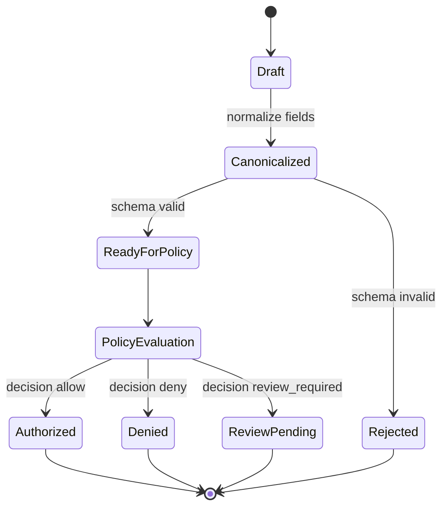

# RFC-0002: The Command and Intent Envelope

Status: Draft

Version: v1.0

## Abstract

This document defines the GAOP command envelope: the protocol object a client uses to request a governed operation. The command envelope binds tenant, actor, trace, idempotency, requested capability, intent, and resource scope into a canonical object suitable for policy evaluation.

## Purpose

The command envelope exists to prevent ambiguous agentic requests from crossing into policy or execution layers.

A command envelope MUST answer:

1. Who is requesting the operation?
2. Which tenant boundary applies?
3. What capability is requested?
4. What resources may be touched?
5. What trace will bind later evidence?
6. What idempotency key prevents duplicate effects?
7. What input artifacts influenced the request?

## Command lifecycle



## Required fields

A `CommandEnvelope` MUST include:

1. `protocol_version`.
2. `command_id`.
3. `tenant_id`.
4. `actor_ref`.
5. `idempotency_key`.
6. `trace_id`.
7. `requested_capability`.
8. `intent`.
9. `resource_scopes`.
10. `created_at`.

## Resource scope semantics

A `ResourceScope` describes the maximum blast radius of a request. Scope is not a suggestion. Policy and execution layers MUST treat scope as a hard boundary.

Well-known scope kinds:

1. `path_prefix`.
2. `object_collection`.
3. `record_set`.
4. `endpoint_class`.
5. `dataset`.
6. `message_queue`.
7. `artifact_collection`.
8. `source_system_segment`.
9. `target_resource_segment`.

Implementations MAY define additional scope kinds. Custom scope kinds SHOULD use a namespaced identifier (e.g., `myorg.kubernetes_namespace`).

Resource scopes MUST be represented by references and constraints. They MUST NOT include raw credentials.

## CommandEnvelope JSON Schema

```json
{
  "$schema": "https://json-schema.org/draft/2020-12/schema",
  "$id": "https://gaop.dev/schemas/v1/command-envelope.schema.json",
  "title": "GAOP CommandEnvelope",
  "type": "object",
  "required": [
    "protocol_version",
    "command_id",
    "tenant_id",
    "actor_ref",
    "idempotency_key",
    "trace_id",
    "requested_capability",
    "intent",
    "resource_scopes",
    "created_at"
  ],
  "additionalProperties": false,
  "properties": {
    "protocol_version": {
      "type": "string",
      "const": "gaop.v1"
    },
    "command_id": {
      "type": "string",
      "minLength": 8,
      "maxLength": 256,
      "pattern": "^[a-zA-Z0-9][a-zA-Z0-9._:-]*$"
    },
    "tenant_id": {
      "type": "string",
      "minLength": 1,
      "maxLength": 256,
      "pattern": "^[a-zA-Z0-9][a-zA-Z0-9._:-]*$"
    },
    "actor_ref": {
      "type": "string",
      "minLength": 1,
      "maxLength": 2048,
      "pattern": "^[a-zA-Z][a-zA-Z0-9+.-]*://.+$"
    },
    "idempotency_key": {
      "type": "string",
      "minLength": 8,
      "maxLength": 512,
      "pattern": "^[a-zA-Z0-9][a-zA-Z0-9._:-]*$"
    },
    "trace_id": {
      "type": "string",
      "minLength": 16,
      "maxLength": 256,
      "pattern": "^[a-zA-Z0-9][a-zA-Z0-9._:-]*$"
    },
    "requested_capability": {
      "$ref": "#/$defs/RequestedCapability"
    },
    "intent": {
      "$ref": "#/$defs/AgenticIntent"
    },
    "resource_scopes": {
      "type": "array",
      "minItems": 1,
      "maxItems": 128,
      "items": {
        "$ref": "#/$defs/ResourceScope"
      }
    },
    "input_artifacts": {
      "type": "array",
      "maxItems": 256,
      "items": {
        "$ref": "#/$defs/InputArtifact"
      },
      "default": []
    },
    "constraints": {
      "$ref": "#/$defs/CommandConstraints"
    },
    "delegation_chain": {
      "type": "array",
      "maxItems": 16,
      "items": {
        "$ref": "#/$defs/DelegationLink"
      },
      "default": []
    },
    "created_at": {
      "type": "string",
      "format": "date-time"
    },
    "expires_at": {
      "type": "string",
      "format": "date-time"
    },
    "epistemic_frame_ref": {
      "type": "string",
      "maxLength": 2048,
      "pattern": "^[a-zA-Z][a-zA-Z0-9+.-]*://.+$"
    },
    "epistemic_frame_hash": {
      "type": "string",
      "pattern": "^[a-z0-9_+-]+:[a-fA-F0-9]{32,}$"
    },
    "metadata": {
      "type": "object",
      "additionalProperties": {
        "oneOf": [
          { "type": "string", "maxLength": 4096 },
          { "type": "number" },
          { "type": "integer" },
          { "type": "boolean" }
        ]
      },
      "default": {}
    }
  },
  "$defs": {
    "RequestedCapability": {
      "type": "object",
      "required": ["capability_id", "operation", "effect_class"],
      "additionalProperties": false,
      "properties": {
        "capability_id": {
          "type": "string",
          "minLength": 1,
          "maxLength": 256,
          "pattern": "^[a-zA-Z0-9][a-zA-Z0-9._:-]*$"
        },
        "operation": {
          "type": "string",
          "minLength": 1,
          "maxLength": 256,
          "pattern": "^[a-zA-Z0-9][a-zA-Z0-9._:-]*$"
        },
        "effect_class": {
          "type": "string",
          "enum": ["read", "write", "delete", "execute", "network", "delegate", "observe", "compensate"]
        },
        "target_kind": {
          "type": "string",
          "minLength": 1,
          "maxLength": 128
        },
        "capability_ref": {
          "type": "string",
          "maxLength": 2048,
          "pattern": "^[a-zA-Z][a-zA-Z0-9+.-]*://.+$"
        }
      }
    },
    "AgenticIntent": {
      "type": "object",
      "required": ["intent_id", "summary", "intent_hash"],
      "additionalProperties": false,
      "properties": {
        "intent_id": {
          "type": "string",
          "minLength": 8,
          "maxLength": 256,
          "pattern": "^[a-zA-Z0-9][a-zA-Z0-9._:-]*$"
        },
        "summary": {
          "type": "string",
          "minLength": 1,
          "maxLength": 4096
        },
        "structured_intent": {
          "type": "object",
          "additionalProperties": true,
          "default": {}
        },
        "intent_hash": {
          "type": "string",
          "pattern": "^[a-z0-9_+-]+:[a-fA-F0-9]{32,}$"
        },
        "origin_ref": {
          "type": "string",
          "maxLength": 2048,
          "pattern": "^[a-zA-Z][a-zA-Z0-9+.-]*://.+$"
        }
      }
    },
    "ResourceScope": {
      "type": "object",
      "required": ["scope_id", "scope_kind", "resource_ref", "access_modes"],
      "additionalProperties": false,
      "properties": {
        "scope_id": {
          "type": "string",
          "minLength": 1,
          "maxLength": 256,
          "pattern": "^[a-zA-Z0-9][a-zA-Z0-9._:-]*$"
        },
        "scope_kind": {
          "type": "string",
          "minLength": 1,
          "maxLength": 256,
          "description": "Well-known values: path_prefix, object_collection, record_set, endpoint_class, dataset, message_queue, artifact_collection, source_system_segment, target_resource_segment. Implementations MAY define additional values using namespaced identifiers.",
          "pattern": "^[a-zA-Z0-9][a-zA-Z0-9._:-]*$"
        },
        "resource_ref": {
          "type": "string",
          "minLength": 1,
          "maxLength": 2048,
          "pattern": "^[a-zA-Z][a-zA-Z0-9+.-]*://.+$"
        },
        "access_modes": {
          "type": "array",
          "minItems": 1,
          "maxItems": 16,
          "items": {
            "type": "string",
            "enum": ["read", "write", "delete", "execute", "network", "list", "metadata", "redacted_read"]
          },
          "uniqueItems": true
        },
        "constraints": {
          "type": "object",
          "additionalProperties": {
            "oneOf": [
              { "type": "string", "maxLength": 4096 },
              { "type": "number" },
              { "type": "integer" },
              { "type": "boolean" },
              { "type": "array" },
              { "type": "object" },
              { "type": "null" }
            ]
          },
          "default": {}
        },
        "expires_at": {
          "type": "string",
          "format": "date-time"
        }
      }
    },
    "InputArtifact": {
      "type": "object",
      "required": ["artifact_ref", "artifact_hash"],
      "additionalProperties": false,
      "properties": {
        "artifact_ref": {
          "type": "string",
          "minLength": 1,
          "maxLength": 2048,
          "pattern": "^[a-zA-Z][a-zA-Z0-9+.-]*://.+$"
        },
        "artifact_hash": {
          "type": "string",
          "pattern": "^[a-z0-9_+-]+:[a-fA-F0-9]{32,}$"
        },
        "artifact_kind": {
          "type": "string",
          "maxLength": 128
        },
        "redaction_manifest_ref": {
          "type": "string",
          "maxLength": 2048,
          "pattern": "^[a-zA-Z][a-zA-Z0-9+.-]*://.+$"
        }
      }
    },
    "CommandConstraints": {
      "type": "object",
      "additionalProperties": false,
      "properties": {
        "max_wall_clock_ms": {
          "type": "integer",
          "minimum": 1,
          "maximum": 86400000
        },
        "max_output_bytes": {
          "type": "integer",
          "minimum": 0
        },
        "requires_review": {
          "type": "boolean"
        },
        "sandbox_class": {
          "type": "string",
          "enum": ["none", "language_runtime", "process", "container", "virtual_machine", "hardware_isolated"]
        },
        "egress_posture": {
          "type": "string",
          "enum": ["none", "allowlisted", "tenant_private", "unrestricted"]
        }
      }
    },
    "DelegationLink": {
      "type": "object",
      "required": ["delegator_ref", "delegatee_ref", "delegation_scope_ids"],
      "additionalProperties": false,
      "properties": {
        "delegator_ref": {
          "type": "string",
          "minLength": 1,
          "maxLength": 2048,
          "pattern": "^[a-zA-Z][a-zA-Z0-9+.-]*://.+$"
        },
        "delegatee_ref": {
          "type": "string",
          "minLength": 1,
          "maxLength": 2048,
          "pattern": "^[a-zA-Z][a-zA-Z0-9+.-]*://.+$"
        },
        "delegation_scope_ids": {
          "type": "array",
          "minItems": 1,
          "maxItems": 128,
          "items": {
            "type": "string",
            "minLength": 1,
            "maxLength": 256
          },
          "uniqueItems": true
        },
        "delegated_at": {
          "type": "string",
          "format": "date-time"
        }
      }
    }
  }
}
```

## Validation rules

1. A command envelope MUST fail validation if any required field is absent.
2. A command envelope MUST fail validation if `resource_scopes` is empty.
3. A command envelope MUST fail validation if `expires_at` is earlier than `created_at`.
4. A command envelope MUST fail validation if resource scopes contain raw secrets.
5. A command envelope SHOULD include at least one input artifact when the operation is derived from prior agent reasoning or external content.
6. A command envelope MUST be canonicalized before policy evaluation.
7. The command hash MUST be computed over the canonical command envelope.

## Idempotency rules

1. A client MUST provide an idempotency key for every command.
2. A receiver MUST use `tenant_id`, `actor_ref`, `capability_id`, `operation`, and `idempotency_key` to detect duplicate commands.
3. A duplicate command with byte-identical canonical payload SHOULD return the previous terminal result.
4. A duplicate command with the same idempotency key and different canonical payload MUST be rejected.
5. Idempotency keys MUST be retained by receivers for at least the lifetime of the associated authority packet. Implementations SHOULD retain keys for at least 24 hours.

## Trace rules

1. `trace_id` MUST be preserved across policy evaluation, authority packet generation, effect execution, receipt generation, and evidence records.
2. A downstream component MUST NOT replace `trace_id`.
3. A downstream component MAY add child trace identifiers if parent linkage is retained.

## Epistemic frame binding

A command envelope MAY include `epistemic_frame_ref` and `epistemic_frame_hash` when the command was produced by an analyzer, planner, autonomous agent, bounded query, replay process, or other system whose output depends on system identity or resource conditions.

For GAOP-Epistemic conformance:

1. Agent-produced command envelopes MUST include an epistemic frame reference.
2. Human-entered command envelopes SHOULD include an epistemic frame reference if the command was shaped by system-generated findings.
3. Commands derived from degraded or partial query results MUST disclose the originating epistemic frame.
4. A policy engine SHOULD treat missing epistemic context as a risk factor for high-impact effects.

## Example command envelope

```json
{
  "protocol_version": "gaop.v1",
  "command_id": "cmd_20260518_000001",
  "tenant_id": "tenant_acme",
  "actor_ref": "principal://tenant_acme/human/alex",
  "idempotency_key": "tenant_acme:cmd:000001",
  "trace_id": "trace_20260518_000001",
  "requested_capability": {
    "capability_id": "capability.artifact.inspect",
    "operation": "artifact.inspect",
    "effect_class": "read",
    "target_kind": "artifact_collection",
    "capability_ref": "capability://artifact-inspection/v1"
  },
  "intent": {
    "intent_id": "intent_20260518_000001",
    "summary": "Inspect scoped build artifacts and produce a redacted diagnostic summary.",
    "structured_intent": {
      "diagnostic_profile": "redacted_read_only"
    },
    "intent_hash": "sha256:1111111111111111111111111111111111111111111111111111111111111111",
    "origin_ref": "input://trace_20260518_000001/request"
  },
  "resource_scopes": [
    {
      "scope_id": "scope_artifacts",
      "scope_kind": "artifact_collection",
      "resource_ref": "artifact-collection://tenant_acme/builds/20260518",
      "access_modes": ["read", "metadata", "redacted_read"],
      "constraints": {
        "max_files": 100,
        "forbid_secret_material": true
      }
    }
  ],
  "input_artifacts": [],
  "constraints": {
    "max_wall_clock_ms": 30000,
    "max_output_bytes": 65536,
    "sandbox_class": "process",
    "egress_posture": "none"
  },
  "created_at": "2026-05-18T00:00:00Z"
}
```

