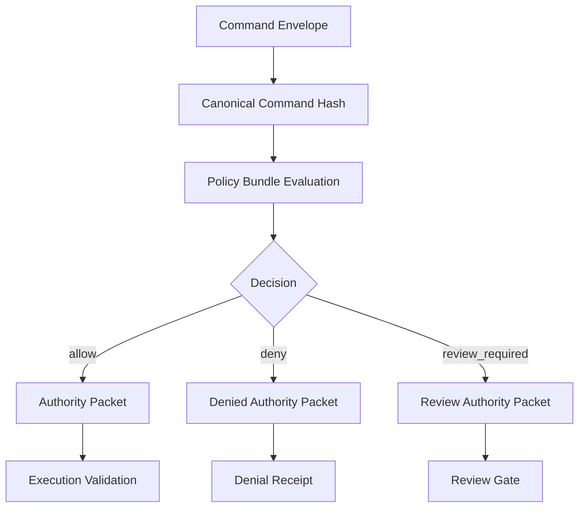

# RFC-0003: The Authority Packet

Status: Draft

Version: v1.0

## Abstract

This document defines the GAOP authority packet. An authority packet is the policy engine output that proves whether a command envelope is allowed, denied, or requires human review.

An execution layer MUST NOT perform side effects unless it validates that an authority packet is fresh, bound to the command, and compatible with the requested execution lane.

## Purpose

The authority packet separates policy evaluation from effect execution. This separation allows one policy engine to evaluate intent and multiple execution lanes to enforce the resulting constraints.

## Authority lifecycle



## Required fields

An `AuthorityPacket` MUST include:

1. `protocol_version`.
2. `authority_id`.
3. `tenant_id`.
4. `trace_id`.
5. `command_id`.
6. `command_hash`.
7. `decision`.
8. `policy_bundle_ref`.
9. `policy_bundle_hash`.
10. `approved_capabilities`.
11. `sandbox_requirements`.
12. `egress_posture`.
13. `decision_hash`.
14. `issued_at`.
15. `expires_at`.

## AuthorityPacket JSON Schema

```json
{
  "$schema": "https://json-schema.org/draft/2020-12/schema",
  "$id": "https://gaop.dev/schemas/v1/authority-packet.schema.json",
  "title": "GAOP AuthorityPacket",
  "type": "object",
  "required": [
    "protocol_version",
    "authority_id",
    "tenant_id",
    "trace_id",
    "command_id",
    "command_hash",
    "decision",
    "policy_bundle_ref",
    "policy_bundle_hash",
    "approved_capabilities",
    "sandbox_requirements",
    "egress_posture",
    "decision_hash",
    "issued_at",
    "expires_at"
  ],
  "additionalProperties": false,
  "properties": {
    "protocol_version": {
      "type": "string",
      "const": "gaop.v1"
    },
    "authority_id": {
      "type": "string",
      "minLength": 8,
      "maxLength": 256,
      "pattern": "^[a-zA-Z0-9][a-zA-Z0-9._:-]*$"
    },
    "tenant_id": {
      "type": "string",
      "minLength": 1,
      "maxLength": 256,
      "pattern": "^[a-zA-Z0-9][a-zA-Z0-9._:-]*$"
    },
    "trace_id": {
      "type": "string",
      "minLength": 16,
      "maxLength": 256,
      "pattern": "^[a-zA-Z0-9][a-zA-Z0-9._:-]*$"
    },
    "command_id": {
      "type": "string",
      "minLength": 8,
      "maxLength": 256,
      "pattern": "^[a-zA-Z0-9][a-zA-Z0-9._:-]*$"
    },
    "command_hash": {
      "type": "string",
      "pattern": "^[a-z0-9_+-]+:[a-fA-F0-9]{32,}$"
    },
    "decision": {
      "type": "string",
      "enum": ["allow", "deny", "review_required"]
    },
    "policy_bundle_ref": {
      "type": "string",
      "minLength": 1,
      "maxLength": 2048,
      "pattern": "^[a-zA-Z][a-zA-Z0-9+.-]*://.+$"
    },
    "policy_bundle_hash": {
      "type": "string",
      "pattern": "^[a-z0-9_+-]+:[a-fA-F0-9]{32,}$"
    },
    "approved_capabilities": {
      "type": "array",
      "maxItems": 128,
      "items": {
        "$ref": "#/$defs/ApprovedCapability"
      }
    },
    "sandbox_requirements": {
      "$ref": "#/$defs/SandboxRequirements"
    },
    "egress_posture": {
      "$ref": "#/$defs/EgressPosture"
    },
    "denial_reasons": {
      "type": "array",
      "maxItems": 64,
      "items": {
        "$ref": "#/$defs/DenialReason"
      },
      "default": []
    },
    "review_requirements": {
      "type": "array",
      "maxItems": 64,
      "items": {
        "$ref": "#/$defs/ReviewRequirement"
      },
      "default": []
    },
    "conditions": {
      "type": "object",
      "additionalProperties": {
        "oneOf": [
          { "type": "string", "maxLength": 4096 },
          { "type": "number" },
          { "type": "integer" },
          { "type": "boolean" },
          { "type": "array" },
          { "type": "object" },
          { "type": "null" }
        ]
      },
      "default": {}
    },
    "decision_hash": {
      "type": "string",
      "pattern": "^[a-z0-9_+-]+:[a-fA-F0-9]{32,}$"
    },
    "signature": {
      "$ref": "#/$defs/Signature"
    },
    "issued_at": {
      "type": "string",
      "format": "date-time"
    },
    "expires_at": {
      "type": "string",
      "format": "date-time"
    }
  },
  "$defs": {
    "ApprovedCapability": {
      "type": "object",
      "required": ["capability_id", "operations", "resource_scope_ids"],
      "additionalProperties": false,
      "properties": {
        "capability_id": {
          "type": "string",
          "minLength": 1,
          "maxLength": 256,
          "pattern": "^[a-zA-Z0-9][a-zA-Z0-9._:-]*$"
        },
        "operations": {
          "type": "array",
          "minItems": 1,
          "maxItems": 64,
          "items": {
            "type": "string",
            "minLength": 1,
            "maxLength": 256
          },
          "uniqueItems": true
        },
        "resource_scope_ids": {
          "type": "array",
          "minItems": 1,
          "maxItems": 128,
          "items": {
            "type": "string",
            "minLength": 1,
            "maxLength": 256
          },
          "uniqueItems": true
        },
        "max_uses": {
          "type": "integer",
          "minimum": 1
        }
      }
    },
    "SandboxRequirements": {
      "type": "object",
      "required": ["sandbox_class", "network", "filesystem", "process"],
      "additionalProperties": false,
      "properties": {
        "sandbox_class": {
          "type": "string",
          "enum": ["none", "language_runtime", "process", "container", "virtual_machine", "hardware_isolated"]
        },
        "network": {
          "type": "string",
          "enum": ["none", "allowlisted", "tenant_private", "unrestricted"]
        },
        "filesystem": {
          "type": "string",
          "enum": ["none", "read_only_scoped", "read_write_scoped", "unrestricted"]
        },
        "process": {
          "type": "string",
          "enum": ["none", "no_spawn", "allowlisted_spawn", "unrestricted"]
        },
        "max_wall_clock_ms": {
          "type": "integer",
          "minimum": 1
        },
        "max_output_bytes": {
          "type": "integer",
          "minimum": 0
        }
      }
    },
    "EgressPosture": {
      "type": "object",
      "required": ["mode"],
      "additionalProperties": false,
      "properties": {
        "mode": {
          "type": "string",
          "enum": ["none", "allowlisted", "tenant_private", "unrestricted"]
        },
        "allowed_endpoint_refs": {
          "type": "array",
          "maxItems": 256,
          "items": {
            "type": "string",
            "maxLength": 2048,
            "pattern": "^[a-zA-Z][a-zA-Z0-9+.-]*://.+$"
          },
          "default": []
        }
      }
    },
    "DenialReason": {
      "type": "object",
      "required": ["code", "message"],
      "additionalProperties": false,
      "properties": {
        "code": {
          "type": "string",
          "minLength": 1,
          "maxLength": 128
        },
        "message": {
          "type": "string",
          "minLength": 1,
          "maxLength": 4096
        },
        "policy_ref": {
          "type": "string",
          "maxLength": 2048,
          "pattern": "^[a-zA-Z][a-zA-Z0-9+.-]*://.+$"
        }
      }
    },
    "ReviewRequirement": {
      "type": "object",
      "required": ["requirement_id", "review_reason", "required_reviewer_class"],
      "additionalProperties": false,
      "properties": {
        "requirement_id": {
          "type": "string",
          "minLength": 1,
          "maxLength": 256
        },
        "review_reason": {
          "type": "string",
          "minLength": 1,
          "maxLength": 4096
        },
        "required_reviewer_class": {
          "type": "string",
          "minLength": 1,
          "maxLength": 256
        }
      }
    },
    "Signature": {
      "type": "object",
      "required": ["signature_algorithm", "key_ref", "signature_value"],
      "additionalProperties": false,
      "properties": {
        "signature_algorithm": {
          "type": "string",
          "minLength": 1,
          "maxLength": 128
        },
        "key_ref": {
          "type": "string",
          "minLength": 1,
          "maxLength": 2048,
          "pattern": "^[a-zA-Z][a-zA-Z0-9+.-]*://.+$"
        },
        "signature_value": {
          "type": "string",
          "minLength": 1
        }
      }
    }
  }
}
```

## Decision hash rules

The `decision_hash` MUST bind the authority packet to the command and approved constraints.

At minimum, the decision hash input MUST include:

1. `protocol_version`.
2. `tenant_id`.
3. `trace_id`.
4. `command_id`.
5. `command_hash`.
6. `decision`.
7. `policy_bundle_ref`.
8. `policy_bundle_hash`.
9. `approved_capabilities`.
10. `sandbox_requirements`.
11. `egress_posture`.
12. `conditions`.
13. `issued_at`.
14. `expires_at`.

An execution layer MUST recompute or verify `decision_hash` before performing side effects.

If the authority packet includes a signature, an execution layer MUST verify the signature before accepting the authority packet.

## Execution validation rules

Before effect execution, an execution layer MUST verify:

1. The authority packet schema is valid.
2. The authority packet is not expired.
3. The `tenant_id` matches the effect request.
4. The `trace_id` matches the effect request.
5. The `command_hash` matches the command envelope hash.
6. The `decision_hash` is valid.
7. The requested capability is included in `approved_capabilities`.
8. The requested resource scopes are included in approved scope ids.
9. The execution lane satisfies `sandbox_requirements`.
10. The egress configuration satisfies `egress_posture`.

If any validation fails, the execution layer MUST return a denial receipt and MUST NOT perform the requested side effect.

## Decision semantics

| Decision | Meaning | Execution behavior |
|---|---|---|
| `allow` | The command is authorized under stated constraints. | Execution MAY proceed after validation. |
| `deny` | The command is not authorized. | Execution MUST NOT proceed. |
| `review_required` | Human or delegated review is required. | Execution MUST pause until a valid review approval is bound. |

## Freshness rules

1. `expires_at` MUST be present.
2. Execution MUST reject expired authority packets.
3. Implementations SHOULD keep authority packet lifetimes short.
4. An authority packet SHOULD be single-use for high-risk write, delete, execute, network, or delegation operations.


## Epistemic validation rules

An authority packet MAY include `epistemic_frame_ref` and `epistemic_frame_hash`.

For GAOP-Epistemic conformance:

1. A policy engine MUST record the epistemic frame under which it evaluated policy.
2. If policy evaluation uses model-generated classification, static analysis, retrieved context, or bounded query output, the authority packet MUST reference an epistemic frame.
3. If an authority packet relies on degraded or partial evidence, `decision` SHOULD be `deny` or `review_required` for high-impact effects unless policy explicitly permits degraded evidence.
4. If an authority packet compares confidence scores from different analyzer manifests, it MUST verify manifest transition compatibility as defined in RFC-0008.
5. An execution layer MAY reject authority packets whose epistemic frame is missing, expired, incompatible, or lower-trust than the requested effect class permits.

Schema fragment:

```json
{
  "epistemic_frame_ref": {
    "type": "string",
    "maxLength": 2048,
    "pattern": "^[a-zA-Z][a-zA-Z0-9+.-]*://.+$"
  },
  "epistemic_frame_hash": {
    "type": "string",
    "pattern": "^[a-z0-9_+-]+:[a-fA-F0-9]{32,}$"
  },
  "epistemic_disclosures": {
    "type": "array",
    "maxItems": 128,
    "items": {
      "type": "string",
      "maxLength": 4096
    }
  }
}
```
