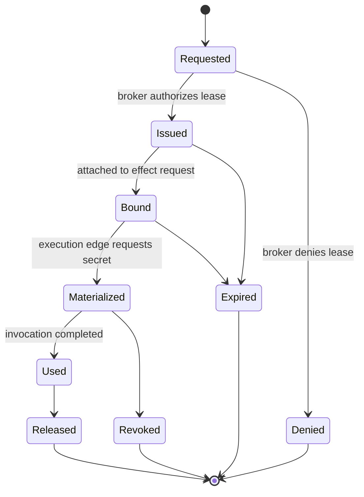

# RFC-0004: Credential Leasing and Materialization

Status: Draft

Version: v1.0

## Abstract

This document defines GAOP credential leases. A credential lease is a short-lived, scope-bound reference to secret material. Lease references may travel through protocol state. Materialized secret values must exist only at the execution edge and must never be persisted in logs, receipts, evidence records, or workflow state.

## Core rule

GAOP separates lease from secret.

```text
CredentialLease travels through protocol state.
Materialized secret bytes exist only at the edge of invocation.
```

## Lease lifecycle



## CredentialLease JSON Schema

```json
{
  "$schema": "https://json-schema.org/draft/2020-12/schema",
  "$id": "https://gaop.dev/schemas/v1/credential-lease.schema.json",
  "title": "GAOP CredentialLease",
  "type": "object",
  "required": [
    "protocol_version",
    "lease_ref",
    "tenant_id",
    "principal_ref",
    "trace_id",
    "authority_id",
    "authority_hash",
    "resource_scope_ids",
    "secret_class",
    "broker_ref",
    "status",
    "issued_at",
    "expires_at"
  ],
  "additionalProperties": false,
  "properties": {
    "protocol_version": {
      "type": "string",
      "const": "gaop.v1"
    },
    "lease_ref": {
      "type": "string",
      "minLength": 1,
      "maxLength": 2048,
      "pattern": "^[a-zA-Z][a-zA-Z0-9+.-]*://.+$"
    },
    "tenant_id": {
      "type": "string",
      "minLength": 1,
      "maxLength": 256,
      "pattern": "^[a-zA-Z0-9][a-zA-Z0-9._:-]*$"
    },
    "principal_ref": {
      "type": "string",
      "minLength": 1,
      "maxLength": 2048,
      "pattern": "^[a-zA-Z][a-zA-Z0-9+.-]*://.+$"
    },
    "trace_id": {
      "type": "string",
      "minLength": 16,
      "maxLength": 256,
      "pattern": "^[a-zA-Z0-9][a-zA-Z0-9._:-]*$"
    },
    "authority_id": {
      "type": "string",
      "minLength": 8,
      "maxLength": 256,
      "pattern": "^[a-zA-Z0-9][a-zA-Z0-9._:-]*$"
    },
    "authority_hash": {
      "type": "string",
      "pattern": "^[a-z0-9_+-]+:[a-fA-F0-9]{32,}$"
    },
    "resource_scope_ids": {
      "type": "array",
      "minItems": 1,
      "maxItems": 128,
      "items": {
        "type": "string",
        "minLength": 1,
        "maxLength": 256
      },
      "uniqueItems": true
    },
    "allowed_audiences": {
      "type": "array",
      "maxItems": 64,
      "items": {
        "type": "string",
        "minLength": 1,
        "maxLength": 512
      },
      "default": []
    },
    "secret_class": {
      "type": "string",
      "enum": ["api_token", "session_token", "private_key", "certificate", "password", "delegated_assertion", "opaque"]
    },
    "broker_ref": {
      "type": "string",
      "minLength": 1,
      "maxLength": 2048,
      "pattern": "^[a-zA-Z][a-zA-Z0-9+.-]*://.+$"
    },
    "status": {
      "type": "string",
      "enum": ["issued", "bound", "materialized", "released", "expired", "revoked", "denied"]
    },
    "max_uses": {
      "type": "integer",
      "minimum": 1,
      "default": 1
    },
    "remaining_uses": {
      "type": "integer",
      "minimum": 0
    },
    "epistemic_frame_ref": {
      "type": "string",
      "maxLength": 2048,
      "pattern": "^[a-zA-Z][a-zA-Z0-9+.-]*://.+$"
    },
    "epistemic_frame_hash": {
      "type": "string",
      "pattern": "^[a-z0-9_+-]+:[a-fA-F0-9]{32,}$"
    },
    "issued_at": {
      "type": "string",
      "format": "date-time"
    },
    "expires_at": {
      "type": "string",
      "format": "date-time"
    },
    "metadata": {
      "type": "object",
      "additionalProperties": {
        "oneOf": [
          { "type": "string", "maxLength": 4096 },
          { "type": "number" },
          { "type": "integer" },
          { "type": "boolean" }
        ]
      },
      "default": {}
    }
  }
}
```

## MaterializationRequest JSON Schema

```json
{
  "$schema": "https://json-schema.org/draft/2020-12/schema",
  "$id": "https://gaop.dev/schemas/v1/materialization-request.schema.json",
  "title": "GAOP MaterializationRequest",
  "type": "object",
  "required": [
    "protocol_version",
    "materialization_id",
    "lease_ref",
    "tenant_id",
    "trace_id",
    "effect_request_hash",
    "execution_lane_ref",
    "requested_at"
  ],
  "additionalProperties": false,
  "properties": {
    "protocol_version": {
      "type": "string",
      "const": "gaop.v1"
    },
    "materialization_id": {
      "type": "string",
      "minLength": 8,
      "maxLength": 256,
      "pattern": "^[a-zA-Z0-9][a-zA-Z0-9._:-]*$"
    },
    "lease_ref": {
      "type": "string",
      "minLength": 1,
      "maxLength": 2048,
      "pattern": "^[a-zA-Z][a-zA-Z0-9+.-]*://.+$"
    },
    "tenant_id": {
      "type": "string",
      "minLength": 1,
      "maxLength": 256,
      "pattern": "^[a-zA-Z0-9][a-zA-Z0-9._:-]*$"
    },
    "trace_id": {
      "type": "string",
      "minLength": 16,
      "maxLength": 256,
      "pattern": "^[a-zA-Z0-9][a-zA-Z0-9._:-]*$"
    },
    "effect_request_hash": {
      "type": "string",
      "pattern": "^[a-z0-9_+-]+:[a-fA-F0-9]{32,}$"
    },
    "execution_lane_ref": {
      "type": "string",
      "minLength": 1,
      "maxLength": 2048,
      "pattern": "^[a-zA-Z][a-zA-Z0-9+.-]*://.+$"
    },
    "requested_at": {
      "type": "string",
      "format": "date-time"
    }
  }
}
```

## MaterializationReceipt JSON Schema

```json
{
  "$schema": "https://json-schema.org/draft/2020-12/schema",
  "$id": "https://gaop.dev/schemas/v1/materialization-receipt.schema.json",
  "title": "GAOP MaterializationReceipt",
  "type": "object",
  "required": [
    "protocol_version",
    "materialization_id",
    "lease_ref",
    "tenant_id",
    "trace_id",
    "status",
    "secret_fingerprint",
    "materialized_at"
  ],
  "additionalProperties": false,
  "properties": {
    "protocol_version": {
      "type": "string",
      "const": "gaop.v1"
    },
    "materialization_id": {
      "type": "string",
      "minLength": 8,
      "maxLength": 256,
      "pattern": "^[a-zA-Z0-9][a-zA-Z0-9._:-]*$"
    },
    "lease_ref": {
      "type": "string",
      "minLength": 1,
      "maxLength": 2048,
      "pattern": "^[a-zA-Z][a-zA-Z0-9+.-]*://.+$"
    },
    "tenant_id": {
      "type": "string",
      "minLength": 1,
      "maxLength": 256,
      "pattern": "^[a-zA-Z0-9][a-zA-Z0-9._:-]*$"
    },
    "trace_id": {
      "type": "string",
      "minLength": 16,
      "maxLength": 256,
      "pattern": "^[a-zA-Z0-9][a-zA-Z0-9._:-]*$"
    },
    "status": {
      "type": "string",
      "enum": ["materialized", "denied", "expired", "revoked", "failed"]
    },
    "secret_fingerprint": {
      "type": "string",
      "description": "Non-secret fingerprint or hash commitment. MUST NOT be sufficient to recover the secret.",
      "pattern": "^[a-z0-9_+-]+:[a-fA-F0-9]{32,}$"
    },
    "epistemic_frame_ref": {
      "type": "string",
      "maxLength": 2048,
      "pattern": "^[a-zA-Z][a-zA-Z0-9+.-]*://.+$"
    },
    "epistemic_frame_hash": {
      "type": "string",
      "pattern": "^[a-z0-9_+-]+:[a-fA-F0-9]{32,}$"
    },
    "materialized_at": {
      "type": "string",
      "format": "date-time"
    },
    "released_at": {
      "type": "string",
      "format": "date-time"
    },
    "denial_reason": {
      "type": "string",
      "maxLength": 4096
    }
  }
}
```

## Lease rules

1. A credential lease MUST be bound to one tenant.
2. A credential lease MUST be bound to an authority packet or equivalent authorization hash.
3. A credential lease MUST expire.
4. A credential lease SHOULD be single-use for write, delete, execute, network, or delegation effects.
5. A credential lease MUST NOT contain raw secret material.
6. A credential lease MUST NOT be usable outside its resource scope ids.
7. A credential lease MUST NOT be materialized by a component that cannot validate the corresponding effect request.

## Materialization rules

1. Secret material MUST be materialized only at the execution edge.
2. Secret material MUST NOT be written to durable workflow state.
3. Secret material MUST NOT appear in effect receipts.
4. Secret material MUST NOT appear in audit lineage.
5. Logs MUST redact materialized secret values.
6. Materialization SHOULD occur as late as possible.
7. Materialized secret values SHOULD be released immediately after invocation.
8. Failed materialization MUST produce a receipt or denial artifact.

## Audit rules

Permanent records MAY include:

1. `lease_ref`.
2. `secret_class`.
3. `broker_ref`.
4. `secret_fingerprint`.
5. `issued_at`.
6. `expires_at`.
7. `materialized_at`.
8. `released_at`.
9. Denial or failure reason.

Permanent records MUST NOT include:

1. Access tokens.
2. Session tokens.
3. Private keys.
4. Passwords.
5. Raw certificates containing private material.
6. Unredacted authorization headers.
7. Unredacted cookie values.

## Epistemic frame binding

For GAOP-Epistemic conformance:

1. A credential lease issued from model-generated or analyzer-generated intent MUST preserve the originating epistemic frame.
2. A materialization receipt MUST disclose if the lease was issued under degraded query evidence, best-effort coordination, or an incompatible analyzer transition.
3. A credential broker MAY deny materialization when the epistemic frame is stale, degraded, or incompatible with the requested secret class.
4. Materialization at the edge MUST NOT weaken the epistemic frame. If a new frame is created at materialization time, it MUST reference the prior frame.

