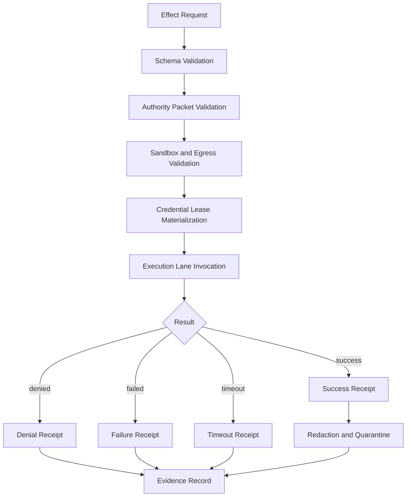

# RFC-0005: Governed Effects and Receipts

Status: Draft

Version: v1.0

## Abstract

This document defines the GAOP effect request and effect receipt. An effect request is the execution-layer payload that carries an authority reference and bounded operation request. An effect receipt is the normalized, durable proof of what happened.

## Effect lifecycle



## EffectRequest JSON Schema

The effect request references the authority packet by `authority_id` and `authority_hash`. The execution layer MUST retrieve and validate the full authority packet before performing side effects.

```json
{
  "$schema": "https://json-schema.org/draft/2020-12/schema",
  "$id": "https://gaop.dev/schemas/v1/effect-request.schema.json",
  "title": "GAOP EffectRequest",
  "type": "object",
  "required": [
    "protocol_version",
    "effect_request_id",
    "tenant_id",
    "trace_id",
    "command_id",
    "command_hash",
    "authority_id",
    "authority_hash",
    "target_ref",
    "operation",
    "resource_scope_ids",
    "execution_lane_ref",
    "requested_at"
  ],
  "additionalProperties": false,
  "properties": {
    "protocol_version": {
      "type": "string",
      "const": "gaop.v1"
    },
    "effect_request_id": {
      "type": "string",
      "minLength": 8,
      "maxLength": 256,
      "pattern": "^[a-zA-Z0-9][a-zA-Z0-9._:-]*$"
    },
    "tenant_id": {
      "type": "string",
      "minLength": 1,
      "maxLength": 256,
      "pattern": "^[a-zA-Z0-9][a-zA-Z0-9._:-]*$"
    },
    "trace_id": {
      "type": "string",
      "minLength": 16,
      "maxLength": 256,
      "pattern": "^[a-zA-Z0-9][a-zA-Z0-9._:-]*$"
    },
    "command_id": {
      "type": "string",
      "minLength": 8,
      "maxLength": 256,
      "pattern": "^[a-zA-Z0-9][a-zA-Z0-9._:-]*$"
    },
    "command_hash": {
      "type": "string",
      "pattern": "^[a-z0-9_+-]+:[a-fA-F0-9]{32,}$"
    },
    "authority_id": {
      "type": "string",
      "minLength": 8,
      "maxLength": 256,
      "pattern": "^[a-zA-Z0-9][a-zA-Z0-9._:-]*$"
    },
    "authority_hash": {
      "type": "string",
      "pattern": "^[a-z0-9_+-]+:[a-fA-F0-9]{32,}$"
    },
    "target_ref": {
      "type": "string",
      "minLength": 1,
      "maxLength": 2048,
      "pattern": "^[a-zA-Z][a-zA-Z0-9+.-]*://.+$"
    },
    "operation": {
      "type": "string",
      "minLength": 1,
      "maxLength": 256,
      "pattern": "^[a-zA-Z0-9][a-zA-Z0-9._:-]*$"
    },
    "resource_scope_ids": {
      "type": "array",
      "minItems": 1,
      "maxItems": 128,
      "items": {
        "type": "string",
        "minLength": 1,
        "maxLength": 256
      },
      "uniqueItems": true
    },
    "credential_lease_refs": {
      "type": "array",
      "maxItems": 64,
      "items": {
        "type": "string",
        "minLength": 1,
        "maxLength": 2048,
        "pattern": "^[a-zA-Z][a-zA-Z0-9+.-]*://.+$"
      },
      "default": []
    },
    "execution_lane_ref": {
      "type": "string",
      "minLength": 1,
      "maxLength": 2048,
      "pattern": "^[a-zA-Z][a-zA-Z0-9+.-]*://.+$"
    },
    "input_payload_ref": {
      "type": "string",
      "maxLength": 2048,
      "pattern": "^[a-zA-Z][a-zA-Z0-9+.-]*://.+$"
    },
    "input_payload_hash": {
      "type": "string",
      "pattern": "^[a-z0-9_+-]+:[a-fA-F0-9]{32,}$"
    },
    "epistemic_frame_ref": {
      "type": "string",
      "maxLength": 2048,
      "pattern": "^[a-zA-Z][a-zA-Z0-9+.-]*://.+$"
    },
    "epistemic_frame_hash": {
      "type": "string",
      "pattern": "^[a-z0-9_+-]+:[a-fA-F0-9]{32,}$"
    },
    "requested_at": {
      "type": "string",
      "format": "date-time"
    }
  }
}
```

## EffectReceipt JSON Schema

```json
{
  "$schema": "https://json-schema.org/draft/2020-12/schema",
  "$id": "https://gaop.dev/schemas/v1/effect-receipt.schema.json",
  "title": "GAOP EffectReceipt",
  "type": "object",
  "required": [
    "protocol_version",
    "receipt_id",
    "effect_request_id",
    "tenant_id",
    "trace_id",
    "actor_ref",
    "status",
    "target_ref",
    "operation",
    "execution_lane_ref",
    "authority_id",
    "authority_hash",
    "output_hash",
    "started_at",
    "completed_at"
  ],
  "additionalProperties": false,
  "properties": {
    "protocol_version": {
      "type": "string",
      "const": "gaop.v1"
    },
    "receipt_id": {
      "type": "string",
      "minLength": 8,
      "maxLength": 256,
      "pattern": "^[a-zA-Z0-9][a-zA-Z0-9._:-]*$"
    },
    "effect_request_id": {
      "type": "string",
      "minLength": 8,
      "maxLength": 256,
      "pattern": "^[a-zA-Z0-9][a-zA-Z0-9._:-]*$"
    },
    "tenant_id": {
      "type": "string",
      "minLength": 1,
      "maxLength": 256,
      "pattern": "^[a-zA-Z0-9][a-zA-Z0-9._:-]*$"
    },
    "trace_id": {
      "type": "string",
      "minLength": 16,
      "maxLength": 256,
      "pattern": "^[a-zA-Z0-9][a-zA-Z0-9._:-]*$"
    },
    "actor_ref": {
      "type": "string",
      "minLength": 1,
      "maxLength": 2048,
      "pattern": "^[a-zA-Z][a-zA-Z0-9+.-]*://.+$"
    },
    "status": {
      "type": "string",
      "enum": ["success", "failed", "denied", "timeout", "cancelled", "compensated"]
    },
    "target_ref": {
      "type": "string",
      "minLength": 1,
      "maxLength": 2048,
      "pattern": "^[a-zA-Z][a-zA-Z0-9+.-]*://.+$"
    },
    "operation": {
      "type": "string",
      "minLength": 1,
      "maxLength": 256,
      "pattern": "^[a-zA-Z0-9][a-zA-Z0-9._:-]*$"
    },
    "execution_lane_ref": {
      "type": "string",
      "minLength": 1,
      "maxLength": 2048,
      "pattern": "^[a-zA-Z][a-zA-Z0-9+.-]*://.+$"
    },
    "authority_id": {
      "type": "string",
      "minLength": 8,
      "maxLength": 256,
      "pattern": "^[a-zA-Z0-9][a-zA-Z0-9._:-]*$"
    },
    "authority_hash": {
      "type": "string",
      "pattern": "^[a-z0-9_+-]+:[a-fA-F0-9]{32,}$"
    },
    "output_hash": {
      "type": "string",
      "pattern": "^[a-z0-9_+-]+:[a-fA-F0-9]{32,}$"
    },
    "redaction_manifest_ref": {
      "type": "string",
      "maxLength": 2048,
      "pattern": "^[a-zA-Z][a-zA-Z0-9+.-]*://.+$"
    },
    "quarantine_refs": {
      "type": "array",
      "maxItems": 128,
      "items": {
        "type": "string",
        "minLength": 1,
        "maxLength": 2048,
        "pattern": "^[a-zA-Z][a-zA-Z0-9+.-]*://.+$"
      },
      "default": []
    },
    "artifact_refs": {
      "type": "array",
      "maxItems": 256,
      "items": {
        "type": "string",
        "minLength": 1,
        "maxLength": 2048,
        "pattern": "^[a-zA-Z][a-zA-Z0-9+.-]*://.+$"
      },
      "default": []
    },
    "error_detail": {
      "description": "Structured error information. Uses the ErrorDetail schema from RFC-0001 core types.",
      "type": "object",
      "required": ["category", "code", "message"],
      "additionalProperties": false,
      "properties": {
        "category": {
          "type": "string",
          "enum": ["client", "policy", "execution", "infrastructure", "lease", "review", "epistemic"]
        },
        "code": {
          "type": "string",
          "minLength": 1,
          "maxLength": 256,
          "pattern": "^[a-zA-Z0-9][a-zA-Z0-9._:-]*$"
        },
        "message": {
          "type": "string",
          "minLength": 1,
          "maxLength": 4096
        },
        "retryable": {
          "type": "boolean",
          "default": false
        },
        "detail_ref": {
          "type": "string",
          "maxLength": 2048,
          "pattern": "^[a-zA-Z][a-zA-Z0-9+.-]*://.+$"
        }
      }
    },
    "epistemic_frame_ref": {
      "type": "string",
      "maxLength": 2048,
      "pattern": "^[a-zA-Z][a-zA-Z0-9+.-]*://.+$"
    },
    "epistemic_frame_hash": {
      "type": "string",
      "pattern": "^[a-z0-9_+-]+:[a-fA-F0-9]{32,}$"
    },
    "execution_completeness": {
      "type": "number",
      "minimum": 0.0,
      "maximum": 1.0
    },
    "degradation_disclosure": {
      "type": "object",
      "additionalProperties": true
    },
    "external_constraint_refs": {
      "type": "array",
      "maxItems": 128,
      "items": {
        "type": "string",
        "maxLength": 2048,
        "pattern": "^[a-zA-Z][a-zA-Z0-9+.-]*://.+$"
      },
      "default": []
    },
    "started_at": {
      "type": "string",
      "format": "date-time"
    },
    "completed_at": {
      "type": "string",
      "format": "date-time"
    },
    "duration_ms": {
      "type": "integer",
      "minimum": 0
    }
  }
}
```

## RedactionManifest JSON Schema

```json
{
  "$schema": "https://json-schema.org/draft/2020-12/schema",
  "$id": "https://gaop.dev/schemas/v1/redaction-manifest.schema.json",
  "title": "GAOP RedactionManifest",
  "type": "object",
  "required": [
    "protocol_version",
    "redaction_manifest_ref",
    "redaction_policy_ref",
    "redaction_policy_hash",
    "input_hash",
    "output_hash",
    "created_at"
  ],
  "additionalProperties": false,
  "properties": {
    "protocol_version": {
      "type": "string",
      "const": "gaop.v1"
    },
    "redaction_manifest_ref": {
      "type": "string",
      "minLength": 1,
      "maxLength": 2048,
      "pattern": "^[a-zA-Z][a-zA-Z0-9+.-]*://.+$"
    },
    "redaction_policy_ref": {
      "type": "string",
      "minLength": 1,
      "maxLength": 2048,
      "pattern": "^[a-zA-Z][a-zA-Z0-9+.-]*://.+$"
    },
    "redaction_policy_hash": {
      "type": "string",
      "pattern": "^[a-z0-9_+-]+:[a-fA-F0-9]{32,}$"
    },
    "input_hash": {
      "type": "string",
      "pattern": "^[a-z0-9_+-]+:[a-fA-F0-9]{32,}$"
    },
    "output_hash": {
      "type": "string",
      "pattern": "^[a-z0-9_+-]+:[a-fA-F0-9]{32,}$"
    },
    "redacted_fields": {
      "type": "array",
      "maxItems": 1024,
      "items": {
        "type": "string",
        "maxLength": 1024
      },
      "default": []
    },
    "quarantined": {
      "type": "boolean",
      "default": false
    },
    "created_at": {
      "type": "string",
      "format": "date-time"
    }
  }
}
```

## Receipt rules

1. Every attempted side effect MUST produce an effect receipt.
2. A denied effect MUST produce a receipt with `status: "denied"`.
3. A timed-out effect MUST produce a receipt with `status: "timeout"`.
4. A failed effect MUST include an `error_detail` object that distinguishes platform failure from target-resource failure when possible.
5. `output_hash` MUST hash the normalized, redacted output or a deterministic empty payload.
6. Raw target payloads MUST be redacted or quarantined before permanent receipt persistence.
7. `target_ref` MUST be a stable reference, not a raw credential-bearing endpoint.
8. An effect receipt MUST preserve `trace_id`.
9. An effect receipt MUST include `actor_ref` from the originating command envelope.
10. `redaction_manifest_ref` SHOULD be present when the effect produces output that requires redaction. It MAY be absent for effects with no sensitive output.

## Quarantine rules

Raw provider or target-resource payloads MAY be stored in a quarantine store when needed for debugging, compliance, or replay.

Quarantined payloads:

1. MUST be access-controlled.
2. MUST be referenced by opaque quarantine refs.
3. MUST NOT be embedded in effect receipts.
4. MUST have a retention policy.
5. SHOULD have a redaction manifest.
6. SHOULD be encrypted at rest.

## Execution lane rules

1. Execution lanes MUST validate authority before side effects.
2. Execution lanes MUST enforce sandbox and egress requirements.
3. Execution lanes MUST reject requests with unknown or unsupported capability ids.
4. Execution lanes MUST return normalized receipts.
5. Execution lanes MUST NOT treat raw target payloads as permanent receipt bodies.

## Epistemic receipt rules

For GAOP-Epistemic conformance:

1. An effect request MUST preserve the epistemic frame from the authority packet unless it creates a successor frame.
2. An execution lane MUST disclose if it ran under a degraded resource class, partial index, best-effort coordination mode, or external constraint exception.
3. An effect receipt MUST disclose whether the execution result is complete, degraded, quarantined, or externally constrained.
4. A successful effect receipt MUST NOT hide that the underlying decision was based on partial evidence.
5. A denied effect receipt SHOULD include epistemic disclosures when denial was caused by missing frame context, incompatible manifests, exceeded query bounds, or external constraint conflict.

