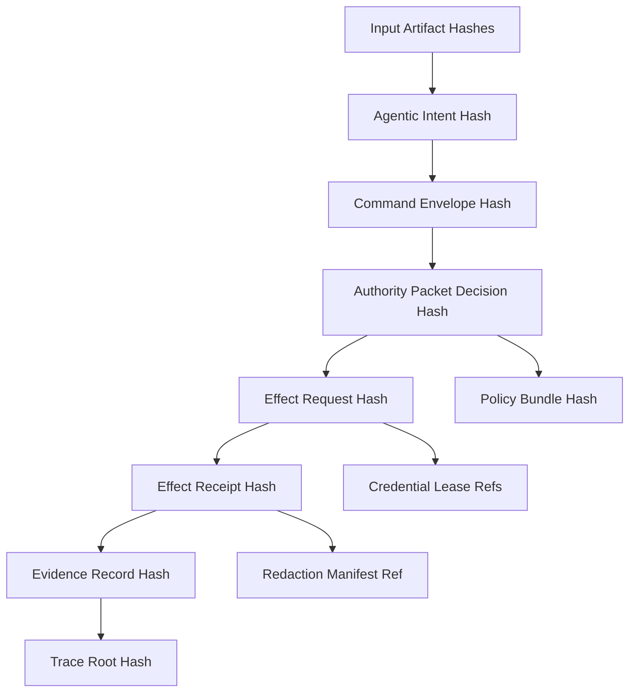

# RFC-0006: Audit Lineage and Causal Replay

Status: Draft

Version: v1.0

## Abstract

This document defines GAOP evidence records, hash chains, and causal replay. A compliant system must be able to prove why an effect occurred by linking input artifacts, command envelopes, authority packets, effect requests, and effect receipts.

## Purpose

Audit lineage exists to answer:

1. What happened?
2. Who or what requested it?
3. Which tenant boundary applied?
4. Which policy bundle evaluated it?
5. Which authority packet permitted, denied, or paused it?
6. Which execution lane attempted it?
7. Which receipt proves the outcome?
8. Can the causal chain be replayed or independently verified?

## Lineage graph



## EvidenceRecord JSON Schema

```json
{
  "$schema": "https://json-schema.org/draft/2020-12/schema",
  "$id": "https://gaop.dev/schemas/v1/evidence-record.schema.json",
  "title": "GAOP EvidenceRecord",
  "type": "object",
  "required": [
    "protocol_version",
    "evidence_id",
    "tenant_id",
    "trace_id",
    "record_kind",
    "command_id",
    "command_hash",
    "authority_id",
    "authority_hash",
    "effect_request_id",
    "effect_request_hash",
    "receipt_id",
    "receipt_hash",
    "evidence_hash",
    "created_at"
  ],
  "additionalProperties": false,
  "properties": {
    "protocol_version": {
      "type": "string",
      "const": "gaop.v1"
    },
    "evidence_id": {
      "type": "string",
      "minLength": 8,
      "maxLength": 256,
      "pattern": "^[a-zA-Z0-9][a-zA-Z0-9._:-]*$"
    },
    "tenant_id": {
      "type": "string",
      "minLength": 1,
      "maxLength": 256,
      "pattern": "^[a-zA-Z0-9][a-zA-Z0-9._:-]*$"
    },
    "trace_id": {
      "type": "string",
      "minLength": 16,
      "maxLength": 256,
      "pattern": "^[a-zA-Z0-9][a-zA-Z0-9._:-]*$"
    },
    "record_kind": {
      "type": "string",
      "enum": ["effect", "denial", "review", "compensation", "lease", "replay"]
    },
    "parent_evidence_hash": {
      "type": "string",
      "pattern": "^[a-z0-9_+-]+:[a-fA-F0-9]{32,}$"
    },
    "command_id": {
      "type": "string",
      "minLength": 8,
      "maxLength": 256,
      "pattern": "^[a-zA-Z0-9][a-zA-Z0-9._:-]*$"
    },
    "command_hash": {
      "type": "string",
      "pattern": "^[a-z0-9_+-]+:[a-fA-F0-9]{32,}$"
    },
    "authority_id": {
      "type": "string",
      "minLength": 8,
      "maxLength": 256,
      "pattern": "^[a-zA-Z0-9][a-zA-Z0-9._:-]*$"
    },
    "authority_hash": {
      "type": "string",
      "pattern": "^[a-z0-9_+-]+:[a-fA-F0-9]{32,}$"
    },
    "effect_request_id": {
      "type": "string",
      "minLength": 8,
      "maxLength": 256,
      "pattern": "^[a-zA-Z0-9][a-zA-Z0-9._:-]*$"
    },
    "effect_request_hash": {
      "type": "string",
      "pattern": "^[a-z0-9_+-]+:[a-fA-F0-9]{32,}$"
    },
    "receipt_id": {
      "type": "string",
      "minLength": 8,
      "maxLength": 256,
      "pattern": "^[a-zA-Z0-9][a-zA-Z0-9._:-]*$"
    },
    "receipt_hash": {
      "type": "string",
      "pattern": "^[a-z0-9_+-]+:[a-fA-F0-9]{32,}$"
    },
    "input_artifact_hashes": {
      "type": "array",
      "maxItems": 256,
      "items": {
        "type": "string",
        "pattern": "^[a-z0-9_+-]+:[a-fA-F0-9]{32,}$"
      },
      "default": []
    },
    "policy_bundle_hash": {
      "type": "string",
      "pattern": "^[a-z0-9_+-]+:[a-fA-F0-9]{32,}$"
    },
    "redaction_manifest_ref": {
      "type": "string",
      "maxLength": 2048,
      "pattern": "^[a-zA-Z][a-zA-Z0-9+.-]*://.+$"
    },
    "evidence_hash": {
      "type": "string",
      "pattern": "^[a-z0-9_+-]+:[a-fA-F0-9]{32,}$"
    },
    "created_at": {
      "type": "string",
      "format": "date-time"
    }
  }
}
```

## ReplayRequest JSON Schema

```json
{
  "$schema": "https://json-schema.org/draft/2020-12/schema",
  "$id": "https://gaop.dev/schemas/v1/replay-request.schema.json",
  "title": "GAOP ReplayRequest",
  "type": "object",
  "required": [
    "protocol_version",
    "replay_id",
    "tenant_id",
    "trace_id",
    "evidence_id",
    "requested_by",
    "replay_mode",
    "requested_at"
  ],
  "additionalProperties": false,
  "properties": {
    "protocol_version": {
      "type": "string",
      "const": "gaop.v1"
    },
    "replay_id": {
      "type": "string",
      "minLength": 8,
      "maxLength": 256,
      "pattern": "^[a-zA-Z0-9][a-zA-Z0-9._:-]*$"
    },
    "tenant_id": {
      "type": "string",
      "minLength": 1,
      "maxLength": 256,
      "pattern": "^[a-zA-Z0-9][a-zA-Z0-9._:-]*$"
    },
    "trace_id": {
      "type": "string",
      "minLength": 16,
      "maxLength": 256,
      "pattern": "^[a-zA-Z0-9][a-zA-Z0-9._:-]*$"
    },
    "evidence_id": {
      "type": "string",
      "minLength": 8,
      "maxLength": 256,
      "pattern": "^[a-zA-Z0-9][a-zA-Z0-9._:-]*$"
    },
    "requested_by": {
      "type": "string",
      "minLength": 1,
      "maxLength": 2048,
      "pattern": "^[a-zA-Z][a-zA-Z0-9+.-]*://.+$"
    },
    "replay_mode": {
      "type": "string",
      "enum": ["hash_verify_only", "policy_recompute", "dry_run_execution", "full_reexecution"]
    },
    "requested_at": {
      "type": "string",
      "format": "date-time"
    }
  }
}
```

## ReplayResult JSON Schema

```json
{
  "$schema": "https://json-schema.org/draft/2020-12/schema",
  "$id": "https://gaop.dev/schemas/v1/replay-result.schema.json",
  "title": "GAOP ReplayResult",
  "type": "object",
  "required": [
    "protocol_version",
    "replay_id",
    "tenant_id",
    "trace_id",
    "status",
    "original_evidence_hash",
    "replay_evidence_hash",
    "completed_at"
  ],
  "additionalProperties": false,
  "properties": {
    "protocol_version": {
      "type": "string",
      "const": "gaop.v1"
    },
    "replay_id": {
      "type": "string",
      "minLength": 8,
      "maxLength": 256,
      "pattern": "^[a-zA-Z0-9][a-zA-Z0-9._:-]*$"
    },
    "tenant_id": {
      "type": "string",
      "minLength": 1,
      "maxLength": 256,
      "pattern": "^[a-zA-Z0-9][a-zA-Z0-9._:-]*$"
    },
    "trace_id": {
      "type": "string",
      "minLength": 16,
      "maxLength": 256,
      "pattern": "^[a-zA-Z0-9][a-zA-Z0-9._:-]*$"
    },
    "status": {
      "type": "string",
      "enum": ["verified", "mismatch", "incomplete", "not_replayable", "failed"]
    },
    "original_evidence_hash": {
      "type": "string",
      "pattern": "^[a-z0-9_+-]+:[a-fA-F0-9]{32,}$"
    },
    "replay_evidence_hash": {
      "type": "string",
      "pattern": "^[a-z0-9_+-]+:[a-fA-F0-9]{32,}$"
    },
    "mismatch_reasons": {
      "type": "array",
      "maxItems": 128,
      "items": {
        "type": "string",
        "maxLength": 4096
      },
      "default": []
    },
    "completed_at": {
      "type": "string",
      "format": "date-time"
    }
  }
}
```

## Hash chain rules

An auditor MUST be able to verify the chain:

```text
input_artifact_hashes
  -> intent_hash
  -> command_hash
  -> authority_hash / decision_hash
  -> effect_request_hash
  -> receipt_hash
  -> evidence_hash
  -> trace_root_hash
```

Rules:

1. Each hash MUST be computed over canonical serialized content.
2. Each downstream object MUST include or reference the relevant upstream hash.
3. Evidence records MUST be append-only.
4. Historical evidence MUST NOT be rewritten.
5. Corrections MUST be represented by new evidence records.
6. Redaction manifests MUST preserve hash commitments to original and redacted payloads where allowed.

## Replay semantics

| Replay mode | Meaning |
|---|---|
| `hash_verify_only` | Verify stored hashes and signatures without recomputing policy or execution. |
| `policy_recompute` | Re-evaluate policy using the original command and policy bundle. |
| `dry_run_execution` | Reconstruct execution inputs without side effects. |
| `full_reexecution` | Re-execute the effect in a controlled lane. |

Full re-execution SHOULD be disabled by default for non-idempotent or externally mutating effects.

## Replay rules

1. Replay MUST preserve tenant boundary.
2. Replay MUST record a new evidence record.
3. Replay MUST NOT overwrite the original receipt.
4. Replay MUST distinguish deterministic mismatch from unavailable external state.
5. Replay MUST NOT rematerialize secrets unless a new authority packet and credential lease allow it.
6. Replay SHOULD prefer hash verification and policy recomputation before full re-execution.

