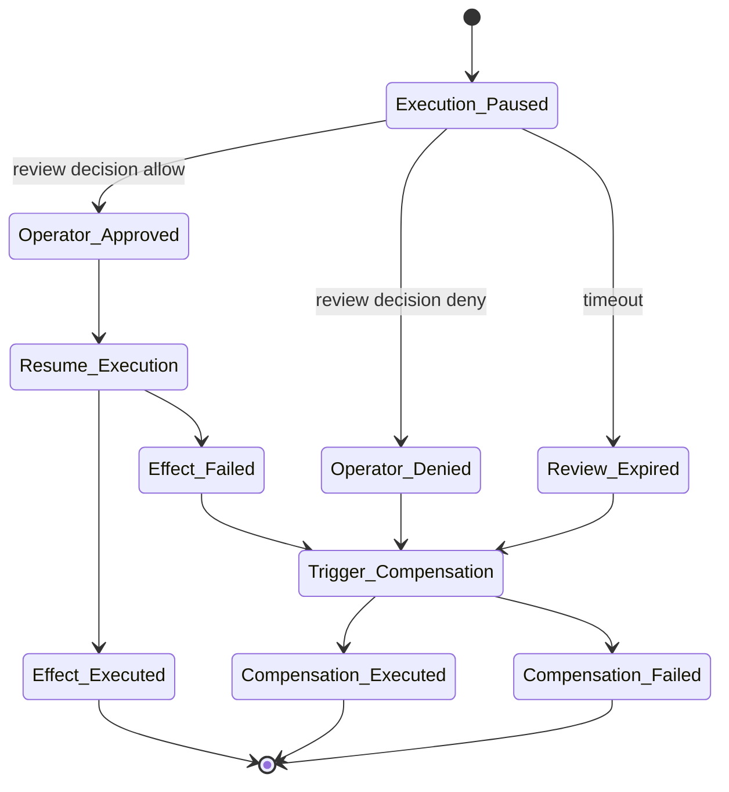

# RFC-0007: Human-in-the-Loop and Compensation

Status: Draft

Version: v1.0

## Abstract

This document defines GAOP human-in-the-loop review gates and compensation recipes. Review gates pause execution when policy requires human or delegated approval. Compensation recipes declare rollback or corrective actions for failed multi-step operations.

## Review and compensation lifecycle



## ReviewGate JSON Schema

```json
{
  "$schema": "https://json-schema.org/draft/2020-12/schema",
  "$id": "https://gaop.dev/schemas/v1/review-gate.schema.json",
  "title": "GAOP ReviewGate",
  "type": "object",
  "required": [
    "protocol_version",
    "review_gate_id",
    "tenant_id",
    "trace_id",
    "command_id",
    "command_hash",
    "authority_id",
    "authority_hash",
    "review_state",
    "required_reviewer_class",
    "created_at",
    "expires_at"
  ],
  "additionalProperties": false,
  "properties": {
    "protocol_version": {
      "type": "string",
      "const": "gaop.v1"
    },
    "review_gate_id": {
      "type": "string",
      "minLength": 8,
      "maxLength": 256,
      "pattern": "^[a-zA-Z0-9][a-zA-Z0-9._:-]*$"
    },
    "tenant_id": {
      "type": "string",
      "minLength": 1,
      "maxLength": 256,
      "pattern": "^[a-zA-Z0-9][a-zA-Z0-9._:-]*$"
    },
    "trace_id": {
      "type": "string",
      "minLength": 16,
      "maxLength": 256,
      "pattern": "^[a-zA-Z0-9][a-zA-Z0-9._:-]*$"
    },
    "command_id": {
      "type": "string",
      "minLength": 8,
      "maxLength": 256,
      "pattern": "^[a-zA-Z0-9][a-zA-Z0-9._:-]*$"
    },
    "command_hash": {
      "type": "string",
      "pattern": "^[a-z0-9_+-]+:[a-fA-F0-9]{32,}$"
    },
    "authority_id": {
      "type": "string",
      "minLength": 8,
      "maxLength": 256,
      "pattern": "^[a-zA-Z0-9][a-zA-Z0-9._:-]*$"
    },
    "authority_hash": {
      "type": "string",
      "pattern": "^[a-z0-9_+-]+:[a-fA-F0-9]{32,}$"
    },
    "review_state": {
      "type": "string",
      "enum": ["pending", "approved", "denied", "expired", "cancelled"]
    },
    "required_reviewer_class": {
      "type": "string",
      "minLength": 1,
      "maxLength": 256
    },
    "review_reason": {
      "type": "string",
      "maxLength": 4096
    },
    "allowed_decision_window": {
      "type": "object",
      "additionalProperties": false,
      "properties": {
        "not_before": {
          "type": "string",
          "format": "date-time"
        },
        "not_after": {
          "type": "string",
          "format": "date-time"
        }
      }
    },
    "created_at": {
      "type": "string",
      "format": "date-time"
    },
    "expires_at": {
      "type": "string",
      "format": "date-time"
    }
  }
}
```

## ReviewDecision JSON Schema

```json
{
  "$schema": "https://json-schema.org/draft/2020-12/schema",
  "$id": "https://gaop.dev/schemas/v1/review-decision.schema.json",
  "title": "GAOP ReviewDecision",
  "type": "object",
  "required": [
    "protocol_version",
    "review_decision_id",
    "review_gate_id",
    "tenant_id",
    "trace_id",
    "reviewer_ref",
    "decision",
    "decision_hash",
    "decided_at"
  ],
  "additionalProperties": false,
  "properties": {
    "protocol_version": {
      "type": "string",
      "const": "gaop.v1"
    },
    "review_decision_id": {
      "type": "string",
      "minLength": 8,
      "maxLength": 256,
      "pattern": "^[a-zA-Z0-9][a-zA-Z0-9._:-]*$"
    },
    "review_gate_id": {
      "type": "string",
      "minLength": 8,
      "maxLength": 256,
      "pattern": "^[a-zA-Z0-9][a-zA-Z0-9._:-]*$"
    },
    "tenant_id": {
      "type": "string",
      "minLength": 1,
      "maxLength": 256,
      "pattern": "^[a-zA-Z0-9][a-zA-Z0-9._:-]*$"
    },
    "trace_id": {
      "type": "string",
      "minLength": 16,
      "maxLength": 256,
      "pattern": "^[a-zA-Z0-9][a-zA-Z0-9._:-]*$"
    },
    "reviewer_ref": {
      "type": "string",
      "minLength": 1,
      "maxLength": 2048,
      "pattern": "^[a-zA-Z][a-zA-Z0-9+.-]*://.+$"
    },
    "decision": {
      "type": "string",
      "enum": ["approve", "deny"]
    },
    "decision_rationale": {
      "type": "string",
      "maxLength": 8192
    },
    "decision_hash": {
      "type": "string",
      "pattern": "^[a-z0-9_+-]+:[a-fA-F0-9]{32,}$"
    },
    "signature": {
      "type": "object",
      "required": ["signature_algorithm", "key_ref", "signature_value"],
      "additionalProperties": false,
      "properties": {
        "signature_algorithm": {
          "type": "string",
          "minLength": 1,
          "maxLength": 128
        },
        "key_ref": {
          "type": "string",
          "minLength": 1,
          "maxLength": 2048,
          "pattern": "^[a-zA-Z][a-zA-Z0-9+.-]*://.+$"
        },
        "signature_value": {
          "type": "string",
          "minLength": 1
        }
      }
    },
    "decided_at": {
      "type": "string",
      "format": "date-time"
    }
  }
}
```

## CompensationRecipe JSON Schema

```json
{
  "$schema": "https://json-schema.org/draft/2020-12/schema",
  "$id": "https://gaop.dev/schemas/v1/compensation-recipe.schema.json",
  "title": "GAOP CompensationRecipe",
  "type": "object",
  "required": [
    "protocol_version",
    "compensation_recipe_id",
    "tenant_id",
    "trace_id",
    "applies_to_effect_request_id",
    "compensation_strategy",
    "steps",
    "created_at"
  ],
  "additionalProperties": false,
  "properties": {
    "protocol_version": {
      "type": "string",
      "const": "gaop.v1"
    },
    "compensation_recipe_id": {
      "type": "string",
      "minLength": 8,
      "maxLength": 256,
      "pattern": "^[a-zA-Z0-9][a-zA-Z0-9._:-]*$"
    },
    "tenant_id": {
      "type": "string",
      "minLength": 1,
      "maxLength": 256,
      "pattern": "^[a-zA-Z0-9][a-zA-Z0-9._:-]*$"
    },
    "trace_id": {
      "type": "string",
      "minLength": 16,
      "maxLength": 256,
      "pattern": "^[a-zA-Z0-9][a-zA-Z0-9._:-]*$"
    },
    "applies_to_effect_request_id": {
      "type": "string",
      "minLength": 8,
      "maxLength": 256,
      "pattern": "^[a-zA-Z0-9][a-zA-Z0-9._:-]*$"
    },
    "compensation_strategy": {
      "type": "string",
      "enum": ["inverse_effect", "restore_snapshot", "append_correction", "manual_remediation", "none_available"]
    },
    "steps": {
      "type": "array",
      "minItems": 1,
      "maxItems": 128,
      "items": {
        "$ref": "#/$defs/CompensationStep"
      }
    },
    "created_at": {
      "type": "string",
      "format": "date-time"
    }
  },
  "$defs": {
    "CompensationStep": {
      "type": "object",
      "required": ["step_id", "operation", "target_ref"],
      "additionalProperties": false,
      "properties": {
        "step_id": {
          "type": "string",
          "minLength": 1,
          "maxLength": 256
        },
        "operation": {
          "type": "string",
          "minLength": 1,
          "maxLength": 256
        },
        "target_ref": {
          "type": "string",
          "minLength": 1,
          "maxLength": 2048,
          "pattern": "^[a-zA-Z][a-zA-Z0-9+.-]*://.+$"
        },
        "requires_review": {
          "type": "boolean",
          "default": true
        },
        "precondition_hash": {
          "type": "string",
          "pattern": "^[a-z0-9_+-]+:[a-fA-F0-9]{32,}$"
        }
      }
    }
  }
}
```

## CompensationReceipt JSON Schema

```json
{
  "$schema": "https://json-schema.org/draft/2020-12/schema",
  "$id": "https://gaop.dev/schemas/v1/compensation-receipt.schema.json",
  "title": "GAOP CompensationReceipt",
  "type": "object",
  "required": [
    "protocol_version",
    "compensation_receipt_id",
    "compensation_recipe_id",
    "tenant_id",
    "trace_id",
    "status",
    "receipt_hash",
    "completed_at"
  ],
  "additionalProperties": false,
  "properties": {
    "protocol_version": {
      "type": "string",
      "const": "gaop.v1"
    },
    "compensation_receipt_id": {
      "type": "string",
      "minLength": 8,
      "maxLength": 256,
      "pattern": "^[a-zA-Z0-9][a-zA-Z0-9._:-]*$"
    },
    "compensation_recipe_id": {
      "type": "string",
      "minLength": 8,
      "maxLength": 256,
      "pattern": "^[a-zA-Z0-9][a-zA-Z0-9._:-]*$"
    },
    "tenant_id": {
      "type": "string",
      "minLength": 1,
      "maxLength": 256,
      "pattern": "^[a-zA-Z0-9][a-zA-Z0-9._:-]*$"
    },
    "trace_id": {
      "type": "string",
      "minLength": 16,
      "maxLength": 256,
      "pattern": "^[a-zA-Z0-9][a-zA-Z0-9._:-]*$"
    },
    "status": {
      "type": "string",
      "enum": ["success", "failed", "partial", "not_available", "manual_required"]
    },
    "step_receipt_refs": {
      "type": "array",
      "maxItems": 128,
      "items": {
        "type": "string",
        "maxLength": 2048,
        "pattern": "^[a-zA-Z][a-zA-Z0-9+.-]*://.+$"
      },
      "default": []
    },
    "receipt_hash": {
      "type": "string",
      "pattern": "^[a-z0-9_+-]+:[a-fA-F0-9]{32,}$"
    },
    "completed_at": {
      "type": "string",
      "format": "date-time"
    }
  }
}
```

## Review rules

1. A `review_required` authority decision MUST produce a review gate.
2. Execution MUST pause while a review gate is pending.
3. A review gate MUST expire.
4. A review decision MUST be bound to the review gate, tenant, trace, command hash, and authority hash.
5. A review approval MUST be verified before execution resumes.
6. A review denial MUST produce a denial receipt or trigger compensation if prior effects exist.
7. Review decisions SHOULD be signed or otherwise authenticated.

## Compensation rules

1. High-risk multi-step operations SHOULD declare compensation recipes before execution.
2. A compensation recipe MUST identify the effect request it applies to.
3. A compensation step SHOULD be independently governed as a new effect.
4. Compensation MUST produce a compensation receipt.
5. Compensation MUST NOT erase the original effect receipt.
6. Failed compensation MUST be represented explicitly.
7. Manual remediation MAY be a valid compensation strategy if automated reversal is unsafe or impossible.

## Review approval binding

An execution layer resuming from review MUST verify:

1. The review gate is not expired.
2. The review decision references the correct review gate.
3. The reviewer satisfies `required_reviewer_class`.
4. The review decision hash is valid.
5. Any review signature is valid.
6. The command hash and authority hash match the paused execution.

If any check fails, execution MUST remain paused or be denied.

