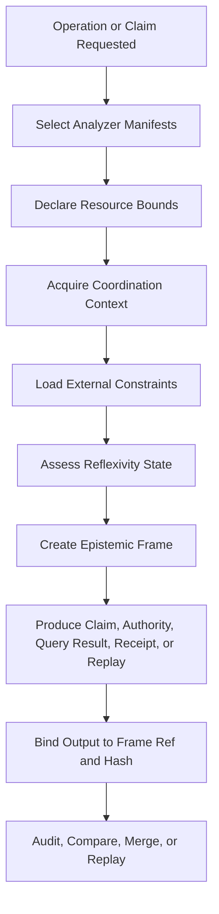

# RFC-0008: Epistemic Frames and Operational Correctness

Status: Draft

Version: v1.0

## Abstract

This document defines the GAOP epistemic frame and related operational-correctness objects. These objects prevent governed systems from producing claims, decisions, receipts, or replays that are wrong in ways the system cannot detect or trusted in ways they should not be trusted.

GAOP assumes that autonomous and semi-autonomous systems are not only readers of state. They are participants in the systems they observe. Their model versions change. Their analyzers drift. Their queries run under resource budgets. Their concurrent analyses may race. Their presence changes human behavior. Their local evidence may omit external legal, regulatory, ecosystem, contractual, or platform constraints.

The epistemic frame records those conditions so outputs can be compared, discounted, disclosed, merged, replayed, or rejected correctly.

## Normative language

The terms `MUST`, `MUST NOT`, `REQUIRED`, `SHOULD`, `SHOULD NOT`, and `MAY` are to be interpreted as described in RFC 2119 and RFC 8174.

## Scope

This RFC standardizes:

1. Epistemic frames.
2. Analyzer manifests.
3. Manifest transitions.
4. Analysis epochs.
5. Query execution bounds.
6. Reflexivity signals.
7. External constraints.
8. Calibration quarantine.

This RFC does not standardize:

1. A database schema.
2. A specific query language.
3. A specific model provider.
4. A specific runtime framework.
5. A specific regulatory catalog.
6. A specific user interface.

## Core problem

Without epistemic framing, a governed system can silently fail in five load-bearing ways:

1. System identity drift: claims produced by different model, analyzer, prompt, policy, or schema versions are treated as comparable when they are not.
2. Concurrent coordination failure: overlapping analyses race and commit conflicting beliefs or receipts.
3. Unbounded query execution: expensive or partial queries are presented as complete fast answers.
4. Reflexivity contamination: the system changes the behavior it measures and then misreads performative compliance as improvement.
5. External constraint invisibility: missing regulatory, legal, ecosystem, contractual, or platform constraints are mistaken for missing local rationale.

## Epistemic frame lifecycle



## EpistemicFrame JSON Schema

```json
{
  "$schema": "https://json-schema.org/draft/2020-12/schema",
  "$id": "https://gaop.dev/schemas/v1/epistemic-frame.schema.json",
  "title": "GAOP EpistemicFrame",
  "type": "object",
  "required": [
    "protocol_version",
    "frame_ref",
    "frame_id",
    "tenant_id",
    "system_version",
    "analyzer_manifests",
    "resource_class",
    "coordination_mode",
    "reflexivity_state",
    "created_at"
  ],
  "additionalProperties": false,
  "properties": {
    "protocol_version": {
      "type": "string",
      "const": "gaop.v1"
    },
    "frame_ref": {
      "type": "string",
      "minLength": 1,
      "maxLength": 2048,
      "pattern": "^[a-zA-Z][a-zA-Z0-9+.-]*://.+$"
    },
    "frame_id": {
      "type": "string",
      "minLength": 8,
      "maxLength": 256,
      "pattern": "^[a-zA-Z0-9][a-zA-Z0-9._:-]*$"
    },
    "tenant_id": {
      "type": "string",
      "minLength": 1,
      "maxLength": 256,
      "pattern": "^[a-zA-Z0-9][a-zA-Z0-9._:-]*$"
    },
    "parent_frame_refs": {
      "type": "array",
      "maxItems": 64,
      "items": {
        "type": "string",
        "maxLength": 2048,
        "pattern": "^[a-zA-Z][a-zA-Z0-9+.-]*://.+$"
      },
      "default": []
    },
    "system_version": {
      "type": "string",
      "minLength": 1,
      "maxLength": 256
    },
    "analyzer_manifests": {
      "type": "array",
      "minItems": 1,
      "maxItems": 128,
      "items": {
        "$ref": "#/$defs/AnalyzerManifestBinding"
      }
    },
    "resource_class": {
      "type": "string",
      "enum": ["full", "degraded", "emergency", "background", "benchmark", "fast", "standard", "research"]
    },
    "token_budget": {
      "type": "integer",
      "minimum": 0
    },
    "time_budget_ms": {
      "type": "integer",
      "minimum": 0
    },
    "index_completeness": {
      "type": "number",
      "minimum": 0.0,
      "maximum": 1.0,
      "default": 1.0
    },
    "coordination_mode": {
      "type": "string",
      "enum": ["exclusive", "cooperative", "snapshot_isolated", "best_effort"]
    },
    "lock_scope_refs": {
      "type": "array",
      "maxItems": 256,
      "items": {
        "type": "string",
        "maxLength": 2048,
        "pattern": "^[a-zA-Z][a-zA-Z0-9+.-]*://.+$"
      },
      "default": []
    },
    "concurrent_frame_refs": {
      "type": "array",
      "maxItems": 256,
      "items": {
        "type": "string",
        "maxLength": 2048,
        "pattern": "^[a-zA-Z][a-zA-Z0-9+.-]*://.+$"
      },
      "default": []
    },
    "reflexivity_state": {
      "type": "string",
      "enum": ["baseline", "post_adoption", "governance_active", "system_aware_team", "unknown"]
    },
    "external_constraint_refs": {
      "type": "array",
      "maxItems": 256,
      "items": {
        "type": "string",
        "maxLength": 2048,
        "pattern": "^[a-zA-Z][a-zA-Z0-9+.-]*://.+$"
      },
      "default": []
    },
    "frame_hash": {
      "type": "string",
      "pattern": "^[a-z0-9_+-]+:[a-fA-F0-9]{32,}$"
    },
    "created_at": {
      "type": "string",
      "format": "date-time"
    },
    "metadata": {
      "type": "object",
      "additionalProperties": true,
      "default": {}
    }
  },
  "$defs": {
    "AnalyzerManifestBinding": {
      "type": "object",
      "required": ["manifest_ref", "manifest_hash", "component_kind", "version"],
      "additionalProperties": false,
      "properties": {
        "manifest_ref": {
          "type": "string",
          "minLength": 1,
          "maxLength": 2048,
          "pattern": "^[a-zA-Z][a-zA-Z0-9+.-]*://.+$"
        },
        "manifest_hash": {
          "type": "string",
          "pattern": "^[a-z0-9_+-]+:[a-fA-F0-9]{32,}$"
        },
        "component_kind": {
          "type": "string",
          "enum": [
            "static_extractor",
            "model_annotator",
            "runtime_ingestor",
            "commitment_evaluator",
            "belief_engine",
            "projection_builder",
            "policy_engine",
            "execution_lane",
            "query_planner",
            "redactor"
          ]
        },
        "version": {
          "type": "string",
          "minLength": 1,
          "maxLength": 256
        }
      }
    }
  }
}
```

## AnalyzerManifest JSON Schema

```json
{
  "$schema": "https://json-schema.org/draft/2020-12/schema",
  "$id": "https://gaop.dev/schemas/v1/analyzer-manifest.schema.json",
  "title": "GAOP AnalyzerManifest",
  "type": "object",
  "required": [
    "protocol_version",
    "manifest_ref",
    "manifest_key",
    "component_kind",
    "version",
    "introduced_at"
  ],
  "additionalProperties": false,
  "properties": {
    "protocol_version": {
      "type": "string",
      "const": "gaop.v1"
    },
    "manifest_ref": {
      "type": "string",
      "minLength": 1,
      "maxLength": 2048,
      "pattern": "^[a-zA-Z][a-zA-Z0-9+.-]*://.+$"
    },
    "manifest_key": {
      "type": "string",
      "minLength": 1,
      "maxLength": 256
    },
    "component_kind": {
      "type": "string",
      "enum": [
        "static_extractor",
        "model_annotator",
        "runtime_ingestor",
        "commitment_evaluator",
        "belief_engine",
        "projection_builder",
        "policy_engine",
        "execution_lane",
        "query_planner",
        "redactor"
      ]
    },
    "version": {
      "type": "string",
      "minLength": 1,
      "maxLength": 256
    },
    "model_family": {
      "type": "string",
      "maxLength": 256
    },
    "model_version": {
      "type": "string",
      "maxLength": 256
    },
    "prompt_pack_ref": {
      "type": "string",
      "maxLength": 2048,
      "pattern": "^[a-zA-Z][a-zA-Z0-9+.-]*://.+$"
    },
    "known_biases": {
      "type": "array",
      "maxItems": 256,
      "items": {
        "$ref": "#/$defs/KnownBias"
      },
      "default": []
    },
    "capability_matrix": {
      "type": "object",
      "additionalProperties": true,
      "default": {}
    },
    "supersedes_manifest_ref": {
      "type": "string",
      "maxLength": 2048,
      "pattern": "^[a-zA-Z][a-zA-Z0-9+.-]*://.+$"
    },
    "manifest_hash": {
      "type": "string",
      "pattern": "^[a-z0-9_+-]+:[a-fA-F0-9]{32,}$"
    },
    "introduced_at": {
      "type": "string",
      "format": "date-time"
    }
  },
  "$defs": {
    "KnownBias": {
      "type": "object",
      "required": ["pattern", "bias_direction"],
      "additionalProperties": false,
      "properties": {
        "pattern": {
          "type": "string",
          "minLength": 1,
          "maxLength": 1024
        },
        "bias_direction": {
          "type": "string",
          "minLength": 1,
          "maxLength": 1024
        },
        "estimated_magnitude": {
          "type": "number",
          "minimum": 0.0,
          "maximum": 1.0
        }
      }
    }
  }
}
```

## ManifestTransition JSON Schema

```json
{
  "$schema": "https://json-schema.org/draft/2020-12/schema",
  "$id": "https://gaop.dev/schemas/v1/manifest-transition.schema.json",
  "title": "GAOP ManifestTransition",
  "type": "object",
  "required": [
    "protocol_version",
    "transition_ref",
    "from_manifest_ref",
    "to_manifest_ref",
    "transition_kind",
    "migration_policy",
    "created_at"
  ],
  "additionalProperties": false,
  "properties": {
    "protocol_version": {
      "type": "string",
      "const": "gaop.v1"
    },
    "transition_ref": {
      "type": "string",
      "minLength": 1,
      "maxLength": 2048,
      "pattern": "^[a-zA-Z][a-zA-Z0-9+.-]*://.+$"
    },
    "from_manifest_ref": {
      "type": "string",
      "minLength": 1,
      "maxLength": 2048,
      "pattern": "^[a-zA-Z][a-zA-Z0-9+.-]*://.+$"
    },
    "to_manifest_ref": {
      "type": "string",
      "minLength": 1,
      "maxLength": 2048,
      "pattern": "^[a-zA-Z][a-zA-Z0-9+.-]*://.+$"
    },
    "transition_kind": {
      "type": "string",
      "enum": [
        "compatible",
        "breaking_for_claim_type",
        "calibration_reset_required",
        "systematic_bias_corrected",
        "capability_expanded",
        "unknown"
      ]
    },
    "affected_claim_types": {
      "type": "array",
      "maxItems": 256,
      "items": {
        "type": "string",
        "maxLength": 256
      },
      "default": []
    },
    "recalibration_required": {
      "type": "boolean",
      "default": false
    },
    "migration_policy": {
      "type": "string",
      "enum": [
        "reuse_existing",
        "mark_stale_for_reannotation",
        "invalidate_and_regenerate",
        "human_review_sample"
      ]
    },
    "estimated_drift": {
      "type": "object",
      "additionalProperties": true,
      "default": {}
    },
    "created_at": {
      "type": "string",
      "format": "date-time"
    }
  }
}
```

## AnalysisEpoch JSON Schema

```json
{
  "$schema": "https://json-schema.org/draft/2020-12/schema",
  "$id": "https://gaop.dev/schemas/v1/analysis-epoch.schema.json",
  "title": "GAOP AnalysisEpoch",
  "type": "object",
  "required": [
    "protocol_version",
    "epoch_ref",
    "tenant_id",
    "snapshot_ref",
    "epoch_kind",
    "coordination_mode",
    "scope_refs",
    "epoch_state",
    "epistemic_frame_ref",
    "created_at"
  ],
  "additionalProperties": false,
  "properties": {
    "protocol_version": {
      "type": "string",
      "const": "gaop.v1"
    },
    "epoch_ref": {
      "type": "string",
      "minLength": 1,
      "maxLength": 2048,
      "pattern": "^[a-zA-Z][a-zA-Z0-9+.-]*://.+$"
    },
    "tenant_id": {
      "type": "string",
      "minLength": 1,
      "maxLength": 256
    },
    "snapshot_ref": {
      "type": "string",
      "minLength": 1,
      "maxLength": 2048,
      "pattern": "^[a-zA-Z][a-zA-Z0-9+.-]*://.+$"
    },
    "epoch_kind": {
      "type": "string",
      "enum": ["review", "background_refresh", "benchmark_run", "governance_trigger", "runtime_ingest", "user_query", "replay"]
    },
    "coordination_mode": {
      "type": "string",
      "enum": ["exclusive", "cooperative", "snapshot_isolated", "best_effort"]
    },
    "scope_refs": {
      "type": "array",
      "minItems": 1,
      "maxItems": 256,
      "items": {
        "type": "string",
        "maxLength": 2048,
        "pattern": "^[a-zA-Z][a-zA-Z0-9+.-]*://.+$"
      }
    },
    "epoch_state": {
      "type": "string",
      "enum": ["acquiring", "active", "committing", "committed", "aborted", "superseded"]
    },
    "parent_epoch_ref": {
      "type": "string",
      "maxLength": 2048,
      "pattern": "^[a-zA-Z][a-zA-Z0-9+.-]*://.+$"
    },
    "conflict_resolution_policy": {
      "type": "string",
      "enum": ["primary_wins", "secondary_wins", "union", "intersection", "higher_confidence_wins", "human_review_required"]
    },
    "epistemic_frame_ref": {
      "type": "string",
      "minLength": 1,
      "maxLength": 2048,
      "pattern": "^[a-zA-Z][a-zA-Z0-9+.-]*://.+$"
    },
    "created_at": {
      "type": "string",
      "format": "date-time"
    },
    "committed_at": {
      "type": "string",
      "format": "date-time"
    },
    "aborted_reason": {
      "type": "string",
      "maxLength": 4096
    }
  }
}
```

## QueryExecutionBound JSON Schema

```json
{
  "$schema": "https://json-schema.org/draft/2020-12/schema",
  "$id": "https://gaop.dev/schemas/v1/query-execution-bound.schema.json",
  "title": "GAOP QueryExecutionBound",
  "type": "object",
  "required": [
    "protocol_version",
    "query_execution_ref",
    "tenant_id",
    "query_ref",
    "cost_class",
    "degradation_policy",
    "epistemic_frame_ref",
    "execution_state"
  ],
  "additionalProperties": false,
  "properties": {
    "protocol_version": {
      "type": "string",
      "const": "gaop.v1"
    },
    "query_execution_ref": {
      "type": "string",
      "minLength": 1,
      "maxLength": 2048,
      "pattern": "^[a-zA-Z][a-zA-Z0-9+.-]*://.+$"
    },
    "tenant_id": {
      "type": "string",
      "minLength": 1,
      "maxLength": 256
    },
    "query_ref": {
      "type": "string",
      "minLength": 1,
      "maxLength": 2048,
      "pattern": "^[a-zA-Z][a-zA-Z0-9+.-]*://.+$"
    },
    "cost_class": {
      "type": "string",
      "enum": ["instant", "fast", "standard", "expensive", "research"]
    },
    "max_execution_ms": {
      "type": "integer",
      "minimum": 1
    },
    "max_artifact_scan": {
      "type": "integer",
      "minimum": 0
    },
    "max_edge_traversal": {
      "type": "integer",
      "minimum": 0
    },
    "max_model_calls": {
      "type": "integer",
      "minimum": 0
    },
    "degradation_policy": {
      "type": "string",
      "enum": ["halt_and_disclose", "partial_result_with_disclosure", "background_then_notify", "refuse_with_suggestion"]
    },
    "precomputed_coverage_state": {
      "type": "string",
      "enum": ["fully_precomputed", "partially_precomputed", "not_precomputed", "stale", "unknown"]
    },
    "estimated_cost": {
      "type": "object",
      "additionalProperties": true,
      "default": {}
    },
    "actual_cost": {
      "type": "object",
      "additionalProperties": true,
      "default": {}
    },
    "execution_state": {
      "type": "string",
      "enum": ["planning", "running", "completed", "degraded", "timed_out", "refused"]
    },
    "result_completeness": {
      "type": "number",
      "minimum": 0.0,
      "maximum": 1.0
    },
    "degradation_disclosure": {
      "$ref": "#/$defs/DegradationDisclosure"
    },
    "epistemic_frame_ref": {
      "type": "string",
      "minLength": 1,
      "maxLength": 2048,
      "pattern": "^[a-zA-Z][a-zA-Z0-9+.-]*://.+$"
    }
  },
  "$defs": {
    "DegradationDisclosure": {
      "type": "object",
      "required": ["reason", "what_was_included", "what_was_excluded"],
      "additionalProperties": false,
      "properties": {
        "result_completeness": {
          "type": "number",
          "minimum": 0.0,
          "maximum": 1.0
        },
        "reason": {
          "type": "string",
          "minLength": 1,
          "maxLength": 4096
        },
        "what_was_included": {
          "type": "string",
          "minLength": 1,
          "maxLength": 8192
        },
        "what_was_excluded": {
          "type": "string",
          "minLength": 1,
          "maxLength": 8192
        },
        "confidence_adjustment": {
          "type": "string",
          "maxLength": 4096
        },
        "suggested_action": {
          "type": "string",
          "maxLength": 4096
        }
      }
    }
  }
}
```

## ReflexivitySignal JSON Schema

```json
{
  "$schema": "https://json-schema.org/draft/2020-12/schema",
  "$id": "https://gaop.dev/schemas/v1/reflexivity-signal.schema.json",
  "title": "GAOP ReflexivitySignal",
  "type": "object",
  "required": [
    "protocol_version",
    "signal_ref",
    "tenant_id",
    "signal_kind",
    "signal_strength",
    "interpretation",
    "confidence",
    "created_at"
  ],
  "additionalProperties": false,
  "properties": {
    "protocol_version": {
      "type": "string",
      "const": "gaop.v1"
    },
    "signal_ref": {
      "type": "string",
      "minLength": 1,
      "maxLength": 2048,
      "pattern": "^[a-zA-Z][a-zA-Z0-9+.-]*://.+$"
    },
    "tenant_id": {
      "type": "string",
      "minLength": 1,
      "maxLength": 256
    },
    "snapshot_ref": {
      "type": "string",
      "maxLength": 2048,
      "pattern": "^[a-zA-Z][a-zA-Z0-9+.-]*://.+$"
    },
    "signal_kind": {
      "type": "string",
      "enum": [
        "artifact_creation_rate_shift",
        "finding_drop_after_enforcement",
        "naming_shift_matches_policy_vocabulary",
        "test_creation_correlates_with_warnings",
        "exception_request_cluster",
        "finding_acknowledgement_without_resolution",
        "commit_pattern_shift_after_activation",
        "other"
      ]
    },
    "subject_ref": {
      "type": "string",
      "maxLength": 2048,
      "pattern": "^[a-zA-Z][a-zA-Z0-9+.-]*://.+$"
    },
    "signal_strength": {
      "type": "number",
      "minimum": 0.0,
      "maximum": 1.0
    },
    "pre_adoption_baseline": {
      "type": "object",
      "additionalProperties": true,
      "default": {}
    },
    "post_adoption_observation": {
      "type": "object",
      "additionalProperties": true,
      "default": {}
    },
    "interpretation": {
      "type": "string",
      "enum": ["genuine_improvement", "performance_for_system", "mixed_signal", "insufficient_data"]
    },
    "confidence": {
      "type": "number",
      "minimum": 0.0,
      "maximum": 1.0
    },
    "created_at": {
      "type": "string",
      "format": "date-time"
    }
  }
}
```

## ExternalConstraint JSON Schema

```json
{
  "$schema": "https://json-schema.org/draft/2020-12/schema",
  "$id": "https://gaop.dev/schemas/v1/external-constraint.schema.json",
  "title": "GAOP ExternalConstraint",
  "type": "object",
  "required": [
    "protocol_version",
    "constraint_ref",
    "source_kind",
    "canonical_key",
    "display_name",
    "constraint_kind",
    "description",
    "lifecycle_state"
  ],
  "additionalProperties": false,
  "properties": {
    "protocol_version": {
      "type": "string",
      "const": "gaop.v1"
    },
    "constraint_ref": {
      "type": "string",
      "minLength": 1,
      "maxLength": 2048,
      "pattern": "^[a-zA-Z][a-zA-Z0-9+.-]*://.+$"
    },
    "source_kind": {
      "type": "string",
      "enum": ["regulatory", "ecosystem_convention", "legal", "platform_behavior", "vendor_sla", "certification_requirement", "language_semantic", "contractual"]
    },
    "canonical_key": {
      "type": "string",
      "minLength": 1,
      "maxLength": 512
    },
    "display_name": {
      "type": "string",
      "minLength": 1,
      "maxLength": 512
    },
    "source_uri": {
      "type": "string",
      "maxLength": 4096
    },
    "jurisdiction": {
      "type": "string",
      "maxLength": 256
    },
    "version_or_edition": {
      "type": "string",
      "maxLength": 256
    },
    "is_mandatory": {
      "type": "boolean",
      "default": false
    },
    "constraint_kind": {
      "type": "string",
      "enum": [
        "data_retention",
        "data_locality",
        "audit_logging",
        "encryption_at_rest",
        "access_control",
        "availability_sla",
        "behavior_guarantee",
        "process_isolation",
        "message_delivery_semantics",
        "failure_mode",
        "other"
      ]
    },
    "subject_selector": {
      "type": "object",
      "additionalProperties": true,
      "default": {}
    },
    "description": {
      "type": "string",
      "minLength": 1,
      "maxLength": 16384
    },
    "architectural_implication": {
      "type": "string",
      "maxLength": 16384
    },
    "lifecycle_state": {
      "type": "string",
      "enum": ["active", "deprecated", "superseded", "unknown"]
    },
    "metadata": {
      "type": "object",
      "additionalProperties": true,
      "default": {}
    }
  }
}
```

## CalibrationQuarantine JSON Schema

```json
{
  "$schema": "https://json-schema.org/draft/2020-12/schema",
  "$id": "https://gaop.dev/schemas/v1/calibration-quarantine.schema.json",
  "title": "GAOP CalibrationQuarantine",
  "type": "object",
  "required": [
    "protocol_version",
    "quarantine_ref",
    "tenant_id",
    "claim_type",
    "quarantine_reason",
    "quarantine_start",
    "affects_samples_after"
  ],
  "additionalProperties": false,
  "properties": {
    "protocol_version": {
      "type": "string",
      "const": "gaop.v1"
    },
    "quarantine_ref": {
      "type": "string",
      "minLength": 1,
      "maxLength": 2048,
      "pattern": "^[a-zA-Z][a-zA-Z0-9+.-]*://.+$"
    },
    "tenant_id": {
      "type": "string",
      "minLength": 1,
      "maxLength": 256
    },
    "claim_type": {
      "type": "string",
      "minLength": 1,
      "maxLength": 256
    },
    "manifest_ref": {
      "type": "string",
      "maxLength": 2048,
      "pattern": "^[a-zA-Z][a-zA-Z0-9+.-]*://.+$"
    },
    "quarantine_reason": {
      "type": "string",
      "enum": [
        "reflexivity_contamination",
        "concurrent_epoch_conflict",
        "manifest_transition_uncertainty",
        "insufficient_sample",
        "external_constraint_change"
      ]
    },
    "quarantine_start": {
      "type": "string",
      "format": "date-time"
    },
    "quarantine_end": {
      "type": "string",
      "format": "date-time"
    },
    "affects_samples_after": {
      "type": "string",
      "format": "date-time"
    }
  }
}
```

## System identity rules

1. A GAOP-Epistemic implementation MUST version analyzer manifests.
2. A manifest MUST identify component kind and version.
3. Model-assisted analyzers SHOULD identify model family, model version, and prompt pack reference.
4. Claims produced by different manifests MUST NOT be merged as directly comparable unless a manifest transition permits comparison.
5. If a manifest transition requires recalibration, confidence scores from old and new manifests MUST be presented with frame context rather than merged into a single score.
6. Calibration records SHOULD be scoped by manifest, claim type, evidence class, and confidence bucket.

## Concurrent coordination rules

1. A GAOP-Epistemic implementation MUST bind concurrent analysis outputs to analysis epochs or equivalent coordination records.
2. Outputs from overlapping exclusive scopes MUST NOT both commit as authoritative.
3. Snapshot-isolated epochs MUST disclose the snapshot they read and the frame they produced.
4. Cooperative epochs MUST define a merge policy.
5. High-impact conflicts SHOULD escalate to human review rather than silently choosing a winner.
6. Best-effort coordination MUST be disclosed in the epistemic frame.

## Bounded query execution rules

1. A query that can influence policy, authority, receipt, replay, or audit projection MUST have declared execution bounds.
2. A query result MUST disclose degradation if it exceeds declared bounds or returns partial evidence.
3. A partial result MUST NOT be represented as complete.
4. A degraded result MUST include what was included, what was excluded, why degradation occurred, and what action can produce a fuller result.
5. A policy engine SHOULD treat degraded evidence as insufficient for high-impact effects unless explicitly allowed by policy.

## Reflexivity rules

1. A GAOP-Epistemic implementation SHOULD track whether system adoption changes observed behavior.
2. Reflexivity signals SHOULD be represented separately from ordinary architecture or policy findings.
3. Calibration samples SHOULD be quarantined when reflexivity contamination is plausible.
4. Improvement trends under governance-active conditions SHOULD include reflexivity disclosures when the system cannot distinguish genuine improvement from performance for the system.
5. Reflexivity state SHOULD be included in epistemic frames used for calibration or audit projection.

## External constraint rules

1. External constraints SHOULD be first-class protocol artifacts when they affect governance, architecture, execution, audit, or replay.
2. External constraints MUST be distinguishable from local design preferences.
3. Mandatory external constraints SHOULD affect policy decisions directly or through explicit authority conditions.
4. A missing local rationale MUST NOT be inferred when an applicable external constraint already explains the architecture.
5. A replay result MUST disclose when relevant external constraints changed between original execution and replay.

## Frame comparison rules

When comparing two framed outputs, an implementation MUST evaluate:

1. System version compatibility.
2. Analyzer manifest compatibility.
3. Resource class and result completeness.
4. Coordination mode and conflicts.
5. Reflexivity state.
6. External constraint equivalence.
7. Tenant boundary.

Frame comparison MUST produce one of:

| Outcome | Meaning |
|---|---|
| `equivalent` | Outputs are comparable for the relevant claim or effect. |
| `compatible_with_disclosure` | Outputs may be compared if disclosures are preserved. |
| `not_comparable` | Outputs MUST NOT be merged into a single confidence or truth value. |
| `unknown` | The implementation lacks enough information to decide. |

## Minimum conformance

GAOP-Epistemic minimum conformance requires:

1. `EpistemicFrame`.
2. `AnalyzerManifest`.
3. `ManifestTransition`.
4. `QueryExecutionBound`.
5. Frame references on authority packets, effect receipts, and evidence records when outputs depend on model/analyzer/query results.

Full GAOP-Strict conformance additionally requires analysis epochs, reflexivity signals, external constraints, and calibration quarantine support.

