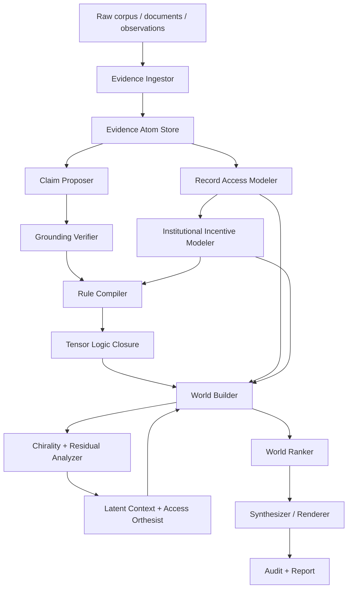

# 04 — System Architecture

## Architecture overview

## Core modules

### 1. Evidence Ingestor

Responsibilities:

- parse corpus;
- assign stable evidence IDs;
- segment spans;
- compute source quality priors;
- store provenance, temporal metadata, and access path.

Outputs: `EvidenceAtom[]`.

### 2. Record Access Modeler

Responsibilities:

- identify records expected by procedure, role, instrumentation, policy, or ordinary practice;
- classify access states: available, inaccessible, sealed, withheld, destroyed, not generated, unknown;
- distinguish absence of evidence from evidence of absence;
- estimate record-generation duty and expected observability;
- emit access uncertainty and record-contingency notes.

Outputs: `RecordAccessState[]`.

### 3. Institutional Incentive Modeler

Responsibilities:

- model actor roles and evidence-control asymmetries;
- estimate incentives to disclose, conceal, delay, narrow, or frame evidence;
- adjust source reliability and missingness likelihood;
- avoid direct truth promotion from motive alone.

Outputs: `InstitutionalIncentiveProfile[]`.

### 4. Claim Proposer

Responsibilities:

- extract candidate claims;
- attach candidate evidence references;
- produce typed relation candidates;
- preserve extraction confidence;
- mark claims that depend on unavailable or expected records.

LLMs may be used here, but outputs are not trusted until verified.

### 5. Grounding Verifier

Responsibilities:

- resolve all citations;
- run claim–evidence entailment;
- detect invalid references;
- reject unsupported strict claim promotion;
- emit grounding reports.

### 6. Rule Compiler

Responsibilities:

- convert claim/relation/access schemas into tensor rules;
- assign temperature and policy tags;
- separate strict rules from soft, abductive, access, and analogical rules;
- generate proof trace identifiers.

### 7. Tensor Logic Closure

Responsibilities:

- compute zero-temperature closure for strict rules;
- compute soft closure for candidate hypotheses;
- record proof traces;
- detect contradictions;
- preserve the distinction between strict proof support and likely-truth support.

### 8. World Builder

Responsibilities:

- enumerate or search possible worlds;
- choose assumption sets;
- assign latent contexts;
- assign access/missingness hypotheses;
- compute per-world energy.

### 9. Chirality + Residual Analyzer

Responsibilities:

- compute round-trip chirality;
- compute graph chiral tensor;
- compute residual tensor energy;
- compute access chirality;
- decide whether latent context or access-state resolution is needed.

### 10. Latent Context + Access Orthesist

Responsibilities:

- decompose contradiction residuals;
- propose latent predicates;
- propose record-access predicates;
- validate proposals against evidence, missingness constraints, and parsimony;
- rerun world builder.

### 11. World Ranker

Responsibilities:

- compute posterior-like world distribution;
- compute claim likely-truth rankings;
- compute strict proof support separately;
- calibrate confidence;
- produce uncertainty decomposition.

### 12. Synthesizer / Renderer

Responsibilities:

- render top-K worlds;
- produce natural language with hedging and estimative language;
- include proof/evidence links;
- include record-contingency notes;
- refuse unsupported strict claims.

## Data flow

1. Evidence enters as immutable atoms.
2. Expected records and access states are modeled separately from available evidence.
3. Claims are proposed and linked to evidence, access states, or record contingencies.
4. Verification rejects non-resolving references and low-entailment strict links.
5. Rules compile verified claims, relations, and access states into a proof substrate.
6. Worlds are generated from alternative assumptions, contexts, and missingness hypotheses.
7. Worlds are ranked by evidence support, contradiction energy, parsimony, source reliability, and access coherence.
8. Synthesizer outputs ranked alternatives, not a single answer unless uncertainty is low.

## Deployment model

### MVP local stack

- Python service for retrieval, NLI, tensor logic, access modeling, and world ranking.
- Optional LLM API for extraction, access-hypothesis suggestions, and rendering.
- SQLite/Postgres evidence store.
- JSONL artifacts for reproducible runs.
- Simple web UI/dashboard for world inspection.

### Production stack

- Evidence store: Postgres + vector index.
- Model services: extraction, NLI, calibration, embeddings, access-state classifier.
- Agent orchestration: workflow engine or actor system.
- Audit storage: append-only lineage logs.
- Batch experiments: reproducible config runner.

## Audit artifacts

Every run emits:

- input corpus manifest;
- evidence atom manifest;
- record-access manifest;
- institutional-incentive manifest;
- claim extraction manifest;
- grounding report;
- rule compilation manifest;
- world distribution report;
- proof trace file;
- access-contingency report;
- rendered synthesis;
- metrics report.

## Failure behavior

If any strict gate fails:

- no strict promoted truth claim is produced;
- the system emits `unsupported`, `record_contingent`, `conflicted`, or `insufficient evidence` as appropriate;
- the report lists missing records, access constraints, and next collection actions.
