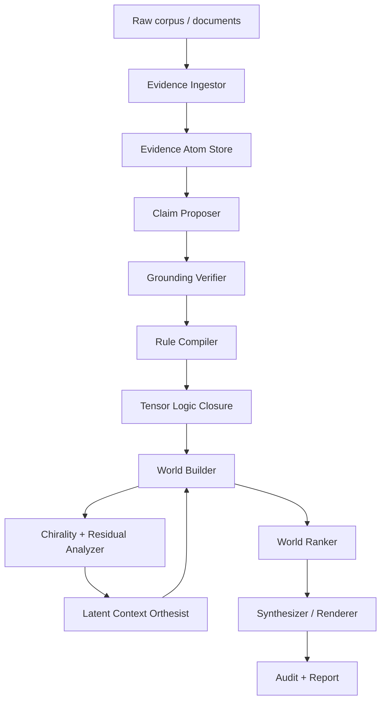

# 04 — System Architecture

## Architecture overview

## Core modules

### 1. Evidence Ingestor

Responsibilities:

- parse corpus;
- assign stable evidence IDs;
- segment spans;
- compute source quality priors;
- store provenance and temporal metadata.

Outputs: `EvidenceAtom[]`.

### 2. Claim Proposer

Responsibilities:

- extract candidate claims;
- attach candidate evidence references;
- produce typed relation candidates;
- preserve extraction confidence.

LLMs may be used here, but outputs are not trusted until verified.

### 3. Grounding Verifier

Responsibilities:

- resolve all citations;
- run claim–evidence entailment;
- detect invalid references;
- reject unsupported claim promotion;
- emit grounding reports.

### 4. Rule Compiler

Responsibilities:

- convert claim/relation schemas into tensor rules;
- assign temperature and policy tags;
- separate strict rules from soft/analogical rules;
- generate proof trace identifiers.

### 5. Tensor Logic Closure

Responsibilities:

- compute zero-temperature closure for strict rules;
- compute soft closure for candidate hypotheses;
- record proof traces;
- detect contradictions.

### 6. World Builder

Responsibilities:

- enumerate or search possible worlds;
- choose assumption sets;
- assign latent contexts;
- compute per-world energy.

### 7. Chirality + Residual Analyzer

Responsibilities:

- compute round-trip chirality;
- compute graph chiral tensor;
- compute residual tensor energy;
- decide whether latent context resolution is needed.

### 8. Latent Context Orthesist

Responsibilities:

- decompose contradiction residuals;
- propose latent predicates;
- validate them against evidence;
- rerun world builder.

### 9. World Ranker

Responsibilities:

- compute posterior-like world distribution;
- compute claim truth rankings;
- calibrate confidence;
- produce uncertainty decomposition.

### 10. Synthesizer / Renderer

Responsibilities:

- render top-K worlds;
- produce natural language with hedging and estimative language;
- include proof/evidence links;
- refuse unsupported claims.

## Data flow

1. Evidence enters as immutable atoms.
2. Claims are proposed and immediately linked to evidence.
3. Verification rejects non-resolving references and low-entailment links.
4. Rules compile verified claims into a proof substrate.
5. Worlds are generated from alternative assumptions and contexts.
6. Worlds are ranked by evidence support, contradiction energy, parsimony, and calibration.
7. Synthesizer outputs ranked alternatives, not a single answer unless uncertainty is low.

## Deployment model

### MVP local stack

- Python service for retrieval, NLI, tensor logic, world ranking.
- Optional LLM API for extraction and rendering.
- SQLite/Postgres evidence store.
- JSONL artifacts for reproducible runs.
- Simple web UI/dashboard for world inspection.

### Production stack

- Evidence store: Postgres + vector index.
- Model services: extraction, NLI, calibration, embeddings.
- Agent orchestration: workflow engine or actor system.
- Audit storage: append-only lineage logs.
- Batch experiments: reproducible config runner.

## Audit artifacts

Every run emits:

- input corpus manifest;
- evidence atom manifest;
- claim extraction manifest;
- grounding report;
- rule compilation manifest;
- world distribution report;
- proof trace file;
- rendered synthesis;
- metrics report.

## Failure behavior

If any strict gate fails:

- no promoted truth claim is produced;
- the system emits an `unknown` or `insufficient evidence` status;
- the report lists missing evidence and next collection actions.
