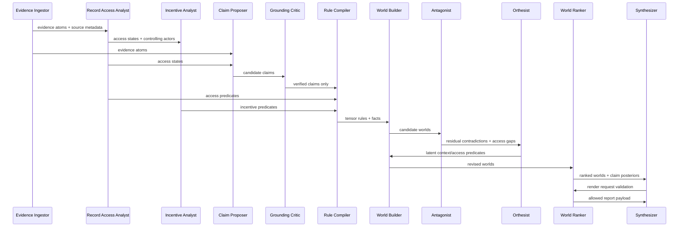

# 05 — Multi-Agent Orchestration Plan

## Agent philosophy

Agents in GCTS are not free-form chatbots. They are role-bounded workers that exchange typed artifacts. Each agent has a narrow responsibility, validation contract, and failure mode.

## Agent roster

| Agent | Inputs | Outputs | Can use LLM? | Can promote strict truth? |
|---|---|---|---:|---:|
| Evidence Ingestor | Raw docs / observations | Evidence atoms | Optional | No |
| Record Access Analyst | Evidence atoms + domain norms | Access states | Optional | No |
| Institutional Incentive Analyst | Actors + roles + access states | Incentive profiles | Optional | No |
| Claim Proposer | Evidence atoms | Candidate claims | Yes | No |
| Citation Auditor | Claims + corpus | Citation validity | No | No |
| Grounding Critic | Claims + spans | Entailment report | NLI model | No |
| Rule Compiler | Claims/relations/access states | Tensor rules | Optional | No |
| World Builder | Facts/rules/access states | Candidate worlds | No/optional | No |
| Antagonist | Worlds/claims/access states | Contradictions/chirality | Yes | No |
| Orthesist | Residuals | Latent context and access predicates | Optional | No |
| World Ranker | Worlds + evidence + access states | Posterior and claim ranks | No | Yes, by rule only |
| Synthesizer | World rankings | Natural language report | Yes | No |
| Evaluator | Reports + labels | Metrics | No | No |
| Human Oracle | Samples | Labels/feedback | Human | Training/eval only |

## Agent contracts

### Claim Proposer

**Prompt discipline:** extract claims only from cited evidence or explicitly mark record-contingent hypotheses.  
**Output schema:** `ClaimCandidate[]`.  
**Failure:** if claims are ungrounded, downstream gates reject strict promotion.

### Record Access Analyst

**Objective:** classify record availability and expectedness.  
**Checks:** record-generation duty, access path, owner/controller, production status, non-production explanation.  
**Output:** `RecordAccessState[]`.

### Institutional Incentive Analyst

**Objective:** model incentives without converting motive into truth.  
**Checks:** control of evidence, exposure if claim is true, incentive to disclose, incentive to conceal, cost of concealment.  
**Output:** `InstitutionalIncentiveProfile[]`.

### Antagonist

**Objective:** maximize useful doubt.  
**Checks:** contradiction, missing evidence, alternative world plausibility, high chirality, hidden context indicators, missing-record explanations.  
**Output:** `AntagonistReport` with severity and suggested tests.

### Orthesist

The Orthesist proposes context or access splits that reduce residual contradiction:

- “claim A true before time T, claim B true after time T”;
- “claim A true for subgroup S, claim B true for not-S”;
- “claim A true under measurement method M1, claim B true under M2”;
- “record R would be expected under world W1 but not W2”;
- “non-production of record R is more likely under suppression hypothesis H than benign-missingness hypothesis B.”

It cannot promote those contexts. It proposes them; the world ranker and evidence gates validate them.

### Synthesizer

The Synthesizer renders:

- top worlds;
- supported claims;
- likely-truth rankings;
- strict proof support where available;
- conflicts;
- record-contingency notes;
- confidence and estimative language;
- what evidence would change the ranking.

It must not add novel facts outside the world/proof/access state.

## Orchestration loop

## Concurrency model

Agents can run asynchronously except for gates:

- Citation resolution is a hard blocking gate for strict promotion.
- Grounding verification is a hard blocking gate for strict promotion.
- Access-state classification must complete before record-contingent ranking.
- Rule compilation must complete before zero-temperature closure.
- World ranking must complete before synthesis rendering.

## Human-in-the-loop points

Human/expert review is used for:

- labeling calibration datasets;
- adjudicating ambiguous gold labels;
- reviewing high-impact outputs;
- approving new strict rules;
- validating latent predicates or access-state heuristics that enter production.

Human labels are never used as a runtime oracle in the undersupervised run.
