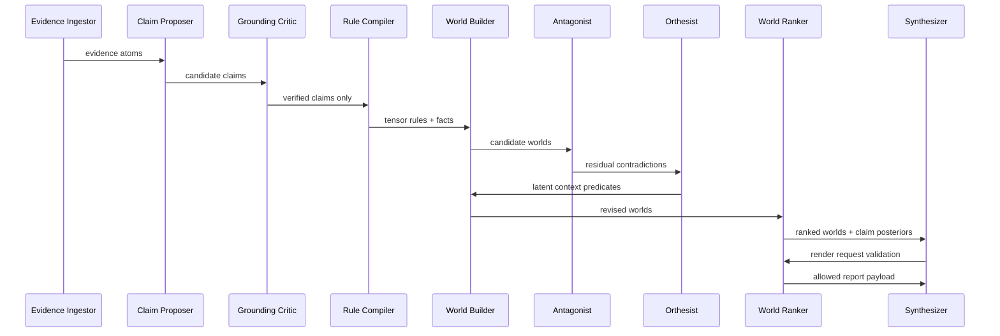

# 05 — Multi-Agent Orchestration Plan

## Agent philosophy

Agents in GCTS are not free-form chatbots. They are role-bounded workers that exchange typed artifacts. Each agent has a narrow responsibility, validation contract, and failure mode.

## Agent roster

| Agent | Inputs | Outputs | Can use LLM? | Can promote truth? |
|---|---|---|---:|---:|
| Evidence Ingestor | Raw docs | Evidence atoms | Optional | No |
| Claim Proposer | Evidence atoms | Candidate claims | Yes | No |
| Citation Auditor | Claims + corpus | Citation validity | No | No |
| Grounding Critic | Claims + spans | Entailment report | NLI model | No |
| Rule Compiler | Claims/relations | Tensor rules | Optional | No |
| World Builder | Facts/rules | Candidate worlds | No/optional | No |
| Antagonist | Worlds/claims | Contradictions/chirality | Yes | No |
| Orthesist | Residuals | Latent context predicates | Optional | No |
| World Ranker | Worlds + evidence | Posterior and claim ranks | No | Yes, by rule only |
| Synthesizer | World rankings | Natural language report | Yes | No |
| Evaluator | Reports + labels | Metrics | No | No |
| Human Oracle | Samples | Labels/feedback | Human | Training/eval only |

## Agent contracts

### Claim Proposer

**Prompt discipline:** extract claims only from cited evidence.  
**Output schema:** `ClaimCandidate[]`.  
**Failure:** if claims are ungrounded, downstream gates reject.

### Antagonist

**Objective:** maximize useful doubt.  
**Checks:** contradiction, missing evidence, alternative world plausibility, high chirality, hidden context indicators.  
**Output:** `AntagonistReport` with severity and suggested tests.

### Orthesist

The Orthesist proposes context splits that reduce residual contradiction:

- “claim A true before time T, claim B true after time T”;
- “claim A true for subgroup S, claim B true for not-S”;
- “claim A true under measurement method M1, claim B true under M2.”

It cannot promote those contexts. It proposes them; the world ranker and evidence gates validate them.

### Synthesizer

The Synthesizer renders:

- top worlds;
- supported claims;
- conflicts;
- confidence and estimative language;
- what evidence would change the ranking.

It must not add novel facts outside the world/proof state.

## Orchestration loop

## Concurrency model

Agents can run asynchronously except for gates:

- Citation resolution is a hard blocking gate.
- Grounding verification is a hard blocking gate.
- Rule compilation must complete before zero-temperature closure.
- World ranking must complete before synthesis rendering.

## Human-in-the-loop points

Human/expert review is used for:

- labeling calibration datasets;
- adjudicating ambiguous gold labels;
- reviewing high-impact outputs;
- approving new strict rules;
- validating latent predicates that enter production.

Human labels are never used as a runtime oracle in the undersupervised run.
