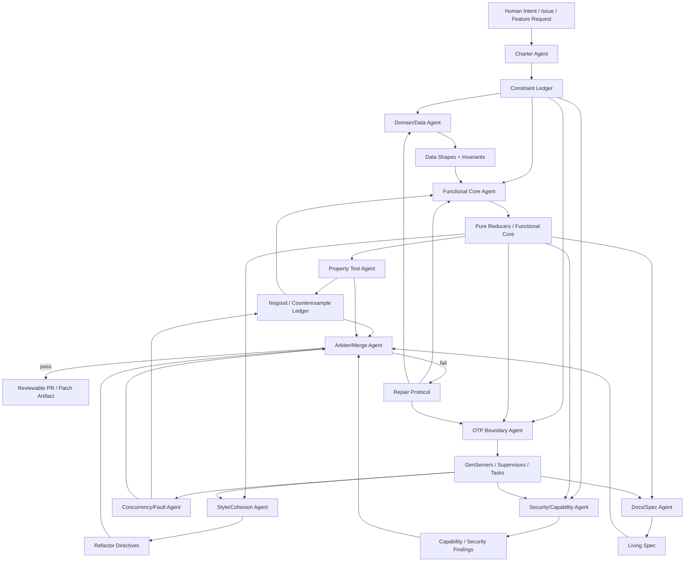

Yes. This is exactly the productive pushback.

The weak version of the argument is:

> “AI cannot engineer Elixir/OTP because Elixir requires expert taste, supervision design, process architecture, failure semantics, and long-term maintainability judgment.”

The stronger counterargument is:

> “A single generic codegen agent cannot engineer Elixir/OTP reliably. But a governed multiagent engineering system could make Elixir/OTP tractable by converting expert judgment into protocol, review, constraint, evaluation, and repair loops.”

That is the difference.

The problem is not **Elixir vs. AI**. The problem is **unstructured single-agent codegen vs. an ecosystem that requires architectural discipline**.

Your quoted thread already circles this point: the concern is that when starting from zero, there is no implicit context pruning the universe of bad SDK/design choices, and agents do not yet have strong enough evaluated preferences over nonfunctional requirements. Your own notes then point toward the right answer: initial constraints, proactive enforcement, established architectural patterns, automated QC, human-machine teaming, and eventually an “Elixir AI engineer” with expertise baked into the system. 

That is a Shoham-style multiagent problem.

Not because you need VCG auctions to write GenServers, but because you need **coordination under bounded rationality**.

---

# The key reframing

Do not ask:

> Can AI write Elixir?

Ask:

> Can we design an agent society where bad Elixir is structurally hard to produce, easy to detect, and expensive to preserve?

That is the Shoham move.

The output quality does not come from “the model being smart enough.” It comes from the **rules of the game**.

---

# Why one agent fails at Elixir/OTP

A single coding agent is asked to simultaneously be:

* domain modeler
* Elixir stylist
* OTP architect
* test engineer
* concurrency reviewer
* failure semantics reviewer
* library selector
* security reviewer
* documentation maintainer
* release engineer
* refactoring strategist

That is too many incompatible cognitive roles.

Elixir/OTP especially punishes this because the code can look fine while the architecture is wrong:

```text
Looks correct:
  GenServer compiles
  tests pass
  API returns expected value

Actually wrong:
  state shape is unstable
  calls block the scheduler
  supervision strategy is fake
  process ownership is unclear
  side effects leak into functional core
  retry semantics duplicate work
  telemetry is missing
  tests only validate happy path
```

This is why “AI can’t do Elixir” feels true.

But the better statement is:

> A generic LLM lacks an enforced model of OTP responsibility boundaries.

That can be fixed architecturally.

---

# The Shoham-style answer

Shoham/Leyton-Brown gives you the conceptual move:

> Do not trust agents to be globally rational. Design the environment so bounded agents produce acceptable outcomes through constraints, protocols, incentives, and verification.

For Elixir, that means you do **not** run “a dozen agents overnight” as a swarm of writers.

You run a **bounded multiagent institution**.

Each agent has:

* a role
* an authority boundary
* an observation set
* a protocol state
* allowed actions
* hard stop conditions
* evidence requirements
* review obligations
* failure penalties
* handoff rules

That is not hype. That is how you make agentic coding less stupid.

---

# The Elixir AI Engineer: multiagent architecture

## Core idea

Build a system where no agent is trusted to produce final code alone.

Instead, agents produce **claims**, **patches**, **tests**, **counterexamples**, and **review decisions**. The system advances only when required agents produce compatible evidence.

```text
Human intent
  → Charter/spec constraints
  → Architecture protocol
  → Implementation agents
  → Review agents
  → Test/falsification agents
  → Repair loop
  → Merge gate
```

This is not a “dozen agents overnight” free-for-all. It is a **protocol machine**.

---

# Agent roles

## 1. Charter Agent

Purpose: convert user intent into non-negotiable system constraints.

For Elixir, it emits things like:

```yaml
constraints:
  - no business logic in GenServers
  - no process per user unless justified
  - no unbounded atom creation
  - no raw stringly message protocols
  - no regex parsing for structural code transforms
  - side effects behind behaviours
  - public API hides OTP machinery
  - supervision strategy required for every process
  - property tests for reducers
  - telemetry for long-running workers
```

This is the “constitution” of the run.

Shoham mapping: **mechanism design**. You are designing the rules before agents act.

---

## 2. Domain/Data Agent

Purpose: design structs, schemas, state shapes, and access patterns.

It is forbidden from writing GenServers.

It only outputs:

* structs
* typed maps/schemas
* state transition inputs
* access patterns
* invariants
* serialization boundaries

This maps to your rule:

> Do: design primitive data shapes based strictly on access.

---

## 3. Functional Core Agent

Purpose: write pure reducers.

Allowed shape:

```elixir
transition(state, event) :: {:ok, new_state} | {:error, reason}
```

Forbidden:

* process calls
* database writes
* network calls
* timers
* random IO
* direct config reads
* hidden side effects

This is where most business logic should live.

Shoham mapping: **bounded rationality + verification**. You force the agent into a smaller game where correctness is checkable.

---

## 4. Property Test Agent

Purpose: attack the functional core.

It writes:

* StreamData properties
* state-machine tests
* invariant tests
* regression tests from failures
* mutation-style counterexamples

It does not write production code.

Its incentive is adversarial:

> Find a counterexample or certify no counterexample was found under the current test budget.

Shoham mapping: **adversarial agent / no-good learning**.

Every failure becomes a reusable `nogood`:

```yaml
nogood:
  id: reducer_negative_balance_001
  invalid_combination:
    state: account.balance < debit.amount
    event: debit
  required_constraint:
    debit must reject insufficient funds
  regression_test: test/account_reducer_test.exs:42
```

That is directly inspired by distributed constraint solving: failure becomes learned structure.

---

## 5. OTP Boundary Agent

Purpose: wrap the pure core in thin GenServers/Supervisors.

It is only allowed to do:

* process lifecycle
* serialization of calls/casts
* timer handling
* supervision placement
* child specs
* backpressure policy
* crash/restart semantics

Forbidden:

* business rules
* ad hoc state transformations
* hidden cross-process coupling
* spawning unsupervised processes

This agent answers:

```text
Why is this a process?
Who owns the state?
What happens on crash?
What is persisted?
What is recomputed?
What messages are accepted?
What messages are rejected?
```

This is the agent that makes Elixir tractable.

---

## 6. Concurrency/Fault Agent

Purpose: deliberately break assumptions.

It tests:

* process crash behavior
* restart strategy
* duplicate messages
* late messages
* mailbox growth
* timeout paths
* race conditions
* scheduler-blocking calls
* task leaks
* supervision tree failures

This is where OTP expertise matters.

It should produce failure traces, not code.

---

## 7. Style/Cohesion Agent

Purpose: enforce local conventions.

It checks:

* naming consistency
* module boundaries
* no competing patterns
* no duplicate abstractions
* no “same idea, three implementations”
* LOC reduction opportunities
* idiomatic Elixir
* library reuse
* no over-macro nonsense
* no framework cosplay

This responds directly to the Discord observation in your pasted notes: once a consistent architectural pattern exists, a good agent follows it much better. 

The Style Agent’s job is to preserve that pattern pressure.

---

## 8. Security/Capability Agent

Purpose: enforce authority boundaries.

It checks:

* no ambient authority
* no arbitrary file access
* no unsafe atom generation
* no command injection
* no unsandboxed shell execution
* no uncontrolled dynamic module loading
* no secret leakage
* capability checks at boundaries

For your substrate, this becomes the Π-chain / AccessGraph agent.

---

## 9. Docs/Spec Agent

Purpose: update documentation from actual code and test behavior.

This matters because Ryan’s quoted “spec from existing implementation → implement from spec → compare” loop is basically an agentic distillation process. 

But the spec agent must not invent aspirational behavior. It must classify:

```text
implemented
tested
documented
assumed
planned
not implemented
```

This prevents docsets from lying.

---

## 10. Arbiter/Merge Agent

Purpose: decide whether the phase can advance.

It does not write code.

It validates:

```text
compile passes
formatter passes
credo/dialyzer policy passes
unit tests pass
property tests pass
fault tests pass
docs reflect implementation
no unresolved counterexamples
no forbidden patterns
all public APIs covered
```

Shoham mapping: **social choice / aggregation**, but with hard gates instead of voting.

No majority vote. No “three agents like it.” Evidence or block.

---

# Architecture diagram



---

# Why this is actually Shoham-style MAS

## 1. Agents have different utility functions

Do not tell every agent “make good code.”

Give them conflicting goals:

| Agent                | Utility                         |
| -------------------- | ------------------------------- |
| Implementation Agent | produce minimal passing patch   |
| Test Agent           | falsify implementation          |
| OTP Agent            | minimize lifecycle ambiguity    |
| Security Agent       | minimize authority leakage      |
| Style Agent          | minimize pattern divergence     |
| Docs Agent           | minimize spec/code mismatch     |
| Arbiter              | minimize false merge acceptance |

This is the key.

You make “good code” emerge from structured disagreement.

---

## 2. No-good learning

Every failure becomes a durable constraint.

Instead of:

> “The agent made that mistake again.”

You get:

```yaml
nogood:
  pattern: "GenServer contains business rule branch"
  reason: "violates functional-core boundary"
  detection:
    ast_query: "case inside handle_call modifying domain state"
  remediation:
    move logic to Domain.Reducer.transition/2
  regression:
    required: true
```

The system becomes smarter because its constraint set grows.

That is directly useful for Elixir.

---

## 3. Mechanism design, not prompt design

Bad prompt design says:

> “Please write idiomatic Elixir.”

Mechanism design says:

> “You cannot merge unless the boundary checker proves domain logic is outside GenServer callbacks.”

That is the whole game.

For Elixir, you want incentives like:

```text
Code Agent gets reward only if:
  tests pass
  reviewers pass
  no forbidden patterns
  no expansion of public API without spec
  no new process without child_spec + crash semantics
```

The agent does not need perfect taste. The environment encodes taste.

---

## 4. Bounded rationality is assumed

The system assumes every agent is stupid in some way:

* implementation agent overfits
* reviewer agent misses bugs
* test agent under-specifies
* docs agent hallucinates
* style agent over-cleans
* security agent over-blocks

So you do not rely on one pass.

You rely on repeated interaction:

```text
proposal → critique → counterexample → repair → re-test → merge gate
```

That is much closer to real engineering than “agent writes repo overnight.”

---

## 5. Common knowledge is replaced by artifacts

Agents do not “understand the project” in some mystical shared way.

They share:

* constraint ledger
* architecture decisions
* state diagrams
* test failures
* traces
* diffs
* no-good records
* module ownership map
* capability graph

This is your common-knowledge substitute.

---

# What would make Elixir viable for non-expert teams?

Not “better autocomplete.”

This:

## 1. A canonical OTP pattern library

The platform should ship approved shapes:

```text
FunctionalCore + GenServer Shell
DynamicSupervisor + Registry
Task.Supervisor Worker Pool
Broadway/Oban-style async pipeline
Finite-state process
Persistent process with snapshot/replay
Telemetry-wrapped service boundary
```

Each pattern has:

* when to use
* when not to use
* generated tests
* supervision template
* failure semantics
* telemetry requirements
* anti-pattern detector

The agent must choose from the pattern library. It cannot invent random OTP architecture.

---

## 2. A process topology checker

The system should render and validate:

```text
Application Supervisor
  ├── Registry
  ├── DynamicSupervisor
  ├── WorkerPool
  └── BoundaryServer
```

And ask:

```text
Who supervises this?
Who restarts this?
What state is lost?
What state is recovered?
What messages can duplicate?
What happens if child init fails?
```

This is where Elixir differs from CRUD web stacks.

---

## 3. Functional-core enforcement

The platform should detect:

```elixir
def handle_call({:do_business_thing, input}, _from, state) do
  # 80 lines of domain logic here
end
```

And force:

```elixir
def handle_call({:do_business_thing, input}, _from, state) do
  case Domain.transition(state.domain, {:do_business_thing, input}) do
    {:ok, domain} -> {:reply, :ok, %{state | domain: domain}}
    {:error, reason} -> {:reply, {:error, reason}, state}
  end
end
```

That one enforcement rule alone would improve agentic Elixir dramatically.

---

## 4. Expert review encoded as gates

The system should have gates like:

```text
Gate: New GenServer
Required:
  - reason this must be a process
  - owned state definition
  - public API module
  - child_spec
  - restart strategy
  - timeout behavior
  - telemetry events
  - crash test
  - mailbox/backpressure consideration
```

This is how you compress S-tier Elixir judgment.

---

## 5. “Refuse to write Elixir badly”

Ryan’s point, as quoted, is that agents do not yet refuse bad choices strongly enough; they know good choices but lack evaluated strong opinions over nonfunctional requirements. 

An Elixir AI engineer needs refusal behavior:

```text
I will not add a GenServer for this.
A pure module is sufficient.

I will not use an Agent here.
Ownership semantics are unclear.

I will not put business logic in handle_call/3.
Move it to the reducer.

I will not create atoms from external input.
Use existing atoms or string keys.

I will not add a process without a supervision plan.
```

That is what “expertise baked in” means.

---

# What “running a dozen agents overnight” should become

Bad version:

```text
12 agents write random files in parallel.
Morning result: chaos.
```

Good version:

```text
1 planner
2 implementers with narrow scopes
1 test adversary
1 OTP reviewer
1 security reviewer
1 style reviewer
1 docs synchronizer
1 arbiter

All actions pass through a protocol.
No direct merge authority except arbiter.
Every failure becomes a durable constraint.
```

Even better:

```text
Most agents do not write code.
Most agents produce constraints, tests, critiques, traces, and counterexamples.
```

That is the missing maturity.

---

# Concrete workflow

## Phase 0: Ingest

```text
Read repo
Detect app topology
Detect OTP processes
Detect public APIs
Detect test coverage
Detect conventions
Build architecture graph
```

## Phase 1: Constraint synthesis

```text
Generate:
  - project charter
  - anti-pattern list
  - allowed OTP patterns
  - module boundary map
  - test obligations
```

## Phase 2: Proposal

Implementation agent proposes a minimal change plan.

It must declare:

```yaml
files_touched:
  - lib/foo/domain.ex
  - lib/foo/server.ex
new_processes: []
new_dependencies: []
state_migrations: []
risk_level: low
```

## Phase 3: Adversarial review

Review agents attack the plan before code is written.

```text
OTP reviewer: no process impact
Security reviewer: no capability change
Style reviewer: matches local pattern
Test reviewer: missing property test for invalid transition
```

## Phase 4: Patch

Implementation agent writes code.

## Phase 5: Falsification

Test/fault agents generate counterexamples.

## Phase 6: Repair

Only scoped repairs allowed.

No random rewrite.

## Phase 7: Merge gate

Arbiter requires evidence.

---

# Minimal viable Elixir AI Engineer

You do not need the whole sci-fi system.

A useful first version is:

```text
1. Repo Pattern Extractor
2. Functional Core Enforcer
3. GenServer Boundary Reviewer
4. Property Test Generator
5. Supervision Tree Reviewer
6. No-Good Ledger
7. Merge Arbiter
```

That alone is enough to make Elixir much more AI-tractable.

---

# The strongest argument against Ryan’s pessimistic version

The pessimistic version says:

> Elixir is risky because long-term maintainability requires stable expert teams.

The counter is:

> True today, but that risk is compressible into tooling because much of Elixir expertise is structural, not mystical.

A lot of OTP judgment can be represented as:

* process ownership rules
* supervision invariants
* state boundary rules
* side-effect placement rules
* failure-mode matrices
* test obligations
* anti-pattern detectors
* architectural templates
* telemetry requirements

That is precisely the kind of expertise agent systems can internalize.

The hard part is not making the model “know Elixir.”

The hard part is making the platform **refuse structurally unsound Elixir**.

---

# What the Shoham book contributes

For your Elixir AI engineer, the useful parts are:

| Shoham concept              | Elixir AI engineer equivalent                             |
| --------------------------- | --------------------------------------------------------- |
| Distributed problem solving | multiple specialist agents coordinate on repo constraints |
| Nogood learning             | every failed patch/test becomes durable anti-pattern      |
| Mechanism design            | environment rewards verified code, not plausible code     |
| Bounded rationality         | agents are assumed fallible and locally scoped            |
| Correlated equilibrium      | central arbiter/choreographer coordinates specialists     |
| Social choice failure       | do not “vote”; require evidence gates                     |
| Epistemic logic             | distinguish known/observed/inferred/assumed               |
| BDI commitment              | agents commit to scoped plans and cannot thrash           |
| Common knowledge            | shared traces/specs/diffs replace implicit context        |
| Repeated games              | agents improve via recurring failures and regressions     |

That is the bridge.

---

# The design principle

The future Elixir AI engineer is not:

```text
GPT but better at Elixir.
```

It is:

```text
A supervised society of constrained agents where Elixir expertise is encoded into the rules of production.
```

More bluntly:

> You do not make AI good at OTP by asking harder.
> You make OTP mistakes unmergeable.

That is the platform.

And if that exists, then yes: AI-assisted Elixir becomes a much more rational choice for civilians, because the thing you are missing — the stable expert team — is partially replaced by a persistent, protocolized, adversarial expert-review environment.
