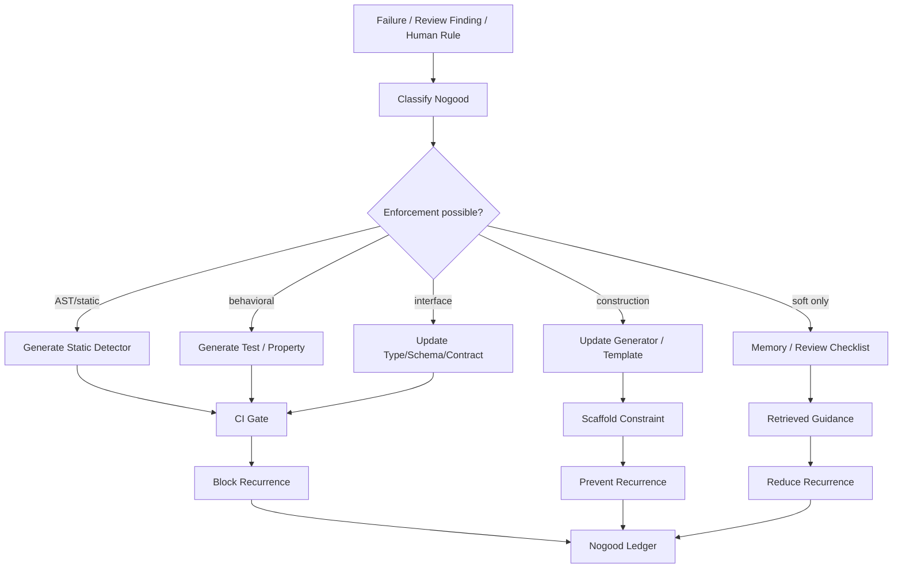

Yes. That is the exact catch.

A “nogood ledger” is only meaningful if it is **operational**, not just remembered.

Otherwise it degenerates into:

```text
more prompt text
more memory
more vague rules
more bloated context
more things the model can ignore
```

And then you are back to “please write good Elixir.”

So the hard line is:

> A nogood is not useful because the model remembers it.
> A nogood is useful only when it becomes an executable constraint, detector, test, type, gate, or repair obligation.

That is the distinction.

---

# Three levels of “nogood” maturity

## Level 0: Prompt memory

```yaml
rule: "Do not put business logic in handle_call/3"
```

This is weak. It depends on model compliance.

Useful as guidance, but not governance.

## Level 1: Retrieval / memory system

```yaml
when_task_mentions:
  - GenServer
  - state transition
retrieve:
  - "Do not put business logic in handle_call/3"
```

Better, but still weak. The agent may retrieve the right memory and still violate it.

## Level 2: Executable constraint

```yaml
nogood:
  pattern: business_logic_inside_genserver_callback
  detector: mix nshkr.check.boundaries
  failure_effect: block_merge
  remediation: extract_to_reducer
  regression_required: true
```

This is real.

The system does not “remember” the rule. It **enforces** it.

---

# The practical version

A real nogood should compile down into one or more artifacts:

```text
nogood
  → AST/static detector
  → property test
  → architectural linter
  → generated regression test
  → review checklist item
  → repair recipe
  → CI gate
```

For example:

```yaml
nogood:
  id: otp_business_logic_in_callback
  claim: "GenServer callbacks must not contain domain branching logic"
  applies_to:
    language: elixir
    files: "lib/**/*.ex"
  detector:
    kind: ast_rule
    command: "mix nshkr.boundary_check"
  remediation:
    strategy: extract_functional_core
    target_shape: "Domain.transition(state, event)"
  gate:
    block_on_violation: true
  regression:
    required: true
```

The important part is not the YAML. The important part is:

```text
command: "mix nshkr.boundary_check"
block_on_violation: true
```

That is where it stops being memory and starts being machinery.

---

# The OpenAI lab-layer version vs. your platform-layer version

You are right that there are two fundamentally different routes.

## Route A: Big lab solves it inside the model

OpenAI or another lab trains the model to internalize:

* Elixir idioms
* OTP taste
* long-horizon refactoring discipline
* refusal behavior
* stronger tool-use policies
* better self-review
* better codebase search
* better test reasoning
* better failure repair

That helps everyone.

But you do not control it.

And even if the base model gets much better, it still will not know your project’s exact constraints unless those are externalized somewhere.

## Route B: You solve it at the harness/platform layer

You build:

* repo-specific constraints
* AST detectors
* codebase topology maps
* property-test generators
* boundary checkers
* CI gates
* no-good ledgers
* repair recipes
* role-specific agents
* trace memory
* eval loops

This is controllable.

It also survives model swaps.

That is the path available to civilians.

---

# The key insight

The platform-layer version should not try to “teach” the model permanently.

It should make the model operate inside a **narrow, instrumented environment** where mistakes are converted into external structure.

The loop is:

```text
model proposes
system checks
failure becomes detector/test/rule
future proposals are blocked by detector/test/rule
```

Not:

```text
model proposes
human says “remember not to do that”
model hopefully remembers
```

That second loop is fake learning.

The first loop is engineering.

---

# What “learning” actually means here

For your system, learning does **not** need to mean model weight updates.

It can mean any durable transformation that changes future system behavior.

## Weak learning

```text
Add note to memory.
```

## Better learning

```text
Retrieve note during similar tasks.
```

## Real learning

```text
Generate a failing test that prevents recurrence.
```

## Strong learning

```text
Generate a static detector that blocks the class of recurrence.
```

## Strongest platform learning

```text
Change the allowed design grammar so the bad shape is no longer generatable.
```

That last one matters.

For Elixir, the real win is not “agent remembers not to write bad GenServers.” The real win is:

```text
New GenServer generation only happens through approved templates.
Approved templates call pure reducers.
Pure reducers require property tests.
Supervisors require crash semantics.
CI blocks violations.
```

Now the agent has less room to make the old mistake.

---

# The “anti-slop memory” should be a compiler, not a diary

Think of the nogood ledger as source material for a project-specific compiler/linter/test suite.

Bad:

```text
Memory:
  “Avoid complex GenServer callbacks.”
```

Good:

```text
Rule:
  Callback body complexity > threshold fails.

Detector:
  Count branches/calls/side effects inside handle_call/3.

Repair:
  Extract branch logic into Domain.Reducer.

Gate:
  Cannot merge until fixed.
```

This is why your instinct about “just more data” is right.

Data alone is inert.

The valuable form is **compiled data**.

---

# Concrete Elixir example

Suppose an agent writes:

```elixir
def handle_call({:purchase, order}, _from, state) do
  if state.balance < order.total do
    {:reply, {:error, :insufficient_funds}, state}
  else
    new_balance = state.balance - order.total
    new_orders = Map.put(state.orders, order.id, order)
    new_state = %{state | balance: new_balance, orders: new_orders}
    {:reply, {:ok, order.id}, new_state}
  end
end
```

The weak memory says:

> Do not do that.

The operational nogood creates:

## 1. AST detector

Detect conditional domain mutation inside `handle_call/3`.

```text
Violation:
  GenServer callback contains domain decision + state mutation.
```

## 2. Repair target

Require:

```elixir
def handle_call({:purchase, order}, _from, state) do
  case Domain.purchase(state.domain, order) do
    {:ok, domain, result} ->
      {:reply, {:ok, result}, %{state | domain: domain}}

    {:error, reason} ->
      {:reply, {:error, reason}, state}
  end
end
```

## 3. Property test

```elixir
property "purchase never reduces balance below zero" do
  ...
end
```

## 4. CI gate

```bash
mix test
mix credo --strict
mix nshkr.boundary_check
```

Now the system learned.

Not because the LLM changed.

Because the repo’s executable boundary changed.

---

# What belongs in memory vs. what belongs in gates

| Artifact           | Use it for                 | Trust level |
| ------------------ | -------------------------- | ----------- |
| Prompt rule        | Soft guidance              | Low         |
| Retrieved memory   | Contextual reminder        | Low-medium  |
| Checklist          | Human/agent review         | Medium      |
| Static detector    | Repeatable enforcement     | High        |
| Property test      | Behavioral enforcement     | High        |
| Type/spec/schema   | Interface enforcement      | High        |
| Generator/template | Prevents bad shape upfront | Very high   |
| CI gate            | Blocks regression          | Very high   |

So for nogoods:

```text
Prompt memory is the seed.
Executable enforcement is the harvest.
```

---

# Where evals fit

You are also right that real learning usually requires evals.

But you do not need giant lab-scale evals at first.

You need **project-local evals**.

For Elixir/OTP, useful evals are small and brutal:

```text
Given this feature request, does the agent:
  - create unnecessary GenServer?
  - put domain logic in callback?
  - omit child_spec?
  - miss crash semantics?
  - fail to add property tests?
  - create stringly protocols?
  - introduce atom leaks?
  - skip telemetry?
  - expand public API unnecessarily?
```

This can be a local benchmark suite.

## Example eval item

```yaml
eval:
  name: avoid_unnecessary_genserver
  prompt: "Add a pure pricing calculation module."
  expected:
    must_not_create:
      - GenServer
      - Supervisor
    must_create:
      - pure_module
      - unit_tests
      - property_tests
```

Another:

```yaml
eval:
  name: genserver_boundary_purity
  prompt: "Add a session process that tracks active job state."
  expected:
    must_have:
      - child_spec
      - public API wrapper
      - pure transition module
      - crash behavior note
    must_not_have:
      - business branching in handle_call
```

This is not OpenAI-scale training. This is harness-level selection and regression.

You use it to choose:

* prompts
* agent roles
* model versions
* templates
* detectors
* repair recipes

---

# The big-lab advantage

OpenAI can do the thing civilians cannot easily do:

```text
failure traces across millions of coding tasks
→ train/fine-tune/RL models
→ internalize better priors
→ improve base behavior
```

That is real.

A lab can make the model less likely to generate bad Elixir in the first place.

But that is still not enough for high-assurance engineering, because:

* project constraints differ
* libraries differ
* architecture differs
* style differs
* risk tolerance differs
* correctness is repo-specific
* nonfunctional requirements are contextual

So even with a much better model, you still need harness constraints.

The best future is:

```text
lab-layer intelligence
+
platform-layer governance
+
repo-local executable constraints
```

Not one or the other.

---

# What this means for your “Elixir AI engineer”

The thing to build is not primarily a memory system.

It is a **constraint compilation system**.

## Pipeline

```text
Failure / critique / expert rule
  → classify
  → convert to nogood
  → decide enforcement form
  → generate detector/test/template/checklist
  → run against repo
  → block or warn
  → store trace
```

## Enforcement form decision

```text
Can this be statically detected?
  yes → AST rule

Can this be behaviorally tested?
  yes → property/regression test

Can this be prevented by generation template?
  yes → scaffold/generator change

Can this be type/schema constrained?
  yes → contract/schema/spec

Otherwise:
  review checklist + retrieved guidance
```

That gives you a practical ladder.

---

# The real architecture



This is the missing practical bridge.

---

# Why this is still “learning”

Because the system’s future behavior changes.

Not through weight updates, but through:

* stronger CI
* stronger generators
* stronger tests
* stronger detectors
* stronger prompts
* better routing
* better refusal behavior
* better task decomposition

That is the same reason a compiler “learns” nothing, but a codebase with tests becomes harder to break.

The substrate learns by accumulating **constraints that execute**.

---

# The dangerous trap

The trap is building:

```text
NogoodDB
VectorMemory
ReflectionStore
AgentMemory
LessonsLearned.md
```

and thinking you solved it.

You did not.

That is just a graveyard of advice unless it affects execution.

A valid nogood should answer:

```text
How is this detected?
Where is it enforced?
What fails if it recurs?
What repair is required?
What test proves the repair?
```

No answer means it is not a nogood. It is a note.

---

# Final formulation

Your critique is right:

> If nogood learning is just “more data,” it is not enough.

The corrected formulation is:

> Nogood learning for agentic engineering only matters when failures are compiled into executable constraints that alter future generation, testing, review, or merge behavior.

So the practical Shoham-inspired innovation is not:

```text
memory for agents
```

It is:

```text
counterexample-driven constraint compilation for agentic software engineering
```

For Elixir/OTP:

```text
bad process pattern observed
→ nogood recorded
→ AST detector generated
→ property/fault test added
→ generator/template updated
→ CI blocks recurrence
→ future agents operate in a narrower valid design space
```

That is real. That does not require OpenAI to update model weights. It does require disciplined platform engineering.

And yes, a big lab can do the model-layer version first. But a civilian platform can still do the stronger repo-local version, because the strongest guarantees come from the harness, not from the model’s memory.
