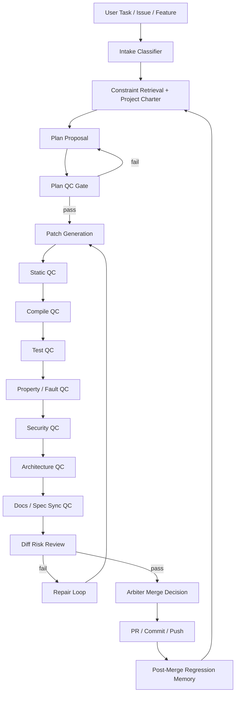
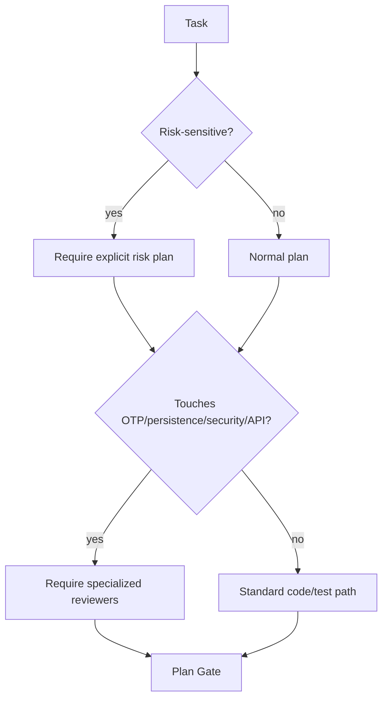
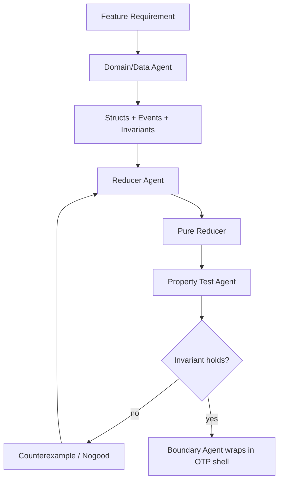
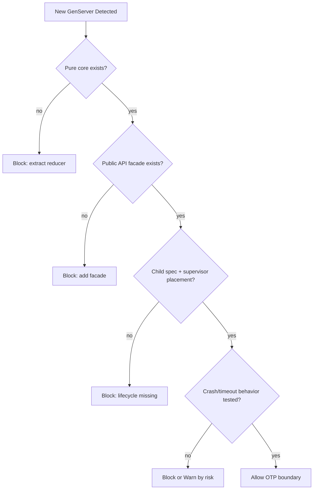
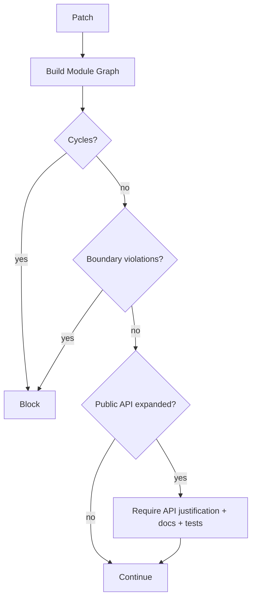
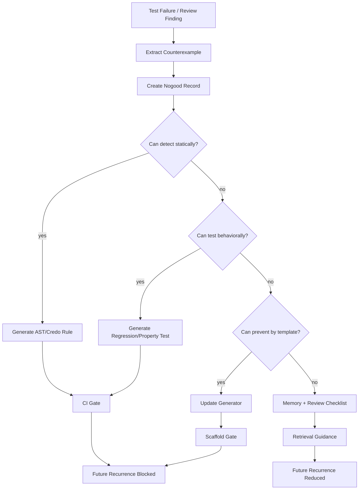
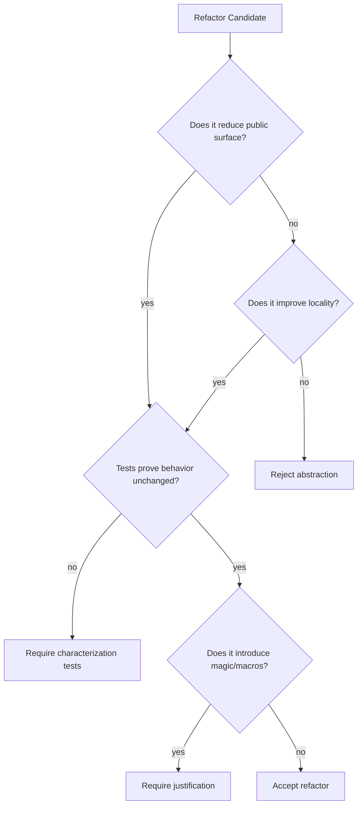
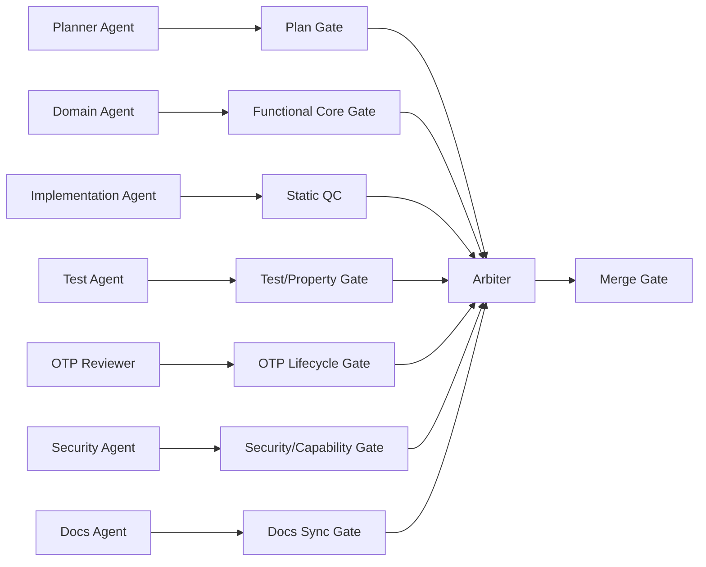

Below is a **QC control catalog** for an **Elixir AI Engineer**: a governed agentic engineering system where LMs propose, explain, refactor, and repair, while deterministic controls decide what advances.

The north-star rule:

```text
LMs may propose.
Deterministic systems must verify.
Humans arbitrate only unresolved design/risk questions.
```

Your prior framing already points in this direction: proactive constraints, cleanup passes, consistent architectural patterns, automated QC, human-machine teaming, and converting agreed rules into development-time constraints rather than retroactive cleanup only. 

---

# 0. Control taxonomy

Every QC control should be classified like this:

```yaml
control:
  id: otp.genserver.functional_core_boundary
  category: architecture
  deterministic: true
  enforcement:
    - credo_custom_check
    - ast_static_analysis
    - ex_unit_contract_test
  lm_role:
    - explain_violation
    - propose_refactor
    - generate_tests
  merge_policy: block
  artifact:
    - failing_check
    - repair_patch
    - regression_test
```

## Enforcement levels

| Level                           | Meaning                                   | Example                                                            |
| ------------------------------- | ----------------------------------------- | ------------------------------------------------------------------ |
| **L0: Guidance**                | Soft instruction only                     | Prompt says “prefer pure functions.”                               |
| **L1: Checklist**               | Reviewer/agent must answer                | “Why is this a GenServer?”                                         |
| **L2: Static check**            | Deterministic AST/text/dependency check   | Credo custom rule blocks callback logic.                           |
| **L3: Behavioral check**        | Tests, property tests, fault tests        | StreamData reducer invariant.                                      |
| **L4: Construction constraint** | Generator/template prevents invalid shape | New GenServer scaffold includes child spec, API facade, telemetry. |
| **L5: Merge gate**              | CI blocks advancement                     | Required check fails.                                              |

Most rules should graduate toward **L2–L5**. Anything stuck at L0 is just prompt vapor.

---

# 1. Overall QC pipeline



The LM appears in **planning**, **patching**, **repair**, **explanation**, and **test generation**. It should not be the final authority for compile, tests, security, architecture gates, or merge readiness.

---

# 2. QC control matrix

## Legend

| Mark      | Meaning                                   |
| --------- | ----------------------------------------- |
| **D**     | Deterministic or mostly deterministic     |
| **LM**    | LM useful for proposal/review/explanation |
| **Block** | Should usually block merge                |
| **Warn**  | Usually warn unless high-risk project     |

---

# 3. Intake and task controls

These prevent the agent from starting in a vague, unsafe state.

| Control                             | Purpose                                            | Deterministic? | Tooling / enforcement      | LM role               | Policy             |
| ----------------------------------- | -------------------------------------------------- | -------------: | -------------------------- | --------------------- | ------------------ |
| Task type classification            | Feature, bug, refactor, test-only, docs, migration |        Partial | Rule-based classifier + LM | classify ambiguity    | Warn               |
| Scope declaration                   | Files/modules expected to change                   |        Partial | Diff scope checker         | propose scope         | Block if unbounded |
| Risk class                          | Low/medium/high risk                               |        Partial | Heuristics + LM            | assess risk           | Warn/Block         |
| Stop conditions                     | Define when task is complete                       |        Partial | Required plan fields       | draft stop conditions | Block              |
| Non-goals                           | Prevent opportunistic rewrites                     |        Partial | Plan schema                | propose non-goals     | Block              |
| Expected artifacts                  | Code, tests, docs, migration, telemetry            |        Partial | Plan schema                | propose artifacts     | Block              |
| Dependency-change declaration       | New deps explicitly named                          |              D | `mix.exs` diff checker     | justify dep           | Block              |
| Public API-change declaration       | Detect changed public functions                    |      D/Partial | AST export diff            | explain API impact    | Block              |
| Runtime-process declaration         | Detect new GenServers/Supervisors/Tasks            |              D | AST module use check       | justify process       | Block              |
| Persistence declaration             | Detect Ecto/file/ETS/Mnesia/Oban changes           |      D/Partial | AST/dependency grep        | explain persistence   | Block              |
| Security-sensitive path declaration | Touching auth, secrets, shell, network             |      D/Partial | path/rule matcher          | risk explain          | Block              |

## Intake flow



---

# 4. Specification / charter controls

These ensure the agent is not coding against vibes.

| Control                                   | Purpose                              | Deterministic? | Tooling                       | LM role                        | Policy              |
| ----------------------------------------- | ------------------------------------ | -------------: | ----------------------------- | ------------------------------ | ------------------- |
| Project charter loaded                    | Global constraints present           |              D | Required file check           | summarize relevant constraints | Block               |
| Architecture decision records loaded      | Existing decisions respected         |      D/Partial | ADR index + retrieval         | map task to ADRs               | Warn/Block          |
| Existing convention extraction            | Local patterns found before patch    |        Partial | AST/module graph + LM summary | infer conventions              | Warn                |
| Requirement traceability                  | Each change maps to task requirement |        Partial | Plan schema + diff map        | generate trace                 | Warn/Block          |
| Assumption ledger                         | Unknowns explicitly recorded         |        Partial | Required plan field           | identify assumptions           | Warn                |
| Constraint conflicts                      | Detect contradictory constraints     |        Partial | Schema/rules + LM             | explain conflict               | Block if unresolved |
| “Implemented vs planned” docs distinction | Prevent aspirational docs            |      Partial/D | doc linter with status tags   | classify claims                | Block               |
| No hidden feature expansion               | Diff must match spec scope           |        Partial | AST/diff analyzer             | explain mismatch               | Block               |

### Required plan schema

```yaml
plan:
  task_type: feature | bugfix | refactor | test | docs | migration
  scope:
    files_expected: []
    modules_expected: []
    public_api_changes: []
    runtime_process_changes: []
    persistence_changes: []
  constraints:
    loaded:
      - project_charter
      - architecture_decisions
      - local_conventions
  non_goals: []
  risks: []
  tests_required: []
  stop_conditions: []
```

---

# 5. Formatting and basic hygiene controls

These are fully deterministic and should always run.

| Control                      | Purpose                         | Deterministic? | Tooling                                                    | LM role           | Policy     |
| ---------------------------- | ------------------------------- | -------------: | ---------------------------------------------------------- | ----------------- | ---------- |
| Format                       | Canonical formatting            |              D | `mix format --check-formatted`                             | none/repair       | Block      |
| Compile                      | Code compiles                   |              D | `mix compile --warnings-as-errors`                         | repair            | Block      |
| Test compile                 | Test files compile              |              D | `mix test --no-start` or normal test                       | repair            | Block      |
| No compiler warnings         | Prevent accumulating debt       |              D | warnings-as-errors                                         | repair            | Block      |
| No unused aliases/imports    | Hygiene                         |              D | compiler/Credo                                             | repair            | Block      |
| No unused deps               | Remove dependency sprawl        |              D | `mix deps.unlock --check-unused` where applicable / custom | suggest removal   | Warn/Block |
| No debug artifacts           | `IO.inspect`, `dbg`, temp files |              D | Credo/custom grep/AST                                      | repair            | Block      |
| No TODO/FIXME without ticket | Avoid latent vague debt         |              D | custom checker                                             | create issue text | Warn/Block |
| No generated junk            | `.bak`, temp, copied snippets   |              D | path checker                                               | repair            | Block      |
| New file naming conventions  | Enforce project layout          |              D | path checker                                               | suggest path      | Block      |

---

# 6. Credo controls

Credo is the obvious base for many deterministic style and maintainability checks.

## Standard Credo controls

| Control                   | Purpose                          | Deterministic? | Tooling              | Policy                    |
| ------------------------- | -------------------------------- | -------------: | -------------------- | ------------------------- |
| Readability               | Idiomatic Elixir                 |              D | Credo                | Warn/Block by severity    |
| Refactoring opportunities | Complexity, nesting, duplication |              D | Credo                | Warn/Block                |
| Design warnings           | Unsafe patterns                  |              D | Credo                | Block selected            |
| Consistency               | Alias/import/module style        |              D | Credo                | Warn                      |
| Strict mode               | Catch more issues                |              D | `mix credo --strict` | Block for mature packages |

## Custom Credo checks you likely want

| Custom check                                    | Purpose                                     | Deterministic? | Policy     |
| ----------------------------------------------- | ------------------------------------------- | -------------: | ---------- |
| No business logic in GenServer callbacks        | Enforce functional core                     |              D | Block      |
| Callback complexity threshold                   | Prevent giant `handle_call` / `handle_cast` |              D | Block      |
| No direct side effects in reducers              | Keep core pure                              |      D/Partial | Block      |
| No unsupervised `spawn` / `Task.start`          | OTP safety                                  |              D | Block      |
| Require `Task.Supervisor` for async work        | Supervised tasks                            |              D | Block      |
| No dynamic atom creation                        | Prevent atom leaks                          |      D/Partial | Block      |
| No `String.to_atom/1` on external input         | Security/stability                          |      D/Partial | Block      |
| No raw `send` except approved modules           | Message discipline                          |              D | Warn/Block |
| No stringly message protocols                   | Require typed/event structs                 |      D/Partial | Warn/Block |
| No process registration without Registry policy | Avoid global-name chaos                     |              D | Block      |
| No direct Application env reads in core         | Config boundary discipline                  |              D | Warn/Block |
| No broad `rescue` swallowing errors             | Failure semantics                           |              D | Block      |
| No `Process.sleep` in tests                     | Flaky tests                                 |              D | Block      |
| No `:timer.sleep` in production paths           | Latency smell                               |              D | Block      |
| No test-only conditionals in prod code          | Integrity                                   |              D | Block      |
| No new dependency without ADR/justification     | Dependency governance                       |      D/Partial | Block      |
| No macro unless allowlisted / justified         | Avoid metaprogramming sprawl                |      D/Partial | Warn/Block |
| No public function without spec/doc policy      | API discipline                              |              D | Warn/Block |
| Require telemetry around long-running workers   | Observability                               |      D/Partial | Warn/Block |
| Require child spec for worker modules           | OTP lifecycle                               |              D | Block      |
| Require explicit restart strategy               | Supervision semantics                       |      D/Partial | Block      |
| No Ecto calls in domain core                    | Boundary purity                             |      D/Partial | Block      |
| No HTTP/client calls in domain core             | Boundary purity                             |      D/Partial | Block      |
| No filesystem calls in domain core              | Boundary purity                             |      D/Partial | Block      |

---

# 7. Dialyzer / type controls

Elixir typing is imperfect, but Dialyzer still matters.

| Control                                          | Purpose                        | Deterministic? | Tooling             | LM role             | Policy                   |
| ------------------------------------------------ | ------------------------------ | -------------: | ------------------- | ------------------- | ------------------------ |
| Dialyzer clean                                   | Type discrepancy detection     |          D-ish | Dialyxir / Dialyzer | repair/spec propose | Block for mature modules |
| Public specs required                            | Document API contracts         |              D | custom AST check    | write specs         | Warn/Block               |
| Callback specs required                          | Behaviour clarity              |              D | compiler/Dialyzer   | repair              | Block                    |
| Opaque types used at boundaries                  | Prevent representation leakage |      D/Partial | custom AST          | propose types       | Warn                     |
| No broad `term()` in public API unless justified | Stronger contracts             |      D/Partial | custom spec checker | refine specs        | Warn                     |
| Type aliases for core domain concepts            | Semantic clarity               |      D/Partial | AST checker         | propose aliases     | Warn                     |
| Success typing mismatch repair                   | Catch impossible returns       |              D | Dialyzer            | repair              | Block                    |
| No ignored Dialyzer warnings without reason      | Prevent suppression rot        |              D | config checker      | explain exceptions  | Block                    |

## Optional stronger typing layer

If you adopt libraries such as typed structs, schema validators, or contract libraries:

| Control                  | Purpose              | Deterministic? | Tooling                        | Policy     |
| ------------------------ | -------------------- | -------------: | ------------------------------ | ---------- |
| Struct field validation  | Runtime shape safety |              D | typed structs / validation lib | Warn/Block |
| Config schema validation | Safe config          |              D | NimbleOptions-style schema     | Block      |
| External input decoding  | Boundary validation  |              D | Jason schema/changesets/custom | Block      |
| Internal event schema    | Message discipline   |              D | struct/schema                  | Block      |
| Command/event versioning | Evolvability         |      D/Partial | schema checker                 | Warn/Block |

---

# 8. Functional core controls

These are central to the Elixir AI Engineer.

| Control                                 | Purpose                              | Deterministic? | Tooling                 | LM role           | Policy     |
| --------------------------------------- | ------------------------------------ | -------------: | ----------------------- | ----------------- | ---------- |
| Pure reducer boundary                   | Business logic lives in pure modules |      D/Partial | AST checker + tests     | extract reducer   | Block      |
| Reducer signature convention            | Standard transition shape            |              D | AST/spec checker        | repair            | Block      |
| No side effects in reducers             | Testability                          |      D/Partial | AST denylist            | repair            | Block      |
| Reducer invariant tests                 | Behavioral guarantees                | D once written | ExUnit/StreamData       | generate tests    | Block      |
| Command/event structs                   | Avoid tuple/string soup              |              D | AST/schema check        | propose structs   | Warn/Block |
| Explicit error algebra                  | Known error returns                  |      D/Partial | spec + pattern checker  | propose errors    | Warn/Block |
| No hidden process dependency            | Core cannot call GenServer           |              D | AST call graph          | repair            | Block      |
| No hidden config dependency             | Core receives config as input        |      D/Partial | AST call graph          | repair            | Warn/Block |
| Deterministic time/randomness injection | Testable core                        |      D/Partial | AST denylist            | repair            | Block      |
| State shape minimality                  | Avoid overgrown state                |        Partial | LM + complexity metrics | refactor proposal | Warn       |
| Access-pattern alignment                | Structs match use cases              |        Partial | LM + call graph         | critique          | Warn       |

## Functional core flow



---

# 9. OTP boundary controls

These enforce real OTP discipline.

| Control                                          | Purpose                        | Deterministic? | Tooling                       | LM role              | Policy                      |
| ------------------------------------------------ | ------------------------------ | -------------: | ----------------------------- | -------------------- | --------------------------- |
| “Why process?” justification                     | Prevent unnecessary GenServers |        Partial | Required design field         | justify/refuse       | Block for new process       |
| State ownership declared                         | Know who owns mutable state    |        Partial | design schema                 | explain              | Block                       |
| Public API facade                                | Hide OTP machinery             |              D | AST exports check             | generate facade      | Block                       |
| No direct external `GenServer.call` to internals | Boundary discipline            |      D/Partial | call graph                    | repair               | Block                       |
| Child spec present                               | Supervision compatibility      |              D | AST/compiler                  | repair               | Block                       |
| Supervisor placement declared                    | Lifecycle clarity              |        Partial | supervision graph             | propose              | Block                       |
| Restart strategy declared                        | Failure semantics              |      Partial/D | child_spec check              | explain              | Block                       |
| Timeout behavior explicit                        | Avoid indefinite calls         |      D/Partial | AST check                     | repair               | Warn/Block                  |
| Call/cast choice justified                       | Backpressure semantics         |        Partial | LM + callback analysis        | critique             | Warn                        |
| No blocking work in GenServer callback           | Scheduler/process health       |      D/Partial | AST denylist + duration tests | repair               | Block                       |
| Long work delegated to supervised task/worker    | Responsiveness                 |      D/Partial | AST/call graph                | repair               | Block                       |
| Mailbox growth considered                        | Avoid overload                 |        Partial | stress test + design field    | propose backpressure | Warn/Block                  |
| Duplicate message semantics                      | Idempotency                    |        Partial | property/fault tests          | generate tests       | Block for distributed/async |
| Late message semantics                           | Race handling                  |        Partial | fault tests                   | generate tests       | Warn/Block                  |
| Crash recovery semantics                         | State loss/recovery known      |      Partial/D | fault tests                   | propose design       | Block                       |
| Registry/name policy                             | Avoid global process chaos     |      D/Partial | AST/config checker            | repair               | Block                       |
| DynamicSupervisor policy                         | Controlled dynamic children    |      D/Partial | AST/supervision check         | repair               | Block                       |
| No unsupervised processes                        | OTP invariant                  |              D | AST denylist                  | repair               | Block                       |
| Telemetry emitted                                | Observability                  |      D/Partial | AST event check               | add telemetry        | Warn/Block                  |
| Shutdown behavior specified                      | Graceful termination           |      Partial/D | child_spec + tests            | propose              | Warn                        |

## New GenServer gate



---

# 10. Supervision and lifecycle controls

| Control                              | Purpose                       | Deterministic? | Tooling                               | LM role       | Policy                           |
| ------------------------------------ | ----------------------------- | -------------: | ------------------------------------- | ------------- | -------------------------------- |
| Supervision tree graph generated     | Make topology visible         |              D | AST/runtime introspection             | explain graph | Block if missing for OTP changes |
| Restart intensity sane               | Avoid crash loops             |        Partial | config checker                        | critique      | Warn                             |
| Child order justified                | Dependencies start in order   |        Partial | supervisor spec analyzer              | explain       | Warn                             |
| Process state recovery plan          | Know what happens after crash |        Partial | design schema + fault tests           | propose       | Block for stateful               |
| Persistent vs ephemeral state marked | Avoid accidental data loss    |        Partial | state schema                          | classify      | Block                            |
| Termination callback policy          | Clean shutdown                |      D/Partial | AST check                             | repair        | Warn                             |
| `trap_exit` usage justified          | Avoid misuse                  |      D/Partial | AST check                             | critique      | Block if unjustified             |
| Links/monitors policy                | Failure propagation clarity   |      D/Partial | AST check                             | explain       | Warn/Block                       |
| Dynamic child naming policy          | Avoid collisions              |      D/Partial | AST/config                            | repair        | Block                            |
| Orphan process detection             | Runtime leak prevention       |      D/Partial | tests/runtime observer                | repair        | Block                            |
| Application boot test                | App starts cleanly            |              D | `Application.ensure_all_started` test | repair        | Block                            |
| Restart/fault injection tests        | Validate lifecycle            | D once written | ExUnit + process kill tests           | generate      | Block for critical               |

---

# 11. Worker / side-effect controls

| Control                        | Purpose                        | Deterministic? | Tooling        | LM role           | Policy                 |
| ------------------------------ | ------------------------------ | -------------: | -------------- | ----------------- | ---------------------- |
| Side effects behind behaviours | Mock/test boundaries           |      D/Partial | call graph     | extract behaviour | Block                  |
| External clients isolated      | HTTP/DB/FS not scattered       |      D/Partial | call graph     | refactor          | Block                  |
| Retry policy explicit          | Avoid hidden loops             |      Partial/D | config/schema  | propose policy    | Block                  |
| Idempotency declared           | Safe retries                   |        Partial | design/test    | generate tests    | Block for side effects |
| Backoff/jitter policy          | Avoid thundering herd          |        Partial | config/test    | propose           | Warn/Block             |
| Circuit breaker policy         | External dependency resilience |        Partial | design/config  | propose           | Warn                   |
| Timeout policy                 | Avoid hangs                    |      D/Partial | AST/config     | repair            | Block                  |
| Pooling policy                 | Avoid overload                 |        Partial | config checker | propose           | Warn                   |
| Rate-limit behavior            | External safety                |        Partial | tests/config   | propose           | Warn/Block             |
| Error classification           | Retryable vs terminal          |      Partial/D | error algebra  | define            | Block                  |
| Dead-letter handling           | Async failure visibility       |        Partial | design/test    | propose           | Warn/Block             |
| Telemetry around side effects  | Observability                  |      D/Partial | AST check      | add telemetry     | Warn/Block             |

---

# 12. Testing controls

## Standard testing

| Control                          | Purpose                 | Deterministic? | Tooling               | LM role        | Policy     |
| -------------------------------- | ----------------------- | -------------: | --------------------- | -------------- | ---------- |
| Unit tests for pure core         | Basic correctness       | D once written | ExUnit                | generate       | Block      |
| Integration tests for boundaries | API/process behavior    |              D | ExUnit                | generate       | Block      |
| Regression tests for bugfixes    | Prevent recurrence      |              D | ExUnit                | generate       | Block      |
| Negative-path tests              | Error behavior          |              D | ExUnit                | generate       | Block      |
| No skipped tests without issue   | Avoid false green       |              D | test metadata checker | explain        | Block      |
| No test-only sleeps              | Flake prevention        |              D | Credo/custom          | repair         | Block      |
| Deterministic async tests        | Avoid global collisions |      D/Partial | ExUnit async policy   | repair         | Block      |
| Fixtures minimal                 | Avoid brittle tests     |        Partial | LM review + metrics   | refactor       | Warn       |
| Test names describe behavior     | Maintainability         |        Partial | LM review             | improve        | Warn       |
| Coverage threshold               | Prevent untested code   |              D | ExCoveralls/cover     | generate tests | Warn/Block |

## Property testing

| Control                       | Purpose                 | Deterministic? | Tooling                  | LM role            | Policy                 |
| ----------------------------- | ----------------------- | -------------: | ------------------------ | ------------------ | ---------------------- |
| Reducer invariants            | State correctness       | D once defined | StreamData/PropCheck     | propose properties | Block                  |
| Command sequence properties   | Stateful behavior       | D once defined | StreamData state machine | generate           | Block for core         |
| Idempotency properties        | Retry safety            |              D | StreamData               | generate           | Block for side effects |
| Serialization roundtrip       | Boundary safety         |              D | StreamData               | generate           | Block                  |
| No invalid state generation   | State model correctness |      D/Partial | generators               | repair             | Warn/Block             |
| Shrunk counterexamples stored | Nogood learning         |      D/Partial | test output parser       | summarize          | Block if unresolved    |

## Fault testing

| Control                        | Purpose                    | Deterministic? | Tooling               | LM role  | Policy                     |
| ------------------------------ | -------------------------- | -------------: | --------------------- | -------- | -------------------------- |
| Kill process under supervision | Restart behavior           |              D | ExUnit + Process.exit | generate | Block for stateful workers |
| Timeout simulation             | Call behavior              |              D | test doubles          | generate | Block                      |
| Duplicate message test         | Idempotency                |              D | ExUnit                | generate | Block if async             |
| Late reply test                | Race safety                |              D | ExUnit                | generate | Warn/Block                 |
| Dependency failure test        | External client resilience |              D | Mox/BYPASS            | generate | Block                      |
| Mailbox pressure test          | Backpressure               |      Partial/D | synthetic load        | generate | Warn                       |
| Crash loop detection           | Restart intensity          |      Partial/D | test supervisor       | generate | Warn/Block                 |

---

# 13. Static architecture controls

These are critical for long-term maintainability.

| Control                               | Purpose                                      | Deterministic? | Tooling                        | LM role               | Policy     |
| ------------------------------------- | -------------------------------------------- | -------------: | ------------------------------ | --------------------- | ---------- |
| Module dependency graph               | Detect coupling                              |              D | `mix xref graph`, custom graph | explain               | Warn/Block |
| No cycles                             | Prevent tangled architecture                 |              D | `mix xref graph` / custom      | repair proposal       | Block      |
| Boundary layer enforcement            | Domain/application/infrastructure separation |      D/Partial | Boundary lib/custom AST        | repair                | Block      |
| No cross-context calls                | Preserve contexts                            |      D/Partial | call graph                     | repair                | Block      |
| Public API surface diff               | Prevent accidental exposure                  |              D | AST export diff                | explain               | Block      |
| Internal modules not used externally  | Encapsulation                                |              D | call graph                     | repair                | Warn/Block |
| Dependency direction policy           | Infrastructure depends inward, not reverse   |      D/Partial | graph rules                    | repair                | Block      |
| No duplicate abstractions             | Avoid sprawl                                 |        Partial | semantic search + LM           | propose consolidation | Warn       |
| LOC/complexity thresholds             | Keep modules small                           |              D | Credo/custom                   | refactor              | Warn/Block |
| Function arity threshold              | Avoid god functions                          |              D | Credo/custom                   | refactor              | Warn       |
| Macro usage map                       | Prevent hidden DSL sprawl                    |      D/Partial | AST check                      | explain               | Warn/Block |
| Protocol/behaviour implementation map | Interface clarity                            |              D | AST graph                      | summarize             | Warn       |

## Architecture gate flow



---

# 14. Dependency controls

| Control                       | Purpose                  | Deterministic? | Tooling                              | LM role         | Policy     |
| ----------------------------- | ------------------------ | -------------: | ------------------------------------ | --------------- | ---------- |
| New dependency justification  | Avoid sprawl             |        Partial | diff + required ADR                  | write ADR       | Block      |
| License check                 | Legal compatibility      |              D | license scanner                      | summarize       | Block      |
| Security advisory check       | Known CVEs               |              D | `mix deps.audit` / GitHub advisories | explain         | Block      |
| Version pin policy            | Reproducibility          |              D | lockfile checker                     | repair          | Block      |
| Unused dependency detection   | Reduce surface           |      D/Partial | `mix xref`, custom                   | propose removal | Warn       |
| Duplicate functionality check | Avoid unnecessary libs   |        Partial | LM + dep catalog                     | critique        | Warn       |
| Transitive dependency review  | Supply-chain risk        |      D/Partial | lockfile analyzer                    | summarize risk  | Warn       |
| Dependency freshness          | Maintenance signal       |        Partial | package metadata if available        | summarize       | Warn       |
| Native dependency declaration | Build/runtime complexity |      D/Partial | dep analyzer                         | explain         | Warn/Block |

---

# 15. Security controls

## General Elixir security

| Control                            | Purpose             | Deterministic? | Tooling                    | LM role  | Policy                  |
| ---------------------------------- | ------------------- | -------------: | -------------------------- | -------- | ----------------------- |
| Sobelow scan for Phoenix           | Web security        |              D | Sobelow                    | repair   | Block for high severity |
| Dependency audit                   | Supply chain        |              D | `mix deps.audit`           | explain  | Block                   |
| Secret scan                        | Prevent leakage     |              D | gitleaks/trufflehog/custom | repair   | Block                   |
| No shell injection                 | Command safety      |      D/Partial | AST taint rules            | repair   | Block                   |
| No unsafe deserialization          | RCE/data risk       |      D/Partial | AST denylist               | repair   | Block                   |
| No dynamic atom from input         | VM safety           |      D/Partial | AST taint rules            | repair   | Block                   |
| No dynamic module calls from input | Code execution risk |      D/Partial | AST taint rules            | repair   | Block                   |
| Path traversal checks              | File safety         |      D/Partial | AST taint rules            | repair   | Block                   |
| SSRF checks                        | HTTP client safety  |        Partial | AST/rules                  | critique | Block for external URLs |
| Auth boundary tests                | Access control      | D once written | ExUnit                     | generate | Block                   |
| Authorization matrix               | Permission clarity  |        Partial | schema/test                | propose  | Block                   |
| PII/secret logging check           | Prevent leaks       |      D/Partial | AST/log scanning           | repair   | Block                   |
| Cryptography policy                | No ad hoc crypto    |      D/Partial | denylist                   | repair   | Block                   |
| TLS/config validation              | Safe clients        |      D/Partial | config checker             | repair   | Warn/Block              |

## Capability-oriented controls

| Control                             | Purpose                | Deterministic? | Tooling                          | Policy |
| ----------------------------------- | ---------------------- | -------------: | -------------------------------- | ------ |
| No ambient authority                | Explicit capabilities  |      D/Partial | call graph + capabilities schema | Block  |
| Capability required for side effect | Governance             |      D/Partial | API wrapper check                | Block  |
| AccessGraph edge emitted            | Provenance             |      D/Partial | instrumentation checker          | Block  |
| Permission checks at boundary       | Security               |      D/Partial | AST + tests                      | Block  |
| Privileged operation telemetry      | Auditability           |      D/Partial | telemetry check                  | Block  |
| Tool/sandbox permission manifest    | Agent execution safety |              D | manifest checker                 | Block  |

---

# 16. Persistence and durability controls

Your architecture wants persistence to be optional and tiered, so QC must enforce that.

| Control                              | Purpose                         | Deterministic? | Tooling              | LM role            | Policy                    |
| ------------------------------------ | ------------------------------- | -------------: | -------------------- | ------------------ | ------------------------- |
| Persistence tier declared            | memory/minimal/full             |      D/Partial | config schema        | classify           | Block                     |
| No hidden persistence                | Avoid accidental data retention |      D/Partial | call graph           | repair             | Block                     |
| Storage boundary interface           | Swap memory/db backends         |      D/Partial | behaviour check      | generate behaviour | Block                     |
| In-memory default works              | Local boot simplicity           |              D | test profile         | repair             | Block                     |
| Persistence-off tests                | Privacy/minimal mode            |              D | test matrix          | generate           | Block                     |
| Persistence-full tests               | Debug/audit mode                |              D | test matrix          | generate           | Warn/Block                |
| Migration required for schema change | DB integrity                    |              D | Ecto migration diff  | repair             | Block                     |
| Migration rollback checked           | Operability                     |      D/Partial | migration test       | repair             | Warn/Block                |
| Data retention policy                | Privacy                         |        Partial | config/schema        | propose            | Warn/Block                |
| Snapshot/replay semantics            | Recovery                        |      Partial/D | property/fault tests | generate           | Block for evented systems |
| Idempotent writes                    | Retry safety                    |      D/Partial | tests                | generate           | Block                     |
| Transaction boundary explicit        | Consistency                     |        Partial | Ecto.Multi checker   | explain            | Warn/Block                |

---

# 17. Configuration controls

| Control                              | Purpose                 | Deterministic? | Tooling              | LM role         | Policy     |
| ------------------------------------ | ----------------------- | -------------: | -------------------- | --------------- | ---------- |
| Config schema                        | Validate knobs          |              D | NimbleOptions/custom | generate schema | Block      |
| No runtime config reads in core      | Testability             |      D/Partial | AST check            | repair          | Block      |
| Environment-specific config coverage | Avoid prod surprises    |              D | config diff checker  | repair          | Warn/Block |
| Required config documented           | Operability             |      D/Partial | docs checker         | update docs     | Warn       |
| Secrets not in config files          | Security                |              D | secret scan          | repair          | Block      |
| Feature flags typed                  | Avoid stringly config   |      D/Partial | schema               | repair          | Warn/Block |
| Persistence mode knob tested         | Required by your design |              D | test matrix          | generate        | Block      |
| Provider/backend selection tested    | 1:N architecture        |      D/Partial | test matrix          | generate        | Block      |
| Invalid config fails early           | Fail-fast               |              D | startup tests        | generate        | Block      |

---

# 18. API and interface controls

| Control                       | Purpose                      | Deterministic? | Tooling           | LM role               | Policy     |
| ----------------------------- | ---------------------------- | -------------: | ----------------- | --------------------- | ---------- |
| Public API diff               | Detect breaking changes      |              D | AST export diff   | explain               | Block      |
| Semantic version impact       | Release discipline           |        Partial | LM + diff rules   | propose version       | Warn       |
| Behaviour callbacks stable    | Adapter compatibility        |              D | AST/spec check    | repair                | Block      |
| Input validation at boundary  | Robustness                   |      D/Partial | schemas/tests     | generate              | Block      |
| Output shape tested           | Contract stability           |              D | tests             | generate              | Block      |
| Error contract documented     | Caller reliability           |      Partial/D | docs/spec checker | update                | Warn/Block |
| No leaking internal structs   | Encapsulation                |      D/Partial | spec/call check   | repair                | Warn/Block |
| Adapter compliance tests      | 1:N provider safety          |              D | shared test suite | generate              | Block      |
| Backward compatibility policy | Greenfield may reject compat |        Partial | charter check     | enforce stated policy | Warn       |

---

# 19. Documentation controls

Docs must reflect implemented truth, not aspirations.

| Control                    | Purpose             | Deterministic? | Tooling                    | LM role         | Policy                  |
| -------------------------- | ------------------- | -------------: | -------------------------- | --------------- | ----------------------- |
| Public modules documented  | User comprehension  |      D/Partial | ExDoc warnings/custom      | write docs      | Warn/Block              |
| Examples compile           | Prevent stale docs  |              D | doctest                    | repair          | Block                   |
| README commands tested     | Onboarding          |      D/Partial | script runner              | repair          | Warn/Block              |
| Architecture docs updated  | Design truth        |        Partial | diff-sensitive doc checker | update docs     | Warn/Block              |
| Implemented/planned labels | Avoid lying docs    |      Partial/D | doc status linter          | classify        | Block                   |
| ADR for major decisions    | Governance          |        Partial | required file check        | draft ADR       | Block for major changes |
| Changelog updated          | Release visibility  |      D/Partial | diff checker               | draft           | Warn                    |
| Mermaid diagrams parse     | Diagram validity    |              D | mermaid-cli if available   | repair          | Warn                    |
| No undocumented config     | Operability         |      D/Partial | config/docs cross-check    | update docs     | Warn/Block              |
| No orphan docs             | Reduce stale docset |        Partial | link checker + LM          | propose cleanup | Warn                    |

---

# 20. Observability controls

| Control                                | Purpose             | Deterministic? | Tooling                 | LM role       | Policy           |
| -------------------------------------- | ------------------- | -------------: | ----------------------- | ------------- | ---------------- |
| Telemetry events for side effects      | Runtime insight     |      D/Partial | AST check               | add telemetry | Warn/Block       |
| Telemetry naming convention            | Consistency         |              D | custom checker          | repair        | Warn             |
| Error logs include context             | Debuggability       |        Partial | LM + AST                | improve       | Warn             |
| Logs do not leak secrets               | Security            |      D/Partial | taint/log checker       | repair        | Block            |
| Span/trace coverage for agent/tool ops | Provenance          |      D/Partial | instrumentation checker | repair        | Block in harness |
| Metrics for queue/mailbox/latency      | OTP health          |        Partial | telemetry checker       | add metrics   | Warn             |
| Structured logging                     | Machine readability |      D/Partial | logger call checker     | repair        | Warn             |
| Failure events emitted                 | Postmortem          |      D/Partial | telemetry checker       | repair        | Warn/Block       |

---

# 21. Performance controls

| Control                         | Purpose             | Deterministic? | Tooling               | LM role        | Policy                 |
| ------------------------------- | ------------------- | -------------: | --------------------- | -------------- | ---------------------- |
| Benchmark critical paths        | Prevent regressions |              D | Benchee               | generate bench | Warn/Block if critical |
| Memory allocation smoke test    | Avoid explosions    |      Partial/D | runtime measurement   | analyze        | Warn                   |
| Process count limit             | Avoid process leaks |      D/Partial | runtime test          | repair         | Block                  |
| Mailbox length bound            | Backpressure        |      D/Partial | runtime test          | repair         | Warn/Block             |
| N+1 database query detection    | Efficiency          |        Partial | telemetry/Ecto logs   | analyze        | Warn/Block             |
| Large binary retention review   | BEAM memory         |        Partial | LM + code review      | critique       | Warn                   |
| Scheduler-blocking NIF/port use | VM safety           |        Partial | dependency/code check | explain risk   | Warn/Block             |
| Stream vs eager collection      | Memory behavior     |        Partial | LM/static heuristics  | refactor       | Warn                   |
| Timeout budgets                 | Latency control     |      D/Partial | config/schema         | repair         | Warn/Block             |

---

# 22. Concurrency and distribution controls

| Control                                     | Purpose                 | Deterministic? | Tooling             | LM role            | Policy     |
| ------------------------------------------- | ----------------------- | -------------: | ------------------- | ------------------ | ---------- |
| Race-condition scenario tests               | Safety                  | D once defined | ExUnit/fault tests  | generate scenarios | Warn/Block |
| Idempotency under duplicate events          | Distributed correctness |              D | property tests      | generate           | Block      |
| Ordering assumptions declared               | Avoid hidden FIFO myths |        Partial | design schema       | explain            | Warn/Block |
| Clock/time assumptions declared             | Avoid time bugs         |        Partial | design schema/tests | propose            | Warn       |
| Distributed node assumptions                | Clustering clarity      |        Partial | config/design       | explain            | Warn       |
| Registry/discovery semantics                | Process addressing      |      Partial/D | config/checker      | repair             | Warn/Block |
| Network partition behavior                  | Distributed safety      |        Partial | design/fault tests  | propose            | Warn       |
| Exactly-once claims forbidden unless proven | Honesty                 |      D/Partial | doc/code linter     | repair docs        | Block      |
| At-least/at-most-once semantics declared    | Messaging clarity       |        Partial | docs/tests          | propose            | Warn/Block |

---

# 23. Phoenix/web controls, if applicable

| Control                    | Purpose                           | Deterministic? | Tooling              | LM role  | Policy              |
| -------------------------- | --------------------------------- | -------------: | -------------------- | -------- | ------------------- |
| Sobelow clean              | Security                          |              D | Sobelow              | repair   | Block high severity |
| Controller thinness        | Business logic out of controllers |      D/Partial | AST complexity check | refactor | Warn/Block          |
| Context boundary respected | Phoenix architecture              |      D/Partial | call graph           | repair   | Block               |
| Changeset validation       | Input safety                      |      D/Partial | tests/schema         | generate | Block               |
| Auth plug coverage         | Access control                    |      D/Partial | route analyzer       | repair   | Block               |
| Route diff reviewed        | API surface                       |              D | router diff          | explain  | Warn/Block          |
| LiveView state discipline  | Avoid giant LiveViews             |      D/Partial | AST complexity       | refactor | Warn                |
| CSRF/security headers      | Web safety                        |      D/Partial | config/Sobelow       | repair   | Block               |

---

# 24. Agent-harness controls

These are specific to the AI Engineer itself.

| Control                                       | Purpose                                                          | Deterministic? | Tooling                 | LM role               | Policy                      |
| --------------------------------------------- | ---------------------------------------------------------------- | -------------: | ----------------------- | --------------------- | --------------------------- |
| Tool permission manifest                      | Restrict agent actions                                           |              D | sandbox policy          | none                  | Block                       |
| No shell without explicit capability          | Safety                                                           |              D | tool gate               | request capability    | Block                       |
| Read/write file allowlist                     | Prevent sprawl/destruction                                       |              D | sandbox                 | request change        | Block                       |
| Max diff size                                 | Prevent giant rewrites                                           |              D | diff checker            | split task            | Block/Warn                  |
| Max files touched                             | Scope discipline                                                 |              D | diff checker            | split task            | Warn/Block                  |
| No binary file edits unless allowed           | Safety                                                           |              D | file type checker       | request               | Block                       |
| No dependency install without approval policy | Supply-chain                                                     |              D | sandbox/deps gate       | justify               | Block                       |
| Trace every tool call                         | Provenance                                                       |              D | harness                 | none                  | Block                       |
| Claim/evidence linkage                        | Prevent unsupported claims                                       |      Partial/D | required summary schema | attach evidence       | Warn/Block                  |
| Repair loop limit                             | Avoid thrashing                                                  |              D | harness                 | summarize stuck state | Block to human              |
| Model routing policy                          | Use stronger model for high-risk work                            |      D/Partial | harness config          | classify risk         | Warn                        |
| Context compaction audit                      | Prevent lost constraints                                         |        Partial | LM + checksum summaries | summarize             | Warn                        |
| Prompt injection defense                      | Tool/doc safety                                                  |      D/Partial | input isolation         | flag                  | Block for untrusted content |
| Agent role separation                         | No single agent self-approves                                    |              D | workflow engine         | none                  | Block                       |
| Reviewer independence                         | Reviewer sees diff + constraints, not implementer rationale only |      Partial/D | harness                 | critique              | Warn/Block                  |
| Arbiter cannot patch                          | Separation of duties                                             |              D | workflow permissions    | none                  | Block                       |

---

# 25. LM-specific QC controls

These govern LM output quality without trusting LM judgment alone.

| Control                                    | Purpose                            |               Deterministic? | Tooling                    | Policy              |
| ------------------------------------------ | ---------------------------------- | ---------------------------: | -------------------------- | ------------------- |
| Structured output schema                   | Make responses parseable           |                            D | JSON/YAML schema           | Block               |
| Citation/evidence required for repo claims | Grounding                          |                    Partial/D | file reference checker     | Warn/Block          |
| No unsupported “done” claims               | Prevent false completion           |                      Partial | checklist/schema           | Block               |
| Assumption tagging                         | Separate known/inferred/assumed    |                      Partial | schema + review            | Warn                |
| Self-review required before patch          | Catch obvious errors               |                           LM | secondary pass             | Warn                |
| Cross-model review for high risk           | Diversity                          |                           LM | alternate reviewer         | Warn                |
| Deterministic re-run on failure            | Repair behavior                    |                         D/LM | harness                    | Block if fails      |
| Counterexample extraction                  | Turn failure into nogood           |                      Partial | LM + parser                | Block if unresolved |
| Prompt budget discipline                   | Avoid context bloat                |                    D/Partial | token accounting           | Warn                |
| Memory retrieval audit                     | Ensure relevant constraints loaded |                    D/Partial | retrieval logs             | Warn                |
| Refusal behavior                           | Agent must reject bad architecture | LM + deterministic templates | Warn/Block where checkable |                     |

---

# 26. Nogood / anti-slop controls

This is the “learning” system, but only if compiled into enforcement.

| Control                                  | Purpose                     | Deterministic? | Tooling               | LM role        | Policy                            |
| ---------------------------------------- | --------------------------- | -------------: | --------------------- | -------------- | --------------------------------- |
| Nogood recorded for each failure         | Durable learning            |      D/Partial | failure parser/schema | summarize      | Block if critical failure ignored |
| Nogood classified                        | Static/test/template/memory |        Partial | LM + rules            | classify       | Warn                              |
| Static detector generated where possible | Recurrence blocking         |      D/Partial | Credo/custom AST      | propose rule   | Block for high-value              |
| Regression test generated                | Behavioral recurrence block |              D | ExUnit/StreamData     | generate test  | Block                             |
| Template updated where possible          | Prevent recurrence          |      D/Partial | generator             | propose update | Warn/Block                        |
| Nogood linked to PR/test                 | Traceability                |              D | metadata              | explain        | Warn                              |
| Nogood expiration/review                 | Avoid stale rules           |        Partial | scheduled review      | summarize      | Warn                              |
| Duplicate nogood detection               | Avoid rule sprawl           |        Partial | semantic search + LM  | merge          | Warn                              |
| False positive tracking                  | Keep rules useful           |      D/Partial | issue metadata        | analyze        | Warn                              |
| Rule severity calibrated                 | Avoid overblocking          |        Partial | metrics + human       | recommend      | Warn                              |

## Nogood compilation flow



---

# 27. LOC reduction and maintainability controls

You specifically noted LOC-reducing processes as part of cleanup. These should be framed carefully: reduce surface area without abstraction cosplay.

| Control                        | Purpose                         | Deterministic? | Tooling                     | LM role               | Policy     |
| ------------------------------ | ------------------------------- | -------------: | --------------------------- | --------------------- | ---------- |
| Module length threshold        | Flag god modules                |              D | Credo/custom                | split proposal        | Warn       |
| Function length threshold      | Flag complex functions          |              D | Credo/custom                | extract/refactor      | Warn       |
| Cyclomatic complexity          | Reduce branching                |              D | Credo                       | refactor              | Warn/Block |
| Duplicate code detection       | Consolidate repeated logic      |      Partial/D | semantic/AST clone detector | propose abstraction   | Warn       |
| Dead code detection            | Remove unused                   |      D/Partial | xref/coverage               | remove proposal       | Warn       |
| Public API minimization        | Fewer contracts to maintain     |      D/Partial | export diff                 | propose privatization | Warn       |
| Dependency-based LOC reduction | Use standard libs appropriately |        Partial | LM + allowlist              | recommend             | Warn       |
| Macro reduction                | Prefer functions/data           |      D/Partial | AST check                   | refactor              | Warn       |
| Config/schema centralization   | Reduce repeated validation      |      D/Partial | call graph                  | refactor              | Warn       |
| Shared test helpers cleanup    | Reduce noisy tests              |        Partial | LM                          | refactor              | Warn       |
| Boilerplate generators         | Prevent handwritten sprawl      |      D/Partial | templates                   | generate              | Warn       |

## LOC reduction gate



---

# 28. Release and commit controls

| Control                     | Purpose             | Deterministic? | Tooling           | LM role       | Policy             |
| --------------------------- | ------------------- | -------------: | ----------------- | ------------- | ------------------ |
| Conventional commit format  | Release automation  |              D | commitlint/custom | draft message | Warn/Block         |
| Changelog entry             | User visibility     |      D/Partial | diff checker      | draft         | Warn               |
| Version bump policy         | SemVer              |        Partial | LM + API diff     | recommend     | Warn               |
| PR summary evidence         | Reviewer efficiency |      Partial/D | template checker  | write summary | Block              |
| Test evidence included      | Trust               |              D | CI artifact links | summarize     | Block              |
| Migration notes             | Operational safety  |        Partial | checklist         | draft         | Block if migration |
| Rollback plan               | Production safety   |        Partial | checklist         | draft         | Warn/Block         |
| Push only after gates pass  | Integrity           |              D | CI/harness        | none          | Block              |
| No force push except policy | Repo safety         |              D | git hook/harness  | none          | Block              |

---

# 29. Human review controls

Human review should be used where deterministic checks cannot decide.

| Control                      | Purpose                       | Deterministic? | LM role              | Policy                   |
| ---------------------------- | ----------------------------- | -------------: | -------------------- | ------------------------ |
| High-risk design approval    | Architecture taste            |             No | summarize tradeoffs  | Human required           |
| New dependency approval      | Long-term maintenance         |        Partial | present alternatives | Human or policy required |
| Public API approval          | SDK quality                   |        Partial | explain API diff     | Human or senior agent    |
| Security exception approval  | Risk ownership                |             No | summarize risk       | Human required           |
| False positive override      | Keep gates usable             |        Partial | explain evidence     | Human required           |
| Major abstraction approval   | Prevent premature abstraction |             No | compare options      | Human recommended        |
| Deletion of large code       | Safety                        |    D threshold | summarize impact     | Human required           |
| Persistence/retention change | Privacy/data risk             |        Partial | summarize            | Human required           |

---

# 30. Suggested CI command stack

A strict but realistic Elixir lane:

```bash
mix deps.get
mix deps.unlock --check-unused || true
mix format --check-formatted
mix compile --warnings-as-errors
mix credo --strict
mix dialyzer
mix test
mix test --only property
mix test --only fault
mix sobelow --config || true
mix deps.audit || true
mix xref graph --label compile
mix docs
```

For your custom harness:

```bash
mix nshkr.qc.plan_check
mix nshkr.qc.boundary_check
mix nshkr.qc.otp_check
mix nshkr.qc.capability_check
mix nshkr.qc.public_api_diff
mix nshkr.qc.docs_sync_check
mix nshkr.qc.nogood_check
mix nshkr.qc.trace_check
```

Policy:

```text
Required block:
  format
  compile
  unit tests
  boundary_check
  otp_check for OTP changes
  capability_check for privileged changes
  public_api_diff approval
  security scan high severity

Warn initially:
  dialyzer
  docs
  coverage
  perf
  LOC thresholds

Promote warnings to blockers as the repo matures.
```

---

# 31. Role-to-control map



---

# 32. Minimal first implementation

Do **not** build all controls at once.

Start with the controls that change behavior immediately.

## Phase 1: Core deterministic lane

```text
1. mix format --check-formatted
2. mix compile --warnings-as-errors
3. mix credo --strict
4. mix test
5. custom: no business logic in GenServer callbacks
6. custom: no unsupervised processes
7. custom: no dynamic atom creation
8. custom: public API diff
9. custom: new GenServer lifecycle checklist
10. required PR summary with tests run
```

## Phase 2: Elixir/OTP architecture lane

```text
1. supervision graph generator
2. process ownership declarations
3. pure reducer enforcement
4. side-effect boundary enforcement
5. property tests for reducers
6. fault tests for stateful processes
7. telemetry check for workers
```

## Phase 3: Agentic harness lane

```text
1. role-separated agents
2. trace every tool call
3. plan schema required
4. no patch without tests
5. nogood ledger
6. generated regression tests from failures
7. repair loop limit
8. merge arbiter cannot patch
```

## Phase 4: Advanced lane

```text
1. capability graph
2. persistence-mode matrix
3. architecture graph constraints
4. semantic duplicate detection
5. local eval suite
6. model routing by risk
7. generated custom Credo rules from recurring nogoods
```

---

# 33. The practical operating doctrine

For every proposed QC rule, ask:

```text
Can this be detected statically?
Can this be tested behaviorally?
Can this be prevented by a generator?
Can this be encoded in a type/schema?
Can this be enforced in CI?
If none of the above, is it only review guidance?
```

The target is to move rules down this ladder:

```text
prompt → checklist → static check → test → generator/type → CI gate
```

That is the whole “process, not prompts” conversion.

---

# 34. Final condensed control set

If I had to compress the entire Elixir AI Engineer QC system into the non-negotiables:

```text
No claim without evidence.
No patch without a plan.
No plan without constraints.
No new process without lifecycle semantics.
No GenServer business logic.
No side effect in the functional core.
No unsupervised process.
No public API change without tests and docs.
No external input without validation.
No dynamic atom creation from untrusted input.
No persistence without a declared mode.
No dependency without justification.
No failure without a regression.
No merge by agent consensus.
Only merge by deterministic gates.
```

That is the spine. Everything else is implementation detail.
