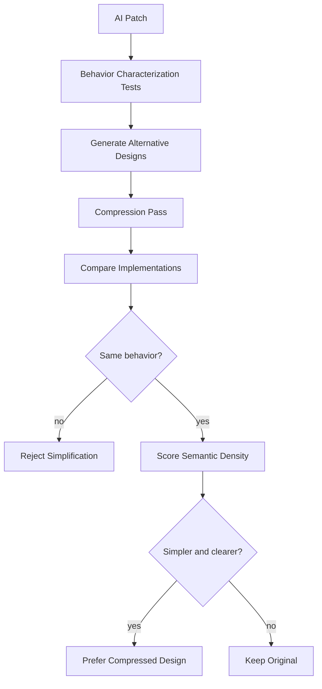
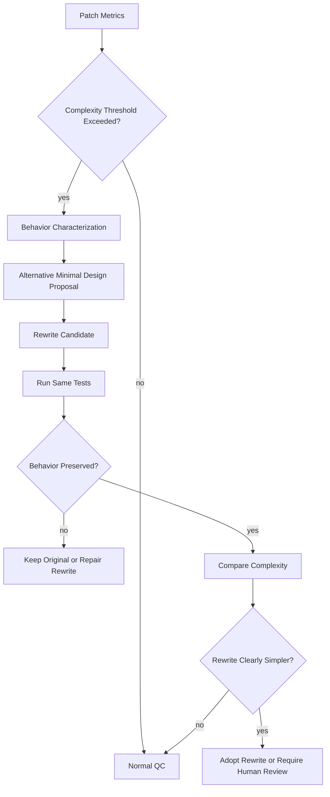

You are right. The earlier QC catalog answers **“how do we prevent known bad patterns?”**

It does **not** fully answer:

> How do we know whether the architecture is actually good?

That is the harder half. Senior Elixir engineers are pointing at something real: AI can generate code that passes tests, obeys rules, looks idiomatic enough, and is still architecturally mediocre — too many modules, too much ceremony, too many abstractions, too much LOC, wrong shape.

The 1,000 LOC → 250 LOC rewrite example is not a lint failure. It is a **compression/taste/architecture failure**.

That is the mysterious part.

---

# 1. The missing concept is not QC. It is **architectural compression**

Good Elixir often has this property:

```text
The code becomes smaller because the right abstraction makes the problem disappear.
```

Bad AI Elixir often has the opposite property:

```text
The code becomes larger because the model explains the problem to itself in code.
```

That is why AI-generated code can look okay but be 4× too large.

It has:

* extra structs
* extra behaviours
* fake extensibility
* redundant modules
* wrapper layers
* defensive helper functions
* overgeneralized config
* unnecessary GenServers
* artificial protocols
* duplicated transformations
* tests that mirror implementation rather than behavior

A senior Elixir engineer sees the simpler shape.

The model sees a plausible enterprise-shaped solution.

That is the gap.

---

# 2. “Good Elixir” is not just idiom; it is **problem collapse**

A lot of good Elixir is not:

```text
Use pipe operator.
Use pattern matching.
Use supervisors.
Use behaviours.
Use GenServers.
```

Those are surface features.

Good Elixir is more like:

```text
Represent the domain so the illegal states are hard to express.
Use data shapes that make transformations obvious.
Use pure functions until a process is actually needed.
Let OTP solve lifecycle, not business logic.
Use pattern matching to eliminate branches.
Use protocols/behaviours only at true extension points.
Prefer boring modules over invented frameworks.
Delete abstractions until the remaining ones are load-bearing.
```

The mystery is that this is **architectural negative space**.

The good engineer knows what **not** to build.

LLMs are bad at that because they are trained to produce plausible completions, and plausible completions often mean **more code**.

Your pasted note already identifies this: LOC-reducing cleanup is not just style polish; it requires human thinking-cap-on refactoring, extraction, and sometimes changing the shape of the ecosystem itself. 

That is exactly the senior-engineer critique.

---

# 3. How can you know code is good?

You cannot fully know from rules.

You need multiple kinds of evidence.

## Level 1: Correctness

```text
Does it work?
```

Evidence:

* tests pass
* properties hold
* no crashes in expected cases
* edge cases handled
* fault behavior works

This is necessary but not sufficient.

## Level 2: Maintainability

```text
Can a future engineer change it safely?
```

Evidence:

* small public API
* low coupling
* clear module boundaries
* few concepts
* minimal state
* local reasoning possible
* tests describe behavior, not internals

## Level 3: Architectural fitness

```text
Is this the right shape for the problem?
```

Evidence:

* fewer moving parts
* no fake extensibility
* no unnecessary processes
* no redundant abstractions
* state lives in the obvious place
* failure semantics are simple
* the design would still make sense if rewritten by hand

## Level 4: Compression

```text
Can the same behavior be expressed more simply?
```

Evidence:

* 1,000 LOC can become 250 LOC without losing behavior
* modules collapse naturally
* duplicated concepts merge
* fewer names are needed
* tests remain stable
* the resulting code is easier to explain

This is the key missing evaluation axis.

---

# 4. The evaluation target should be: **semantic density**

A useful metric is not raw LOC.

It is:

```text
semantic density = behavior / mechanism
```

Bad AI code has low semantic density:

```text
lots of mechanism, little behavior
```

Good Elixir has high semantic density:

```text
small mechanism, clear behavior
```

You evaluate this by asking:

```text
How many concepts did we introduce to solve this problem?
How many modules?
How many public functions?
How many process boundaries?
How many behaviours?
How many config knobs?
How many state representations?
How many transformations?
How many test helpers?
```

Then compare that to the actual behavior delivered.

---

# 5. Concrete “good architecture” evaluation criteria

Here is the missing checklist. This is not ordinary QC; this is **architecture/taste evaluation**.

## A. Concept count

Bad sign:

```text
The solution introduces 12 named concepts for a 3-concept problem.
```

Evaluate:

| Question                                                        | Good answer          |
| --------------------------------------------------------------- | -------------------- |
| How many domain nouns were introduced?                          | Few, load-bearing    |
| How many are user-visible concepts?                             | Most                 |
| How many exist only because the implementation got complicated? | Almost none          |
| Can two concepts collapse into one?                             | Often yes in AI code |
| Are names hiding duplication?                                   | No                   |

This is where senior engineers win: they see that `Coordinator`, `Manager`, `Registry`, `Executor`, `Orchestrator`, and `Service` are often just one thing wearing six hats.

---

## B. Public API surface

Bad sign:

```text
Every internal step became a public function.
```

Evaluate:

| Metric                          | Meaning                                          |
| ------------------------------- | ------------------------------------------------ |
| public functions per module     | Lower is usually better                          |
| public/private ratio            | Too many public functions means unstable surface |
| number of ways to do same thing | Should be one                                    |
| public types exposed            | Should be intentional                            |
| caller knowledge required       | Should be minimal                                |

Good Elixir often hides complexity behind a boring API.

---

## C. State shape

Bad sign:

```text
State is scattered, duplicated, or transformed through many intermediate structs.
```

Evaluate:

| Question                                            | Good answer        |
| --------------------------------------------------- | ------------------ |
| Who owns the state?                                 | Obvious            |
| Is state minimal?                                   | Yes                |
| Is derived data stored unnecessarily?               | No                 |
| Can invalid state exist?                            | Hard or impossible |
| Is state serializable/recoverable if needed?        | Yes                |
| Are there multiple competing state representations? | No                 |

AI often creates too many state layers.

Senior Elixir engineers often collapse state into one obvious struct plus pure functions.

---

## D. Process necessity

Bad sign:

```text
There is a GenServer because “this is Elixir.”
```

Evaluate:

| Question                             | Good answer                                                                 |
| ------------------------------------ | --------------------------------------------------------------------------- |
| Why is this a process?               | It owns mutable runtime state, concurrency, lifecycle, or external resource |
| Could this be a pure module?         | If yes, make it pure                                                        |
| What happens on crash?               | Clear                                                                       |
| What state is lost?                  | Clear                                                                       |
| Who supervises it?                   | Clear                                                                       |
| Is business logic outside callbacks? | Yes                                                                         |

This is where AI frequently fails. It knows GenServer syntax but not process necessity.

---

## E. Abstraction load-bearing test

Bad sign:

```text
The abstraction sounds reasonable but removing it makes the code better.
```

Evaluate each abstraction:

```text
What variation does this abstraction support?
Does that variation exist today?
Is it required by the roadmap?
Does it reduce duplication now?
Does it clarify the domain?
Does it merely hide one function call?
```

If an abstraction does not carry weight, delete it.

This is the 1,000 → 250 LOC rewrite zone.

---

## F. Local reasoning

Bad sign:

```text
To understand one behavior, you must open eight files.
```

Evaluate:

| Question                                               | Good answer |
| ------------------------------------------------------ | ----------- |
| Can I understand this feature from one or two modules? | Yes         |
| Are control flow and data flow close together?         | Yes         |
| Are side effects isolated but not scattered?           | Yes         |
| Do names point to real domain concepts?                | Yes         |
| Is there indirection without payoff?                   | No          |

AI tends to over-layer because it has seen too many enterprise patterns.

---

## G. Change cost

Bad sign:

```text
A small behavior change requires edits across many modules.
```

Evaluate:

```text
For a likely future change, how many files change?
How many tests change?
How many public APIs change?
How many call sites change?
```

Good architecture minimizes expected future change cost.

This is hard for LMs because they do not really feel future maintenance pain.

---

# 6. How to evaluate architecture in practice

You need **comparative evaluation**, not just absolute rules.

The question is not:

```text
Does this code pass?
```

The question is:

```text
Can an alternative implementation express the same behavior with fewer concepts and clearer boundaries?
```

That implies an architecture evaluation loop.

## Architecture evaluation loop



The key is behavior preservation.

If 250 LOC preserves the behavior of 1,000 LOC, the 1,000 LOC version was probably bad.

---

# 7. “Rewrite challenge” as an eval

This is probably the most practical answer to the senior Elixir critique.

For every AI-generated implementation above a complexity threshold, run a **rewrite challenge**.

```text
Given the behavior and tests, produce a smaller implementation.
Constraints:
  - no behavior loss
  - no public API expansion
  - fewer modules preferred
  - fewer processes preferred
  - fewer abstractions preferred
  - tests must still pass
```

Then compare.

## Rewrite challenge score

| Metric           | Original | Rewrite | Interpretation              |
| ---------------- | -------: | ------: | --------------------------- |
| LOC              |     1000 |     250 | Original likely bloated     |
| Modules          |       14 |       4 | Original overfactored       |
| Public functions |       38 |       9 | Original API too wide       |
| GenServers       |        3 |       0 | Original process misuse     |
| Behaviours       |        4 |       1 | Original fake extensibility |
| Tests passing    |      yes |     yes | Rewrite preserves behavior  |

This directly attacks the “looked okay but was 4× too large” problem.

---

# 8. The “senior engineer oracle” can be approximated, not replaced

Jose is right in the strong sense:

> AI does not do engineering.

Engineering includes judgment, tradeoff selection, taste, deletion, sequencing, and accountability.

But you can approximate parts of senior judgment with processes:

```text
generate alternatives
characterize behavior
compress implementation
compare complexity
detect unnecessary processes
penalize public API expansion
prefer fewer concepts
run mutation/property/fault tests
```

The senior engineer still has the edge, but the system becomes less helpless.

The goal is not:

```text
AI equals Jose Valim.
```

The realistic goal is:

```text
AI cannot merge 1,000 LOC if 250 LOC preserves the same behavior with fewer concepts.
```

That is a meaningful platform improvement.

---

# 9. What deterministic systems can and cannot judge

## Deterministic systems can judge

```text
Does it compile?
Do tests pass?
Did public API grow?
Did LOC grow?
Did module count grow?
Did GenServer count grow?
Are there cycles?
Are callbacks complex?
Are there unsupervised processes?
Are behaviours unused?
Are dependencies added?
Did docs drift?
```

## Deterministic systems cannot fully judge

```text
Is this the right abstraction?
Is this future-proof in the right way?
Is this the simplest domain model?
Is this elegant?
Will a team maintain this easily?
Did we choose the correct boundary?
```

But deterministic systems can create **signals** for these.

Then LMs or humans can evaluate the signals.

---

# 10. Architecture scoring model

You can build a scorecard that does not pretend to be truth, but highlights risk.

## Example scorecard

```yaml
architecture_score:
  behavior_preserved: true
  compile: pass
  tests: pass

  complexity:
    loc_added: 742
    modules_added: 11
    public_functions_added: 26
    genservers_added: 2
    behaviours_added: 3
    dependencies_added: 1

  risk_flags:
    - high_loc_for_feature_size
    - new_genserver_without_strong_state_ownership
    - behaviour_with_single_implementation
    - public_api_expansion
    - duplicated_transform_pipeline

  compression_candidate: true

  required_next_step:
    - run_rewrite_challenge
```

This does not say “bad” automatically.

It says:

> This deserves compression review.

---

# 11. Specific architecture smell catalog for AI Elixir

This is the missing practical artifact.

## AI Elixir bloat smells

| Smell                                                    | Meaning                         |
| -------------------------------------------------------- | ------------------------------- |
| `Manager` / `Coordinator` / `Orchestrator` proliferation | Model invented control layers   |
| Behaviour with one implementation                        | Fake extensibility              |
| GenServer with no true concurrent state                  | Process cosplay                 |
| DynamicSupervisor for fixed children                     | OTP overkill                    |
| Registry for non-dynamic names                           | Process addressing overkill     |
| Multiple intermediate structs                            | Data pipeline over-modeled      |
| Config for things that never vary                        | Fake flexibility                |
| Protocols for internal-only dispatch                     | Abstraction cosplay             |
| Macros to reduce trivial repetition                      | Cleverness debt                 |
| Public functions used only once                          | API leakage                     |
| Tests mirror implementation modules                      | Testing structure, not behavior |
| Helpers that wrap one function                           | Indirection without payoff      |
| Separate “service” modules for pure functions            | Java-shaped Elixir              |
| Excessive `with` chains hiding simple pattern match      | Control-flow inflation          |
| `case` trees in GenServer callbacks                      | Business logic in boundary      |
| Error atoms not forming a coherent algebra               | Random failure semantics        |
| `opts` threaded everywhere                               | Configuration anxiety           |
| Defensive validation at every layer                      | No trusted internal boundary    |

This is what senior engineers are reacting to.

---

# 12. How to catch the 1,000 LOC → 250 LOC problem

You need a **compression gate**.

Not for every patch. Only when complexity thresholds trigger.

## Trigger conditions

```text
LOC added > expected threshold
modules added > 3
public functions added > 10
new behaviour with one implementation
new GenServer
new dependency
duplicated transformation code
large test helper scaffolding
```

## Compression gate process



This is a concrete answer to the senior engineer quip.

---

# 13. The architecture eval should penalize unnecessary optionality

AI loves optionality.

Good engineering often removes it.

Penalize:

```text
unused behaviours
unused callbacks
unused config knobs
unused adapters
generic names
provider abstractions before second provider
protocols before multiple data types
supervisors before dynamic lifecycle
GenServers before state ownership
```

Do not ban these. Require proof.

```text
Abstraction allowed only if:
  current second implementation exists
  or roadmap requires it
  or boundary protects external dependency
  or tests demonstrate substitutability
```

Otherwise: delete.

---

# 14. “Good Elixir” may indeed be underrepresented

Your guess is plausible.

Even if the training set contains a lot of Elixir, the model sees:

* tutorials
* toy GenServers
* Phoenix CRUD
* old code
* mediocre library code
* overabstracted enterprise code
* snippets without architectural context
* tests that do not encode taste
* blog-post simplifications

It may not see enough of:

* senior review comments
* before/after refactors
* “deleted 700 LOC” commits
* architectural reasoning
* OTP postmortems
* production failure analyses
* why a GenServer was removed
* why a behaviour was rejected
* why a pure module was enough

That missing corpus matters.

The artifact you want is not just “good code.”

It is paired data:

```text
bad plausible Elixir
→ senior critique
→ compressed rewrite
→ explanation of why rewrite is better
→ tests proving behavior preserved
```

That is the dataset.

---

# 15. The real eval dataset you need

Build a local corpus of **Elixir refactoring pairs**.

Each item:

```yaml
case:
  name: unnecessary_genserver_to_pure_module

  original:
    loc: 420
    modules: 5
    description: "AI-created GenServer wrapper for stateless validation"

  rewrite:
    loc: 90
    modules: 1
    description: "Pure validation module with pattern matching"

  behavior_tests:
    - validation accepts valid input
    - validation rejects malformed input
    - error reasons stable

  senior_principle:
    - no process without state/lifecycle
    - pure function sufficient
    - API surface reduced

  detector:
    - GenServer has no meaningful state mutation
    - callbacks delegate to pure functions only
```

That is how you train/evaluate the system at the harness layer.

---

# 16. Evaluation dimensions for “good Elixir”

Use these axes:

| Axis              | Question                                                          |
| ----------------- | ----------------------------------------------------------------- |
| Correctness       | Does it behave correctly?                                         |
| Simplicity        | Is this close to the smallest clear solution?                     |
| Locality          | Can I understand/change it locally?                               |
| Boundary quality  | Are domain, process, IO, config separated?                        |
| OTP necessity     | Are processes used only where lifecycle/concurrency require them? |
| Semantic density  | Does each module/function carry real meaning?                     |
| Change resilience | Can expected future changes be made cleanly?                      |
| Failure clarity   | Are crash/retry/error semantics explicit?                         |
| Observability     | Can production behavior be understood?                            |
| Deletability      | Can pieces be removed without collapse?                           |

That last one matters.

Good architecture is often deletable.

Bad AI architecture is sticky because everything depends on everything.

---

# 17. The “250-line oracle” as a process

When a senior engineer says “I rewrote 1,000 LOC as 250,” the lesson is not merely “AI bad.”

The lesson is:

> We need an automated system that tries to disprove the necessity of the 1,000 LOC.

So add an explicit phase:

```text
Necessity challenge:
  For each module/function/process introduced,
  prove why it must exist.
```

## Necessity challenge table

| Artifact            | Required justification                        |
| ------------------- | --------------------------------------------- |
| New module          | What concept does it isolate?                 |
| New public function | Who calls it? Why public?                     |
| New GenServer       | What state/lifecycle/concurrency does it own? |
| New behaviour       | Where is the second implementation?           |
| New config knob     | Who changes it and why?                       |
| New dependency      | What complexity does it remove?               |
| New test helper     | What repeated behavior does it clarify?       |
| New abstraction     | What variation does it absorb?                |

If the answer is weak, the artifact is a deletion candidate.

---

# 18. What the LM can do here

The LM is still useful, but not as judge.

Use it to generate:

* alternative simpler designs
* deletion candidates
* concept maps
* “why does this module exist?” tables
* rewrite proposals
* before/after explanations
* characterization tests
* API minimization proposals
* duplicated concept analysis

Then deterministic systems verify behavior preservation.

The LM should be asked:

```text
Find the smaller program.
```

Not:

```text
Is this good?
```

Because “is this good?” invites vibes.

“Find the smaller equivalent program” creates a testable challenge.

---

# 19. Practical architecture evaluator

A useful evaluator would produce:

```text
1. Behavior summary
2. Concept inventory
3. Public API inventory
4. Process inventory
5. State ownership map
6. Dependency graph
7. Complexity metrics
8. Compression opportunities
9. Alternative design sketch
10. Required human questions
```

Example:

```yaml
architecture_review:
  verdict: compression_required

  reason:
    - feature adds 3 runtime processes but owns no durable state
    - behaviour has one implementation
    - public API expanded by 18 functions
    - 4 modules encode the same transformation pipeline
    - tests mirror module structure instead of behavior

  suggested_rewrite:
    - collapse Coordinator/Executor/Runner into pure Pipeline module
    - remove GenServer
    - expose one public run/2 function
    - keep adapter behaviour only around external provider
    - replace 12 example tests with 4 behavior/property tests
```

That is much closer to what a senior Elixir engineer would say.

---

# 20. The honest answer

How can you know AI-generated Elixir is good?

You cannot know from one pass.

You know by trying to **break it, shrink it, and change it**.

```text
Break it:
  tests, property tests, fault injection

Shrink it:
  rewrite challenge, concept deletion, API minimization

Change it:
  simulate likely future requirements
```

If it survives all three, it is probably decent.

## The three-question test

```text
Can it be made smaller?
Can it be made more local?
Can it be made more boring?
```

If yes, it probably should be.

That is the senior-engineer instinct.

---

# 21. Final answer to the senior critique

The proper response is not:

> “We have more QC rules.”

It is:

> “Agreed. Passing QC does not mean good architecture. We need a compression-and-alternatives evaluation loop that forces AI code to prove its complexity is necessary.”

That is the missing half.

The platform should not merely ask:

```text
Does this pass?
```

It must ask:

```text
Why is this much code necessary?
Why these concepts?
Why these processes?
Why this API surface?
Why this abstraction?
Can the same behavior be expressed in one quarter of the code?
```

That is how you begin to approximate senior Elixir judgment.

Not perfectly. But materially.

And yes, this is probably where current AI is weakest: not syntax, not tests, not even OTP APIs, but **architectural compression** — the ability to see the smaller, more natural shape of the program before writing the larger plausible one.
