# Elixir AI Engineer — Clean Architecture

## 0. Architecture Thesis

The Elixir AI Engineer is not an autonomous coding agent. It is a **spec-governed synthesis compiler** for Elixir/OTP systems.

Its job is to transform human intent into admissible code through a controlled pipeline:

```text
Intent
  → SpecGraph
  → Architecture Tournament
  → SpecCell Plan
  → Context Bundle
  → Deterministic Skeleton
  → Bounded LM Fill
  → ImplementationGraph Extraction
  → Evidence + ENF Audit
  → Compression Normalization
  → Accepted Code + Lineage
```

The language model proposes local implementation material. It does not own architecture, authority, acceptance, effects, runtime topology, or final merge decisions.

---

## 1. Core Architectural Partition

The system is divided into six planes:

```text
1. Specification Plane
2. Architecture Plane
3. Synthesis Plane
4. Extraction + Audit Plane
5. Evidence + Runtime Plane
6. Learning + Governance Plane
```

Each plane has a narrow responsibility and produces typed artifacts consumed by the next plane.

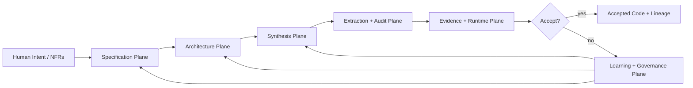

---

## 2. Plane 1 — Specification Plane

### Responsibility

Convert ambiguous human intent into structured, checkable specification artifacts.

This plane prunes the bad-design search space before code exists.

### Inputs

- Human requirements
- Product thesis
- Nonfunctional requirements
- Security invariants
- Team maintainability assumptions
- Existing architecture docs

### Outputs

- `SpecGraph`
- `CapabilityMap`
- `DomainModel`
- `BoundaryGraph`
- `ContractGraph`
- `StateProtocolGraph`
- `EffectGraph`
- `SpecCellTree`

### Key rule

Nothing downstream may introduce a public boundary, external effect, process, credential operation, or domain noun that is not traceable to this plane.

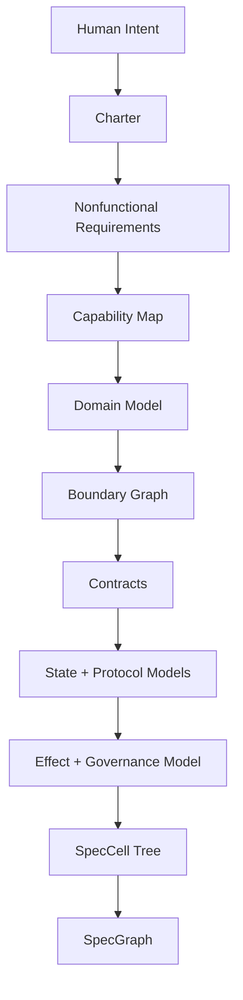

### Canonical artifacts

```text
spec/charter.md
spec/nfr.md
spec/capabilities.md
spec/domain.md
spec/boundaries/*.md
spec/contracts/*.md
spec/protocols/*.md
spec/effects/*.md
spec/cells/*.md
```

---

## 3. Plane 2 — Architecture Plane

### Responsibility

Choose runtime shape before implementation.

The architecture plane prevents the model from silently choosing OTP complexity.

### Inputs

- `SpecGraph`
- `SpecCellTree`
- NFRs
- Engineering Normal Form policy
- Existing implementation graph, if any

### Outputs

- Architecture candidates
- Cost/risk comparison
- Architecture Decision Records
- Runtime topology
- ENF budgets
- Implementation plan

### Core mechanism: Architecture Tournament

Every major component must compare alternatives before code.

Example candidate set for a lease registry:

```text
A. Pure module with caller-owned state
B. Single GenServer with map state
C. GenServer + ETS table
D. Persistent event log + projection
E. DynamicSupervisor of per-tenant workers
```

The winner becomes an ADR and constrains implementation.

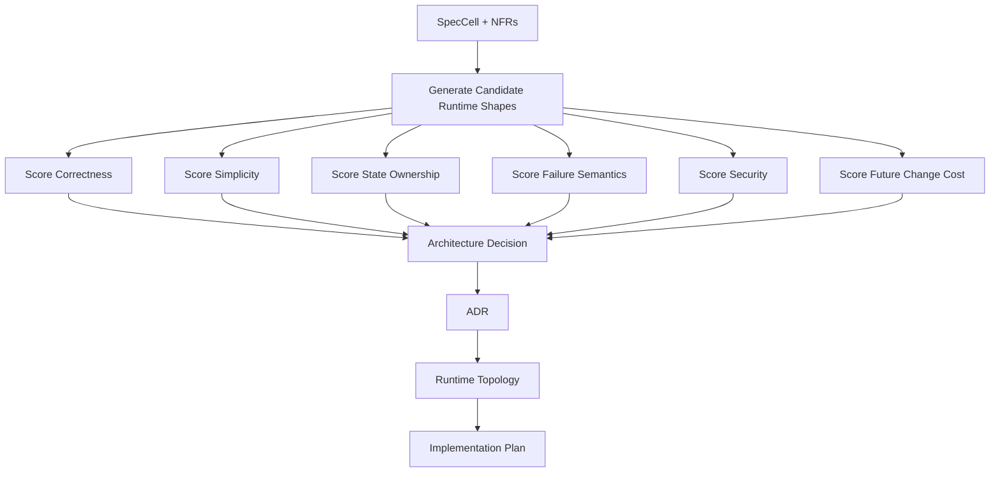

### Runtime-shape decision table

| Architectural need | Default lowering | Requires proof |
|---|---|---|
| Pure deterministic logic | module + struct | no |
| Stateful serial access | GenServer | yes |
| Static lifecycle group | Supervisor | yes |
| Runtime child creation | DynamicSupervisor | yes |
| Dynamic process lookup | Registry | yes |
| External API/CLI translation | Adapter | yes |
| Credential materialization | Materializer | yes, security-critical |
| Background IO/time work | Task.Supervisor or worker | yes |
| High-read shared state | ETS with owner | yes |

### Hard architecture invariant

```text
No OTP primitive may be introduced unless the corresponding architectural responsibility exists in a SpecCell and ADR.
```

---

## 4. Plane 3 — Synthesis Plane

### Responsibility

Generate implementation artifacts with minimal model freedom.

The synthesis plane does not ask an LM to design the system. It gives the LM a bounded local job.

### Subsystems

```text
Context Bundle Compiler
Deterministic Skeleton Generator
Bounded LM Fill Layer
Patch Capability Sandbox
```

### Flow

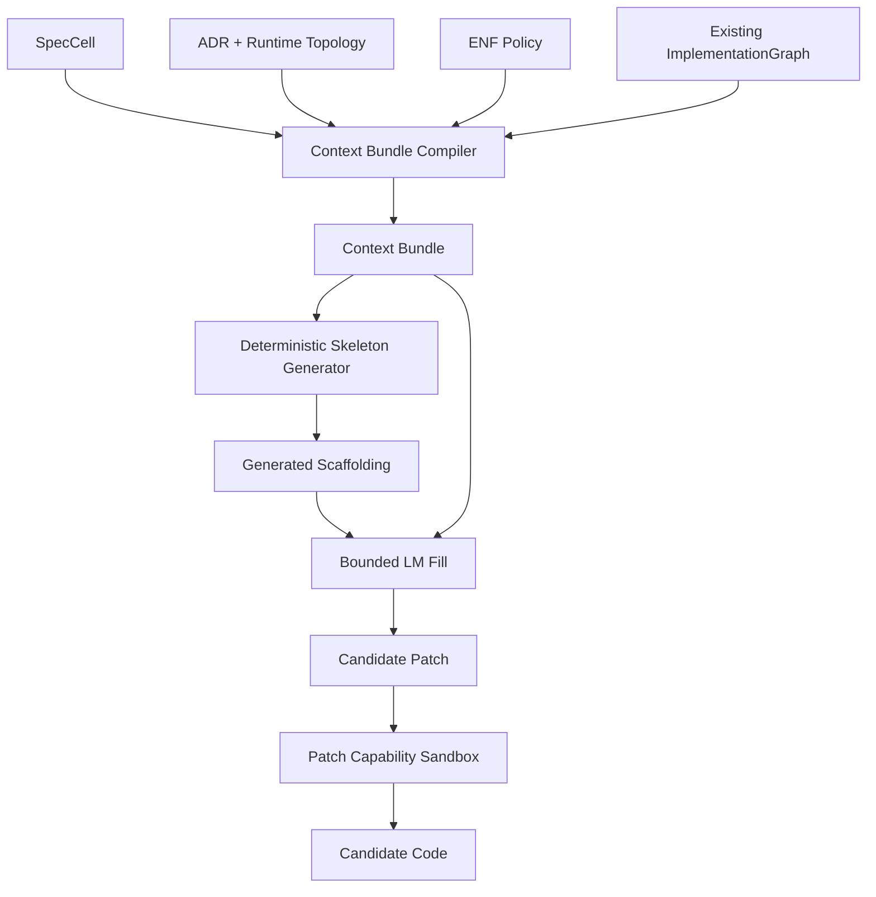

### Context Bundle contents

A bundle must contain exactly the information needed for one implementation task:

```yaml
bundle:
  task: implement one SpecCell
  allowed_files: []
  forbidden_actions: []
  domain_terms: []
  contracts: []
  effects: []
  runtime_shape: PureDomainModule | StatefulProcess | Adapter | Materializer
  public_api: []
  tests_required: []
  enf_policy_subset: []
  completion_criteria: []
```

### LM authority model

| Decision | LM may propose? | LM may decide? |
|---|---:|---:|
| Function body | yes | no, evidence decides |
| Test cases | yes | no, evidence decides |
| New module | only if declared | no |
| New process | no | no |
| New public API | no | no |
| External effect | no | no |
| Credential access | no | no |
| Architecture change | critique only | no |
| Acceptance | no | no |

### Patch sandbox rule

The implementer receives only:

```text
- allowed files
- local context bundle
- current failing evidence
- explicit stop condition
```

Any edit outside allowed scope is rejected before tests run.

---

## 5. Plane 4 — Extraction + Audit Plane

### Responsibility

Extract what the code actually built and compare it against what the spec allowed.

This is the central anti-slop mechanism.

### Subsystems

```text
ImplementationGraph Extractor
SpecGraph Comparator
ENF Auditor
Cost Model
Compression Trigger
Violation Classifier
```

### ImplementationGraph nodes

```text
Module
Function
Struct
Behaviour
Protocol
GenServer
Supervisor
DynamicSupervisor
Registry
Task
ETS table
ExternalEffect
ConfigRead
TelemetryEvent
Test
SpecCell
Contract
```

### ImplementationGraph edges

```text
calls
implements
uses
supervises
registers
spawns
reads_config
performs_effect
emits_telemetry
tests
traces_to
violates
```

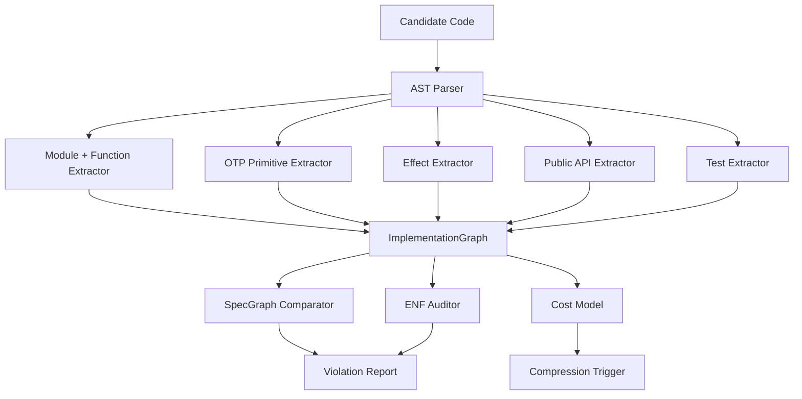

### ENF rejection examples

```text
- GenServer exists without state/lifecycle/concurrency proof.
- Behaviour has one implementation and no declared seam.
- Public function has no contract trace.
- External effect has no declaration.
- Adapter performs domain policy.
- Pure module reads Application config or System env.
- Registry exists for a single statically known process.
- Test asserts implementation shape instead of behavior.
```

### Cost model sketch

```yaml
cost_weights:
  module: 1
  public_function: 0.4
  stateful_process: 4
  supervisor: 2
  dynamic_supervisor: 3
  registry: 2
  behaviour: 2
  single_impl_behaviour: 5
  undeclared_effect: inf
  boundary_violation: inf
  invented_domain_term: 3
  traceability_bonus: -0.5
```

---

## 6. Plane 5 — Evidence + Runtime Plane

### Responsibility

Prove behavior and runtime properties through execution.

The audit plane can reject structure. The evidence plane proves behavior.

### Evidence classes

```text
Compile evidence
Unit evidence
Property evidence
State-machine evidence
Fault-injection evidence
Security/adversarial evidence
Runtime topology evidence
Telemetry/audit evidence
```

### Acceptance pipeline

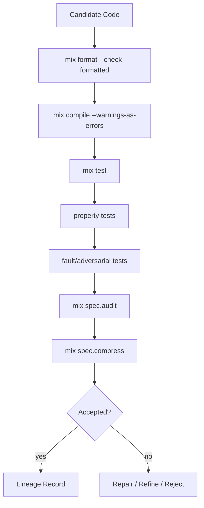

### Acceptance rule

A candidate is accepted only if:

```text
1. It satisfies declared contracts.
2. It preserves invariants.
3. It performs no undeclared effects.
4. It matches the declared runtime topology.
5. It passes ENF.
6. It survives compression challenge.
7. It emits traceability and evidence records.
```

---

## 7. Plane 6 — Learning + Governance Plane

### Responsibility

Convert failures into future constraints.

This plane is how the system improves without pretending the LM has learned anything internally.

### Subsystems

```text
Nogood Compiler
Doctrine Distiller
Rule Promotion Engine
Benchmark Harness
Lineage Store
Policy Versioner
```

### Nogood compilation

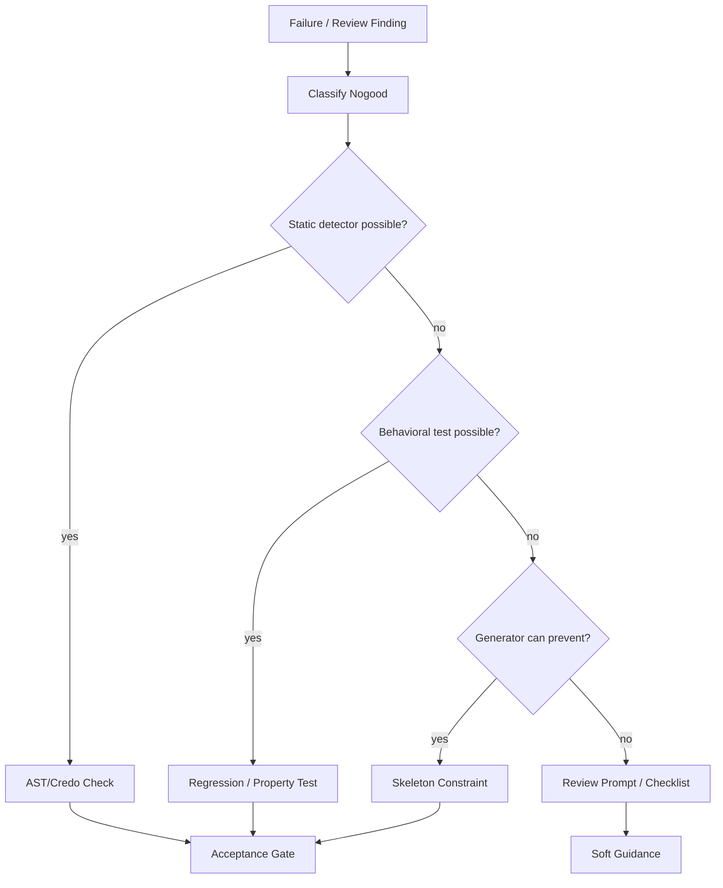

### Rule promotion ladder

```text
LM critique
  → structured finding
  → detector candidate
  → regression test
  → policy rule
  → CI gate
```

### Benchmark objective

The metric is not first-pass generation quality.

The metric is:

```text
accepted-normal-form implementation quality
```

Measured by:

```text
- lower module count
- lower public API surface
- fewer unjustified processes
- fewer fake behaviours
- preserved behavior
- stronger traceability
- lower future change cost
```

---

## 8. The Core Data Model

### Graphs

```text
SpecGraph
ImplementationGraph
EvidenceGraph
RuntimeGraph
LineageGraph
CostGraph
PolicyGraph
```

### Primary artifacts

```mermaid
classDiagram
    class SpecGraph {
      +charter
      +capabilities
      +domain_model
      +boundaries
      +contracts
      +effects
      +spec_cells
    }

    class SpecCell {
      +id
      +kind
      +purpose
      +entities
      +operations
      +state
      +effects
      +runtime_shape
      +test_obligations
      +lowering_hints
    }

    class ADR {
      +component
      +candidates
      +scores
      +chosen_shape
      +risks
      +rationale
    }

    class ContextBundle {
      +task
      +allowed_files
      +forbidden_actions
      +contracts
      +runtime_shape
      +tests_required
      +completion_criteria
    }

    class ImplementationGraph {
      +modules
      +functions
      +otp_primitives
      +effects
      +public_api
      +tests
      +traceability
    }

    class EvidenceGraph {
      +compile
      +unit_tests
      +property_tests
      +fault_tests
      +security_tests
      +runtime_traces
    }

    class LineageRecord {
      +spec_hash
      +bundle_hash
      +model_runs
      +operator_runs
      +patches
      +evidence_hash
      +accepted_at
    }

    SpecGraph "1" --> "many" SpecCell
    SpecCell "1" --> "many" ADR
    ADR "1" --> "many" ContextBundle
    ContextBundle "1" --> "many" ImplementationGraph
    ImplementationGraph "1" --> "many" EvidenceGraph
    EvidenceGraph "1" --> "1" LineageRecord
```

---

## 9. Repository Architecture

### Umbrella shape

```text
apps/
  spec_core/
    lib/spec_core/
      graph.ex
      spec_cell.ex
      domain_model.ex
      contract.ex
      effect.ex
      policy.ex

  spec_parser/
    lib/spec_parser/
      markdown.ex
      yaml_blocks.ex
      spec_graph_loader.ex

  spec_architecture/
    lib/spec_architecture/
      tournament.ex
      candidate.ex
      scorer.ex
      adr.ex
      otp_lowering.ex

  spec_bundle/
    lib/spec_bundle/
      compiler.ex
      resolver.ex
      sufficiency.ex
      renderer.ex

  spec_skeleton/
    lib/spec_skeleton/
      generator.ex
      module_template.ex
      test_template.ex
      trace_header.ex

  spec_extract/
    lib/spec_extract/
      ast_loader.ex
      module_extractor.ex
      call_graph.ex
      effect_extractor.ex
      otp_extractor.ex
      public_api_extractor.ex
      implementation_graph.ex

  spec_audit/
    lib/spec_audit/
      comparator.ex
      enf_auditor.ex
      rules/
        undeclared_effect.ex
        unjustified_genserver.ex
        single_impl_behaviour.ex
        public_function_without_contract.ex
        invented_domain_term.ex

  spec_evidence/
    lib/spec_evidence/
      runner.ex
      evidence_graph.ex
      exunit_adapter.ex
      property_adapter.ex
      fault_adapter.ex

  spec_normalizer/
    lib/spec_normalizer/
      cost_model.ex
      compression_trigger.ex
      rewrite_candidate.ex
      safe_rewrites/
        collapse_single_impl_behaviour.ex
        remove_stateless_genserver.ex
        inline_single_use_wrapper.ex

  spec_lineage/
    lib/spec_lineage/
      record.ex
      store.ex
      hash.ex

  spec_mix/
    lib/mix/tasks/spec.audit.ex
    lib/mix/tasks/spec.bundle.ex
    lib/mix/tasks/spec.accept.ex
    lib/mix/tasks/spec.extract.ex
    lib/mix/tasks/spec.compress.ex
    lib/mix/tasks/spec.gen.ex
```

### Why this split works

| App | Reason |
|---|---|
| `spec_core` | Stable artifact types and graph primitives. |
| `spec_parser` | Converts docs into graph structures. |
| `spec_architecture` | Owns runtime-shape decisions and ADRs. |
| `spec_bundle` | Compiles bounded LM context. |
| `spec_skeleton` | Emits deterministic scaffolding. |
| `spec_extract` | Extracts architectural truth from code. |
| `spec_audit` | Compares code to spec and ENF. |
| `spec_evidence` | Runs behavioral/runtime evidence. |
| `spec_normalizer` | Compresses working slop. |
| `spec_lineage` | Records traceability. |
| `spec_mix` | Public CLI surface. |

---

## 10. First Three Mix Tasks

### `mix spec.audit`

Reads:

```text
spec/
lib/
test/
```

Produces:

```text
ImplementationGraph
SpecGraph comparison
ENF violations
compression candidates
traceability gaps
```

First five checks:

```text
1. GenServer without state-ownership justification.
2. Behaviour with one implementation.
3. Public function without contract trace.
4. External effect without declaration.
5. Domain term absent from domain model.
```

### `mix spec.bundle <cell>`

Produces a bounded implementation packet:

```text
tmp/context_bundles/<cell>.md
```

Includes:

```text
- inherited invariants
- local SpecCell
- allowed files
- forbidden actions
- domain dictionary
- contract
- effect declarations
- runtime shape
- ENF subset
- required tests
```

### `mix spec.accept`

Runs the acceptance gate:

```bash
mix format --check-formatted
mix compile --warnings-as-errors
mix test
mix spec.audit
```

Later expansion:

```bash
mix credo --strict
mix dialyzer
mix spec.property
mix spec.fault
mix spec.compress
mix spec.traceability
```

---

## 11. First Proof Slice

### Slice

```text
Governed credentialed connector invocation
```

### Components

```text
ExecutionContext
CredentialFabric.Lease
CredentialFabric.LeaseIssuer
CredentialFabric.LeaseRegistry
CredentialFabric.Materializer.LocalDev
ConnectorFabric.Invocation
TelemetryAudit.AuditSink
```

### Required invariants

```text
No governed operation without ExecutionContext.
No credentialed effect without CredentialLease.
No raw credential material reaches an untrusted actor.
No connector redeems a lease issued to another connector.
No expired lease can be redeemed.
No revoked lease can be redeemed.
No provider invocation occurs without audit event.
No secret appears in logs, telemetry, or crash output.
```

### Runtime shape

```text
CredentialFabric.Lease              PureDomainModule
CredentialFabric.LeaseIssuer        PureDomainModule or BoundaryAPI
CredentialFabric.LeaseRegistry      StatefulProcess only if runtime lease state is needed
CredentialFabric.Materializer       Materializer
ConnectorFabric.Invocation          Adapter / BoundaryAPI
TelemetryAudit.AuditSink            BoundaryAPI or StatefulProcess depending on persistence
```

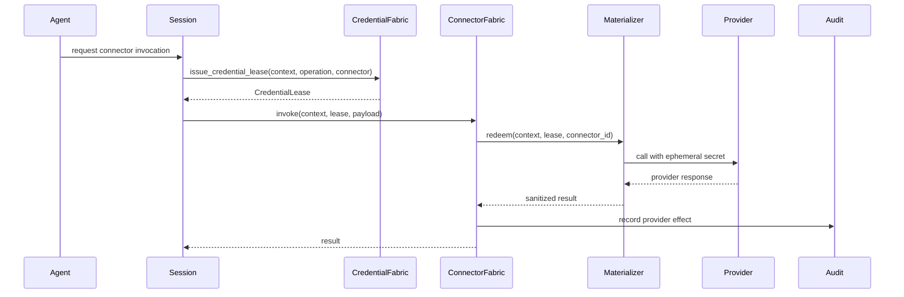

---

## 12. Security and Governance Architecture

### Capability discipline

Every operator and agent role receives explicit capabilities.

```yaml
implementer:
  can_read:
    - context_bundle
    - allowed_files
  can_write:
    - allowed_files
  cannot:
    - edit_spec
    - create_new_files_unless_declared
    - introduce_new_effects
    - approve_own_patch
```

### Role separation

```text
Patch author cannot be final acceptor.
Spec curator cannot silently widen authority.
LM cannot approve its own output.
Credential materializer cannot expose raw secret to agent-visible state.
```

### Credential boundary

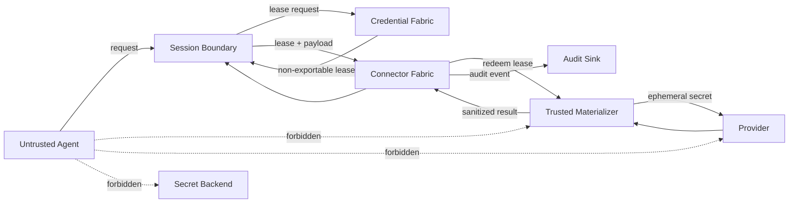

---

## 13. Compression Architecture

### Trigger

Compression is triggered when the implementation graph exceeds ENF budget.

Common triggers:

```text
- too many modules
- too many public functions
- new GenServer
- new DynamicSupervisor
- new Registry
- single-implementation behaviour
- wrapper modules with one call site
- duplicated state representations
- tests that mirror implementation structure
```

### Compression loop

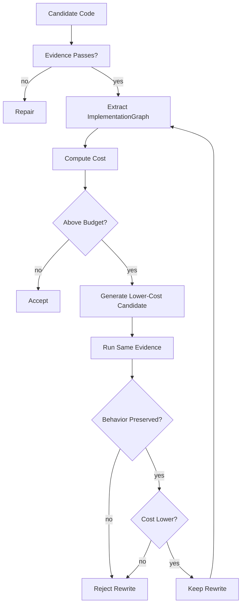

### Safe initial rewrites

```text
1. Collapse single-implementation behaviour.
2. Remove stateless GenServer.
3. Inline one-call wrapper module.
4. Shrink public API when no contract requires exposure.
5. Consolidate duplicated validators.
```

---

## 14. What Makes This an Architecture, Not a Workflow

A workflow says:

```text
Ask model to write code, then review it.
```

This architecture defines:

```text
- stable planes
- typed artifacts
- graph boundaries
- authority boundaries
- runtime-shape lowering rules
- extraction passes
- acceptance gates
- compression operators
- governance feedback loops
- repository/module boundaries
- first vertical slice
```

The core product boundary is not the coding agent.

The core product boundary is:

```text
SpecGraph + ImplementationGraph + EvidenceGraph + ENF policy + Compression Normalizer
```

That is the substrate that makes AI-assisted Elixir engineering tractable.

---

## 15. Build Order

### Phase 1 — Audit-first MVP

```text
1. Define seed spec files.
2. Implement SpecGraph parser for minimal markdown/YAML blocks.
3. Implement ImplementationGraph extraction from Elixir AST.
4. Implement five ENF checks.
5. Emit useful `mix spec.audit` report.
```

### Phase 2 — Bundle MVP

```text
1. Implement SpecCell resolver.
2. Compile bounded ContextBundle.
3. Add bundle sufficiency checks.
4. Generate allowed-files and forbidden-actions sections.
```

### Phase 3 — Acceptance MVP

```text
1. Implement `mix spec.accept`.
2. Add traceability matrix.
3. Add CI-friendly JSON reports.
4. Run against naive AI-generated code.
```

### Phase 4 — Proof slice

```text
1. Build credentialed connector slice.
2. Add adversarial credential tests.
3. Add runtime topology checks.
4. Report naive-vs-harness compression delta.
```

### Phase 5 — Normalizer

```text
1. Add cost model.
2. Add compression triggers.
3. Add one safe rewrite.
4. Add rewrite acceptance evidence.
```

---

## 16. Minimal Success Metric

The first credible demo is:

```text
Given the same credentialed connector task:

Naive AI output:
  - compiles
  - tests pass
  - but has ENF violations and architecture bloat

Harness output:
  - compiles
  - tests pass
  - passes ENF
  - has fewer modules
  - has fewer public functions
  - has fewer unjustified OTP primitives
  - preserves stronger traceability
```

The claim is not that the harness writes perfect code.

The claim is that the harness reliably rejects, compresses, and normalizes plausible-but-wrong AI code before it becomes architecture.

