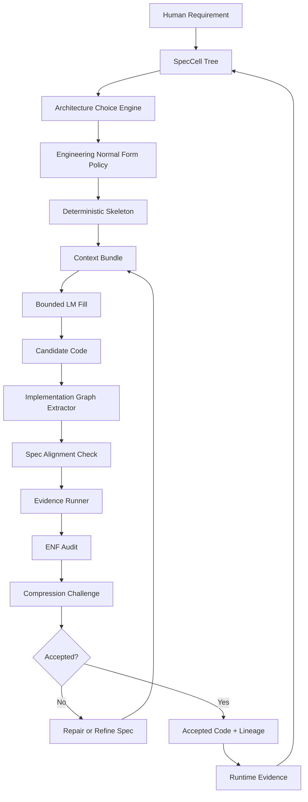

# 02 — System Overview

## One-line architecture

```text
A spec-governed Elixir/OTP synthesis harness where LMs generate bounded candidates, deterministic systems extract and verify implementation graphs, and normalizers compress candidates into Engineering Normal Form.
```

## Top-level subsystems

```text
1. Spec Stack
2. Context Bundle Compiler
3. Architecture Choice Engine
4. Deterministic Skeleton Generator
5. Bounded LM Fill Layer
6. Implementation Graph Extractor
7. Evidence Runner
8. ENF Auditor
9. Compression Normalizer
10. Reverse-Extraction Feedback Loop
11. Benchmark/Eval Harness
12. Agent Harness Integration
```

## System flow



## Substrate principle

Most agent-role systems encode discipline in prompts:

```text
Planner, please do not edit files.
Reviewer, please be strict.
Coder, please follow OTP best practices.
```

This system encodes discipline in the substrate:

```text
- capabilities determine what an agent can read/write
- specs determine what artifacts may exist
- ENF determines acceptable implementation shapes
- graph extraction determines what the code actually did
- gates determine what can advance
```

Personas are optional. Capability-bounded operations are required.

## The important inversion

Standard coding agents:

```text
Code is source of truth; specs and docs trail behind.
```

This system:

```text
SpecGraph is source of truth; code is an accepted projection.
```

Not every local implementation detail must be represented in the spec. But every public boundary, state mutation, external effect, process, credentialed operation, and runtime lifecycle must be traceable.

## The five core graphs

| Graph | Purpose |
|---|---|
| `SpecGraph` | What should exist: entities, contracts, effects, protocols, boundaries. |
| `ImplementationGraph` | What code actually implements: modules, functions, calls, processes, effects. |
| `EvidenceGraph` | What has been tested, falsified, or proven by execution. |
| `RuntimeGraph` | What happens when the BEAM runs: processes, messages, supervisors, telemetry. |
| `LineageGraph` | Why each artifact exists and which operator/model created it. |

## Acceptance rule

A candidate implementation is accepted only when:

```text
1. It satisfies declared behavior.
2. It preserves required invariants.
3. It matches declared boundaries and effects.
4. It fits Engineering Normal Form.
5. It survives compression challenge.
6. It emits traceability evidence.
```

## Non-goals

This architecture does not claim:

```text
- formal verification of arbitrary Elixir systems
- perfect spec-to-code bijection
- model-weight training
- elimination of human architecture judgment
- full automation of taste
```

It does claim:

```text
- fewer ungrounded abstractions
- smaller accepted implementations
- explicit state/effect/runtime design before code
- better context bundles for coding agents
- measurable rejection/normalization traces
- a path to harness-level learning
```
