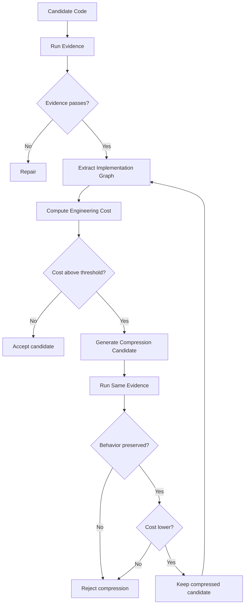

# 07 — Architecture Compression: The Missing Half of AI Engineering

## The problem

Rules and QC catch known bad patterns. They do not guarantee elegance.

The senior Elixir critique is about compression:

```text
AI wrote 1,000 LOC.
A senior engineer rewrote it in 250 LOC.
Same behavior. Better architecture.
```

This is not merely LOC reduction. It is **concept reduction**.

## Architecture compression definition

Architecture compression is the process of finding a lower-cost implementation that preserves declared behavior and evidence.

```text
Candidate A: passes tests, high mechanism.
Candidate B: passes same tests, lower mechanism.
Prefer B.
```

## Semantic density

Use the idea:

```text
semantic_density = behavior / mechanism
```

Bad AI code has low semantic density:

```text
lots of mechanism, little behavior
```

Good Elixir has high semantic density:

```text
small mechanism, clear behavior
```

## Compression signals

Trigger a compression challenge when:

```text
- LOC exceeds budget
- modules added > threshold
- public functions added > threshold
- a behaviour has one implementation
- a new GenServer appears
- a DynamicSupervisor appears
- a Registry appears
- concepts with similar names appear
- tests mirror implementation modules
- abstraction count grows faster than behavior count
```

## Necessity challenge

For each artifact, answer:

| Artifact | Required proof |
|---|---|
| Module | What concept does it isolate? |
| Public function | Which contract requires it? |
| GenServer | What state/lifecycle/concurrency does it own? |
| Supervisor | What failure domain does it own? |
| Behaviour | Where is the second implementation or declared seam? |
| Registry | Why is dynamic lookup required? |
| Config knob | Who varies it and why? |
| Dependency | What complexity does it remove? |
| Test helper | What repeated behavior does it clarify? |

Weak proof means deletion candidate.

## Rewrite challenge

For any bloated candidate:

```text
Given the same spec and behavior tests, produce a smaller implementation.
Constraints:
  - no behavior loss
  - no public API expansion
  - fewer modules preferred
  - fewer processes preferred
  - fewer abstractions preferred
  - all tests pass
  - extracted spec graph remains equivalent
```

## Compression loop



## Senior-engineer heuristics to encode

```text
- delete abstraction until it hurts
- collapse concepts with no independent lifecycle
- prefer pure data transformations to process wrappers
- use one public API for one user intent
- avoid provider abstraction until second provider exists or boundary requires it
- avoid config knobs for things that do not vary
- avoid modules that merely rename a function call
- avoid tests that assert internal shape instead of observable behavior
```

## Compression metrics

```yaml
compression_report:
  original:
    loc: 1000
    modules: 14
    public_functions: 38
    genservers: 3
    behaviours: 4
  compressed:
    loc: 250
    modules: 4
    public_functions: 9
    genservers: 1
    behaviours: 1
  behavior_preserved: true
  extracted_spec_equivalent: true
  accepted: true
```

## What cannot be automated fully

The harness cannot fully know:

```text
- whether a domain abstraction will age well
- whether a future roadmap justifies optionality
- whether a naming choice is ideal
- whether a team will prefer one local style over another
```

But it can force every expensive structure to prove its necessity.

That is enough to reduce AI slop materially.
