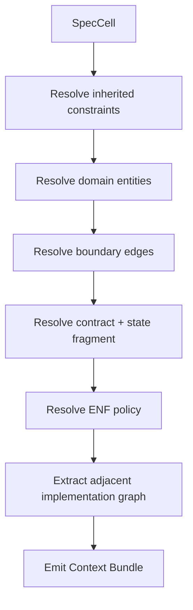

# 10 — Context Bundles: The Unit of AI Work

## Problem

LLMs fail when fed:

```text
- too much global context
- inconsistent old notes
- vague requirements
- missing constraints
- no local boundaries
- no forbidden choices
```

The solution is not larger context. The solution is **compiled context**.

## Definition

A Context Bundle is a minimal, typed packet of information sufficient for one agent task.

```text
ContextBundle = relevant spec + relevant code graph + allowed actions + forbidden inventions + evidence obligations
```

## Bundle contents

```yaml
bundle:
  id: credential_fabric.issue_lease.implementation
  task: implement issue_credential_lease
  target_modules:
    - CredentialFabric.LeaseIssuer
    - CredentialFabric.Lease
  allowed_files:
    - lib/credential_fabric/lease.ex
    - lib/credential_fabric/lease_issuer.ex
    - test/credential_fabric/lease_issuer_test.exs
  forbidden:
    - create_new_genserver
    - create_new_behaviour
    - read_system_env
    - call_external_provider
    - introduce_new_domain_terms
```

## Required sections

```text
1. Task
2. Relevant invariants
3. Domain entities
4. Contract
5. State/protocol fragment
6. Effects
7. Runtime shape
8. ENF policy subset
9. Existing code summary
10. Allowed actions
11. Forbidden actions
12. Test obligations
13. Completion criteria
```

## Example bundle excerpt

```text
You are implementing only the pure lease issue/redeem logic.
Do not create a GenServer.
Do not create a behaviour.
Do not read credentials.
Do not call external providers.
Do not introduce new terms beyond CredentialLease, LeaseId, ConnectorId, ExecutionContext.

Required tests:
- wrong connector cannot redeem
- expired lease cannot redeem
- revoked context cannot redeem
```

## Bundle generation flow



## Bundle sufficiency eval

Before sending to an LM, ask:

```text
Could a competent implementer complete this without inventing architecture?
```

If not, the bundle fails.

## Bundle drift protection

The bundle must include a hash or version of:

```text
SpecCell
ENF policy
related domain model
related boundary graph
implementation graph snapshot
```

If any source changes before acceptance, re-bundle.

## Why bundles matter

A bundle is the practical answer to Ryan's “no implicit context” issue.

Instead of hoping the model has good taste, the harness supplies:

```text
- strong project taste
- strong local context
- strong refusal conditions
- strong artifact boundaries
```
