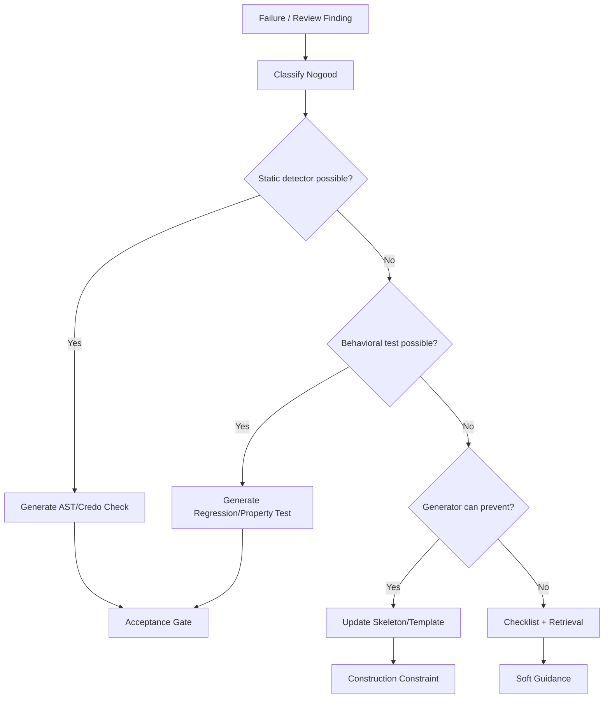

# 13 — Nogood and Constraint Compilation

## Principle

A nogood is not a memory item.

A nogood is useful only when it changes future system behavior.

```text
failure → classified nogood → detector/test/template/policy → future recurrence blocked
```

## Nogood maturity levels

| Level | Form | Value |
|---|---|---|
| L0 | Prompt reminder | weak |
| L1 | Retrieved memory | weak-medium |
| L2 | Checklist item | medium |
| L3 | Static detector | high |
| L4 | Regression/property test | high |
| L5 | Generator/template constraint | very high |
| L6 | CI/acceptance gate | very high |

## Nogood schema

```yaml
nogood:
  id: otp.business_logic_in_callback
  source:
    kind: review_failure
    component: CredentialFabric.LeaseRegistry
  pattern:
    description: GenServer callback contains domain branching and state mutation
    detector: ast_callback_complexity_and_domain_mutation
  observed_failure:
    - state transition untestable without process
    - duplicated logic in tests
  rule:
    - move business logic to PureDomainModule reducer
  enforcement:
    static_check: mix spec.audit --check otp.callback_logic
    regression_required: true
    gate: block
  remediation:
    - extract Domain.transition/2
    - keep handle_call as traffic cop
```

## Compilation targets

A nogood should compile into one or more:

```text
- Credo custom check
- AST detector
- property test
- regression test
- ENF policy rule
- generator/template change
- context bundle warning
- review checklist
- acceptance gate
```

## Flow



## Examples

### Business logic in callback

```text
Detection: handle_call/handle_cast has branch complexity > threshold and mutates domain fields.
Repair: extract pure reducer.
Gate: block.
```

### Behaviour with one implementation

```text
Detection: @behaviour has exactly one implementing module and no spec seam.
Repair: collapse behaviour into concrete module.
Gate: warn/block depending on policy.
```

### Undeclared external effect

```text
Detection: calls Req/Finch/File/System/Port without effect declaration.
Repair: declare effect or move to adapter/materializer.
Gate: block.
```

### Invented domain term

```text
Detection: module/function/entity name contains noun absent from domain model.
Repair: map to existing entity or update domain model.
Gate: warn/block.
```

## Rule

A finding without an enforcement path is not a nogood. It is a note.
