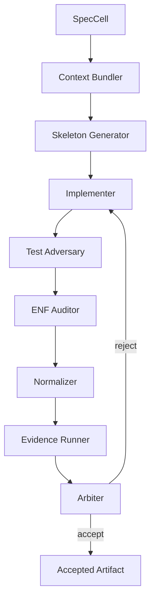

# 17 — Agent Roles: Thin Proposers Against a Strong Substrate

## Principle

Do not encode authority in personas. Encode authority in capabilities.

The roles below are useful, but the runtime must enforce what each role can do.

## Roles

| Role | Writes code? | Authority |
|---|---:|---|
| Spec Curator | no | edits structured spec with human approval |
| Architecture Critic | no | proposes findings |
| Context Bundler | no | generates bundle |
| Skeleton Generator | yes, deterministic | emits scaffolds only |
| Implementer | yes | fills allowed holes |
| Test Adversary | yes | adds tests/counterexamples |
| ENF Auditor | no | reports normal-form violations |
| Normalizer | yes | proposes simplifying rewrites |
| Arbiter | no | accepts/rejects; cannot patch |

## Capability examples

```yaml
roles:
  implementer:
    can_read:
      - context_bundle
      - allowed_files
    can_write:
      - allowed_files
    cannot:
      - create_new_files_unless_declared
      - edit_spec
      - approve_own_patch

  arbiter:
    can_read:
      - all_reports
      - diff
      - evidence
    can_write:
      - acceptance_record
    cannot:
      - edit_code
```

## Agent flow



## Role separation rule

No agent may be both:

```text
- patch author
- final acceptor
```

## Why most agents should not write code

Most value comes from:

```text
- narrowing context
- detecting drift
- generating counterexamples
- compressing architecture
- explaining violations
- updating rules
```

Parallel code writers without a substrate produce parallel slop.

## Substrate-owned decisions

The substrate, not the agent, decides:

```text
- allowed files
- allowed effects
- whether tests passed
- whether API surface expanded
- whether process count changed
- whether public functions trace to contracts
- whether a credential boundary was crossed
```
