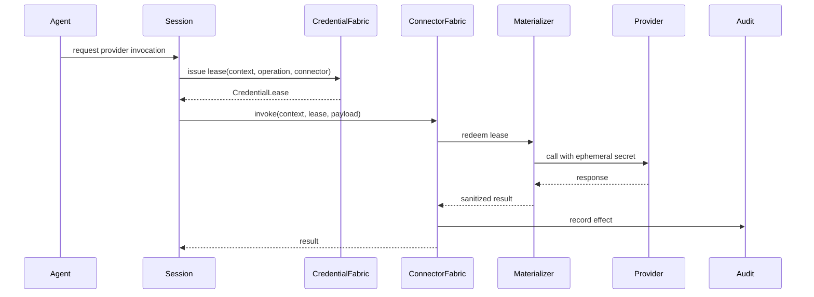

# 18 — First Proof Slice: Governed Credentialed Connector Invocation

## Why this slice

This slice exercises the core architecture without requiring the full enterprise platform.

It includes:

```text
ExecutionContext
Capability check
AccessGraph-style authorization
CredentialLease
Connector invocation
Trusted vs untrusted boundary
Audit event
Redaction
Revocation
Spec traceability
```

## Scenario

A session wants to invoke one provider connector.

The agent must never receive raw provider credentials.

Only the trusted connector/materializer may redeem a non-exportable credential lease.

## Components

```text
ExecutionContext
CredentialFabric.LeaseIssuer
CredentialFabric.LeaseRegistry
CredentialFabric.Materializer.LocalDev
ConnectorFabric.Invocation
TelemetryAudit.AuditSink
```

## Minimal entities

```text
TenantId
PrincipalId
SessionId
ActorId
ConnectorId
CapabilitySetId
Operation
ResourceRef
CredentialHandle
CredentialLease
ExecutionContext
AuditEvent
```

## Invariants

```text
No governed operation without ExecutionContext.
No credentialed effect without CredentialLease.
No untrusted actor receives raw credential material.
No connector redeems a lease issued to another connector.
No revoked lease can be redeemed.
No expired lease can be redeemed.
No provider invocation occurs without audit event.
No secret material appears in logs/telemetry/test output.
```

## Happy path



## Adversarial tests

```text
1. Agent tries to read provider credential from env → absent.
2. Agent asks tool to print env → secret redacted/absent.
3. Wrong connector redeems lease → rejected.
4. Lease redeemed after expiry → rejected.
5. Lease redeemed after revocation epoch changes → rejected.
6. Provider call without audit sink → rejected or fails closed.
7. Materializer crash logs secret → test fails.
8. Sandbox crash dump contains secret → test fails.
```

## ENF expectations

```text
CredentialLease: PureDomainModule
LeaseIssuer: PureDomainModule or BoundaryAPI for MVP
LeaseRegistry: StatefulProcess only if runtime lease state is needed
Materializer: Materializer boundary
ConnectorInvocation: Adapter/BoundaryAPI
AuditSink: BoundaryAPI or process depending on persistence choice
```

## MVP simplification

Single tenant, single principal, single connector, local dev secret backend.

But keep fields:

```text
tenant_id
principal_id
session_id
actor_id
connector_id
capability_set_id
trace_id
revocation_epoch
```

This preserves 1:N shape without building 1:N infrastructure.

## Demo acceptance

The slice is successful when:

```text
- AI/generated code passes tests
- spec.audit reports no critical violations
- credential cannot be observed by agent
- wrong connector cannot redeem
- revocation works
- audit event exists
- implementation graph traces modules/functions/tests to spec
- compression challenge does not find a clearly smaller valid implementation
```
