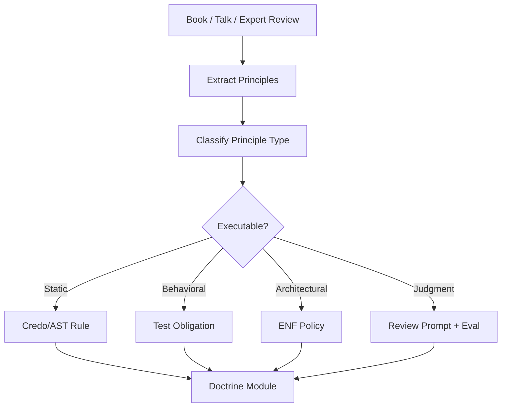

# 22 — Distilling Elixir Books into Processes and Evals

## Purpose

The user does not need to personally become an S-tier Elixir engineer before using the harness. Instead, expert knowledge should be converted into **doctrine modules**.

A doctrine module is a structured extraction from a book, talk, article, or senior review pattern that compiles into:

```text
principles
architecture rules
ENF policy
static checks
test obligations
review prompts
compression heuristics
eval cases
```

## Doctrine is not advice

Bad:

```text
Remember to keep GenServers thin.
```

Good:

```text
Rule: StatefulProcess callback complexity threshold.
Detector: AST check for branching/domain mutation inside handle_call/3.
Repair: extract PureDomainModule reducer.
Eval: agent must convert callback logic into reducer.
```

## Doctrine pipeline



## Doctrine module schema

```yaml
doctrine:
  id: designing_elixir_systems.functional_core
  source: Designing Elixir Systems with OTP
  principle: Business logic belongs in pure functional core.
  applies_to:
    - StatefulProcess
    - PureDomainModule
  rules:
    - no_business_logic_in_callbacks
    - reducer_required_for_state_transition
  evals:
    - convert_genserver_callback_to_reducer
  checks:
    - callback_complexity_detector
  prompts:
    - architecture_critic_functional_core
```

## Types of doctrine

| Doctrine type | Example | Enforcement |
|---|---|---|
| Data doctrine | Shape structs by access pattern | review + tests + spec fields |
| Functional doctrine | reducers first | AST + test shape |
| Boundary doctrine | thin GenServer shell | AST/Credo |
| Lifecycle doctrine | supervisors own recovery | runtime topology check |
| Worker doctrine | isolate time/IO | runtime/effect check |
| Compression doctrine | delete non-load-bearing abstraction | cost + rewrite challenge |
| API doctrine | public surface minimal | API diff + contract trace |
| Security doctrine | no ambient authority | capability/effect gates |

## Book-to-eval method

For each chapter or principle, create at least one eval:

```yaml
eval:
  name: avoid_process_cosplay
  prompt: Add stateless validation to an Elixir app.
  expected:
    must_create:
      - PureDomainModule
    must_not_create:
      - GenServer
      - Supervisor
      - Registry
```

Another:

```yaml
eval:
  name: thin_genserver_boundary
  prompt: Add stateful session with purchase transition.
  expected:
    must_have:
      - pure reducer
      - GenServer shell
      - public API facade
    must_not_have:
      - business branch inside handle_call
```

## Doctrine priority

Start with a small doctrine set:

```text
1. Functional core / imperative shell
2. GenServer necessity
3. Public API minimality
4. Effects at boundaries
5. Supervision lifecycle semantics
6. Compression challenge
```

Do not ingest twenty books before building the first harness. Build the doctrine ingestion path using one or two sources, then expand.
