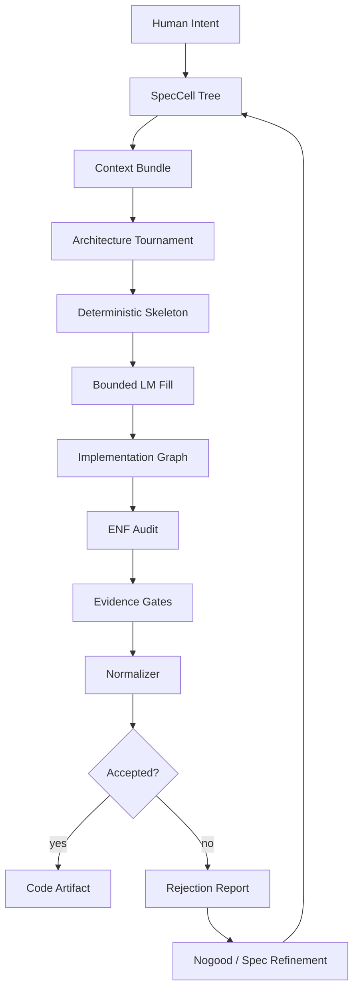

# From Code Generation to Code Acceptance

*A specification-lowered, normal-form harness for AI-assisted Elixir/OTP engineering*

Draft whitepaper v0.1  
May 5, 2026  
Working title: The Elixir AI Engineer  

### Core claim
The next useful AI software engineer is not a single model or a swarm of unconstrained agents. It is a deterministic engineering harness that treats language models as bounded proposal engines and accepts code only when it is an admissible, normalized, evidenced projection of a structured specification.

## Abstract
Large language models can now produce code that compiles, passes tests, and often appears locally plausible. They still routinely fail at software engineering. The failure is most visible in ecosystems such as Elixir/OTP, where correct syntax and passing tests are insufficient. A generated system can look idiomatic while being architecturally wrong: too many GenServers, unnecessary behaviours, inflated public APIs, fake extensibility, scattered state, duplicated data transformations, ambiguous supervision semantics, and a thousand lines of code where a senior engineer would write two hundred and fifty.

This whitepaper proposes a different framing for AI-assisted engineering. The bottleneck is no longer code generation. The bottleneck is code acceptance: deciding whether generated code deserves to exist. We introduce a greenfield Elixir/OTP engineering harness that compiles human intent through a hierarchy of strongly specified artifacts before allowing language models to write narrow implementation fragments. The system extracts implementation graphs from generated code, compares them to specification graphs, enforces an Elixir Engineering Normal Form, compresses bloated candidates through normalizing rewrites, and requires executable evidence before acceptance.

The innovation is not a perfect formal mapping from requirements to code. That object is not realistic for nontrivial software. Instead, the system defines an admissible implementation set for each specification, extracts the architectural model of candidate code, and accepts the lowest-cost candidate that satisfies the tracked specification, Engineering Normal Form, and evidence gates.

In compact form:

```text
AcceptedCode = argmin EngineeringCost(candidate)
 subject to:
  abstract(candidate) satisfies Spec
  candidate conforms to Engineering Normal Form
  candidate passes evidence gates
  candidate has traceability to specification
```

This transforms language-model output from an unchecked artifact into an untrusted candidate inside a compiler-like engineering loop.

## 1. The problem: AI can code, but it does not engineer
The current agentic coding workflow is usually a variation of:

```text
prompt -> plan -> edit files -> run tests -> repair -> summarize
```

This works surprisingly well for small bugs, local refactors, API glue, tests, and routine implementation tasks. It breaks down for greenfield system architecture and large-scale program design because the model is forced to make hidden architectural choices that are not specified, not evaluated, and not constrained by the runtime semantics of the target ecosystem.

In Elixir/OTP, this failure is especially sharp. The language gives developers powerful primitives: immutable data, pattern matching, processes, GenServers, Supervisors, Registries, Tasks, ETS, message passing, and fault-tolerant supervision. Those primitives are also traps. A model can use them syntactically while choosing the wrong architectural shape.

The failure mode is not merely that the model hallucinates APIs. The deeper failure is that it fills unspecified design space with the average of what it has seen. If the spec does not prune the universe of bad nonfunctional choices, the model invents plausible architecture. That architecture often works locally while creating long-term maintenance debt.

Common generated-code symptoms include:
*   A GenServer where a pure module was sufficient.
*   A behaviour with one implementation.
*   A DynamicSupervisor for fixed children.
*   A Registry where explicit ownership would suffice.
*   Public functions created for internal helper steps.
*   `Manager`, `Coordinator`, `Service`, and `Orchestrator` layers that do not carry real domain meaning.
*   Tests that mirror implementation structure instead of behavior.
*   Configuration knobs for variation that does not exist.
*   Side effects leaking into domain logic.
*   State duplicated across structs, process state, and persistence boundaries.
*   Working code that is four times larger than the natural solution.

No amount of prompting fully solves this. The missing ingredient is not another role persona. The missing ingredient is an externalized engineering process that defines, checks, compresses, and accepts architecture.

## 2. Design principle: build processes, not prompts
The core principle is simple:

```text
Language models propose.
Graphs verify.
Tests falsify.
Normalizers compress.
The harness accepts or rejects.
```

A language model remains essential. It is useful for semantic translation, code synthesis, naming, local repairs, test generation, explanation, and exploring alternatives. But it should not be sovereign. It should not be the final judge of whether an abstraction is necessary, a process is justified, a boundary is sound, or a design is maintainable.

Traditional software engineering already wraps human fallibility in deterministic systems: compilers, type checkers, linters, tests, formatters, CI, schemas, interfaces, migrations, release checks, and review gates. AI increases the need for those systems. It does not remove them.

The Elixir AI Engineer therefore treats the model as a bounded proposal engine embedded inside a deterministic software-production institution.

## 3. Why Elixir/OTP is a good testbed
Elixir/OTP is demanding but also unusually inspectable. Its runtime architecture is not merely hidden in source files. It appears as process topology, supervision trees, message flows, callbacks, application configuration, telemetry, crashes, and state ownership. This makes it a strong substrate for an AI engineering harness.

The established Elixir/OTP design discipline can be summarized by the progression:

```text
Data -> Functions -> Tests -> Boundaries -> Lifecycles -> Workers
```

A mature Elixir design starts with data shapes, builds a pure functional core, tests that core without mocks, wraps it in thin OTP boundaries only where runtime state or concurrency demands it, defines supervision and lifecycle behavior explicitly, and isolates workers for side effects and timers.

That framework is necessary but not sufficient. It tells us the preferred order of thought. It does not fully solve the architectural compression problem: deciding whether a proposed design has too many concepts, too many modules, too much public surface, too many processes, or the wrong boundary shape.

The harness proposed here turns that discipline into an executable process.

## 4. The core innovation: admissibility plus normalization
A tempting but incorrect goal is to seek a bijection from specification to ideal code. For any meaningful program, there are many valid implementations. The term "ideal" depends on tradeoffs: latency, fault isolation, memory pressure, restart behavior, readability, testability, deployment model, observability, and team skill.

The practical replacement is admissibility plus normalization.

A specification defines a set of admissible implementations. A candidate implementation is valid only if the system can extract an architectural model from the code and show that this model satisfies the tracked specification. Among valid candidates, the harness chooses the one with the lowest engineering cost under declared policy.

```text
Spec S defines admissible implementations Gamma(S).
Candidate code C is abstracted into implementation model abstract(C).
C is valid when:
 abstract(C) satisfies S
 evidence(C) passes
 ENF(C) passes
 every artifact is traceable to S

Accepted code C* is the lowest-cost valid candidate found.
```

This does not claim global optimality. It claims bounded, auditable engineering preference under declared constraints. That is enough to be useful.

## 5. Specification cells: the unit of software intent
The system should not start from one giant prompt or one giant requirements document. It should decompose the software into Specification Cells.

A SpecCell is a structured, human-readable, machine-checkable unit of intent. It can describe a whole system, subsystem, component, module group, process, or operation. The same shape recurs at every scale.

Each SpecCell contains:
*   Purpose
*   Charter inheritance
*   Domain references
*   Boundary
*   Interfaces
*   State
*   Mutations
*   Protocols
*   Effects
*   Capabilities
*   Concurrency model
*   Failure modes
*   Observability
*   Test obligations
*   Lowering hints
*   Traceability links

This gives the process a fractal structure. A whole system lowers into subsystems. A subsystem lowers into components. A component lowers into module kinds. A module kind lowers into skeletons. Skeletons contain narrow holes that an LM may fill.

The crucial property is that lower layers may refine and narrow authority, but they may not silently widen it.

## 6. The specification stack
The proposed stack has ten layers. Not every layer needs maximum formality; the goal is localized rigor where structure matters.

### 6.1 Charter
The Charter defines stable non-negotiable invariants.

**Examples:**
*   No GenServer exists without state ownership, lifecycle, concurrency, or external resource justification.
*   No credentialed effect occurs without an ExecutionContext.
*   No public operation exists without a contract.
*   No implementation effect occurs without a declared effect.
*   No lower-tier artifact may invent a domain term absent from the domain model.
*   No untrusted execution environment receives raw credential material.
*   No code artifact may cross a declared boundary without a declared edge.

The Charter is small, human-owned, and persistent.

### 6.2 Capability map
The capability map states what the system must be able to do, without prematurely choosing implementation.

**Example capabilities:**
*   Create a governed AI session.
*   Route an operation through a provider connector.
*   Issue a credential lease for one authorized operation.
*   Revoke session authority while work is in progress.
*   Audit every credentialed external effect.
*   Spawn a sandbox without exposing provider credentials to it.

### 6.3 Domain model
The domain model defines the nouns. Any lower layer that invents a domain noun without declaring it is drifting.

**Example domain terms:**
*   Tenant
*   Principal
*   Session
*   Actor
*   ExecutionContext
*   Capability
*   CapabilitySet
*   Resource
*   Operation
*   Connector
*   CredentialHandle
*   CredentialLease
*   Sandbox
*   Pool
*   Provider
*   AccessGraphEdge
*   PiToken
*   AuditEvent
*   SpecCell
*   ImplementationPlan

### 6.4 Boundary graph
The boundary graph defines components and allowed edges.

**Example components:**
*   Spec Compiler
*   Session Fabric
*   Identity Fabric
*   Capability Fabric
*   Credential Fabric
*   Connector Fabric
*   Execution Plane
*   API Projection Plane
*   StackLab Evidence Plane
*   Telemetry and Audit Plane

Edges are explicit. If generated code creates an undeclared call path across components, it is rejected or the spec must be updated.

### 6.5 Contract surface
Contracts define operations, inputs, outputs, error variants, preconditions, and preserved invariants.

**Example:**
```yaml
operation: issue_credential_lease
input:
  context: ExecutionContext
  operation: Operation
  resource: ResourceRef
  connector_id: ConnectorId
  requested_scope: ScopeSet
output:
  ok: CredentialLease
  error:
    - missing_identity
    - capability_denied
    - access_graph_denied
    - credential_not_found
    - connector_not_authorized
    - tenant_boundary_violation
    - revoked
requires:
  - context.tenant_id
  - context.session_id
  - context.actor_id
  - context.capability_set_id
  - context.pi_head
preserves:
  - no_raw_secret_exposure
  - tenant_isolation
  - session_isolation
  - connector_redeemability
  - auditability
```

### 6.6 State and protocol model
This layer defines states and legal transitions.

**Example credential lease lifecycle:**
```text
Requested -> PolicyChecked
PolicyChecked -> Issued
Issued -> Redeemed
Redeemed -> Used
Used -> Audited
Issued -> Revoked
Issued -> Expired
```

Forbidden transitions matter as much as allowed ones:
```text
Issued -> RedeemedByWrongConnector
Issued -> SecretMaterialReturnedToAgent
Used -> AuditMissing
Issued -> RedeemedAfterRevocation
```

### 6.7 Effect and governance model
Effects are explicit. An operation that reads files, writes files, performs network calls, spawns processes, uses credentials, mutates storage, emits telemetry, or performs provider calls must declare that effect.

**Example:**
```yaml
Operation: Connector.invoke_provider
Consumes:
  CredentialLease
  Capability
  AccessGraphEdge
  PiToken
Produces:
  ProviderRequest
  ProviderResponse
  AuditEvent
Forbidden:
  RawCredentialExposure
  CrossTenantCredentialUse
  UnattributedExternalCall
```

### 6.8 Runtime and concurrency model
This layer decides which OTP primitives are justified.

It specifies:
*   Pure modules
*   Boundary APIs
*   GenServers
*   Supervisors
*   DynamicSupervisors
*   Registries
*   Tasks
*   ETS usage
*   Process ownership
*   Restart behavior
*   Message format
*   State retention
*   Crash cleanup
*   Telemetry

### 6.9 Implementation plan
The implementation plan lists the modules, tests, generated skeletons, and traceability matrix. The AI may help produce this, but the plan must pass structural checks before code generation.

### 6.10 Runtime evidence
Runtime evidence closes the loop:
*   unit tests
*   property tests
*   state-machine tests
*   fault-injection tests
*   exfiltration tests
*   trace checks
*   runtime topology checks
*   telemetry/audit completeness checks

This evidence feeds back into the specification.

## 7. Elixir Engineering Normal Form
Elixir Engineering Normal Form, or ENF, is a declared subset of acceptable generated Elixir architecture.

The model is not asked to write arbitrary Elixir. It is asked to fill a slot in a constrained system. Every generated module belongs to one of a small number of kinds:
*   PureDomainModule
*   BoundaryAPI
*   StatefulProcess
*   Supervisor
*   DynamicSupervisor
*   Registry
*   Adapter
*   Materializer
*   PolicyModule
*   ProtocolStateMachine
*   TestModule
*   PropertyTestModule
*   TelemetryEmitter

Each kind has allowed and forbidden features.

**Example: PureDomainModule**

**Allowed:**
*   pure functions
*   struct transformations
*   pattern matching
*   guards
*   small private helpers
*   contract checks

**Forbidden:**
*   GenServer calls
*   process spawning
*   ETS access
*   network calls
*   filesystem writes
*   credential materialization
*   Application config reads
*   telemetry emission unless declared

**Example: StatefulProcess**

**Allowed:**
*   GenServer
*   explicit state struct
*   public facade functions
*   handle_call / handle_cast / handle_info
*   child_spec
*   init

**Forbidden unless specified:**
*   direct credential access
*   business logic in callbacks
*   unbounded mailbox assumptions
*   cross-tenant lookup
*   external network calls
*   multiple unrelated responsibilities
*   runtime process spawning not in the spec

ENF converts fuzzy taste into a partially executable policy. It cannot prove elegance, but it can reject many forms of architectural bloat.

## 8. Implementation graphs
After generation, the harness extracts concrete graphs from code.

### 8.1 SpecGraph
Represents the intended system:
*   entities
*   contracts
*   boundaries
*   state machines
*   effects
*   capabilities
*   runtime topology
*   test obligations

### 8.2 ImplementationGraph
Extracted from source:
*   modules
*   functions
*   public APIs
*   call graph
*   GenServers
*   Supervisors
*   Registries
*   Tasks
*   ETS usage
*   behaviours
*   protocols
*   external effects
*   config reads
*   telemetry events

### 8.3 EvidenceGraph
Represents proof obligations and results:
*   unit tests
*   property tests
*   state-machine tests
*   integration tests
*   fault tests
*   adversarial tests
*   coverage of contracts
*   coverage of invariants

### 8.4 RuntimeGraph
Extracted from actual execution:
*   process tree
*   message flows
*   supervision restarts
*   pool checkouts
*   sandbox spawns
*   credential redemptions
*   telemetry events
*   crash behavior
*   latency
*   memory
*   backpressure

### 8.5 CostGraph
Represents engineering cost:
*   module count
*   public API size
*   process count
*   supervision depth
*   callback count
*   abstraction depth
*   duplication
*   cross-boundary edge count
*   test complexity
*   runtime overhead

### 8.6 LineageGraph
Records where artifacts came from:
*   which spec fragment produced which module
*   which operator produced which patch
*   which model generated which candidate
*   which evaluator accepted or rejected it
*   which rewrite simplified it
*   which failure created which constraint

The central relation is:
```text
ImplementationGraph must be an admissible projection of SpecGraph.
EvidenceGraph must cover required obligations.
CostGraph must fit the component budget.
LineageGraph must explain why every artifact exists.
```

## 9. Architecture compression
The missing half of AI engineering is compression.

A generated implementation can be correct and still be bad. It may have too many concepts. The architecture evaluator therefore asks:
*   Can this be made smaller?
*   Can this be made more local?
*   Can this be made more boring?
*   Can this be made more directly aligned with the runtime primitive that actually fits the problem?

Compression is not arbitrary minimization. It is behavior-preserving normalization under the spec.

The harness computes an engineering cost:
```text
Cost(C) =
  module_count_weight
+ public_function_count_weight
+ process_count_weight
+ callback_count_weight
+ supervision_depth_weight
+ cross_boundary_edge_weight
+ duplicated_logic_weight
+ dynamic_dispatch_weight
+ global_state_weight
+ macro_weight
+ undocumented_boundary_weight
+ untraced_artifact_weight
- pure_function_bonus
- pattern_match_bonus
- local_reasoning_bonus
- deletion_bonus
```

Normalizing rewrites include:
*   Collapse a behaviour with one implementation.
*   Replace a GenServer with a pure module when no state ownership exists.
*   Inline a single-use helper module.
*   Reduce public API surface.
*   Merge duplicate validation layers.
*   Replace invented Manager/Service/Coordinator modules with domain modules.
*   Move business logic from callbacks into reducers.
*   Remove configuration knobs without declared variation.
*   Delete dead abstractions.

A rewrite is retained only if the evidence still passes and the extracted tracked model still satisfies the spec.

## 10. The acceptance pipeline
The overall loop is:

```text
Human intent
 -> SpecCell tree
 -> Context bundle
 -> Architecture tournament
 -> Deterministic skeleton
 -> Bounded LM fill
 -> Implementation graph extraction
 -> ENF audit
 -> Evidence gates
 -> Compression/normalization
 -> Acceptance or rejection
 -> Reverse extraction and spec refinement
```

Mermaid representation:


The model does not get a blank page. It receives a context bundle for one narrow lowering task.

## 11. Context bundles
A context bundle is compiled context, not conversation history.

For a task such as implementing `CredentialFabric.LeaseIssuer.issue/5`, the bundle includes:
*   relevant Charter invariants
*   relevant domain entities
*   component boundary
*   operation contract
*   state machine fragment
*   effect declarations
*   capability requirements
*   runtime ownership rules
*   ENF module kind
*   allowed files
*   forbidden inventions
*   required tests
*   existing adjacent modules

It excludes:
*   unrelated architecture prose
*   unrelated repos
*   obsolete discussion history
*   speculative future architecture
*   large files not needed for the operation

This is the practical version of context distillation. The goal is not to make the LM remember the whole ecosystem. The goal is to give it the exact slice required to fill one constrained hole.

## 12. Architecture tournament
Before code generation, the system should compare multiple admissible architecture shapes.

For example, a component may be implementable as:
*   A pure module.
*   A pure module plus BoundaryAPI.
*   A single GenServer.
*   A GenServer plus ETS.
*   A DynamicSupervisor plus per-resource workers.
*   An adapter boundary plus materializer process.

The tournament scores each shape against the spec:
*   Does the component own state?
*   Does it need serialized access?
*   Does it need independent crash recovery?
*   Does it manage an external resource?
*   Does it need runtime-created children?
*   Does it require shared concurrent reads?
*   Does it cross a credentialed boundary?

The selected shape becomes the runtime lowering. This is where an Elixir system avoids defaulting to GenServers.

## 13. Nogood compilation
A failure becomes useful only when it changes future system behavior.

A weak nogood is a memory note:
```text
Do not put business logic in GenServer callbacks.
```

A strong nogood is executable:
```yaml
nogood:
  id: otp_business_logic_in_callback
  detector: mix spec.audit --rule otp_business_logic_in_callback
  remediation: extract_to_pure_reducer
  regression_required: true
  gate: block
```

Nogoods compile into:
*   static detectors
*   property tests
*   regression tests
*   generator constraints
*   ENF rules
*   context-bundle warnings
*   CI gates

This is how the harness learns without model weight updates.

## 14. Reverse extraction and drift classification
Ongoing development cannot require manual forensic investigation. Every code change should be projected back into the implementation graph and classified.

Possible classifications:

*   **Conforming detail:** code changed, but tracked architecture is unchanged.
*   **Spec violation:** code does something the spec forbids.
*   **Spec omission:** code introduces behavior that may be legitimate but is not specified.
*   **Implementation bloat:** code adds structure not justified by the spec.
*   **Spec refinement candidate:** code reveals a real missing entity, effect, state, or failure case.
*   **Dead behavior:** code implements behavior no spec still references.

This allows the system to say:
*   Accept without spec update.
*   Reject as violation.
*   Require spec update.
*   Normalize away.
*   Create new test obligation.
*   Create new nogood.

This is the practical substitute for perfect spec-code bijection.

## 15. The adversary: StackLab-style evidence
A generator and verifier are not enough. The system needs an adversary.

The adversary tries to falsify invariants:
*   Can a sandbox read credentials?
*   Can a wrong connector redeem a lease?
*   Can a revoked session still perform an effect?
*   Can tenant A observe tenant B?
*   Can a pool worker leak state across sessions?
*   Can telemetry or crash dumps leak secrets?
*   Can duplicate messages break idempotency?
*   Can late messages corrupt state?
*   Can a process restart lose required state?

Counterexamples refine the spec and the harness:
```text
counterexample -> new test -> new detector -> new lowering rule -> new context warning -> new ENF policy
```

This creates a CEGAR-like loop for engineering, even without full formal verification.

## 16. MVP: three Mix tasks
The first useful implementation should not be a full autonomous coding agent. It should be a small Elixir harness that audits, bundles, and accepts.

### 16.1 `mix spec.audit`
Reads `spec/` and `lib/`, extracts an implementation graph, and reports architectural drift.

First five checks:
*   GenServer without state-ownership justification.
*   Behaviour with one implementation.
*   Public function not traceable to a spec contract.
*   External effect not declared in the spec.
*   Domain term absent from the domain model.

### 16.2 `mix spec.bundle`
Generates a context bundle for a coding agent.

**Example:**
```bash
mix spec.bundle credential_fabric issue_credential_lease
```

**Output:**
*   relevant invariants
*   entities
*   contracts
*   allowed files
*   forbidden inventions
*   runtime shape
*   required tests

### 16.3 `mix spec.accept`
Runs the acceptance gate:
*   format
*   compile
*   tests
*   spec audit
*   ENF check
*   traceability check
*   security/effect check

It outputs either `ACCEPTED` or a rejection report with structural reasons.

## 17. Proof slice: governed credentialed connector invocation
The first slice should be small but representative:
*   One session.
*   One ExecutionContext.
*   One CapabilitySet.
*   One AccessGraph edge.
*   One CredentialHandle.
*   One CredentialLease.
*   One Connector.
*   One sandbox boundary.
*   One provider operation.
*   One audit event.

The demo should prove:
*   An agent can invoke a provider operation through a governed connector.
*   The provider credential exists.
*   The connector can use it.
*   The agent cannot see it.
*   The sandbox cannot see it.
*   Logs cannot leak it.
*   A wrong session cannot use it.
*   A wrong connector cannot redeem it.
*   A revoked lease fails.
*   A missing Pi-chain fails.
*   A missing AccessGraph edge fails.
*   The operation emits an audit event.

This slice exercises the core thesis without requiring the full enterprise platform.

## 18. Evaluation plan
The system should be evaluated against naive agentic coding, not against a fantasy of perfect software.

### 18.1 Baselines
*   Naive frontier model with broad prompt.
*   Naive frontier model with better prompt.
*   Single-agent coding tool with tests.
*   Human-authored minimal baseline when available.
*   Harness-guided generation with ENF and acceptance gates.

### 18.2 Metrics
*   Test pass rate.
*   Property pass rate.
*   Spec alignment pass rate.
*   ENF violation count.
*   Undeclared effect count.
*   Untraceable artifact count.
*   Module count.
*   Public API count.
*   GenServer count.
*   Behaviour count.
*   Compression ratio after normalization.
*   Frontier model calls per accepted implementation.
*   Human review defects.
*   Runtime invariant failures.

### 18.3 The key claim to prove
A credible early claim would be:
> On a benchmark suite of greenfield Elixir/OTP tasks, the harness produces accepted BEAM-normal-form implementations with fewer unjustified abstractions, fewer public functions, fewer processes, and lower review burden than naive agent generation, while preserving behavioral evidence.

Quantitative example target:
*   50% fewer modules.
*   60% fewer public functions.
*   80% fewer unjustified behaviours.
*   Zero undeclared effects in accepted code.
*   Same tests and property tests passing.
*   Lower frontier-call budget per accepted patch.

## 19. Why this matters beyond Elixir
The Elixir focus is a wedge, not a limitation. Elixir/OTP makes architecture visible enough to audit. But the broader idea applies to any ecosystem where generated code needs architecture-level acceptance.

The generalized claim:

> AI coding needs a code acceptance layer, not only stronger generation.

That layer consists of:
*   strong specification artifacts
*   implementation graph extraction
*   engineering normal forms
*   cost functions
*   normalizing rewrites
*   evidence gates
*   reverse extraction
*   feedback loops
*   benchmark trajectories

The output is not just code. It is engineering judgment data:
*   spec
*   candidate implementation
*   extracted graph
*   failure classification
*   normalization rewrite
*   accepted implementation
*   reason for rejection
*   cost delta
*   evidence results

This dataset is valuable because public code repositories mostly show final code. They rarely show the rejected architecture, the senior critique, the simplification, and the reason one design was better.

## 20. Limitations
*   This proposal does not solve software globally.
*   It does not provide full formal verification.
*   It does not guarantee globally optimal code.
*   It does not eliminate human architectural judgment.
*   It does not remove language models from the loop.
*   It does not make Elixir automatically easy for non-experts.

Instead, it claims a tractable intermediate target:
> For a constrained class of greenfield Elixir/OTP systems, structured specifications plus Engineering Normal Form plus implementation graph extraction plus evidence gates can materially reduce AI-generated architectural bloat and make accepted code more predictable, maintainable, and auditable.

That is enough to build.

## 21. Roadmap

### Phase 1: Audit first
Build `mix spec.audit` with five checks:
*   unjustified GenServer
*   single-implementation behaviour
*   untraceable public function
*   undeclared external effect
*   undefined domain term

Run it on existing generated code. Produce a slop report.

### Phase 2: Context bundles
Build `mix spec.bundle` to generate narrow, task-specific context bundles.

### Phase 3: Acceptance gate
Build `mix spec.accept` to combine compile, tests, audit, traceability, and ENF checks.

### Phase 4: Proof slice
Implement the governed credentialed connector invocation slice.

### Phase 5: Normalizer
Add the first normalizing rewrite:
*   `collapse behaviour with one implementation`

Then add:
*   `reject GenServer without state ownership`
*   `collapse Manager/Service/Coordinator layers not traceable to spec`
*   `reduce public API surface`
*   `move callback logic into pure reducers`

### Phase 6: Benchmark suite
Create 20-50 small Elixir/OTP greenfield tasks with expected invariants, forbidden patterns, and cost budgets.

### Phase 7: Harness evolution
Version the lowering pipeline itself and evaluate pipeline variants.

## 22. Conclusion
Current AI coding agents optimize for producing code that runs. Software engineering requires deciding which code should exist.

The proposed Elixir AI Engineer is not a chatbot, not a swarm, and not a fantasy of perfect formal code generation. It is a code acceptance harness: a specification-lowered, graph-extracted, normal-form, adversarially evidenced process for turning probabilistic model output into maintainable Elixir/OTP artifacts.

The central inversion is:
```text
The model is not the engineer.
The harness is the engineer.
The model is one operator inside it.
```

This reframes AI software engineering from prompt craft to process design. The practical goal is not to make language models magically develop senior Elixir taste. It is to make structurally bad Elixir hard to accept, easy to detect, and increasingly easy to normalize away.

That is the innovation.

---

## Appendix A: ENF slop patterns
Initial high-value slop patterns:
*   GenServer without state ownership.
*   GenServer with business logic in callbacks.
*   Behaviour with one implementation.
*   DynamicSupervisor for static children.
*   Registry without dynamic process lookup need.
*   Public function not traceable to contract.
*   Domain term absent from domain model.
*   External effect not declared.
*   Credential access outside materializer boundary.
*   Application config read in tenant/session-sensitive logic.
*   Multiple modules encoding the same transformation.
*   Manager/Coordinator/Service layer with no domain purpose.
*   Tests that mirror implementation rather than behavior.
*   Config knobs with no declared variation.
*   Macro introduced without explicit benefit.

## Appendix B: Example SpecCell skeleton

```yaml
spec_cell:
  id: credential_fabric.lease_issuer
  purpose: Issue non-exportable credential leases for authorized connector operations.
  inherits:
    - charter.no_raw_secret_exposure
    - charter.execution_context_required
    - charter.traceability_required
  domain:
    entities:
      - ExecutionContext
      - CredentialLease
      - CredentialHandle
      - Connector
      - Operation
      - Resource
  boundary:
    component: CredentialFabric
    allowed_edges:
      - SessionFabric -> CredentialFabric
      - CredentialFabric -> ConnectorFabric
    operations:
      - issue_credential_lease
    effects:
      declared:
        - audit_event_emit
      forbidden:
        - raw_secret_return_to_agent
        - provider_network_call
  runtime:
    module_kind: PureDomainModule
    process_allowed: false
  tests:
    required:
      - missing_context_rejected
      - wrong_connector_rejected
      - revoked_context_rejected
      - no_raw_secret_exposure
```

## Appendix C: Candidate acceptance report

```yaml
acceptance_report:
  candidate: credential_fabric_v3
  status: rejected
  reasons:
    - public_function_not_traceable:
        function: CredentialLeaseValidator.validate_scope/2
    - single_implementation_behaviour:
        behaviour: CredentialLeaseBackend
    - undeclared_effect:
        module: CredentialFabric.ProviderKeyResolver
        effect: System.get_env
    - process_without_state_ownership:
        module: CredentialFabric.LeaseManager
  suggested_normalization:
    - collapse CredentialLeaseBackend into CredentialFabric.Lease
    - move System.get_env access to Materializer boundary
    - replace LeaseManager GenServer with pure LeaseIssuer module
```

## Appendix D: One-sentence pitch
A specification-lowered Elixir/OTP engineering harness that treats AI code as an untrusted candidate, extracts its implementation graph, rejects architectural drift, normalizes it into Engineering Normal Form, and accepts it only when it satisfies structured specs and executable evidence.
