# Living Substrate Architecture

## 0. Core Claim

The Elixir AI Engineer is not a coding agent, not a static spec compiler, and not a one-shot workflow.

It is a **living engineering substrate**.

Its purpose is to continuously project specifications, code, runtime behavior, evidence, and engineering judgment into shared graphs, then use those graphs to:

```text
1. constrain generation,
2. reject invalid structure,
3. compress bloated candidates,
4. falsify invariants adversarially,
5. refine specifications,
6. evolve the harness that performs the lowering.
```

The system is not primarily a pipeline from spec to code.

It is a **multi-timescale feedback engine** where LMs are bounded proposal operators inside a governed substrate.

---

## 1. The Missing Shift

The previous architecture was good but too static.

It still implied:

```text
spec -> bundle -> skeleton -> LM -> audit -> accept
```

That is useful, but incomplete.

The actual innovation is:

```text
software development becomes a continuously observed, graph-projected, adversarially tested, self-normalizing, self-improving control system.
```

The harness is not just something that runs before merge.

The harness is the environment in which the software exists.

---

## 2. Three Nested Feedback Loops

The living substrate has three primary loops operating at different timescales.

```text
Inner loop: Candidate synthesis
  seconds to minutes
  produces and repairs local implementation candidates

Middle loop: Normalization and evidence
  minutes to hours
  compresses working code into Engineering Normal Form

Outer loop: Harness evolution
  hours to weeks
  converts failures into new rules, tests, operators, cost weights, and lowering strategies
```

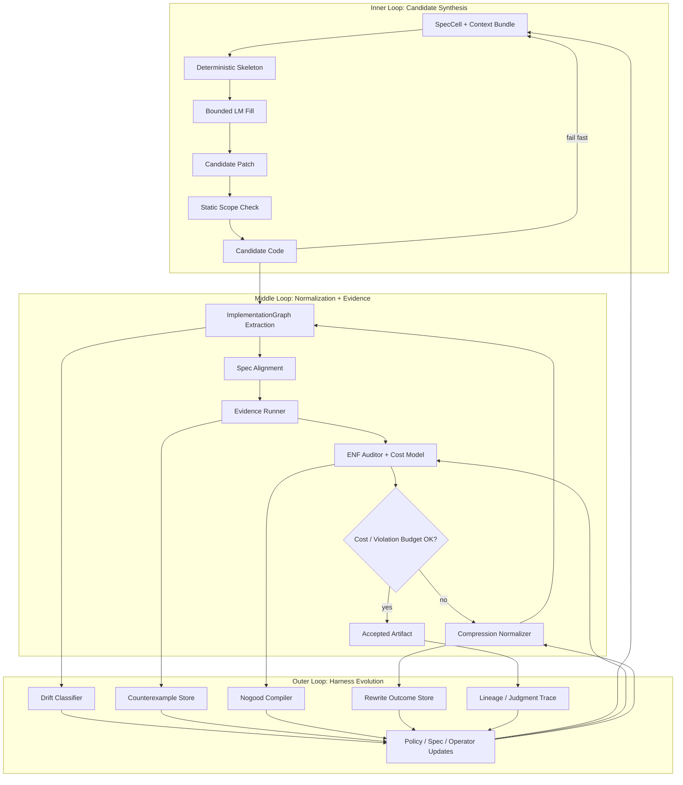

The important move is that failure does not merely trigger another prompt.

Failure becomes substrate material.

A failed patch can become:

```text
- a new static rule,
- a new property test,
- a new forbidden pattern,
- a new skeleton constraint,
- a revised SpecCell,
- a changed cost weight,
- a new benchmark case,
- a labeled training trajectory.
```

---

## 3. The Substrate Surface

The system’s center is not the LM.

The center is the graph substrate.

Every artifact projects into the substrate:

```text
specification
code
runtime topology
tests
telemetry
adversarial failures
normalization rewrites
human decisions
LM attempts
acceptance records
```

These are not stored as disconnected logs. They become graph facts.

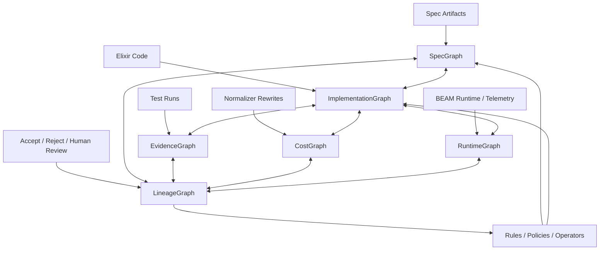

The substrate is a continuously maintained surface of engineering truth.

The codebase is one projection.

The spec is another projection.

The tests are another projection.

The runtime is another projection.

The lineage graph records why each projection changed.

---

## 4. The Five Living Graphs

### 4.1 `SpecGraph`

Represents what should exist.

Contains:

```text
charter invariants
entities
relationships
capabilities
boundaries
contracts
protocols
effects
runtime expectations
SpecCells
test obligations
```

### 4.2 `ImplementationGraph`

Represents what code actually built.

Contains:

```text
modules
functions
public APIs
calls
behaviours
protocols
GenServers
Supervisors
DynamicSupervisors
Registries
ETS tables
effects
config reads
telemetry emissions
credential materialization paths
```

### 4.3 `EvidenceGraph`

Represents what has been tested, falsified, proven, or observed.

Contains:

```text
unit tests
property tests
state-machine tests
adversarial tests
fault-injection outcomes
redaction tests
runtime invariant checks
coverage of spec obligations
```

### 4.4 `RuntimeGraph`

Represents what the running BEAM system actually does.

Contains:

```text
process trees
supervision restarts
messages
pool checkouts
sandbox spawns
connector invocations
credential redemptions
telemetry events
latency/memory/backpressure
crash behavior
```

### 4.5 `LineageGraph`

Represents why each artifact exists.

Contains:

```text
which SpecCell caused which module
which operator produced which patch
which LM generated which candidate
which detector rejected which artifact
which normalizer rewrote which structure
which test falsified which invariant
which human accepted which exception
which rule was born from which failure
```

This is the most valuable graph.

GitHub contains final code.

The living substrate contains engineering judgment.

---

## 5. The Real Product: Judgment Traces

The output is not merely accepted code.

The output is a **lowering trajectory**.

```yaml
trajectory:
  task_id: credential_lease_registry.issue

  input:
    spec_cell: credential_fabric.lease_registry
    context_bundle_hash: abc123
    enf_policy_hash: def456

  candidate:
    generator: bounded_lm_fill
    model: local_or_frontier_model
    patch_hash: c01

  extraction:
    modules: 8
    genservers: 3
    behaviours: 2
    public_functions: 41
    effects: []

  evaluation:
    compile: pass
    tests: pass
    property_tests: pass
    spec_alignment: pass
    enf: fail

  rejection:
    reasons:
      - single_implementation_behaviour
      - unjustified_genserver
      - public_api_budget_exceeded
      - duplicated_validation_logic

  normalization:
    rewrites:
      - collapse_single_impl_behaviour
      - remove_stateless_genserver
      - reduce_public_api
      - merge_validator_modules

  result:
    modules: 3
    genservers: 1
    behaviours: 0
    public_functions: 14
    cost_delta: -63%
    evidence_preserved: true

  accepted: true
```

This is richer than ordinary training data because it includes:

```text
- rejected alternatives,
- reasons for rejection,
- simplification paths,
- invariant failures,
- evidence outcomes,
- accepted normal form.
```

The strategic value is the dataset of engineering judgment traces.

---

## 6. The Living Substrate Is Not an Agent Swarm

Traditional agent systems distribute judgment across personas:

```text
Planner
Explorer
Coder
Reviewer
Critic
Arbiter
```

The living substrate collapses role theater into capability-bounded operators.

```text
role = capability bundle + allowed graph operations + allowed artifact writes
```

A persona saying “I cannot edit code” is weak.

A capability boundary that prevents code writes is strong.

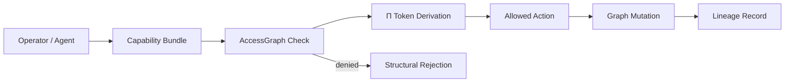

Agents become thin proposers.

The substrate owns:

```text
- authority,
- scope,
- file permissions,
- effects,
- acceptance,
- lineage,
- evidence,
- traceability.
```

---

## 7. Continuous Reverse Extraction

The previous architecture treated extraction as a stage.

The living substrate treats extraction as continuous.

Every code change projects back into the implementation graph.

Every graph delta is classified.

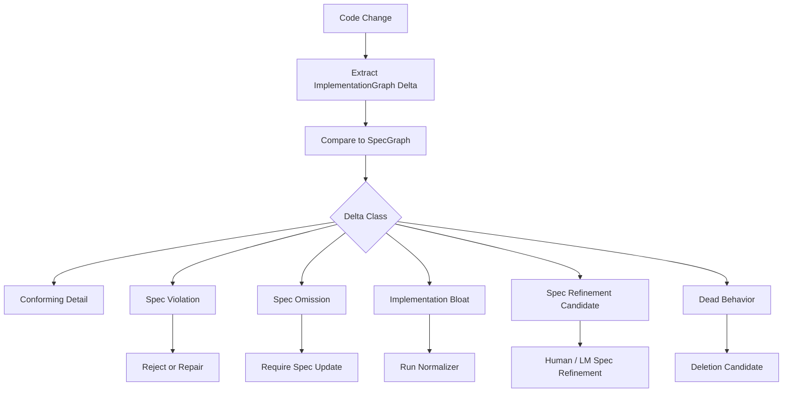

### Delta classes

| Class | Meaning | Action |
|---|---|---|
| `conforming_detail` | Code changed but tracked architecture did not. | Allow after evidence. |
| `spec_violation` | Code now does something the spec forbids. | Reject or repair. |
| `spec_omission` | Code may be legitimate but spec lacks it. | Require spec update. |
| `implementation_bloat` | Structure added without load-bearing reason. | Normalize or reject. |
| `spec_refinement_candidate` | Code reveals a real missing concept. | Human/LM spec refinement. |
| `dead_behavior` | Code implements behavior no spec references. | Delete or justify. |

This prevents every feature update from becoming a forensic investigation.

---

## 8. The Adversary Is a First-Class Subsystem

A generator-verifier loop is insufficient.

The missing third party is the adversary.

```text
Generator proposes.
Verifier checks declared obligations.
Adversary tries to falsify invariants.
```

StackLab is not just a test harness.

StackLab is the adversarial engine that turns latent design gaps into counterexamples.

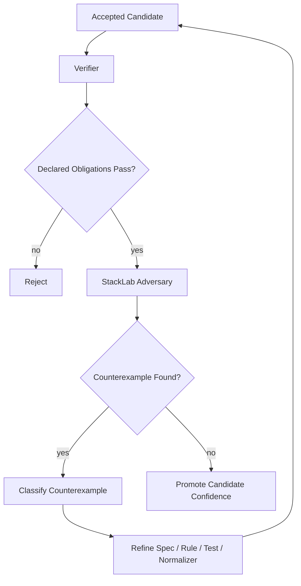

Counterexamples refine specifications, not just code.

That is the CEGAR loop:

```text
counterexample -> abstraction refinement -> constrained regeneration
```

The substrate learns from the adversary.

---

## 9. Engineering Normal Form Becomes Dynamic Policy

Engineering Normal Form is not a static style guide.

It is a versioned, empirically adjusted policy.

Initial ENF may say:

```text
- no GenServer without state ownership,
- no behaviour with one implementation,
- no public function without contract,
- no undeclared external effect,
- no invented domain term.
```

Over time, the harness records:

```text
- which rules produced useful rejections,
- which rules created false positives,
- which normalizers preserved behavior,
- which cost weights predicted human acceptance,
- which abstractions aged well,
- which patterns caused later failures.
```

Then ENF evolves.

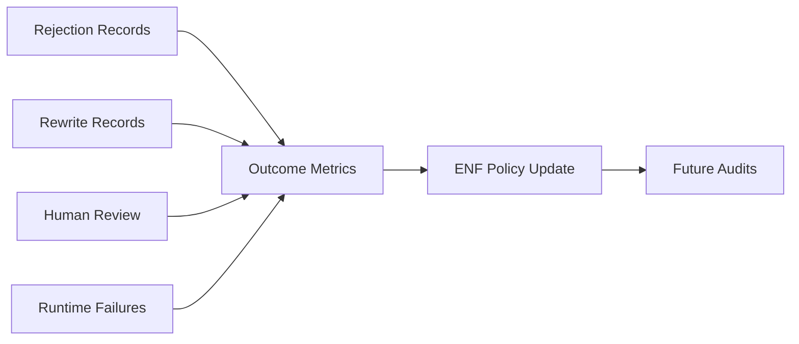

The policy is not arbitrary taste.

It is taste plus evidence plus history.

---

## 10. Harness Evolution

The harness itself is an object of optimization.

A lowering pipeline is a versioned artifact:

```yaml
pipeline: credential_fabric_v7

operators:
  - parse_spec_cell
  - generate_runtime_candidates
  - choose_runtime_shape
  - generate_skeleton
  - generate_property_tests
  - bounded_lm_fill
  - extract_impl_graph
  - run_evidence
  - run_enf_audit
  - normalize
  - re_run_evidence
  - record_lineage

models:
  bounded_lm_fill: local_model
  hard_repair: frontier_model
  ambiguity_detection: cheap_classifier

cost_weights:
  module_count: 0.25
  public_function_count: 0.30
  process_count: 0.75
  single_impl_behaviour: 1.00
  undeclared_effect: inf

escalation_policy:
  frontier_model_after_failures: 2
  human_review_after_failures: 4
```

The system can compare pipeline versions:

```text
pipeline_v7 vs pipeline_v8
```

Metrics:

```text
accepted candidates per token
frontier calls per accepted component
normalization delta
module bloat ratio
ENF violation rate
false positive rate
human review defects
runtime failure rate
spec drift rate
```

This is the meta-level innovation.

The system does not only search over code.

It searches over the process that creates code.

---

## 11. Resource-Constrained Intelligence

The substrate assumes frontier calls are expensive.

It therefore minimizes semantic uncertainty per dollar.

Escalation ladder:

```text
1. deterministic rule
2. static analysis
3. generated test
4. property / state-machine test
5. cheap LM classifier
6. local LM repair
7. frontier LM repair
8. human review
```

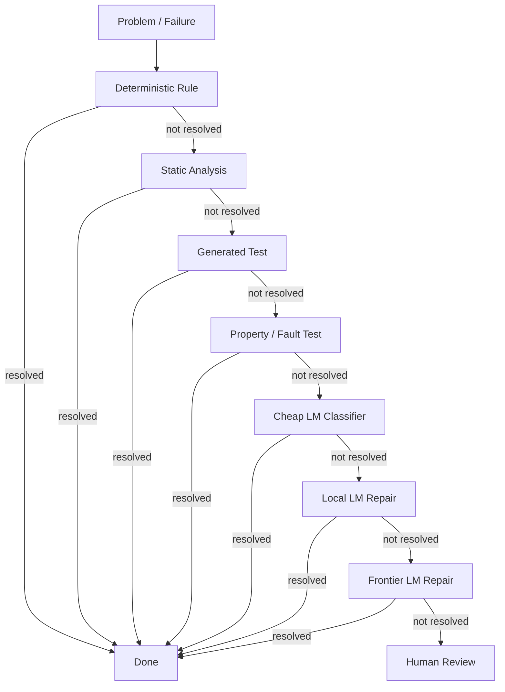

A frontier model is not the default engine.

It is the escalation path for ambiguity, novelty, or repeated failure.

---

## 12. AccessGraph as the Common Primitive

The deepest convergence is that several apparent systems collapse into one substrate primitive.

```text
identity
capabilities
session scope
effect ordering
credential authority
connector access
sandbox boundaries
proof tokens
runtime graph edges
spec projection edges
```

These are not parallel layers.

They are views over a governed graph.

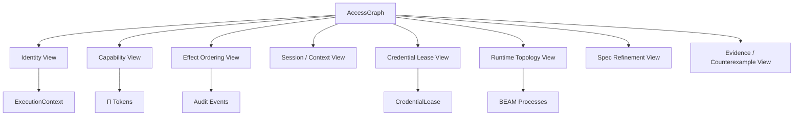

### Consequence

Capabilities replace personas.

Credentials become governed effects.

Session types become edge attributes.

Proof tokens become capability derivations.

Runtime topology becomes graph projection.

Spec-to-code traceability becomes graph refinement.

---

## 13. Context Is the Universal Runtime Primitive

“1:N everywhere” is not the primitive.

`ExecutionContext` is the primitive.

1:N emerges when the system stops assuming singleton context.

```elixir
%ExecutionContext{
  tenant_id: TenantId.t(),
  principal_id: PrincipalId.t(),
  session_id: SessionId.t(),
  actor_id: ActorId.t(),
  trace_id: TraceId.t(),
  causality_id: CausalityId.t(),
  capability_set_id: CapabilitySetId.t(),
  pi_head: Pi.Token.t(),
  governance_epoch: non_neg_integer(),
  trust_zone: :host | :connector | :sandbox | :external,
  boundary: BoundaryRef.t(),
  parent_context: ExecutionContext.id() | nil,
  delegation_depth: non_neg_integer(),
  metadata: map()
}
```

Every serious operation carries context:

```text
session creation
pool checkout
sandbox spawn
connector invocation
credential lease issuance
provider API call
CLI execution
telemetry emission
audit event
spec lowering operator
normalizer rewrite
acceptance decision
```

Defaults must be explicit but generated.

Bad:

```text
implicit singleton context hidden in config
```

Good:

```text
Citadel.start() returns a generated default context
```

Promotion to enterprise 1:N is then:

```text
pass different contexts
```

not:

```text
retrofit context into hidden globals
```

---

## 14. Credentials as Governed Effects

Credential handling is not a secret-storage subsystem.

It is a governed effect system.

A credentialed call is not:

```text
use API key
```

It is:

```text
actor A, in session S, under tenant T, using capability C,
performs operation O on resource R through connector K,
with Π-chain P, AccessGraph edge E, credential lease L,
inside boundary B, producing audit event Q.
```

### Credential Fabric

```text
CredentialFabric.Supervisor
├── CredentialAuthority
├── CredentialCatalog
├── LeaseIssuer
├── LeaseRegistry
├── RevocationIndex
├── SecretBackendSupervisor
├── MaterializerSupervisor
├── AuditSink
└── RedactionPolicy
```

### The central object is `CredentialLease`

```elixir
%CredentialLease{
  lease_id: LeaseId.t(),
  tenant_id: TenantId.t(),
  principal_id: PrincipalId.t(),
  session_id: SessionId.t(),
  actor_id: ActorId.t(),
  credential_handle: CredentialHandle.t(),
  capability_id: CapabilityId.t(),
  connector_id: ConnectorId.t(),
  operation: Operation.t(),
  resource: ResourceRef.t(),
  issued_at: DateTime.t(),
  expires_at: DateTime.t(),
  revocation_epoch: non_neg_integer(),
  pi_head: Pi.Token.t(),
  access_graph_edge: AccessGraph.EdgeId.t(),
  constraints: CredentialConstraints.t(),
  redeemable_by: ConnectorId.t() | ProxyId.t(),
  exportable?: false
}
```

The agent may hold a lease reference.

Only a trusted connector or materializer may redeem it.

The secret exists only at the final effect boundary.

---

## 15. Projection, Not Cache

Most code intelligence systems build a graph from code and treat it as a cache.

The living substrate inverts this.

```text
The graph is the source of engineering truth.
Code is a projection.
Specs are projections.
Tests are projections.
Runtime evidence is a projection.
```

For brownfield code, extraction bootstraps the graph.

For greenfield code, the graph constrains generation.

For ongoing development, graph deltas govern change.

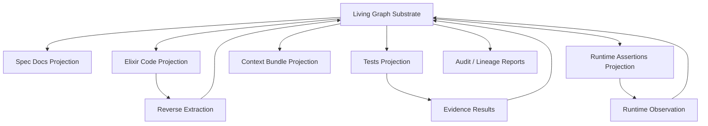

The graph may initially be incomplete.

But the direction of truth is clear.

Every artifact is either:

```text
1. a projection of the graph,
2. a proposed mutation to the graph,
3. evidence about the graph,
4. or rejected drift.
```

---

## 16. Living SpecCells

A SpecCell is not a static document.

It is a living node in the substrate.

It accumulates:

```text
spec declarations
implementation projections
evidence coverage
known counterexamples
normalization history
runtime observations
human decisions
operator performance
```

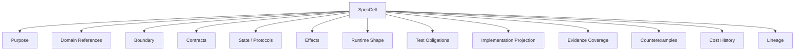

A mature SpecCell can answer:

```text
- What behavior does this own?
- What authority does it require?
- What effects may it perform?
- What runtime shape is admissible?
- What code currently implements it?
- What tests cover it?
- What failures has it produced historically?
- What normalizations have been accepted?
- What changes would violate it?
```

---

## 17. Living Acceptance

Acceptance is not a single gate.

Acceptance is a state with provenance.

```text
unseen
  -> candidate
  -> structurally_valid
  -> evidence_passing
  -> normal_form_passing
  -> adversarially_challenged
  -> accepted
  -> runtime_observed
  -> stale_or_refined
```

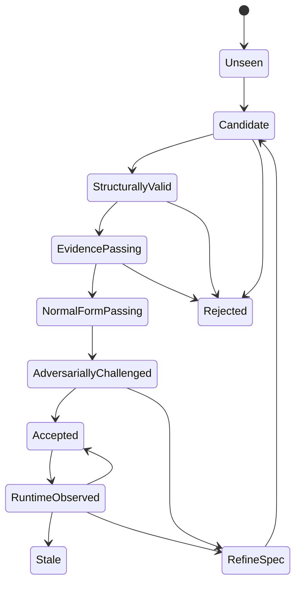

Accepted code can become stale when:

```text
- the spec changes,
- runtime evidence contradicts assumptions,
- new adversarial counterexamples appear,
- ENF policy evolves,
- dependencies change,
- Elixir/OTP version changes,
- domain model changes.
```

Living acceptance means the system knows when previously accepted code needs revalidation.

---

## 18. The Innovation in One Sentence

```text
A living substrate for AI software engineering where specs, code, runtime behavior,
evidence, and engineering judgment are continuously projected into shared graphs;
LLMs propose bounded mutations; deterministic and adversarial systems verify,
compress, and classify those mutations; and every failure evolves the harness.
```

---

## 19. The Innovation in Lab Language

Current coding agents optimize for producing plausible patches.

This system optimizes the **acceptance and normalization loop** around generated code.

It produces training-grade trajectories:

```text
spec -> candidate -> extracted graph -> violation -> rewrite -> evidence -> accepted normal form
```

The strategic contribution is not another agent.

It is a **data engine for engineering judgment**.

Every rejected abstraction, every failed invariant, every compression rewrite, every accepted normal form, and every adversarial counterexample becomes labeled supervision for future coding systems.

---

## 20. The Concrete Build Pivot

Do not build the whole living substrate at once.

Build the first living loop.

### MVP loop

```text
SpecCell
  -> Context Bundle
  -> Candidate Patch
  -> ImplementationGraph Extraction
  -> ENF Audit
  -> Evidence Run
  -> Normalization Report
  -> Lineage Record
  -> Rule/Test/Spec Update
```

### First commands

```bash
mix spec.audit
mix spec.bundle <cell>
mix spec.accept
mix spec.trace
```

### First five detectors

```text
1. GenServer without state ownership justification.
2. Behaviour with one implementation.
3. Public function without contract trace.
4. External effect without declaration.
5. Domain term absent from domain model.
```

### First proof slice

```text
Governed provider invocation through Credential Fabric + Connector Fabric.
```

### First adversarial suite

```text
agent cannot read provider credential
wrong connector cannot redeem lease
revoked lease cannot be redeemed
missing Π-chain fails
missing AccessGraph edge fails
provider call without audit fails
logs/telemetry/crash output contain no secret
```

### First quantitative claim

```text
Compared to naive AI-generated Elixir for the same slice, the harness produces
accepted BEAM-normal-form code with fewer modules, fewer public functions,
fewer unjustified OTP primitives, preserved behavior, and explicit traceability.
```

---

## 21. What Changes from the Static Architecture

| Static Architecture | Living Substrate |
|---|---|
| Pipeline stages | Nested feedback loops |
| Acceptance gate | Acceptance state machine |
| Specs as inputs | Specs as live graph nodes |
| Code extraction as audit step | Continuous reverse projection |
| ENF as style policy | ENF as evolving cost/evidence policy |
| Tests as final gate | Evidence graph with adversarial counterexamples |
| LM as implementation step | LM as bounded mutation operator |
| Reports as output | Judgment traces as product |
| Failure as repair prompt | Failure as rule/test/spec/operator update |
| Codebase as source of truth | Graph substrate as source of engineering truth |

---

## 22. Final Form

The living substrate eventually becomes:

```text
Spec compiler
+ implementation graph extractor
+ BEAM runtime observer
+ Engineering Normal Form normalizer
+ AccessGraph capability substrate
+ Credentialed effect fabric
+ StackLab adversary
+ lineage/judgment trace store
+ harness evolution engine
```

But the bootstrapping path is small:

```text
1. Build graph extraction.
2. Build five slop detectors.
3. Build context bundle compilation.
4. Build one governed credentialed connector slice.
5. Build lineage records.
6. Build one safe normalizer.
7. Let failures create the next rules.
```

The living system begins when the first failure becomes a rule instead of a note.

