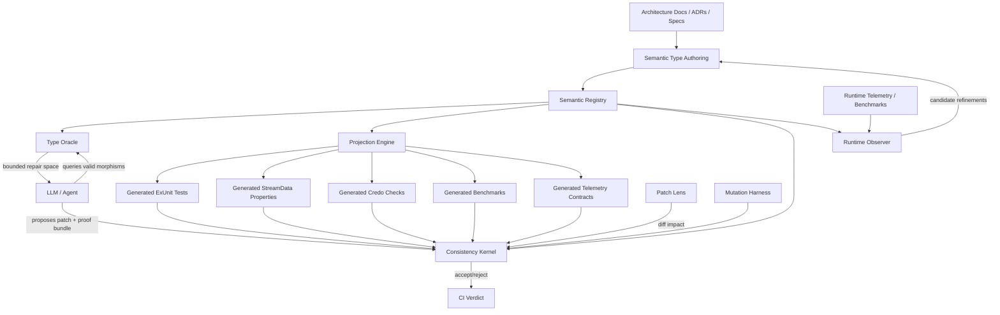
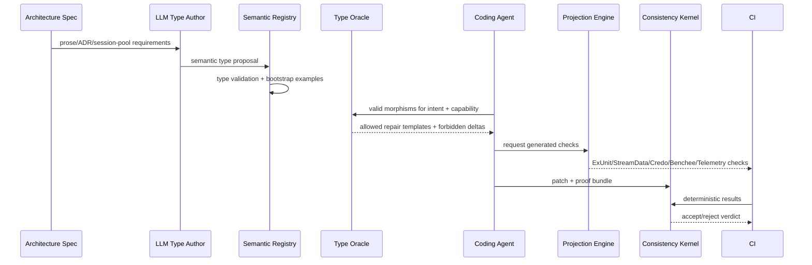

# System Overview

## Mission

Build an Elixir/OTP MVP that turns architecture into executable semantic types and uses those types to guide and verify autonomous code changes.

## Top-level architecture

## Major components

| Component | Responsibility |
|---|---|
| Semantic Registry | Stores typed semantic objects, IDs, relationships, aliases, versions |
| Type Oracle | Answers “what valid morphisms exist for this intent/capability?” |
| Projection Engine | Generates deterministic enforcement artifacts from semantic types |
| Consistency Kernel | Accepts/rejects patches based on proof bundles and checker results |
| Patch Lens | Maps source diffs to semantic objects and required checks |
| Mutation Harness | Proves semantic types/checks reject known-bad non-inhabitants |
| Runtime Observer | Maps telemetry/benchmarks back to semantic cost and observation types |
| Agent Gateway | Restricts agents by typed capability bundles and mediates oracle access |

## MVP dataflow

## MVP boundedness

The MVP does not attempt universal formal verification. It proves the loop for four semantic types:

1. `AgentCapabilityBundle`
2. `BoundaryProcess`
3. `SessionProtocol`
4. `HotPathOperation`

Each type must generate deterministic projections and have a mutation suite.
