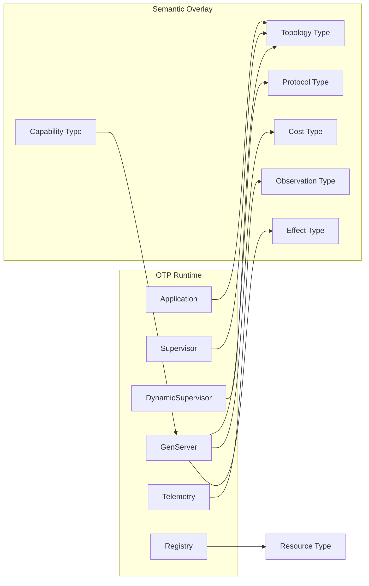
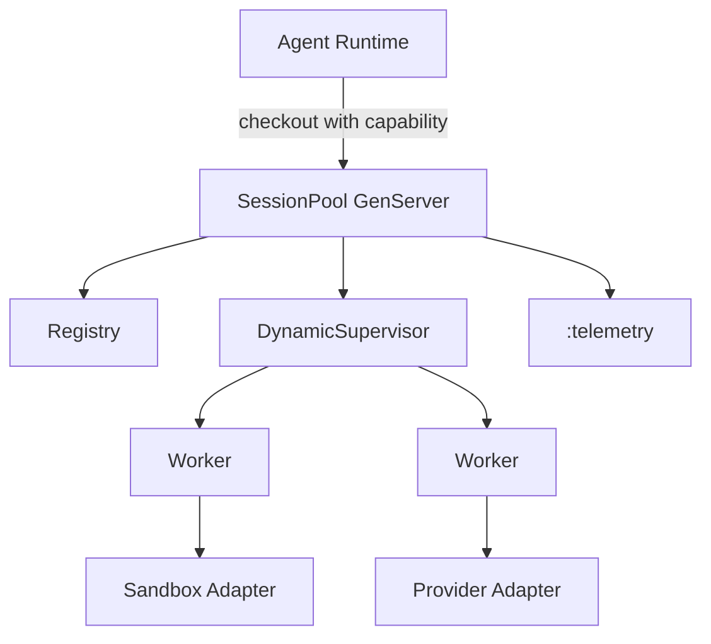

# Elixir/OTP Mapping

## Why OTP maps well

OTP already objectifies runtime architecture through processes, supervision trees, behaviours, callbacks, and message passing. The executable architecture layer adds explicit semantic types for capability, cost, protocol, and observation.

## Mapping table

| OTP concept | Semantic type role | Example invariant |
|---|---|---|
| `Application` | root topology object | starts all required supervisors |
| `Supervisor` | fault/restart topology | workers are supervised; restart strategy declared |
| `DynamicSupervisor` | bounded dynamic topology | no unsupervised spawn; max children bounded |
| `GenServer` | boundary process | all calls/casts are typed protocol transitions |
| `Registry` | identity/resource graph | lookup path does not scan global process list |
| `Task.Supervisor` | async effect boundary | tasks are supervised and time bounded |
| `:telemetry` | observation projection | required events emitted with required metadata |
| ExUnit | deterministic test projection | contract and invariant tests |
| StreamData | property projection | generated inputs and state-machine properties |
| Credo | static/pattern projection | forbidden effects, naming projection, unsafe APIs |
| Dialyzer/Dialyxir | success typing projection | type/spec sanity and unreachable code warnings |
| Benchee | empirical cost projection | benchmark calibration for cost types |

## Semantic type overlays

## MVP target domain

The example system is a `SessionPool` for agent execution:

## What the layer adds

OTP tells us *how* to structure fault-tolerant runtime components.

Executable architecture tells us:

- which agents may modify which components
- which messages are legal in which lifecycle state
- which effects are allowed in each operation
- what resource/cost envelope each operation must inhabit
- which observations prove runtime conformance
- which mutations the checks must reject
