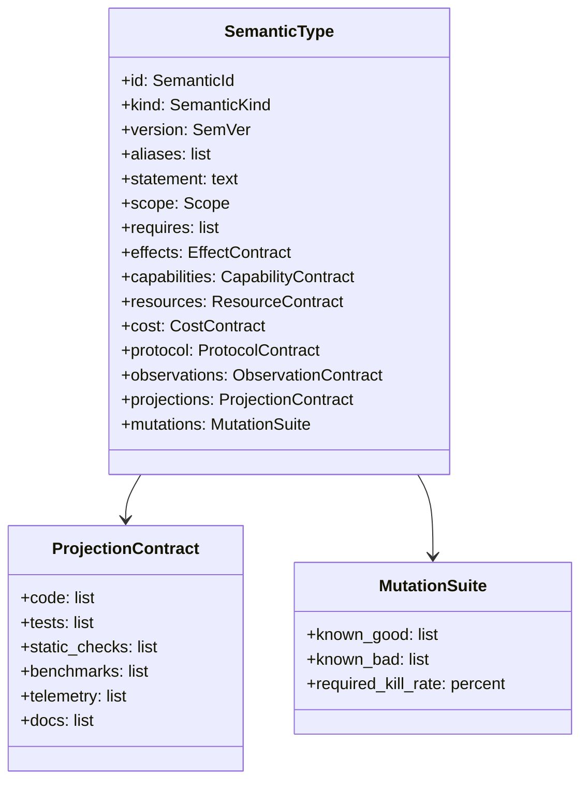

# Semantic Type System

## Design goal

Create a specification-first type layer above Elixir code. It is not a replacement for Elixir, Dialyzer, or ExUnit. It is a semantic contract system that generates and validates those projections.

## Type object schema



## Minimal DSL shape

```elixir
defmodule ArchEx.Types.SessionPool.Checkout do
  use ArchEx.SemanticType

  semantic_type "session_pool.checkout" do
    kind :hot_path_operation
    version "0.1.0"

    behavior do
      input "SessionId"
      output "WorkerRef"
      guarantees [:returns_available_worker, :does_not_create_unbounded_workers]
    end

    requires do
      capability "session.worker.checkout"
    end

    effects do
      allow :registry_lookup
      allow :worker_checkout
      allow :telemetry_emit
      forbid :db_write
      forbid :network_call
      forbid :unsupervised_spawn
    end

    resources do
      bound :mailbox_delta, max: 1
      bound :dynamic_children, max_ref: "config.session_pool.max_workers"
    end

    cost do
      asymptotic :constant, relative_to: :active_sessions
      p95 max_ms: 20
    end

    protocol do
      requires_state :session_open
      transitions from: :session_open, to: :worker_checked_out
    end

    observes do
      event [:archex, :session_pool, :checkout, :start]
      event [:archex, :session_pool, :checkout, :stop]
      event [:archex, :session_pool, :checkout, :exception]
    end

    derive_checks [:ex_unit, :stream_data, :credo, :telemetry, :benchee]
    derive_mutants [:remove_capability_check, :remove_telemetry, :add_network_call, :unbounded_spawn]
  end
end
```

## Type inhabitance

An implementation inhabits a semantic type when:

```text
implementation_effects     ⊆ allowed_effects
implementation_capabilities ⊇ required_capabilities
implementation_resources    ≤ resource_bounds
implementation_cost         ≤ cost_envelope
implementation_protocol     preserves protocol contract
implementation_observation  satisfies observation contract
```

## Versioning

Semantic types are versioned independently from code.

| Change | Version action |
|---|---|
| Strengthen invariant | patch/minor depending on breakage |
| Weaken invariant | major + migration proof |
| Add observation | minor if non-breaking |
| Change protocol | major |
| Change cost envelope | explicit calibration record |
| Add new projection | minor |

## Invalid type definitions

A semantic type is not authoritative until it passes bootstrap validation:

- accepts known-good implementations
- rejects known-bad implementations
- generated projection suite kills required mutants
- maps cleanly to code scope
- produces actionable oracle answers
