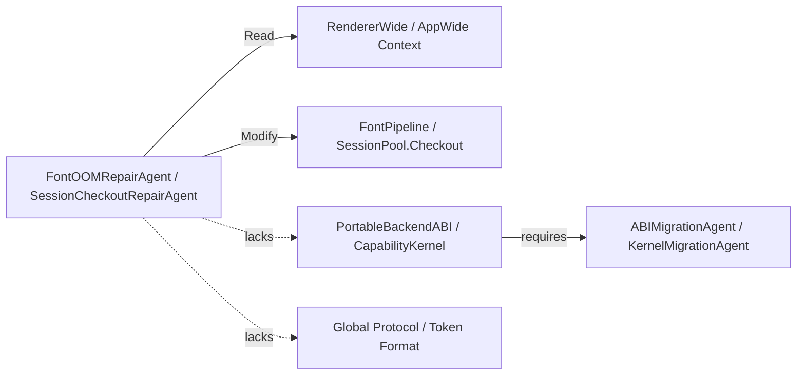
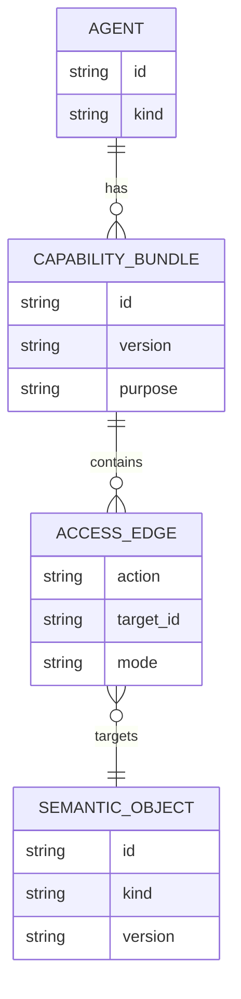

# Capability Bundles

## Core idea

Repair scope is an agent capability type.

A local repair agent should not be modeled only as “may edit these files.” It should be modeled as a typed authority bundle over semantic objects.

```text
CapabilityBundle<Agent> = Read × Modify × Execute × Delegate × ForbiddenModify
```

## Agent capability graph



## OTP capability example

```elixir
capability_bundle "agent.session_checkout_repair" do
  read do
    allow "session_pool.*"
    allow "capability.kernel"
    allow "runtime.telemetry"
  end

  modify do
    allow "session_pool.checkout"
    allow "session_pool.worker_selection"
    allow "session_pool.generated_tests"
  end

  forbidden_modify do
    deny "capability.kernel"
    deny "capability.derivation_rules"
    deny "semantic_type.capability_token"
    deny "runtime.auth_kernel"
    deny "memory_tier.boundary"
  end

  execute do
    allow "mix test"
    allow "mix archex.check"
    allow "mix archex.oracle"
  end
end
```

## Access relation



## Capability checks

The consistency kernel rejects a patch when:

```text
patch.modifies(object) AND NOT capability_bundle.permits_modify(object)
```

Read permission is intentionally broader than modify permission. Agents need context to avoid bad edits, but context is not authority.

## Capability escalation

If an agent needs to modify a forbidden object, it must produce a different semantic intent and request a different bundle.

Example:

```text
SessionCheckoutRepairAgent cannot modify CapabilityKernel.
CapabilityKernelMigrationAgent may modify CapabilityKernel, but must satisfy stronger projection obligations.
```

## Required projection checks

Capability bundles generate:

- static patch-scope checks
- diff-to-semantic-object mapping checks
- generated negative tests for forbidden mutations
- proof-bundle requirements
- oracle filtering of valid morphisms
