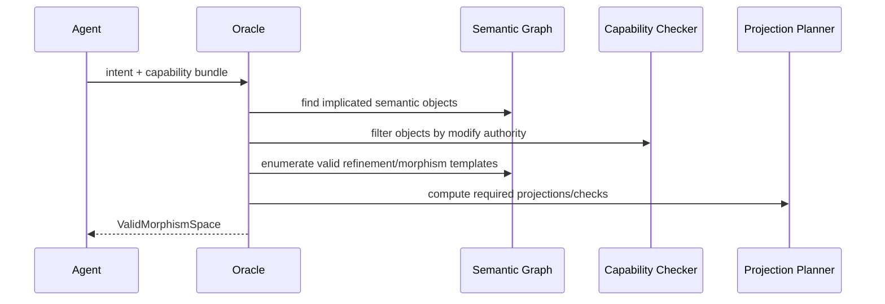
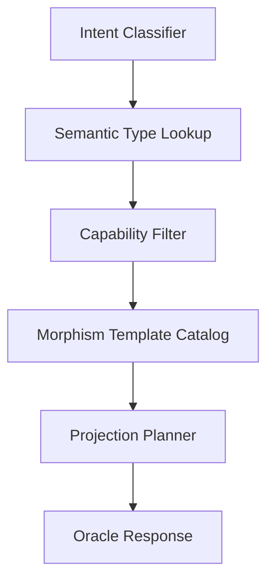

# Type Oracle

## Why queryability matters

A normal checker is reactive:

```text
Agent writes patch → checker fails patch
```

The type oracle is proactive:

```text
Agent declares intent + capability → oracle returns valid morphism space
```

The agent should generate inside the permitted semantic space rather than stumble into failure after writing code.

## Oracle contract

```text
oracle(intent, capability_bundle, current_semantic_graph) -> ValidMorphismSpace
```

The result includes:

- valid repair templates
- forbidden deltas
- required proof obligations
- required projections
- examples of valid inhabitants
- examples of invalid non-inhabitants

## Sequence



## Example query

```bash
mix archex.oracle valid_morphisms \
  --intent fix_session_checkout_timeout \
  --capability agent.session_checkout_repair \
  --target session_pool.checkout
```

## Example response

```yaml
intent: fix_session_checkout_timeout
capability: agent.session_checkout_repair
valid_morphisms:
  - id: add_timeout_handling_to_checkout
    modifies:
      - session_pool.checkout
    required_tests:
      - session_pool.checkout.timeout_property
      - session_pool.checkout.telemetry_contract
  - id: bound_worker_selection_retry
    modifies:
      - session_pool.worker_selection
    required_tests:
      - session_pool.worker_selection.retry_bound_property
forbidden_deltas:
  - modify capability.kernel
  - bypass capability check
  - spawn unsupervised worker
  - remove telemetry stop event
  - convert call protocol to unchecked cast
proof_obligations:
  - capability_preserved
  - protocol_preserved
  - p95_checkout_envelope_preserved
  - mailbox_growth_bound_preserved
```

## Oracle implementation strategy

The MVP oracle does not need full synthesis. It can be template-based:



## Morphism templates

| Template | Applies to | Example |
|---|---|---|
| Local validation refinement | boundary process / command | add input check before checkout |
| Timeout bound refinement | hot path operation | add bounded retry/backoff |
| Observation refinement | any operation | add required telemetry metadata |
| Effect narrowing | effectful operation | replace DB write with local ETS lookup |
| Protocol-preserving fix | session process | add transition guard without changing lifecycle |
| Cost-preserving repair | hot path | replace linear scan with registry lookup |

## Invalid morphism classes

| Invalid class | Reason |
|---|---|
| Unauthorized topology mutation | capability missing |
| Protocol reordering | session type violation |
| Cost expansion | cost type violation |
| Observation removal | observation type violation |
| Hidden effect addition | effect type violation |
| ABI/schema change | contract migration required |
