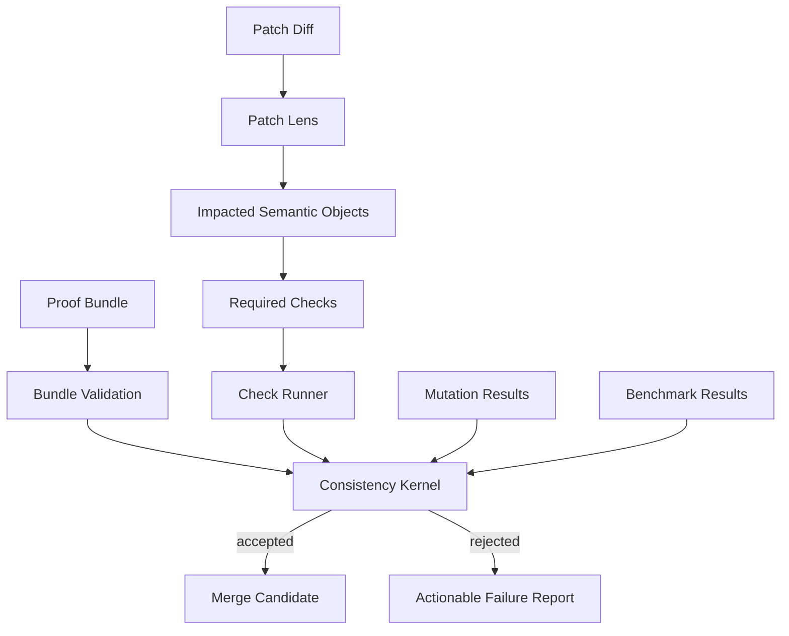

# Consistency Kernel

## Role

The consistency kernel is the deterministic court. It accepts or rejects patch proof bundles.

The LLM may propose code, tests, semantic types, and explanations. The consistency kernel decides whether the result satisfies executable architecture.

## Acceptance predicate

```text
accept(Δ) =
  well_typed(SemanticGraph_after)
  ∧ capability_authorized(Δ)
  ∧ projection_complete(implicated_types)
  ∧ invariant_checks_pass(implicated_types)
  ∧ mutants_killed(implicated_types)
  ∧ cost_envelopes_satisfied(implicated_hot_paths)
  ∧ telemetry_contracts_satisfied(implicated_observations)
  ∧ proof_bundle_complete(Δ)
```

## Kernel flow



## Proof bundle schema

```yaml
patch_id: patch_001
intent: fix_session_checkout_timeout
agent_capability: agent.session_checkout_repair
semantic_delta:
  modifies:
    - session_pool.checkout
  preserves:
    - capability.kernel
    - session.protocol
    - session_pool.checkout.cost
implicated_types:
  - session_pool.checkout
  - session_pool.protocol
  - agent.session_checkout_repair
checks:
  ex_unit:
    passed: true
  stream_data:
    passed: true
  credo:
    passed: true
  telemetry_contract:
    passed: true
  benchee:
    passed: true
mutations:
  killed:
    - remove_capability_check
    - remove_checkout_stop_telemetry
    - unbounded_spawn
  survived: []
observations:
  p95_checkout_ms: 12.3
  mailbox_depth_max: 3
verdict_request: accept
```

## Failure report format

```yaml
verdict: rejected
reasons:
  - type: capability_violation
    object: capability.kernel
    detail: patch modifies forbidden semantic object
  - type: observation_violation
    object: session_pool.checkout
    detail: missing telemetry event [:archex, :session_pool, :checkout, :stop]
  - type: mutation_survived
    mutant: remove_capability_check
    detail: generated tests did not detect removed capability check
suggested_oracle_query:
  mix archex.oracle valid_morphisms --intent fix_session_checkout_timeout --capability agent.session_checkout_repair
```

## Kernel invariants

The kernel must itself be small, deterministic, and boring.

- no LLM calls
- no heuristic verdicts
- explicit inputs/outputs
- reproducible check execution
- auditable proof bundles
- signed semantic graph version
- signed capability bundle version
