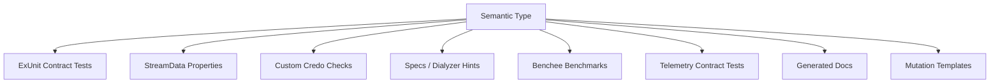

# Projection Engine

## Purpose

The projection engine compiles semantic types into deterministic enforcement artifacts.

```text
SemanticType → Code/Test/Static/Benchmark/Telemetry/Docs/Mutation projections
```

## Projection map



## Projection contract by semantic kind

| Semantic kind | Required projections |
|---|---|
| `capability_bundle` | patch-scope check, negative mutation, oracle filter |
| `boundary_process` | GenServer callback contract tests, supervision tests, telemetry tests |
| `protocol` | state-machine property tests, invalid transition mutations |
| `hot_path_operation` | Credo/static checks, Benchee benchmark, telemetry duration check |
| `effect_contract` | forbidden call checks, property tests for effect absence |
| `observation_contract` | telemetry attach/assert tests |
| `resource_contract` | process/mailbox/ETS bounds tests |

## Example generated artifacts

For `session_pool.checkout`, generate:

```text
test/generated/session_pool/checkout_contract_test.exs
test/generated/session_pool/checkout_property_test.exs
lib/credo/check/archex/session_pool_checkout_effects.ex
bench/session_pool_checkout_bench.exs
test/generated/session_pool/checkout_telemetry_test.exs
priv/archex/mutations/session_pool_checkout_mutants.exs
```

## Generated ExUnit example

```elixir
defmodule Generated.SessionPool.CheckoutContractTest do
  use ExUnit.Case

  test "checkout requires session.worker.checkout capability" do
    session = Fixtures.session_open()
    denied = CapabilityBundle.empty()

    assert {:error, :unauthorized} = SessionPool.checkout(session.id, denied)
  end
end
```

## Generated StreamData example

```elixir
defmodule Generated.SessionPool.CheckoutPropertyTest do
  use ExUnit.Case
  use ExUnitProperties

  property "checkout/checkin preserves bounded pool resource envelope" do
    check all commands <- Generators.session_commands() do
      result = SessionPool.Model.run(commands)
      assert result.max_workers <= Config.session_pool_max_workers()
      assert result.max_mailbox_delta <= 1
    end
  end
end
```

## Generated Credo check example

A hot path that forbids network calls should generate a check over impacted files:

```elixir
defmodule Credo.Check.ArchEx.NoNetworkCallInCheckout do
  use Credo.Check,
    category: :warning,
    base_priority: :high,
    explanations: [check: "session_pool.checkout forbids network calls"]

  def run(source_file, params) do
    issue_meta = IssueMeta.for(source_file, params)

    Credo.Code.prewalk(source_file, &traverse(&1, &2, issue_meta))
  end

  defp traverse({{:., _, [{:__aliases__, _, [:HTTPoison]}, _fun]}, meta, _args} = ast, issues, issue_meta) do
    issue = format_issue(issue_meta, message: "Network call forbidden in session_pool.checkout", line_no: meta[:line])
    {ast, [issue | issues]}
  end

  defp traverse(ast, issues, _issue_meta), do: {ast, issues}
end
```

## Generated Benchee example

```elixir
Benchee.run(
  %{
    "session_pool.checkout" => fn ->
      {:ok, worker} = SessionPool.checkout(Fixtures.session_id(), Fixtures.checkout_capability())
      SessionPool.checkin(worker)
    end
  },
  time: 5,
  memory_time: 2,
  save: [path: "bench/results/session_pool_checkout.benchee"]
)
```

## Projection idempotence

Generated files should include source semantic type ID and hash:

```elixir
# Generated by ArchEx
# semantic_type: session_pool.checkout
# semantic_type_hash: sha256:...
# DO NOT EDIT MANUALLY
```

If the semantic type changes, projections are regenerated and diffs are reviewed by the kernel.
