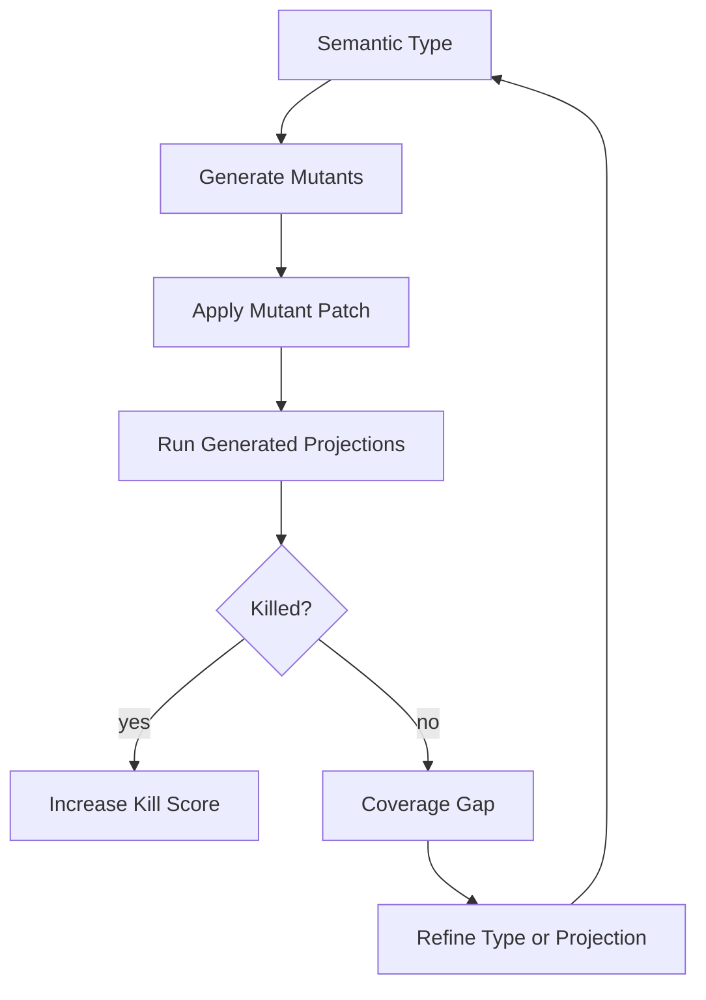

# Mutation Harness

## Purpose

Mutation testing proves that semantic types and generated projections actually reject known-bad changes.

Without mutation testing, a semantic type may be elegant but toothless.

## Two mutation levels

| Level | Question |
|---|---|
| Projection mutation | Do generated tests/checks catch bad implementation changes? |
| Semantic type mutation | Does the semantic type definition reject known-bad/accept known-good examples? |

## Mutation loop



## MVP mutation classes

| Mutant | Expected detection |
|---|---|
| remove capability check | ExUnit contract + property |
| add forbidden network call | Credo check |
| remove telemetry stop event | telemetry contract test |
| spawn unsupervised process | Credo/topology check |
| make checkout scan all sessions | cost/property/benchmark check |
| permit execute before checkout | protocol property test |
| remove checkin transition | state-machine property test |
| widen agent modify scope | capability bundle validation |

## Example mutation definition

```elixir
defmodule ArchEx.Mutations.RemoveCapabilityCheck do
  @behaviour ArchEx.Mutation

  def id, do: :remove_capability_check
  def targets, do: ["lib/session_pool.ex"]

  def apply(source) do
    String.replace(source, "with :ok <- Capability.require!(cap, :checkout) do", "with :ok <- :ok do")
  end

  def expected_killers do
    [
      "test/generated/session_pool/checkout_contract_test.exs",
      "test/generated/session_pool/checkout_property_test.exs"
    ]
  end
end
```

## Type authority gate

A semantic type enters `trusted` status only when:

```text
known_good_acceptance_rate = 100%
known_bad_rejection_rate = 100%
required_mutation_kill_rate ≥ configured_threshold
projection_generation_success = true
oracle_response_actionable = true
```

## Mutation score report

```yaml
semantic_type: session_pool.checkout
version: 0.1.0
mutants:
  total: 8
  killed: 8
  survived: 0
kill_rate: 100%
trusted: true
```

## Bootstrap implication

The LLM may propose semantic types, but types are not trusted until they survive this harness. This is the answer to the bootstrap problem.
