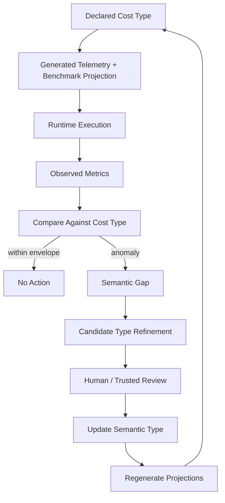

# Runtime Observer and Cost-Type Calibration

## Purpose

Runtime observations close the loop between declared semantic cost types and actual behavior.

Telemetry is not only monitoring. It is the calibration channel for cost-refined semantics.

## Feedback loop



## Observation type

```elixir
observation_contract "session_pool.checkout.observation" do
  event [:archex, :session_pool, :checkout, :start] do
    metadata [:session_id, :agent_id]
  end

  event [:archex, :session_pool, :checkout, :stop] do
    measurements [:duration]
    metadata [:session_id, :agent_id, :worker_id, :pool_size]
  end

  event [:archex, :session_pool, :checkout, :exception] do
    measurements [:duration]
    metadata [:session_id, :agent_id, :reason]
  end
end
```

## Runtime anomaly example

```yaml
semantic_type: session_pool.checkout
expected:
  p95_ms: <= 20
  mailbox_depth_max: <= 5
observed:
  p95_ms: 67
  mailbox_depth_max: 4
  allocation_delta: normal
classification: cost_anomaly_without_resource_growth
candidate_refinements:
  - add contention_cost_term
  - add scheduler_pressure_observation
  - add registry_lookup_cardinality_metric
```

## Cost-type refinement workflow

1. Detect anomaly.
2. Attach trace/telemetry evidence to semantic type.
3. Generate candidate refinement.
4. Require human or trusted maintainer confirmation.
5. Update semantic type.
6. Regenerate benchmark thresholds, telemetry metadata, and mutation cases.
7. Record ADR.

## Required runtime events for MVP

| Event | Purpose |
|---|---|
| `[:archex, :session_pool, :checkout, :start]` | duration start |
| `[:archex, :session_pool, :checkout, :stop]` | p95 latency, pool size, worker ID |
| `[:archex, :session_pool, :checkout, :exception]` | failed checkout timing |
| `[:archex, :kernel, :verdict, :stop]` | consistency-kernel decision timing |
| `[:archex, :oracle, :query, :stop]` | oracle performance and query class |
| `[:archex, :mutation, :run, :stop]` | mutation harness cost and kill rate |

## Runtime observer must not auto-weaken types

Observation can propose refinements. It must not automatically loosen performance contracts. Cost type drift without review would make the system unsafe.
