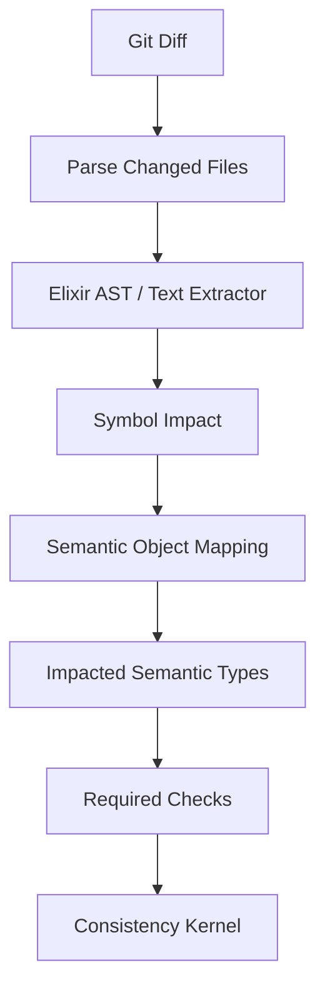

# Patch Lens

## Purpose

Patch Lens maps code diffs to semantic objects and required checks.

A patch touches files and symbols. The kernel needs to know which semantic types those changes implicate.

## Flow



## Inputs

- git diff
- semantic registry
- code projection metadata
- generated-file headers
- module-to-semantic-object index
- capability bundle

## Outputs

```yaml
patch_id: patch_001
changed_files:
  - lib/session_pool.ex
changed_symbols:
  - SessionPool.checkout/2
semantic_objects:
  - session_pool.checkout
  - session_pool.protocol
  - session_pool.observation
required_checks:
  - generated.session_pool.checkout_contract
  - generated.session_pool.checkout_property
  - credo.no_forbidden_effects.session_pool.checkout
  - telemetry.session_pool.checkout
  - benchee.session_pool.checkout
```

## Mapping strategies

| Strategy | MVP support |
|---|---|
| Generated projection header | yes |
| Module attribute annotation | yes |
| DSL-declared path scope | yes |
| AST symbol extraction | partial |
| Call graph impact | later |
| Runtime trace impact | later |

## Example annotation

```elixir
defmodule SessionPool do
  @archex_semantic_object "session_pool"

  @archex_operation "session_pool.checkout"
  def checkout(session_id, capability_bundle) do
    ...
  end
end
```

## Path scope fallback

```yaml
semantic_object: session_pool.checkout
scope:
  files:
    - lib/session_pool.ex
    - lib/session_pool/**/*.ex
  functions:
    - SessionPool.checkout/2
```

## Risk levels

| Patch impact | Risk |
|---|---|
| generated test only | low |
| local operation implementation | medium |
| boundary process callbacks | medium/high |
| capability kernel | critical |
| semantic type definition | critical |
| consistency kernel | critical |

Critical changes require stronger mutation and proof-bundle obligations even in the MVP.
