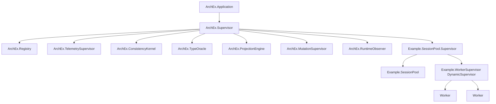

# OTP Supervision Topology

## MVP supervision tree



## Component process model

| Process | Kind | Restart | Role |
|---|---|---|---|
| `ArchEx.Registry` | Registry | permanent | semantic object/process lookup |
| `ConsistencyKernel` | GenServer | permanent | deterministic verdict state and audit log |
| `TypeOracle` | GenServer | permanent | query valid morphism space |
| `ProjectionEngine` | GenServer/Task supervisor | permanent | generate check artifacts |
| `MutationSupervisor` | Task.Supervisor | permanent | run isolated mutation tasks |
| `RuntimeObserver` | GenServer | permanent | aggregate telemetry and calibration events |
| `Example.SessionPool` | GenServer | permanent | MVP target boundary process |
| `Example.WorkerSupervisor` | DynamicSupervisor | permanent | managed workers |

## Kernel isolation

The consistency kernel should not execute arbitrary generated code directly. It should receive signed results from bounded check runners.


## Supervision invariants

- no unsupervised long-lived processes
- mutation tasks are supervised and time bounded
- check runners have timeout and resource limits
- runtime observer failure does not accept bad patches
- kernel state is recoverable from audit log

## MVP child spec sketch

```elixir
children = [
  {Registry, keys: :unique, name: ArchEx.Registry},
  ArchEx.ConsistencyKernel,
  ArchEx.TypeOracle,
  ArchEx.ProjectionEngine,
  {Task.Supervisor, name: ArchEx.MutationSupervisor},
  ArchEx.RuntimeObserver,
  Example.SessionPool.Supervisor
]

Supervisor.start_link(children, strategy: :one_for_one)
```
