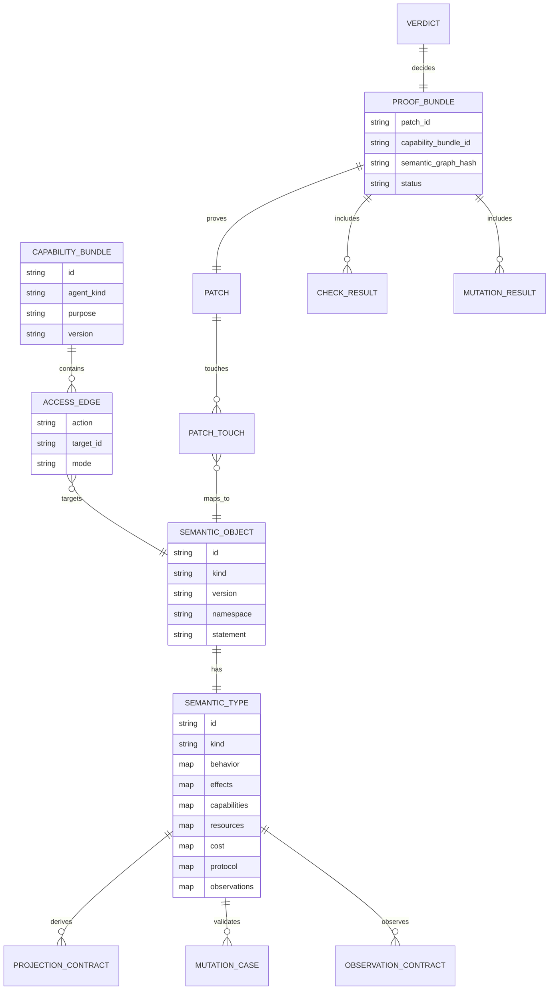

# Data Model

## Entity relationship diagram



## Core structs

```elixir
defmodule ArchEx.Core.SemanticObject do
  @type t :: %__MODULE__{
    id: String.t(),
    kind: atom(),
    version: Version.t(),
    aliases: [String.t()],
    statement: String.t(),
    scope: map()
  }

  defstruct [:id, :kind, :version, aliases: [], statement: "", scope: %{}]
end
```

```elixir
defmodule ArchEx.Core.SemanticType do
  @type t :: %__MODULE__{
    id: String.t(),
    kind: atom(),
    behavior: map(),
    effects: map(),
    capabilities: map(),
    resources: map(),
    cost: map(),
    protocol: map(),
    observations: map(),
    projections: [map()],
    mutations: [map()]
  }

  defstruct [
    :id,
    :kind,
    behavior: %{},
    effects: %{},
    capabilities: %{},
    resources: %{},
    cost: %{},
    protocol: %{},
    observations: %{},
    projections: [],
    mutations: []
  ]
end
```

## Semantic ID rules

IDs are deterministic handles into semantic space:

```text
<domain>.<component>.<kind>.<concept>
```

Examples:

```text
session_pool.operation.checkout
session_pool.protocol.lifecycle
agent.capability.session_checkout_repair
kernel.capability.derivation_rules
runtime.observation.session_pool_checkout
```

Names are projections. IDs are identity.

## Semantic graph hash

Every proof bundle should record the semantic graph hash:

```text
sha256(canonical_json(semantic_graph))
```

This makes verdicts reproducible.
