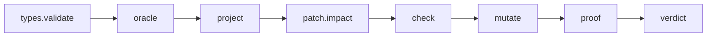

# Mix Tasks and CLI

## MVP tasks

| Task | Purpose |
|---|---|
| `mix archex.types.validate` | validate semantic type files |
| `mix archex.oracle` | query valid morphism space |
| `mix archex.project` | generate projections from semantic types |
| `mix archex.patch.impact` | map git diff to semantic objects |
| `mix archex.check` | run required checks for impacted types |
| `mix archex.mutate` | run mutation suite |
| `mix archex.bench` | run generated/impacted benchmarks |
| `mix archex.proof` | assemble proof bundle |
| `mix archex.verdict` | invoke consistency kernel over proof bundle |

## Example commands

```bash
mix archex.types.validate priv/semantic_types
```

```bash
mix archex.oracle valid_morphisms \
  --intent fix_session_checkout_timeout \
  --capability agent.session_checkout_repair \
  --target session_pool.operation.checkout
```

```bash
mix archex.project --type session_pool.operation.checkout
```

```bash
mix archex.patch.impact --diff origin/main...HEAD
```

```bash
mix archex.mutate --impacted --diff origin/main...HEAD
```

```bash
mix archex.proof --patch patch_001 --out priv/archex/proofs/patch_001.yaml
```

```bash
mix archex.verdict priv/archex/proofs/patch_001.yaml
```

## CLI lifecycle



## Exit codes

| Code | Meaning |
|---|---|
| `0` | success / accepted |
| `1` | deterministic check failure |
| `2` | semantic type validation failure |
| `3` | capability violation |
| `4` | mutation survived |
| `5` | cost envelope failure |
| `6` | proof bundle invalid |
| `7` | internal error |

## Output modes

- human-readable console
- JSON
- YAML proof bundle
- GitHub Actions annotations
- JUnit XML for CI integration
