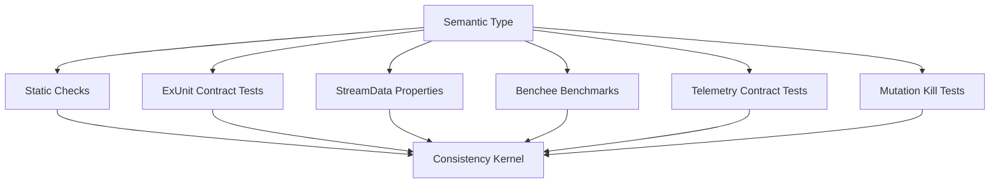

# Generated Testing Strategy

## Testing layers



## ExUnit contract tests

Use for direct examples and clear negative cases.

Generated examples:

- unauthorized action returns `{:error, :unauthorized}`
- missing session returns `{:error, :not_found}`
- valid checkout returns supervised worker
- telemetry events emitted around operation

## StreamData properties

Use for state and protocol spaces.

Properties:

- cannot execute before checkout
- every checkout must be eventually checked in or timed out
- worker count never exceeds bound
- session HLC/order field is monotonic if included
- invalid capability is never accepted

## Credo checks

Use for static/pattern violations.

Generated checks:

- no `spawn`/`spawn_link` in modules requiring supervised workers
- no network call inside declared hot path
- no DB write inside pure/effect-limited operation
- no direct mutation of capability kernel from local repair scope
- no removal of generated telemetry call marker

## Dialyzer/Dialyxir role

Dialyzer is not the semantic type system. Use it as a projection for ordinary BEAM type sanity:

- specs generated from semantic type input/output
- unreachable code warnings
- type mismatch warnings
- behaviour callback mismatches

## Benchee role

Benchee calibrates empirical cost types.

Generated benchmark stubs should:

- isolate the operation
- set up controlled fixtures
- save baseline results
- compare impacted patches to baseline
- report p95 or available statistics according to benchmark configuration

## Telemetry contract tests

Generated tests should attach a handler and assert event shape:

```elixir
test "checkout emits telemetry start/stop" do
  parent = self()
  handler_id = "checkout-test-#{System.unique_integer()}"

  :telemetry.attach_many(
    handler_id,
    [
      [:archex, :session_pool, :checkout, :start],
      [:archex, :session_pool, :checkout, :stop]
    ],
    fn event, measurements, metadata, _ ->
      send(parent, {:telemetry, event, measurements, metadata})
    end,
    nil
  )

  try do
    assert {:ok, worker} = SessionPool.checkout(Fixtures.session_id(), Fixtures.checkout_capability())
    assert_receive {:telemetry, [:archex, :session_pool, :checkout, :start], _, _}
    assert_receive {:telemetry, [:archex, :session_pool, :checkout, :stop], %{duration: _}, metadata}
    assert Map.has_key?(metadata, :session_id)
    SessionPool.checkin(worker)
  after
    :telemetry.detach(handler_id)
  end
end
```

## Mutation coverage as coverage metric

Line coverage is secondary. The primary metric is:

```text
invariant_mutation_kill_rate
```

A semantic type is inadequately covered if known-bad mutations survive.
