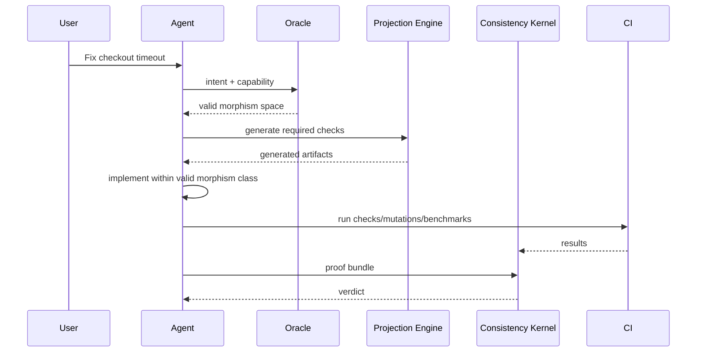
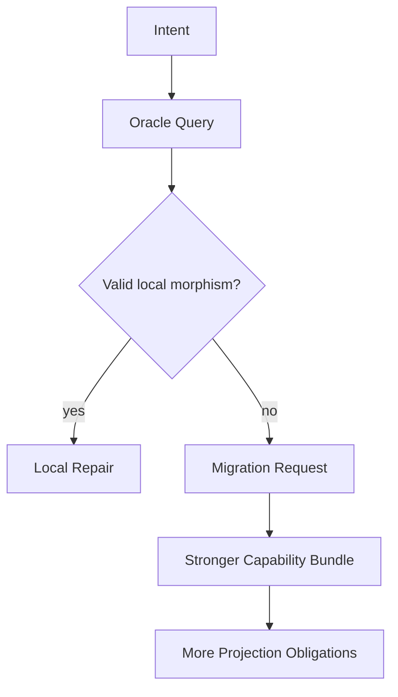

# Agent Workflow

## Principle

The agent should query the type oracle before editing. It should not discover semantic invalidity only after patch generation.

## Workflow



## Agent prompt contract

Agents receive:

```yaml
intent: fix_session_checkout_timeout
capability_bundle: agent.session_checkout_repair
semantic_graph_hash: sha256:...
required_oracle_query: true
allowed_outputs:
  - patch
  - generated tests
  - proof bundle
forbidden:
  - edit without oracle response
  - modify forbidden semantic object
  - skip mutation suite
  - claim correctness without kernel verdict
```

## Agent lifecycle

1. Read issue.
2. Classify intent.
3. Query oracle.
4. Choose valid morphism template.
5. Generate or request projections.
6. Implement patch.
7. Run local checks.
8. Assemble proof bundle.
9. Submit to kernel.
10. Revise on deterministic failure.

## Failure behavior

If the oracle returns no valid morphism, the agent must not improvise architecture changes. It should produce:

```yaml
status: blocked_by_semantic_type
reason: no valid morphism under current capability bundle
required_capability:
  - capability.kernel_migration
  - session_protocol_migration
```

## Local repair vs migration



## Agent output example

```yaml
chosen_morphism: bound_checkout_retry
reason: local timeout repair preserving session protocol
modified_objects:
  - session_pool.operation.checkout
preserved_objects:
  - capability.kernel
  - session.protocol.lifecycle
  - session_pool.cost.checkout
checks_run:
  - mix test test/generated/session_pool
  - mix credo --strict
  - mix archex.mutate --impacted
```
