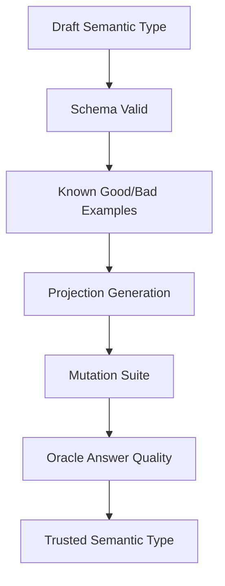

# Bootstrap Validation

## Problem

If the LLM translates architecture prose into semantic types incorrectly, all generated enforcement artifacts may be wrong. Therefore semantic types must be validated before they are trusted.

## Trust ladder



## Status levels

| Status | Meaning |
|---|---|
| `draft` | loaded but not enforceable |
| `schema_valid` | parses and validates structurally |
| `example_validated` | accepts known-good, rejects known-bad |
| `projection_validated` | generated artifacts compile/run |
| `mutation_validated` | required mutants killed |
| `trusted` | can be used in CI verdicts |

## Known-good / known-bad examples

For `session_pool.checkout`:

```yaml
known_good:
  - local_timeout_guard
  - bounded_retry
  - add_missing_stop_telemetry
  - improve_registry_lookup_without_protocol_change
known_bad:
  - remove_capability_check
  - bypass_session_state
  - spawn_unsupervised_worker
  - add_network_call_to_checkout
  - remove_stop_telemetry
  - make_worker_count_unbounded
```

## Bootstrap command

```bash
mix archex.types.bootstrap session_pool.operation.checkout
```

Expected output:

```yaml
semantic_type: session_pool.operation.checkout
status: trusted
known_good:
  accepted: 4
  rejected: 0
known_bad:
  rejected: 6
  accepted: 0
mutants:
  killed: 6
  survived: 0
oracle:
  valid_morphism_templates: 4
  forbidden_deltas: 6
```

## Bootstrap failure examples

| Failure | Meaning | Action |
|---|---|---|
| known-good rejected | type too strict | refine type or example |
| known-bad accepted | type too weak | add invariant/projection |
| mutant survived | generated checks insufficient | improve projection/mutation |
| oracle returns vague results | template catalog insufficient | add morphism templates |
| generated code does not compile | generator bug | fix generator |

## Meta-invariant

No semantic type can enforce production changes until it validates itself against adversarial examples.
