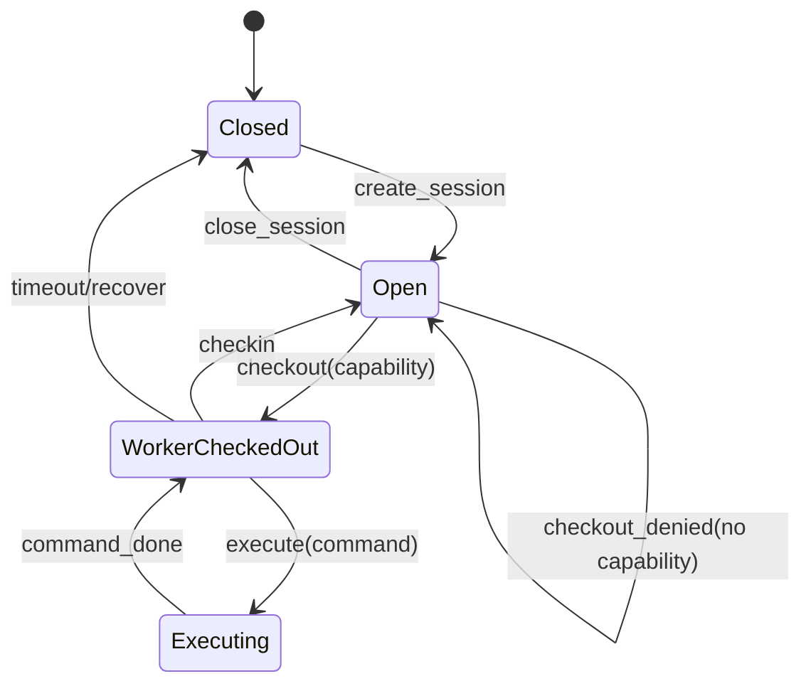

# End-to-End Example: SessionPool

## Scenario

An autonomous agent is asked to fix checkout timeouts in a supervised session worker pool.

The dangerous bad patch would bypass capability checks or spawn unsupervised workers. The executable architecture layer should reject those deterministically.

## Runtime sketch



## Semantic types involved

```text
agent.capability.session_checkout_repair
session_pool.boundary
session_pool.protocol.lifecycle
session_pool.operation.checkout
session_pool.observation.checkout
session_pool.cost.checkout
```

## Valid morphism

```yaml
id: bound_checkout_retry
intent: fix_session_checkout_timeout
modifies:
  - session_pool.operation.checkout
preserves:
  - capability.kernel
  - session_pool.protocol.lifecycle
  - session_pool.cost.checkout
  - session_pool.observation.checkout
```

## Invalid morphisms

```yaml
invalid:
  - id: bypass_capability_check
    violates: capability_contract
  - id: spawn_unsupervised_worker
    violates: topology_resource_contract
  - id: convert_checkout_to_untracked_cast
    violates: protocol_observation_contract
  - id: remove_checkout_stop_telemetry
    violates: observation_contract
  - id: scan_all_sessions_on_checkout
    violates: cost_type
```

## Oracle response

```yaml
valid_morphisms:
  - bound_retry
  - local_timeout_guard
  - worker_selection_backoff
  - telemetry_preserving_error_path
forbidden_deltas:
  - modify capability.kernel
  - remove Capability.require!
  - call spawn/spawn_link directly
  - add external network call
  - remove checkout telemetry stop event
required_checks:
  - session_pool.checkout_contract_test
  - session_pool.checkout_property_test
  - credo.no_unsupervised_spawn
  - credo.no_network_call_in_checkout
  - telemetry.checkout_contract_test
  - benchee.session_pool_checkout
  - mutation.remove_capability_check
  - mutation.unsupervised_spawn
```

## Acceptance report

```yaml
verdict: accepted
patch: bound_checkout_retry
semantic_graph_hash: sha256:example
capability_authorized: true
projection_complete: true
checks_passed: true
mutants_killed: 6/6
cost_envelope:
  p95_ms: 13.1
  max_ms: 20
observations_satisfied: true
```
