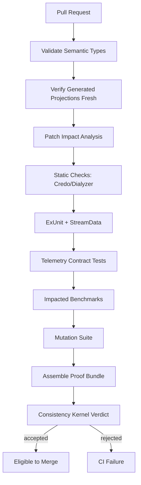

# CI Pipeline

## Pipeline overview



## Required CI commands

```bash
mix deps.get
mix compile --warnings-as-errors
mix archex.types.validate
mix archex.project --check
mix archex.patch.impact --diff origin/main...HEAD --out priv/archex/impact.yaml
mix test
mix credo --strict
mix dialyzer
mix archex.telemetry.check --impacted
mix archex.bench --impacted --compare-baseline
mix archex.mutate --impacted
mix archex.proof --impact priv/archex/impact.yaml --out priv/archex/proof.yaml
mix archex.verdict priv/archex/proof.yaml
```

## CI gates

| Gate | Required for MVP? |
|---|---|
| semantic type validation | yes |
| projection freshness | yes |
| ExUnit | yes |
| StreamData | yes |
| Credo | yes |
| Dialyzer | optional in first demo, recommended |
| Benchee impacted benchmarks | yes for hot paths |
| mutation suite | yes |
| proof bundle | yes |
| consistency verdict | yes |

## Benchmark stability

Benchmarks are noisy. MVP policy:

- static resource-shape violations fail immediately
- empirical benchmark failures create either CI failure or quarantine depending on project mode
- baseline updates require cost-type calibration record
- repeated anomalies create refinement candidates

## GitHub Actions sketch

```yaml
name: archex-ci
on: [pull_request]

jobs:
  archex:
    runs-on: ubuntu-latest
    steps:
      - uses: actions/checkout@v4
        with:
          fetch-depth: 0
      - uses: erlef/setup-beam@v1
        with:
          otp-version: '27'
          elixir-version: '1.18'
      - run: mix deps.get
      - run: mix compile --warnings-as-errors
      - run: mix archex.types.validate
      - run: mix archex.project --check
      - run: mix archex.patch.impact --diff origin/main...HEAD --out priv/archex/impact.yaml
      - run: mix test
      - run: mix credo --strict
      - run: mix archex.mutate --impacted
      - run: mix archex.proof --impact priv/archex/impact.yaml --out priv/archex/proof.yaml
      - run: mix archex.verdict priv/archex/proof.yaml
```

Adjust versions to project policy; do not hard-code them into the semantic model.
