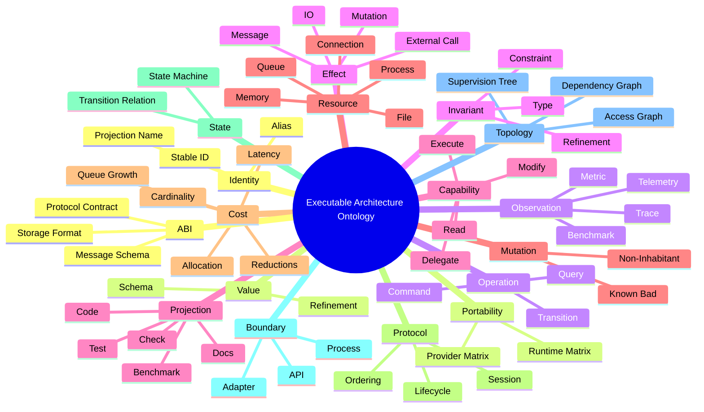

# Universal Semantic Ontology

The ontology should be universal. Platform-specific systems instantiate it; they do not fork it.

## Universal kinds

## Elixir/OTP instantiation

| Universal kind | OTP instance |
|---|---|
| Identity | semantic IDs, module names, telemetry event IDs |
| Value | structs, Ecto schemas, protocol payloads |
| Operation | `GenServer.call`, command handler, job execution |
| Effect | DB write, file IO, network call, telemetry emit |
| Capability | token authorizing an action or patch scope |
| Resource | process, mailbox, ETS table, connection, memory |
| Cost | p95 latency, reductions, memory, queue depth |
| Protocol | session lifecycle, checkout/checkin, worker state |
| State | GenServer state and transitions |
| Boundary | GenServer, Supervisor, adapter module |
| Topology | supervision tree, dependency graph, access graph |
| ABI | message schema, provider protocol, serialized payload |
| Observation | `:telemetry` events, OpenTelemetry traces, Benchee results |
| Invariant | property, contract, semantic type |
| Projection | ExUnit, StreamData, Credo, Dialyzer, Benchee |
| Mutation | remove auth check, reorder protocol, remove telemetry |

## Renderer-to-OTP unification

The motivating GPU renderer case and OTP case share the same structure:

| GPU renderer | Elixir/OTP equivalent | Universal form |
|---|---|---|
| font repair agent cannot mutate binding ABI | session repair agent cannot mutate capability kernel | capability type |
| bind group slot limit | bounded mailbox / process pool size | resource type |
| shader ABI | message/protocol schema | ABI type |
| render command order | session lifecycle order | protocol/session type |
| frame-time regression | p95 latency/reductions regression | cost type |
| backend matrix | provider/runtime matrix | portability type |
