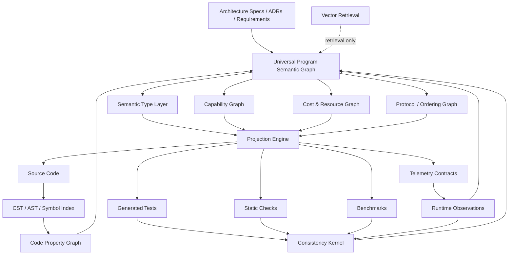
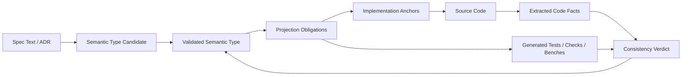
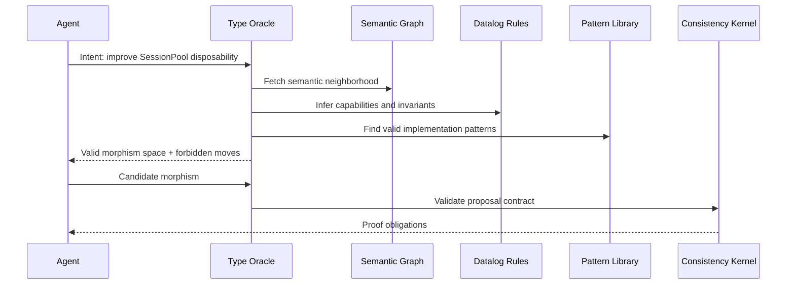
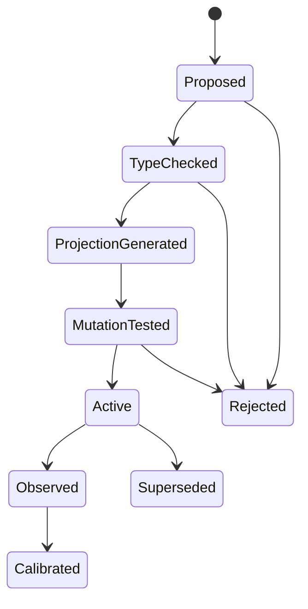
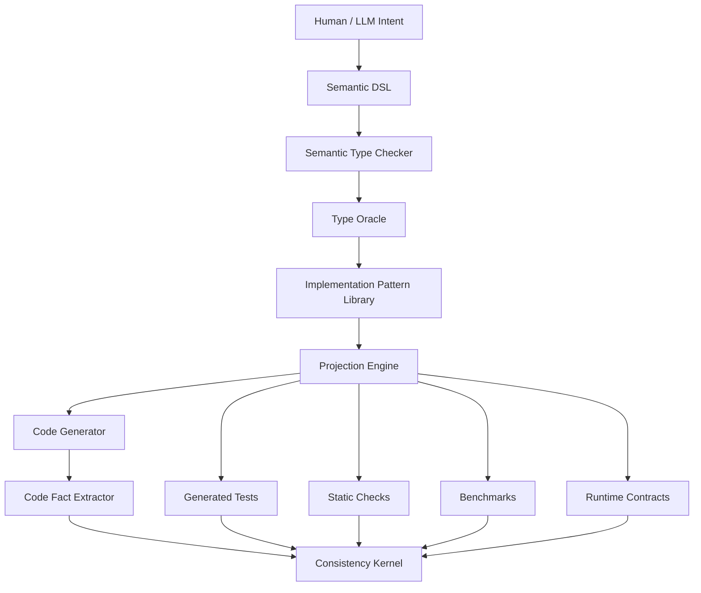
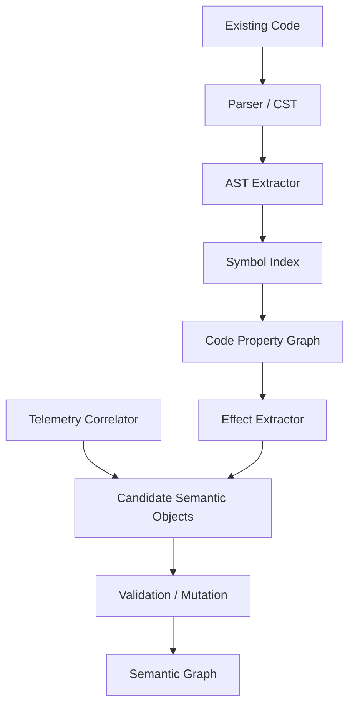

Yes. The thing you’re describing is **not annotations on code**.

Annotations are too weak. They imply:

```text
source code is primary
metadata is attached to it
```

But the architecture we’ve been developing wants the opposite:

```text
semantic structure is primary
source code is one projection of it
tests are another projection
runtime observations are another projection
documentation is another projection
```

So the database should not be “a better code index.” It should be a **semantic operating substrate for software**.

My answer: the ideal structure is a **versioned semantic hypergraph with materialized relational, graph, vector, AST, e-graph, and time-series projections**.

Or shorter:

> **A Universal Program Semantic Graph, backed by polyglot projections.**

Not one database. One canonical identity/fact model with multiple query surfaces.

---

# 1. The core data model

The universal representation should be:

```text
Typed Versioned Semantic Hypergraph
  + source-code projection
  + syntax-tree projection
  + symbol projection
  + code-property projection
  + spec projection
  + capability projection
  + cost/resource projection
  + protocol projection
  + test projection
  + runtime-observation projection
  + vector/semantic retrieval projection
```

Why a **hypergraph**?

Because many of the relationships we care about are not simple binary edges.

A normal graph edge can say:

```text
function A implements requirement B
```

But our real facts are often higher arity:

```text
Patch Δ modifies Function F under Capability C
and claims to preserve Invariant I
with Evidence E
in Version V
```

That is not naturally a single edge. It is a typed relation involving multiple entities.

So the canonical model should support **n-ary semantic facts**.

Example:

```yaml
fact:
  id: fact.patch_827.preserves.checkout_capability
  predicate: preserves_invariant
  args:
    patch: patch_827
    invariant: invariant.session.checkout_requires_capability
    implementation: symbol.SessionPool.checkout/2
    evidence: proof_bundle_827
    version: git_sha_a1b2
  provenance:
    asserted_by: consistency_kernel
    derived_from:
      - test.checkout_capability_property
      - mutation.remove_capability_check.killed
```

That is the atomic unit.

---

# 2. Do not choose graph versus relational versus vector

The right answer is **all of them**, but with strict roles.

## Canonical layer: semantic facts

This is the source of truth.

Use a relational or append-only fact store for canonical identity, provenance, versioning, and deterministic querying.

Core shape:

```text
entities(id, kind, stable_name, version, metadata)
relations(id, predicate, subject, object, version, provenance)
hyperfacts(id, predicate, args_json, version, provenance)
artifacts(id, kind, content_hash, uri, version)
observations(id, semantic_id, metric, value, timestamp, run_id)
```

This should be boring, durable, queryable, and auditable.

For an MVP, I would use **Postgres** with:

```text
SQL tables for canonical facts
JSONB for flexible typed payloads
recursive CTEs for some graph traversal
pgvector or external vector store for embeddings
object storage for artifacts
```

Then materialize additional views.

---

## Graph layer: traversal and impact analysis

Use a property graph view for questions like:

```text
What does this function depend on?
What specs does this code implement?
What tests cover this invariant?
What capabilities permit this mutation?
What breaks if this semantic object changes?
```

A property graph is appropriate because it models nodes as entities and relationships as first-class connections with properties; Neo4j’s property-graph model is the familiar example of nodes connected by relationships with properties on both. ([Graph Database & Analytics][1])

This graph is not the only truth. It is a **materialized query surface** over canonical facts.

---

## Logic layer: deterministic inference

Use Datalog-style rules for questions like:

```text
Does this patch have authority to modify this semantic object?
Which invariants are implicated by this diff?
Which proof obligations are required?
Does capability C imply capability D?
Is there a forbidden dependency path?
```

Datalog is a strong fit because it supports recursive queries and is used for program analysis, security, graph databases, and declarative networking; Soufflé specifically is a Datalog-inspired language designed for large-scale static analysis. ([Soufflé][2])

Example:

```prolog
requires_check(Patch, Check) :-
  touches(Patch, Symbol),
  implements(Symbol, SemanticObject),
  governed_by(SemanticObject, Invariant),
  check_for(Invariant, Check).

unauthorized_patch(Patch) :-
  modifies(Patch, Object),
  submitted_by(Patch, Agent),
  not has_modify_capability(Agent, Object).
```

This is where the “deterministic rigor” lives.

---

## Syntax layer: CST / AST / source spans

Use syntax trees for precise source anchoring.

Tree-sitter is relevant because it builds concrete syntax trees for source files and updates them incrementally as files change. ([Tree-sitter][3])

For Elixir specifically, you would likely combine:

```text
Elixir quoted AST / compiler metadata
tree-sitter CST for source anchoring
xref/call graph extraction
custom semantic extraction
```

The distinction matters:

| Layer          | Purpose                                    |
| -------------- | ------------------------------------------ |
| CST            | Exact syntactic structure and source spans |
| AST            | Language-level structure                   |
| Symbol index   | Definitions, references, calls             |
| Semantic graph | Architecture meaning                       |
| Runtime graph  | Observed behavior                          |

You do **not** want to attach every semantic concept to every token. You want stable anchors at meaningful granularity.

---

## Code-property layer: program analysis

A code property graph is useful as the bridge between syntax and behavior. The original Code Property Graph work introduced a representation that merges classic program-analysis structures including ASTs, control-flow graphs, and program-dependence graphs into a joint structure for mining code. ([IEEE Security][4])

For us, a CPG-like layer gives:

```text
AST edges
control-flow edges
data-flow edges
call edges
module dependency edges
effect edges
callback edges
macro expansion edges
```

But again, this is not enough. CPG knows code structure. It does not know architectural intent unless we overlay semantic types.

So:

```text
Code Property Graph
  + Semantic Type Overlay
  = executable architecture substrate
```

---

## Symbol-intelligence layer

Use a language-agnostic source index for editor-grade navigation.

SCIP is a language-agnostic protocol for indexing source code and powering navigation like go-to-definition, find references, and find implementations. ([GitHub][5])

That kind of index is valuable because semantic anchors need to survive source movement, refactors, and formatting changes.

The system needs to know:

```text
semantic object X is implemented by symbol Y
symbol Y is defined at source location Z
symbol Y is referenced by symbols A, B, C
```

That is not “architecture” by itself, but it is the plumbing that makes architecture traceable to code.

---

## Vector layer: retrieval, not truth

Use vectors for:

```text
finding related specs
matching natural language to semantic objects
retrieving similar architectural patterns
finding prior incidents
finding code that “sounds like” a concept
```

But never let vector similarity decide correctness.

Vector search answers:

```text
What might be relevant?
```

The semantic graph answers:

```text
What is true?
```

The logic layer answers:

```text
What follows?
```

The consistency kernel answers:

```text
Is this acceptable?
```

This separation is non-negotiable.

---

## E-graph layer: equivalent implementations and rewrite space

E-graphs are useful where you want to represent many equivalent expressions or implementation variants compactly. The `egg` project describes e-graphs as a way to compactly represent many equivalent programs and use equality saturation for optimization and synthesis. ([egraphs-good.github.io][6])

This matters because eventually you do not want the LLM to “invent code” from scratch.

You want the system to have a bounded space of valid rewrites:

```text
semantic type
  → valid implementation patterns
  → valid rewrites
  → extract idiomatic target code according to cost function
```

For Elixir/OTP, an e-graph-like layer could represent equivalent ways to implement a semantic operation:

```text
direct GenServer call
GenServer call through facade
pure reducer + effect adapter
supervised worker checkout
registry lookup + dynamic supervisor child
```

Then the extractor chooses the implementation that optimizes:

```text
idiomaticity
testability
cost
capability preservation
supervision correctness
```

This is not day-one MVP, but it is exactly where the architecture wants to go.

---

## Time-series / observation layer

Runtime observation needs its own storage.

OpenTelemetry is relevant because it provides APIs, SDKs, and tools for generating, collecting, and exporting telemetry data such as metrics, logs, and traces. ([GitHub][7])

For this architecture, telemetry is not just monitoring. It is the calibration channel for cost types.

Store observations like:

```text
semantic operation checkout_worker
  p95 latency
  mailbox depth
  reductions
  memory growth
  restart count
  error rate
```

Then connect them back to the semantic type:

```text
Observation
  ──calibrates──▶ CostEnvelope
  ──violates────▶ PerformanceInvariant
  ──triggers────▶ TypeRefinementProposal
```

---

# 3. The canonical object: Universal Semantic Node

Every important thing becomes a semantic node.

```yaml
id: sem.session_pool.checkout
kind: Operation
stable_name: SessionPool.checkout
domain: otp.session_runtime

denotation:
  behavior:
    input: SessionId
    output: WorkerRef | CheckoutError

  capability:
    requires:
      - cap.session.worker.checkout

  effects:
    allowed:
      - registry_lookup
      - worker_checkout
      - telemetry_emit
    forbidden:
      - db_write
      - network_call
      - unsupervised_spawn

  resources:
    process_delta: 0
    mailbox_delta_max: 1
    ets_reads: bounded

  cost:
    p95_latency_ms: 20
    asymptotic: O(1)

  protocol:
    requires_state:
      - session_open
    transitions:
      - session_open -> worker_checked_out

  observation:
    telemetry_events:
      - [:session_pool, :checkout, :start]
      - [:session_pool, :checkout, :stop]
      - [:session_pool, :checkout, :exception]

projections:
  code:
    - symbol: MyApp.SessionPool.checkout/2
  tests:
    - test/session_pool/checkout_property_test.exs
  benchmarks:
    - bench/session_pool_checkout_bench.exs
  telemetry:
    - contract.telemetry.session_pool.checkout
  mutations:
    - mutation.remove_capability_check
    - mutation.unbounded_mailbox_growth
```

This is not an annotation. It is the **semantic object** that code must inhabit.

---

# 4. The source code is anchored into the semantic graph

You need “hooks” into code, but not one hook per byte.

Use **semantic anchors** at several granularities.

## Anchor levels

```text
Repository
  Application
    Module
      Behaviour / Protocol
        Function / Callback
          Clause
            Expression region
              Source span
```

Each semantic object chooses the minimum useful anchor level.

Examples:

| Semantic object    | Anchor granularity                   |
| ------------------ | ------------------------------------ |
| Capability rule    | function or module                   |
| GenServer boundary | module                               |
| Protocol ordering  | callback set                         |
| Cost envelope      | operation/function                   |
| Effect boundary    | function or adapter module           |
| Local invariant    | function clause or expression region |
| Generated region   | exact source span                    |
| Runtime event      | telemetry call site                  |

The anchor object looks like:

```yaml
anchor:
  id: anchor.session_pool.checkout.impl
  semantic_id: sem.session_pool.checkout
  symbol: MyApp.SessionPool.checkout/2
  file: lib/my_app/session_pool.ex
  span:
    start_line: 42
    end_line: 67
  symbol_fingerprint: sha256:...
  ast_path:
    - module: MyApp.SessionPool
    - def: checkout/2
  ownership:
    mode: handwritten_constrained
```

The key field is `ownership.mode`.

---

# 5. Code ownership modes

Not all code relates to the semantic graph the same way.

You need explicit code-generation/ownership modes:

```text
generated_exact
generated_with_slots
scaffolded
handwritten_constrained
handwritten_observed
external_dependency
```

## `generated_exact`

The source is fully generated from the semantic model.

```text
semantic type changes → regenerate code
manual edits forbidden
```

Good for:

```text
test files
telemetry contracts
simple behaviours
schema modules
capability constants
proof-bundle templates
```

---

## `generated_with_slots`

The system generates structure, humans/agents fill designated holes.

```elixir
defmodule MyApp.SessionPool do
  use GenServer

  # @semantic_slot sem.session_pool.checkout.policy
  defp decide_checkout(state, request) do
    # handwritten logic here
  end
end
```

Good for:

```text
GenServer shells
adapter modules
workflow skeletons
```

---

## `scaffolded`

The system generates initial code but does not own exact formatting or later edits.

Still checked against semantic type.

---

## `handwritten_constrained`

The source is manually or agent-written, but must satisfy semantic facts.

Most application logic lives here.

---

## `handwritten_observed`

The system cannot fully statically validate it, but runtime observations and tests calibrate the semantic model.

Good for:

```text
external API clients
performance-sensitive code
legacy areas
```

---

# 6. The “semantic source map”

You need the equivalent of a source map, but for architecture.

Call it:

## Semantic Source Map

It maps:

```text
semantic object
  ↔ code symbol
  ↔ source span
  ↔ generated tests
  ↔ runtime telemetry
  ↔ proof obligations
  ↔ observed evidence
```

Example:

```yaml
semantic_source_map:
  sem.session_pool.checkout:
    code:
      symbols:
        - MyApp.SessionPool.checkout/2
        - MyApp.SessionPool.Server.handle_call({:checkout, _}, _, _)
        - MyApp.SessionPool.Policy.checkout/2

    syntax:
      anchors:
        - anchor.session_pool.checkout.facade
        - anchor.session_pool.checkout.callback
        - anchor.session_pool.checkout.policy

    tests:
      - prop.checkout_requires_capability
      - prop.checkout_state_transition
      - contract.telemetry_checkout

    mutations:
      - remove_capability_check
      - skip_policy_reducer
      - omit_telemetry_stop_event

    observations:
      - metric.session_pool.checkout.p95_latency
      - trace.session_pool.checkout
```

This is the bridge from spec to code and code back to spec.

---

# 7. The layered model

Here is the architecture in diagram form.



The important cycle is:

```text
Spec → Semantic Graph → Projections → Code/Tests/Runtime → Extracted Facts → Semantic Graph
```

That is the round trip.

---

# 8. The database architecture I would actually build

## MVP storage stack

For the MVP, I would not start with Neo4j plus RDF plus ten systems.

I would start with this:

```text
Postgres
  canonical semantic facts
  JSONB payloads
  versioning/provenance
  proof bundles
  observation summaries
  pgvector for embeddings if acceptable

Object store / filesystem
  source snapshots
  generated artifacts
  AST dumps
  proof bundle artifacts
  benchmark reports

Datalog engine
  offline or embedded rule evaluation
  capability and invariant inference

Optional graph projection
  materialized graph export for visualization/traversal
```

The MVP wants determinism and simplicity.

Later, split into dedicated systems:

```text
Postgres           canonical facts and provenance
Graph DB           traversal and impact analysis
Vector DB          retrieval
Time-series DB     observations
Object store       immutable artifacts
E-graph engine     rewrite/equivalence space
Datalog engine     inference and policy
```

---

# 9. Canonical schema

Minimal tables:

```sql
entities (
  id text primary key,
  kind text not null,
  stable_name text,
  namespace text,
  version_from text,
  version_to text,
  payload jsonb not null,
  created_at timestamptz
)

relations (
  id text primary key,
  predicate text not null,
  subject_id text not null,
  object_id text not null,
  version_from text,
  version_to text,
  payload jsonb not null,
  provenance_id text
)

hyperfacts (
  id text primary key,
  predicate text not null,
  args jsonb not null,
  version_from text,
  version_to text,
  payload jsonb not null,
  provenance_id text
)

artifacts (
  id text primary key,
  kind text not null,
  content_hash text not null,
  uri text not null,
  media_type text,
  payload jsonb
)

provenance (
  id text primary key,
  asserted_by text,
  derivation_kind text,
  source_artifacts jsonb,
  confidence text,
  created_at timestamptz
)

observations (
  id text primary key,
  semantic_id text not null,
  metric text not null,
  value numeric,
  unit text,
  run_id text,
  observed_at timestamptz,
  payload jsonb
)
```

This is the durable core.

Everything else can be rebuilt.

---

# 10. Core entity kinds

The universal ontology should include these entities:

```text
SpecItem
ADR
Requirement
SemanticType
Operation
Capability
CapabilityBundle
Effect
Resource
CostEnvelope
Protocol
State
Transition
Boundary
Topology
ABI
Invariant
Projection
Check
Test
Benchmark
Mutation
Observation
RuntimeEvent
ProofBundle
Patch
Agent
CodeArtifact
SourceFile
SyntaxNode
Symbol
SourceAnchor
Morphism
Refinement
```

A lot of the power comes from making **Morphism** explicit.

A patch is not just a diff. It is a candidate morphism:

```yaml
id: morphism.patch_827
kind: Morphism
from: sem.system.version_41
to: sem.system.version_42
intent: fix_checkout_timeout
claims:
  preserves:
    - invariant.checkout_requires_capability
    - invariant.mailbox_growth_bounded
  improves:
    - cost.checkout_p95_latency
evidence:
  - proof_bundle.patch_827
```

Then acceptance is:

```text
does this morphism preserve required structure?
```

---

# 11. Core relationship predicates

The relationship vocabulary should be small but expressive.

```text
defines
implements
refines
projects_to
generated_from
anchored_at
calls
depends_on
reads
writes
emits
requires_capability
grants_capability
consumes_resource
bounded_by
governed_by
checked_by
tested_by
benchmarked_by
observed_by
mutated_by
killed_by
violates
preserves
improves
regresses
supersedes
composes_with
precedes
follows
has_state
transitions_to
```

The ideal is not thousands of bespoke edge types. It is a compact semantic vocabulary with rich typed payloads.

---

# 12. How specs connect to code

You need a pipeline like this:



The LLM can help with:

```text
Spec Text → Semantic Type Candidate
Code Facts → missing semantic links
Architecture question → candidate proposal
```

But the deterministic system validates:

```text
semantic type well-formedness
projection completeness
capability authority
invariant preservation
test/mutation evidence
runtime observation alignment
```

---

# 13. How code connects back to specs

Reverse mapping is essential.


Given any function, you should be able to ask:

```text
What semantic object does this implement?
What requirements justify its existence?
What capabilities does it require?
What effects may it perform?
What invariants govern it?
What tests prove it?
What runtime telemetry observes it?
What changes is an agent allowed to make here?
```

This is the “code back to specification” path.

---

# 14. How code generation becomes less dependent on the LLM

You said something important: if we solve the structure deeply enough, eventually the LLM is not “generating code” in the normal sense.

Correct.

The desired path is:

```text
architecture intent
  → semantic type
  → implementation pattern
  → code skeleton
  → constrained holes
  → deterministic checks
  → extraction/reconciliation
```

The LLM moves upward.

Instead of:

```text
LLM writes arbitrary Elixir
```

it does:

```text
LLM proposes semantic object
LLM selects implementation pattern
LLM fills constrained hole
LLM explains tradeoff
```

The code generator handles:

```text
module skeletons
behaviours
child specs
telemetry events
test shells
property generators
capability constants
proof bundle templates
```

The LLM handles the ambiguous parts only where the semantic type is not yet expressive enough.

Over time, more patterns become deterministic.

---

# 15. Implementation patterns as first-class objects

You need to store idiomatic patterns in the graph.

Example:

```yaml
id: pattern.otp.boundary_process.pure_core_shell
kind: ImplementationPattern
applies_to:
  - SemanticType.BoundaryProcess

structure:
  modules:
    - Server
    - Policy
    - EffectAdapter

rules:
  - Server owns GenServer callbacks
  - Policy is pure
  - EffectAdapter performs external effects
  - Telemetry emitted at boundary
  - State transitions tested on Policy

projection_templates:
  code:
    - genserver_shell.eex
    - policy_module.eex
    - effect_adapter_behaviour.eex
  tests:
    - policy_property_test.eex
    - server_contract_test.eex
    - telemetry_contract_test.eex
```

Now the type oracle can answer:

```text
For semantic type BoundaryProcess, these implementation patterns are valid.
```

And code generation becomes pattern extraction, not freeform generation.

---

# 16. Granularity: not every line, but enough semantic load-bearing points

You do not need every byte mapped to the semantic graph.

You need every **load-bearing semantic point** mapped.

Load-bearing points include:

```text
public API
capability checks
effect boundaries
state transitions
message handlers
protocol phases
resource acquisition/release
hot paths
telemetry emission
supervision boundaries
external adapters
persistence boundaries
serialization boundaries
```

These are the points where architectural invariants can be violated.

A good anchor density metric:

```text
semantic_anchor_coverage =
  load_bearing_points_with_anchors / total_load_bearing_points
```

Not:

```text
annotated_lines / total_lines
```

This is a better coverage metric.

---

# 17. Semantic overlay on AST

The AST/CST should carry a semantic overlay.

Example:

```text
def checkout(session_id, capability) do
  with :ok <- Capability.authorize(capability, :checkout_worker),
       {:ok, worker} <- Server.checkout(session_id) do
    {:ok, worker}
  end
end
```

Semantic overlay:

```yaml
source_span: lib/session_pool.ex:42-48
symbol: MyApp.SessionPool.checkout/2
semantic_object: sem.session_pool.checkout
semantic_roles:
  - public_facade
  - capability_checked_operation

effects:
  - capability_authorize
  - genserver_call

invariants:
  - checkout_requires_capability
  - checkout_emits_telemetry
  - checkout_p95_latency

tests:
  - prop.checkout_denied_without_capability
  - contract.checkout_telemetry

mutations:
  - remove_capability_authorize
  - call_server_before_authorize
```

This is much richer than an annotation because it is connected to tests, capabilities, cost, runtime, and mutation.

---

# 18. The type oracle sits on top of the graph

The type oracle is the interface agents use.



The oracle should answer:

```text
What can I change?
What must I preserve?
What valid patterns exist?
What tests will be required?
What would make this invalid?
What examples exist nearby?
```

This prevents the LLM from generating in an unconstrained space.

---

# 19. The semantic graph must be versioned

Architecture changes over time.

So every semantic fact needs time/version.

```text
semantic object V1
  → refinement morphism
semantic object V2
```

You need to ask:

```text
What did this invariant mean at commit X?
When was this capability introduced?
Which patches changed this cost envelope?
Which runtime observations caused the type refinement?
```

So semantic facts should be append-only with validity intervals:

```text
valid_from_git_sha
valid_to_git_sha
superseded_by
provenance
```

This gives you architectural archaeology.

---

# 20. Provenance and authority

Every fact must know where it came from.

```yaml
provenance:
  kind: derived
  derived_by: semcheck.extract_effects.v1
  source:
    - git_sha: abc123
    - file: lib/session_pool.ex
    - span: 42-48
  confidence: deterministic
```

or:

```yaml
provenance:
  kind: llm_proposed
  model: GPT-5.5-Pro
  prompt_artifact: artifact_918
  confidence: untrusted_until_validated
```

or:

```yaml
provenance:
  kind: human_approved
  reviewer: architecture_owner
  decision: accepted
```

The system must distinguish:

```text
asserted
derived
observed
inferred
proposed
validated
superseded
```

Never mix them.

---

# 21. The fact lifecycle

A semantic fact goes through states:



This prevents hallucinated structure from becoming authoritative just because it was written into a file.

---

# 22. How to represent uncertainty without losing rigor

The graph can contain uncertain candidates, but the consistency kernel must not treat them as truth.

Use trust levels:

```text
candidate
hypothesis
validated_static
validated_mutation
validated_runtime
authoritative
deprecated
```

Vector-derived links are usually:

```text
candidate
```

Datalog-derived facts can be:

```text
validated_static
```

Runtime observations are:

```text
observed
```

Mutation-proven invariants are:

```text
validated_mutation
```

This lets the LLM help enrich the graph without poisoning the core.

---

# 23. How to model “best practices” without hardcoding taste

You said something crucial: the platform needs a rich ontology/interface for particular instantiations and best practices.

That should be the **Pattern Library**.

A pattern is not prose. It is a typed semantic object:

```yaml
id: pattern.otp.supervised_worker_pool
kind: ArchitecturalPattern
host_runtime: elixir_otp

intent:
  - manage bounded set of workers
  - recover crashed workers
  - provide lookup by session id

requires:
  semantic_types:
    - BoundaryProcess
    - Supervisor
    - Registry
    - HotPathOperation

forbids:
  - unsupervised_spawn
  - global_process_dictionary_state
  - direct worker pid storage without monitor

generates:
  - DynamicSupervisor child spec
  - Registry lookup wrapper
  - worker lifecycle tests
  - crash recovery mutation tests
  - telemetry contract
```

This is how “idiomatic OTP” becomes structure.

Not:

```text
Please write idiomatic Elixir.
```

But:

```text
This semantic object must instantiate pattern.otp.supervised_worker_pool.
```

---

# 24. Universal ontology plus domain libraries

The universal ontology should stay small.

Domain libraries carry specificity.

```text
Universal Ontology
  Operation
  Effect
  Resource
  Cost
  Capability
  Protocol
  Observation
  Invariant
  Projection

Domain Library: Elixir/OTP
  GenServerBoundary
  SupervisorTree
  RegistryLookup
  TelemetryEvent
  MailboxResource
  BEAMReductionCost
  CapabilityCheckedOperation

Domain Library: GPU Renderer
  ShaderABI
  BindGroupTopology
  BackendPortabilityMatrix
  GPUCommandProtocol
  DescriptorResource
  FrameTimeEnvelope
```

This avoids the trap of separate ontologies while still giving each domain enough precision.

---

# 25. The “spec to code” compiler

The final architecture behaves like a compiler.



The LLM becomes a frontend to the semantic DSL, not the compiler backend.

---

# 26. The “code to spec” decompiler

You also need the reverse.



This is how you bootstrap existing codebases.

The system proposes:

```text
This GenServer appears to be a BoundaryProcess.
This function appears to be a CapabilityCheckedOperation.
This module appears to be an EffectAdapter.
```

Then those candidates must be validated before becoming authoritative semantic facts.

---

# 27. The hardest part: semantic reconciliation

Generated code and handwritten code will diverge.

So you need reconciliation.

Reconciliation asks:

```text
Does the extracted code still inhabit the semantic type?
If not, is the semantic type wrong, the code wrong, or the anchor stale?
```

Outcomes:

```text
accept: code matches semantic type
repair_code: implementation violates type
repair_semantics: semantic model is outdated
repair_anchor: source moved/refactored
downgrade_confidence: cannot prove relationship
```

This is essential because the real world is messy.

---

# 28. The schema for semantic types

A semantic type should be structured like this:

```yaml
id: type.otp.capability_checked_operation
kind: SemanticType

parameters:
  input:
  output:
  required_capability:
  allowed_effects:
  forbidden_effects:
  resource_bounds:
  cost_envelope:
  protocol_preconditions:
  observations:

composition_laws:
  effects: union_with_forbidden_check
  capabilities: required_capability_must_dominate_effects
  cost: sequential_add_or_declared_operator
  protocol: session_type_sequence

projection_obligations:
  code:
    - public_symbol_anchor
    - capability_check_anchor
  tests:
    - unauthorized_denied_property
    - authorized_succeeds_contract
  mutations:
    - remove_capability_check
    - perform_forbidden_effect
  telemetry:
    - start_stop_exception_events
  benchmarks:
    - p95_latency_if_hot_path
```

The important fields are:

```text
composition_laws
projection_obligations
mutation_obligations
```

That is what turns a type into executable architecture.

---

# 29. The graph can answer architecture questions

Once you have this structure, the AI self-reflection question becomes queryable.

User asks:

> Can you make this architecture more elegant, composed, disposable, and idiomatic?

The system translates that into graph queries:

```text
Find modules with multiple semantic roles.
Find effects performed outside effect adapters.
Find unsupervised process lifecycle operations.
Find components without replacement conformance tests.
Find public APIs not backed by semantic types.
Find invariants without mutation tests.
Find operations without telemetry.
Find hot paths without cost envelopes.
Find dependency cycles.
Find capability checks not dominating effects.
```

Then the LLM proposes improvements using actual structural evidence.

The answer is no longer pure style.

It is graph-grounded architecture analysis.

---

# 30. Query examples

## What tests prove this operation?

```sql
SELECT t.*
FROM relations r
JOIN entities t ON t.id = r.object_id
WHERE r.subject_id = 'sem.session_pool.checkout'
  AND r.predicate = 'tested_by';
```

## What invariants are implicated by a patch?

```prolog
implicated_invariant(Patch, Invariant) :-
  modifies(Patch, Symbol),
  implements(Symbol, SemObj),
  governed_by(SemObj, Invariant).

implicated_invariant(Patch, Invariant) :-
  modifies(Patch, Symbol),
  calls(Symbol, OtherSymbol),
  implements(OtherSymbol, SemObj),
  governed_by(SemObj, Invariant).
```

## What code lacks semantic anchors?

```sql
SELECT s.*
FROM symbols s
LEFT JOIN relations r
  ON r.subject_id = s.id
 AND r.predicate = 'implements'
WHERE s.kind IN ('public_function', 'genserver_callback')
  AND r.id IS NULL;
```

## Which architecture facts are not mutation-proven?

```sql
SELECT inv.*
FROM entities inv
WHERE inv.kind = 'Invariant'
AND NOT EXISTS (
  SELECT 1 FROM relations r
  WHERE r.subject_id = inv.id
    AND r.predicate = 'mutation_tested_by'
);
```

---

# 31. What gets embedded?

Do not embed everything blindly.

Embed these:

```text
ADR paragraphs
semantic type descriptions
source docstrings
module docs
proposal rationales
proof bundle summaries
historical incident writeups
test failure summaries
runtime anomaly summaries
```

Do not treat embeddings as authoritative for:

```text
capability checks
invariant preservation
cost bounds
dependency legality
protocol ordering
```

Embeddings are a discovery layer.

---

# 32. The ideal persisted artifact for every patch

Every patch gets a proof bundle:

```yaml
patch_id: patch_1042
intent: improve SessionPool disposability

semantic_delta:
  added:
    - sem.session_pool.policy
    - sem.session_pool.effect_adapter
  modified:
    - sem.session_pool.checkout
  preserved:
    - invariant.checkout_requires_capability
    - invariant.session_protocol_ordering

code_delta:
  modified_symbols:
    - MyApp.SessionPool.checkout/2
    - MyApp.SessionPool.Server.handle_call/3
  added_symbols:
    - MyApp.SessionPool.Policy.checkout/2

fitness_delta:
  composability: +2
  disposability: +2
  otp_idiomaticity: +1
  cognitive_load: -1

checks:
  passed:
    - test.policy_property
    - test.checkout_capability
    - credo.no_effects_in_policy
    - bench.checkout_p95

mutations:
  killed:
    - remove_capability_check
    - policy_calls_registry
    - unsupervised_spawn_worker

observations:
  required:
    - telemetry.checkout.start
    - telemetry.checkout.stop
```

This patch bundle itself becomes a node in the semantic graph.

Future agents can learn from it structurally.

---

# 33. Bootstrapping sequence

You asked how to engineer this without trying to solve the whole problem at once.

Build in this order:

## Phase 1: Semantic identity and anchors

```text
entities
relations
source anchors
symbol index
manual semantic links
```

Goal:

```text
Can we ask what semantic object a function implements?
```

---

## Phase 2: Semantic types and projection obligations

Add:

```text
Operation
Capability
Effect
Resource
CostEnvelope
Protocol
Invariant
Projection
```

Goal:

```text
Can we say what tests/checks an operation requires?
```

---

## Phase 3: Patch impact and proof bundles

Add:

```text
diff parser
symbol impact
implicated invariants
proof bundle schema
```

Goal:

```text
Can we determine what a patch must prove?
```

---

## Phase 4: Generated checks

Add:

```text
property tests
static checks
telemetry checks
benchmark shells
```

Goal:

```text
Can semantic types generate enforcement?
```

---

## Phase 5: Mutation testing

Add:

```text
known-bad mutations
mutation runners
kill reports
```

Goal:

```text
Can invariants prove they catch representative violations?
```

---

## Phase 6: Type oracle

Add:

```text
valid morphism queries
implementation pattern library
forbidden move explanations
```

Goal:

```text
Can agents query allowed change space before editing?
```

---

## Phase 7: Runtime calibration

Add:

```text
telemetry ingestion
cost envelope comparison
type refinement proposals
```

Goal:

```text
Can runtime reality refine semantic types?
```

---

# 34. The MVP should target one vertical slice

For Elixir/OTP, the MVP vertical slice should be:

```text
CapabilityCheckedOperation
BoundaryProcess
SessionProtocol
HotPathOperation
```

Applied to:

```text
SessionPool.checkout
SessionPool.checkin
Worker lifecycle
```

The graph should connect:

```text
spec → semantic type → capability → GenServer code → tests → mutation → telemetry → benchmark
```

Do not start by indexing the entire codebase.

Start with one path and make the round trip perfect.

---

# 35. What this enables long-term

If built correctly, the system eventually supports:

```text
Spec-first code generation
Architecture review with structural evidence
Automatic proof-obligation generation
Patch risk classification
Agent capability enforcement
Executable architecture docs
Runtime cost-type calibration
Semantic refactoring
Cross-language architecture consistency
Idiomatic pattern extraction
Semantic search over code/spec/test/runtime
```

The LLM becomes less of a coder and more of a semantic model editor.

---

# 36. The final answer

The ideal database structure is:

```text
Canonical versioned semantic fact store
  +
typed hypergraph model
  +
materialized property graph for traversal
  +
Datalog/logic layer for inference
  +
CST/AST/symbol/code-property projections for code structure
  +
vector index for semantic retrieval
  +
e-graph/rewrite space for valid implementation alternatives
  +
time-series observation store for runtime calibration
```

The canonical representation is not “annotated code.”

It is:

> **a Universal Program Semantic Graph where code, tests, specs, benchmarks, telemetry, capabilities, invariants, and architecture proposals are all linked projections of the same typed semantic objects.**

The core bridge is the **Semantic Source Map**:

```text
semantic object
  ↔ source anchor
  ↔ code symbol
  ↔ tests
  ↔ mutations
  ↔ runtime observations
  ↔ specifications
  ↔ proof bundles
```

The long-term win is exactly what you said:

> once this structure is rich enough, code generation becomes increasingly deterministic pattern extraction from semantic types rather than open-ended LLM authorship.

That is the right target.

The LLM manages, proposes, reconciles, and fills gaps in the semantic structure.

The structure itself becomes the universal bridge from specification to implementation and back.

[1]: https://neo4j.com/docs/getting-started/appendix/graphdb-concepts/?utm_source=chatgpt.com "Graph database concepts - Getting Started"
[2]: https://souffle-lang.github.io/tutorial?utm_source=chatgpt.com "Tutorial | Soufflé • A Datalog Synthesis Tool for Static ..."
[3]: https://tree-sitter.github.io/?utm_source=chatgpt.com "Tree-sitter: Introduction"
[4]: https://www.ieee-security.org/TC/SP2014/papers/ModelingandDiscoveringVulnerabilitieswithCodePropertyGraphs.pdf?utm_source=chatgpt.com "Modeling and Discovering Vulnerabilities with Code ..."
[5]: https://github.com/sourcegraph/scip/?utm_source=chatgpt.com "SCIP Code Intelligence Protocol"
[6]: https://egraphs-good.github.io/?utm_source=chatgpt.com "Egg: E-Graphs Good"
[7]: https://github.com/open-telemetry?utm_source=chatgpt.com "OpenTelemetry - CNCF"
