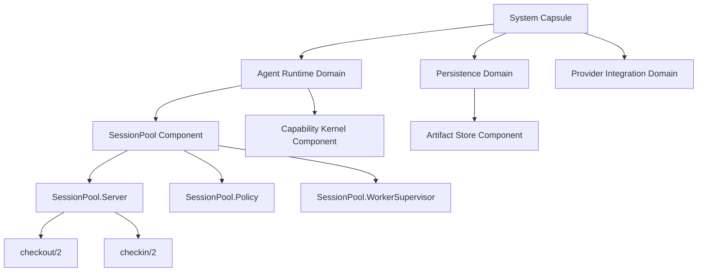
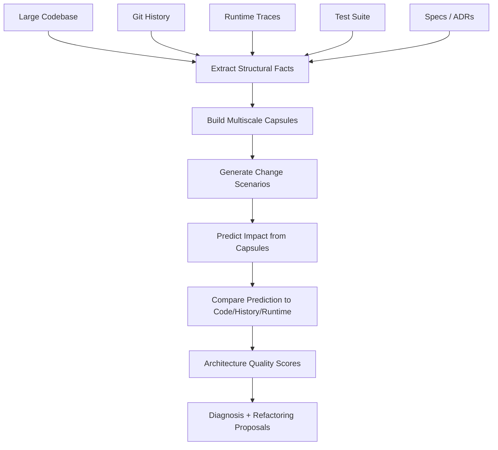
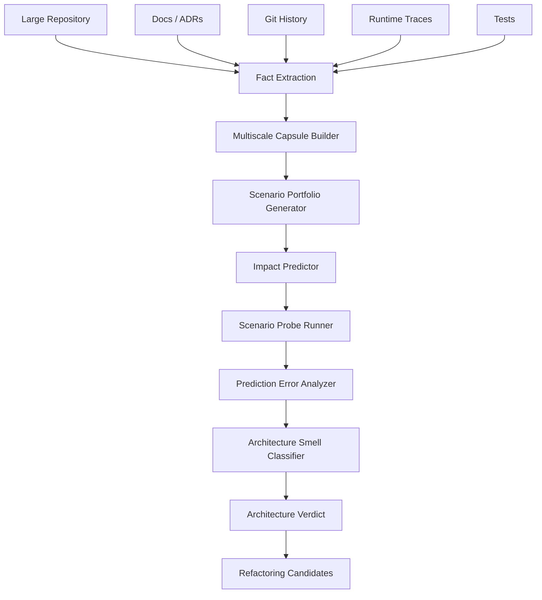

Yes — **this is the main point**.

Everything earlier was too close to:

```text
known invariant → encode invariant → enforce invariant
```

But you are asking the deeper question:

> Given a huge codebase, how do you know whether its architecture is good or junk **before** you already know the right invariants?

A senior engineer looks at a large, messy system and says:

> “This thing has no architecture. Every change is going to be painful.”

That judgment is not just about tests, types, or specific rules. It is about whether the system admits a **compact, predictive model**.

That is the missing center.

---

# The real criterion: architectural quality is predictive compression

A good architecture is not “pretty code.”

A good architecture is a system where you can build a **compressed mental model** that still predicts how the system behaves and how changes propagate.

A bad architecture is a system where no small model predicts anything reliably. You need to inspect arbitrary implementation details because boundaries leak, concepts are duplicated, ownership is unclear, and every change has surprise blast radius.

So the deepest formulation is:

> **Architecture quality is the degree to which a system can be lossily compressed into smaller representations that remain predictive for the changes and questions that matter.**

That is the thing a senior engineer is sensing.

They are not reading the whole codebase. They are asking:

```text
Can I form a compact model of this thing?
Does the model explain the code?
Does it predict where changes go?
Does it predict what can break?
Does it predict runtime behavior?
Does it predict cost?
```

If the answer is no, the architecture is bad.

---

# Context window becomes a measurement device

The context-window problem is not incidental. It is the measurement.

If a subsystem is well-architected, then this should fit in context:

```text
subsystem purpose
public interfaces
owned state
effects
dependencies
main protocols
quality constraints
known invariants
representative flows
```

You should not need the entire implementation.

If the interface summary itself exceeds the context window, that is already evidence of architectural failure or at least decomposition failure.

So the test becomes:

> Can a bounded representation of this subsystem support accurate reasoning about realistic changes?

That is a first-principles test.

Not:

```text
Can the entire codebase fit in the model context?
```

But:

```text
Can the right abstraction layer fit?
```

A good architecture creates context-window-sized “understanding units.”

A bad architecture forces you to load the world.

---

# The actual evaluation target is not code; it is the model’s prediction error

For a large codebase, you cannot ask:

> Is this code good?

That is too vague.

You ask:

> Given a compressed architecture model of this codebase, how accurately can that model predict answers to architecture-relevant questions?

For example:

```text
If I add a new provider, which modules should change?
If I change session identity format, what breaks?
If I add authorization to all tool execution, where should it go?
If I replace the queue backend, what components are affected?
If p95 latency regresses in checkout, where is the likely cause?
If a worker crashes mid-session, who owns recovery?
```

Then compare:

```text
predicted impact
vs.
actual impact
```

That gives you an empirical architecture-quality signal.

The model is good if compressed summaries predict change.

The architecture is good if such summaries are possible.

---

# The senior-engineer instinct

A senior engineer sees junk because they detect **anti-compression**.

They see things like:

```text
Same concept implemented six different ways.
One module has five unrelated reasons to change.
A local policy change requires editing 30 call sites.
Runtime ownership disagrees with source-code ownership.
Public interfaces do not describe real usage.
Data moves through side channels.
Important behavior is hidden in callbacks, macros, globals, or conventions.
Tests encode examples but not system structure.
Adding a feature requires knowing folklore.
```

That is architectural junk.

Not because it violates a specific invariant, but because it prevents a compact predictive model.

The system cannot be summarized without lying.

---

# Existing architecture-evaluation work points in this direction

This is not entirely alien to existing practice. The SEI’s Architecture Tradeoff Analysis Method evaluates architectures relative to quality-attribute goals and exposes architectural risks and tradeoffs. That matters because “good architecture” is not absolute; it is evaluated against goals like modifiability, performance, reliability, security, and deployability. ([SEI at Carnegie Mellon][1])

Evolutionary-architecture work similarly talks about “fitness functions” for automated architectural governance and emphasizes how structure and fitness functions support change. ([Thoughtworks][2])

The cognitive-dimensions literature is also relevant because it gives vocabulary for properties like “viscosity,” meaning resistance to change, and “hidden dependencies”; it explicitly frames these as properties of information artifacts evaluated relative to activities, not universal good/bad traits. ([ScienceDirect][3])

But the thing we are adding is more direct:

> For AI-scale codebases, architecture quality should be measured by the predictive power of bounded multiscale representations.

That is the missing piece.

---

# The core structure: multiscale architectural capsules

Instead of trying to fit the whole system into context, build a hierarchy of **architectural capsules**.

A capsule is a compact representation of a system unit.

```yaml
id: capsule.session_pool
level: component
purpose: owns session worker checkout/checkin lifecycle

public_surface:
  operations:
    - checkout(session_id, capability)
    - checkin(session_id, worker_ref)

owned_state:
  - session_to_worker_mapping
  - worker_lifecycle_state

effects:
  - registry_lookup
  - dynamic_supervisor_start_child
  - telemetry_emit

dependencies:
  inward:
    - SessionPool.Policy
  outward:
    - Registry
    - DynamicSupervisor
    - Worker

protocols:
  - session_open -> worker_checked_out -> worker_checked_in

failure_model:
  - worker crash releases ownership
  - supervisor restarts workers according to child spec

cost_model:
  checkout:
    p95_ms: 20
    expected_complexity: O(1)

tests:
  - checkout_requires_capability
  - worker_crash_cleanup
  - bounded_mailbox_growth

known_change_scenarios:
  - add worker backend
  - change session id format
  - add checkout authorization

confidence:
  extracted_from_code: high
  validated_by_tests: medium
  runtime_observed: high
```

This capsule is not documentation. It is a **predictive summary**.

The architecture is good if this summary is small and accurate.

The architecture is bad if the summary needs endless exceptions.

---

# The recursive part

The system should be represented at multiple levels:

```text
System
  → domain areas
    → bounded contexts / applications
      → components
        → processes / modules
          → operations
            → code spans
```

Each level has capsules.



The test is:

> Can the parent capsule reason about the child without needing arbitrary child internals?

If yes, abstraction is working.

If no, the boundary leaks.

---

# The central metric: summary prediction error

For each architecture capsule, define:

```text
prediction_error =
  difference between what the capsule predicts
  and what the code/history/runtime actually shows
```

The capsule predicts things like:

```text
which files change for scenario X
which component owns behavior Y
which dependency direction should exist
which runtime path handles request Z
which tests should fail when invariant I breaks
which telemetry event observes operation O
```

Then compare with reality.

Example:

```yaml
scenario: add authorization to worker checkout

capsule_prediction:
  should_change:
    - SessionPool.checkout facade
    - Capability policy
    - checkout property test
  should_not_change:
    - WorkerSupervisor
    - Registry implementation
    - ArtifactStore

actual_change:
  changed:
    - SessionPool.Server
    - WorkerSupervisor
    - Registry
    - ArtifactStore
    - three provider adapters

verdict:
  architecture_prediction_error: high
  likely_problem:
    - authorization concern is scattered
    - checkout boundary is not real
    - ownership model is unclear
```

That is how you tell architecture is bad.

---

# A large system is “good” if its abstraction hierarchy has low prediction error

This is the core answer.

A system with one million lines can still be architecturally good if:

```text
root capsule predicts domain boundaries
domain capsules predict components
component capsules predict modules
module capsules predict operations
operation capsules predict local code
```

The source is huge, but the reasoning path is bounded.

A system with ten thousand lines can be architecturally bad if:

```text
every meaningful question requires reading everything
```

So architecture quality is not size. It is **compressibility plus predictive validity**.

---

# The evaluation process

Here is the actual process I would build.



This is not “ask the AI if it likes the code.”

It is:

```text
build compressed models
test their predictive power
diagnose where compression fails
```

---

# The scenario portfolio

You need representative architecture questions.

These are not unit tests. They are **change probes**.

For an Elixir/OTP agent runtime, examples:

```text
1. Add a new provider adapter.
2. Add a capability check to every tool execution.
3. Replace the session registry implementation.
4. Change session identity format.
5. Add telemetry to all execution paths.
6. Make worker checkout cancellable.
7. Add a new persistence backend.
8. Enforce HLC monotonicity across commits.
9. Bound mailbox growth under load.
10. Recover from worker crash during artifact write.
```

For each scenario, ask:

```text
What should change?
What must not change?
Which invariants are implicated?
Which tests should exist?
Which runtime paths are affected?
Which owners are involved?
```

Then compare against actual code structure or historical commits.

This approximates how a senior engineer evaluates architecture.

---

# Historical replay is the strongest test

If you have Git history, use it.

Take past changes:

```text
commit before change
architecture capsules at that point
change intent from PR/issue/commit message
actual files touched
actual tests added
actual regressions
```

Then ask:

```text
Could the capsule model have predicted the impact?
```

Example:

```yaml
past_change: "add provider timeout handling"

predicted_by_architecture:
  expected_components:
    - ProviderAdapter
    - TimeoutPolicy
    - ProviderTelemetry

actual_change:
  touched_components:
    - ProviderAdapter
    - SessionPool
    - ArtifactStore
    - CapabilityKernel
    - RuntimeSupervisor
    - three unrelated tests

diagnosis:
  timeout concern is not localized
  provider abstraction leaks into runtime lifecycle
```

This is powerful because it does not require guessing future changes. The repository already contains evidence.

If the architecture model cannot explain the actual evolution of the codebase, either:

```text
the model is wrong
or the architecture is bad
or both
```

---

# Context-window fit test

This directly addresses your point.

For each scenario, create the smallest context bundle:

```text
root capsule
relevant domain capsule
component capsules
public contracts
selected code anchors
historical examples if needed
```

Then measure:

```text
How much context was required to answer accurately?
```

Metrics:

```yaml
context_fit:
  tokens_required_for_correct_plan: 18_000
  capsules_required: 4
  source_files_required: 3
  graph_radius_required: 2
  unexpected_retrievals: 1
```

Bad architecture:

```yaml
context_fit:
  tokens_required_for_correct_plan: 240_000
  capsules_required: 37
  source_files_required: 91
  graph_radius_required: 8
  unexpected_retrievals: 46
```

That is not an LLM limitation. That is an architectural signal.

A good architecture lets relevant understanding fit into bounded context.

A bad architecture makes the relevant subset explode.

---

# The abstraction seal test

Your TCP/IP analogy is exactly right.

The internet can be huge because the packet/protocol abstraction is finite.

An endpoint does not need to know the entire internet to send a packet. It needs the protocol.

Good software architecture works the same way.

Each boundary should have an **abstraction seal**:

```text
what crosses the boundary
what cannot cross
what assumptions are exposed
what internals are hidden
what protocol is guaranteed
what cost/resource behavior is promised
```

A boundary is good if callers can reason from the seal.

A boundary is bad if callers need endpoint internals.

Test:

```yaml
boundary: ProviderAdapter

public_contract_sufficient_for:
  - adding new provider
  - enforcing timeout
  - observing request latency

leakage_detected:
  - SessionPool knows provider retry internals
  - ArtifactStore handles provider-specific errors
  - tests mock private provider structs

verdict:
  boundary seal broken
```

This scales to infinite systems because only protocol crosses the boundary.

---

# Architecture quality dimensions that matter at scale

These are the dimensions I would evaluate.

## 1. Predictive compressibility

Can a small model predict behavior and change?

```text
Good: compact capsule predicts impact.
Bad: every question requires code archaeology.
```

## 2. Change locality

Does a semantic change touch a bounded region?

```text
Good: new provider touches provider boundary.
Bad: new provider touches session runtime, storage, auth, UI, and test harness.
```

## 3. Boundary integrity

Do boundaries hide internals and expose sufficient contracts?

```text
Good: callers depend on protocol.
Bad: callers depend on implementation accidents.
```

## 4. Semantic cohesion

Does each component have one reason to change?

```text
Good: SessionPool owns worker checkout lifecycle.
Bad: SessionPool owns auth, persistence, retry policy, provider errors, telemetry formatting.
```

## 5. Mechanism uniformity

Is each concept implemented one way?

```text
Good: all effects go through EffectAdapter.
Bad: effects happen directly in callbacks, tasks, macros, tests, and process dictionary.
```

## 6. Flow legibility

Can you trace a request or state transition without jumping through unrelated abstractions?

```text
Good: API → boundary → policy → effect adapter.
Bad: API → macro → global registry → callback → hidden process message → ETS side effect.
```

## 7. Runtime/source alignment

Does runtime behavior match source architecture?

```text
Good: traces follow declared capsules.
Bad: runtime calls cross boundaries not visible in static graph.
```

## 8. Cost predictability

Can cost be predicted from architecture?

```text
Good: checkout is O(1), bounded mailbox growth.
Bad: local changes unexpectedly add global scans, blocking calls, or unbounded queues.
```

## 9. Test alignment

Do tests prove architectural properties, not just examples?

```text
Good: capability invariant has mutation test.
Bad: tests pass while architecture rots.
```

## 10. Evolutionary stability

Do historical changes follow declared boundaries?

```text
Good: commits cluster around intended components.
Bad: every feature commit touches the same god modules.
```

Tools like CodeScene commercially emphasize code health, hotspots, technical debt, and AI risk as measurable aspects of codebase maintainability; that is not the whole answer, but it supports the idea that large-scale code health can be assessed from structural and historical signals, not just by reading code manually. ([codescene.com][4])

---

# The “junk architecture” signature

A large codebase is probably architectural junk if it shows this pattern:

```text
High change scatter
+ high hidden dependency
+ low summary predictiveness
+ weak boundary seals
+ many duplicate mechanisms
+ high context requirement
+ history does not cluster by domain
+ runtime traces do not match declared architecture
```

This is the real thing you are reaching for.

Not:

```text
the code has bad names
```

But:

```text
the system does not support bounded understanding
```

---

# Formal-ish definition

Let:

```text
C = full codebase
A_L = architecture representation at level L
Q = set of architecture-relevant questions/change scenarios
P(A_L, q) = prediction made from representation A_L
R(C, q) = actual answer/impact observed in code/history/runtime
```

Then architecture quality at level `L` is approximately:

```text
Quality_L =
  predictive_accuracy(P(A_L, Q), R(C, Q))
  / representation_size(A_L)
```

In plain English:

> How much truth about the system do you get per token of architecture summary?

That is the first-principles metric.

Good architecture gives high truth per token.

Bad architecture gives low truth per token.

---

# The multiscale version

You do not need one representation of the whole system.

You need a tower:

```text
A_system
A_domain
A_component
A_module
A_operation
```

Each level compresses the level below.

The system is healthy if:

```text
A_system predicts domain interactions
A_domain predicts component interactions
A_component predicts module interactions
A_module predicts operation behavior
```

And unhealthy if:

```text
A_system lies
A_domain boundaries leak
A_component summaries require arbitrary module details
A_module summaries miss hidden effects
```

This gives you a scale-free architecture evaluation.

Not “fractal” in a mystical sense, but **recursive predictive abstraction**.

---

# Why our previous invariant machinery still matters, but only later

The earlier stuff is not useless. It is just downstream.

Pipeline:

```text
1. Discover whether compact architecture models exist.
2. Validate those models against scenarios/history/runtime.
3. Identify where prediction fails.
4. Turn stable discoveries into invariants/types/tests.
5. Use those to govern future AI changes.
```

We started at step 4.

You are asking about steps 1–3.

That is the missing front half.

---

# Architecture evaluation machine

This is what I would build.



The LLM can help summarize, cluster, and hypothesize. But the evaluation target is objective:

```text
Did the compressed model predict the system?
```

---

# Concrete probes

These are the kinds of deterministic or semi-deterministic probes I would use.

## 1. Change-impact replay

Use historical commits.

```text
Given pre-change architecture capsule + change intent,
predict files/components touched.
Compare to actual commit.
```

Metrics:

```text
precision
recall
unexpected touch count
graph radius
cross-boundary violations
```

## 2. Boundary substitution test

Replace a component with a fake implementing the same interface.

```text
If replacement requires global changes, boundary is fake.
```

## 3. Deletion test

Remove or disable a feature/component.

```text
If unrelated components fail, ownership is smeared.
```

## 4. New-backend test

Add a new provider/storage/backend adapter.

```text
If many unrelated files change, extensibility is poor.
```

## 5. Policy injection test

Add a cross-cutting policy.

```text
If you must edit every call site, policy is scattered.
```

## 6. Trace alignment test

Compare runtime traces to declared architecture.

```text
If runtime crosses boundaries not shown in capsules, model is wrong or architecture is leaky.
```

## 7. Context minimization test

Try to answer a change question with only capsules.

```text
If successful, abstraction works.
If not, measure required extra context.
```

This last one is directly about context windows.

---

# The Context Residual metric

Define:

```text
context_residual =
  extra context needed beyond declared capsule set
```

Example:

```yaml
scenario: add provider timeout

expected_context:
  - ProviderAdapter capsule
  - TimeoutPolicy capsule
  - ProviderTelemetry contract

actual_needed_context:
  - SessionPool internals
  - Worker lifecycle internals
  - ArtifactStore error mapping
  - three provider-specific test helpers

context_residual:
  severity: high
  diagnosis:
    - provider concern leaks across runtime
    - error taxonomy not centralized
    - tests depend on implementation details
```

This is exactly the context-window version of architectural quality.

Good architecture minimizes context residual.

---

# Architecture “badness” becomes measurable as surprise

A senior engineer’s “this is junk” is often a surprise judgment:

```text
Why is auth logic in storage?
Why does changing provider timeout touch session lifecycle?
Why does a test for checkout instantiate artifact persistence?
Why does this module know five concepts?
Why is this callback doing IO, policy, telemetry, and state transition?
```

So define:

```text
architectural_surprise =
  observed dependency/change/effect
  not predicted by the capsule model
```

Aggregate surprise over scenario probes.

High surprise = bad architecture.

Low surprise = good architecture.

---

# How to build the model from a huge codebase

You cannot ask the LLM to summarize everything in one go.

You build bottom-up and top-down.

## Bottom-up extraction

```text
source graph
call graph
dependency graph
test graph
git co-change graph
runtime trace graph
effect graph
ownership graph
```

## Top-down hypothesis

```text
docs
folder structure
module names
public APIs
ADRs
supervision trees
deployment topology
domain vocabulary
```

## Reconcile

Ask:

```text
Does the code structure match the intended architecture?
Do co-change clusters match domain boundaries?
Do runtime traces match static dependency graph?
Do tests align with semantic components?
```

Mismatches are often the most important findings.

---

# Example: what bad looks like in OTP

Suppose the system says:

```text
SessionPool owns session checkout.
CapabilityKernel owns authorization.
ArtifactStore owns artifact persistence.
ProviderAdapter owns provider calls.
```

But extracted facts show:

```text
SessionPool calls ProviderAdapter directly.
ArtifactStore checks capabilities.
ProviderAdapter writes session state.
CapabilityKernel emits worker lifecycle telemetry.
WorkerSupervisor knows artifact schema.
```

That is not just “messy.”

It means the compressed model is false.

So either the architecture docs are wrong, or the code is wrong, or there is no architecture.

---

# The “understanding levels” you are asking for

I would define these levels:

## Level 0: Source facts

```text
files, functions, modules, calls, references
```

## Level 1: Local semantic roles

```text
this function is a policy check
this module is a boundary process
this callback is a protocol transition
```

## Level 2: Component capsules

```text
owned state, public surface, dependencies, effects, tests
```

## Level 3: Domain maps

```text
capability domain, session domain, provider domain, artifact domain
```

## Level 4: System skeleton

```text
major domains, allowed dependency directions, runtime topology
```

## Level 5: Change model

```text
for each scenario class, expected impact region and proof obligations
```

The key is that **Level 5 is what tells you whether the architecture is any good**.

If the change model cannot predict changes, the architecture is weak.

---

# The judge is scenario-based, not absolute

There is no universal context-free answer to:

> Is this architecture good?

You need a scenario portfolio.

That is also why ATAM is scenario/quality-attribute-driven rather than purely generic; it evaluates architecture relative to quality goals and tradeoffs. ([SEI at Carnegie Mellon][1])

For example:

```text
A monolith can be architecturally good for a small team and bad for a platform company.
Microservices can be good for independent deployability and bad for latency/cognitive load.
A highly generic plugin architecture can be good for extensibility and bad for simple product iteration.
```

So the judge must ask:

```text
Good for what changes?
Good for what scale?
Good for what team?
Good for what runtime constraints?
Good for what failure model?
```

But once those are declared, the evaluation can be structured.

---

# The architecture verdict format

A real verdict should look like this:

```yaml
architecture_verdict:
  scope: session/provider/artifact runtime
  confidence: medium_high

  primary_finding:
    summary: architecture has weak boundary integrity between provider execution and session lifecycle

  evidence:
    prediction_error:
      add_provider_timeout:
        expected_components: [ProviderAdapter, TimeoutPolicy]
        actual_components: [ProviderAdapter, SessionPool, WorkerSupervisor, ArtifactStore]
        severity: high

    context_residual:
      scenario: trace provider failure
      expected_capsules: 2
      actual_capsules_needed: 9

    co_change:
      files in SessionPool and ArtifactStore changed together in 71% of provider-related commits

    runtime_trace:
      provider error path crosses ArtifactStore before returning to SessionPool

  diagnosis:
    - provider error taxonomy is not a boundary object
    - session lifecycle owns too much provider-specific behavior
    - artifact persistence is coupled to execution failure semantics

  consequence:
    - new provider changes will continue to have high blast radius
    - AI agents are likely to patch symptoms in global lifecycle code

  recommended_refactor:
    - introduce ProviderExecutionResult as boundary protocol
    - move provider timeout/retry mapping into ProviderAdapter layer
    - make SessionPool consume normalized execution result only
    - add scenario tests for new provider and timeout injection

  validation:
    - replay last three provider-related commits after refactor
    - expect touched component count to drop by 50%
    - context residual should drop from 9 capsules to 3
```

That is how you make “this architecture is junk” rigorous.

---

# The role of the LLM

The LLM is useful, but not as an oracle of quality.

Its jobs:

```text
summarize capsules
propose domain boundaries
explain architectural surprise
generate scenario portfolios
hypothesize causes of prediction error
propose refactorings
write the verdict
```

The deterministic harness checks:

```text
dependency graphs
change scatter
context residual
historical replay
runtime trace alignment
boundary violations
test coverage by scenario
```

So the LLM helps interpret. The system measures.

---

# What this means for the database structure

The semantic graph still matters, but the important thing it stores is not just invariants.

It stores **predictions and their validation**.

New first-class entities:

```text
ArchitectureCapsule
Scenario
ImpactPrediction
ActualImpact
PredictionError
ContextBundle
ContextResidual
BoundarySeal
ArchitecturalSurprise
ChangeClass
RefactoringHypothesis
Verdict
```

This is what we were missing.

The database should not only say:

```text
function X implements invariant Y
```

It should say:

```text
capsule C predicted scenario S would touch components A/B
actual history showed it touched A/B/C/D/E
therefore C has prediction error
therefore boundary B is suspect
```

That is architecture evaluation.

---

# The most important object: the change scenario

The change scenario is the unit of architecture judgment.

```yaml
scenario:
  id: scenario.provider.add_timeout_policy
  intent: add timeout policy to provider calls
  quality_attribute: modifiability
  expected_locality:
    domain: provider_execution
    allowed_components:
      - ProviderAdapter
      - TimeoutPolicy
      - ProviderTelemetry
    forbidden_components:
      - SessionPool
      - ArtifactStore
      - CapabilityKernel
  expected_cost:
    implementation_files_max: 6
    graph_radius_max: 2
    context_capsules_max: 3
  validation:
    historical_replay:
      commits:
        - abc123
        - def456
    synthetic_probe:
      enabled: true
```

Architecture is judged by scenario performance.

---

# The deepest answer

You are trying to formalize **understanding**.

For software architecture, understanding is not possession of all details.

Understanding is:

> the ability to answer relevant counterfactual questions from a compressed representation.

Questions like:

```text
What changes if I add X?
What breaks if Y fails?
Where does policy Z belong?
What owns state A?
What cost changes if path B gets hot?
What can be replaced without global surgery?
```

A system is architecturally good if the compressed representation answers those questions.

A system is architecturally bad if the only answer is:

```text
Read the code.
```

That is the main point.

---

# Final formulation

The criterion is not:

```text
Does the code satisfy known invariants?
```

The criterion is:

```text
Does the codebase admit a bounded, multiscale representation
that accurately predicts behavior, change impact, cost, ownership,
failure, and dependency flow for the scenarios that matter?
```

If yes, architecture is good.

If no, architecture is bad.

Everything else follows:

```text
semantic graph = storage for the representations
capsules = context-window-sized understanding units
scenarios = probes of architectural quality
prediction error = evidence of architecture failure
context residual = measurement of abstraction leakage
historical replay = calibration against reality
invariants/tests = downstream enforcement once good structure is discovered
```

So the full architecture-evaluation process is:

```text
extract facts
build multiscale capsules
generate scenario portfolio
predict change impact from capsules
compare against code/history/runtime
measure prediction error and context residual
diagnose leakage/scatter/surprise
propose refactors
validate that prediction error falls
```

That is how you judge a huge codebase.

Not by asking the AI whether it “looks elegant.”

By asking whether the codebase can be compressed into models that still predict the future.

[1]: https://www.sei.cmu.edu/library/architecture-tradeoff-analysis-method-collection/ "Architecture Tradeoff Analysis Method Collection"
[2]: https://www.thoughtworks.com/en-us/insights/books/building-evolutionaryarchitectures-second-edition "Building Evolutionary Architectures: 2nd Edition | Thoughtworks United States"
[3]: https://www.sciencedirect.com/topics/computer-science/cognitive-dimension "Cognitive Dimension - an overview | ScienceDirect Topics"
[4]: https://codescene.com/ "Scale AI Coding Safely and Mitigate Technical Debt | CodeScene"
