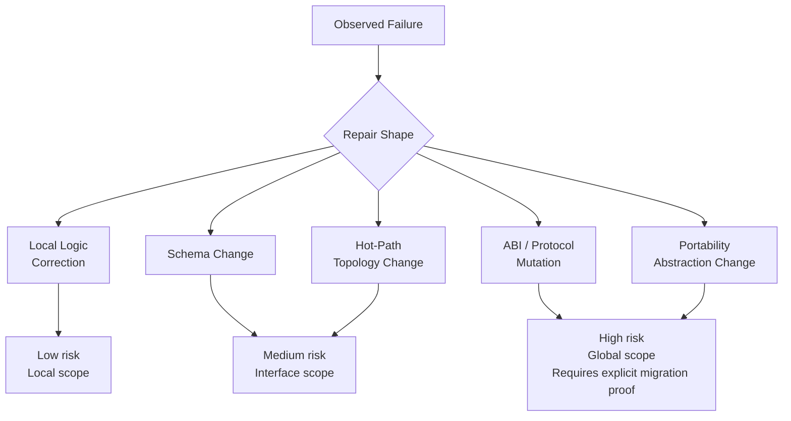
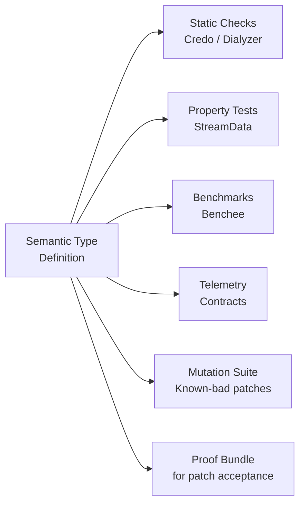
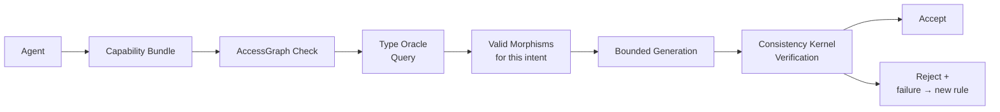
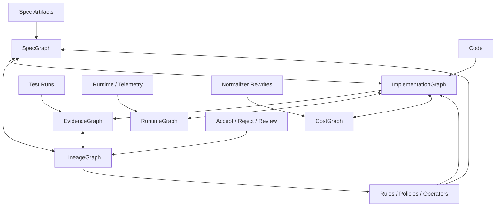
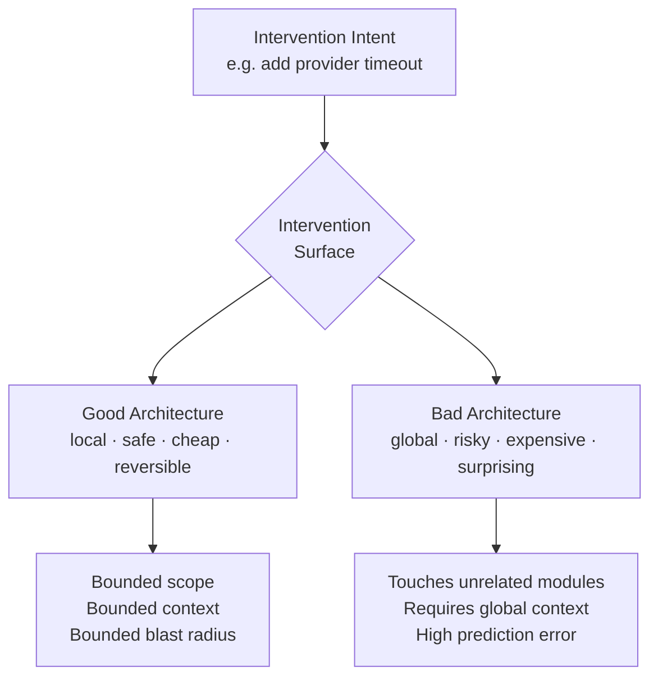
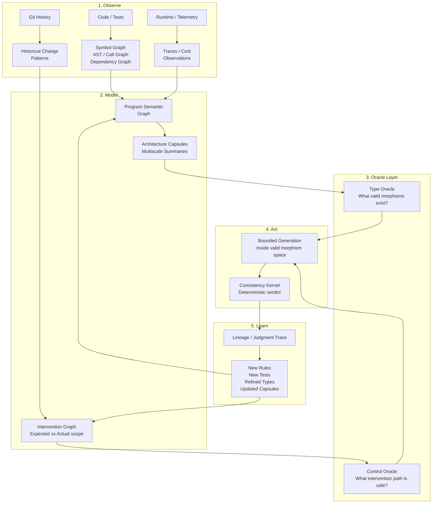

# Executable Architecture: Why Agentic Coding Fails on Large Systems and What to Do About It

This is a synthesis of a long line of thinking about AI-assisted software engineering. It starts from a concrete failure case and ends somewhere more fundamental than I expected.

---

## The Incident That Started This

Sebastian Aaltonen gave AI agents write access to his renderer codebase. The agent was asked to fix a font rendering OOM problem. It did fix it — locally, plausibly, with code that compiled and passed narrow tests.

It also:
- added a shader-visible bind group at slot 30, violating the hard WebGPU/Vulkan 4-slot portable ABI limit
- introduced per-buffer metadata that changed hot-path complexity from O(draws) to O(draws × buffers)
- created Metal-only code paths, breaking cross-backend equivalence
- did all of this despite explicit architecture constraints in AGENTS.md

This is not a dumb mistake. It is a locally coherent solution that violated a global architectural contract the model did not actually understand. That is the hardest class of failure: the agent didn't know what it didn't know.

---

## Why Guardrails Are Insufficient

The obvious response is better guardrails: read-only architecture files, AGENTS.md instructions, review gates, adversarial reviewer agents. These help. They are not enough.

A senior engineer would not have made that change. Not because they read a rule that said not to. Because they carry a **causal model of the stack**. They know why the slot limit is 4 — it is load-bearing in the GPU API spec. They know OOM handling belongs in the host, not the shader. They know a per-buffer metadata model changes the cost profile of the entire hot path.

That causal knowledge is not something you can inject via prose. You can document it. The model will nod and override it under local task pressure anyway.

The fundamental limitation is structural: current agents have strong local coherence and weak global model integrity. They optimize for "this compiles and passes narrow tests" and cannot reliably weight that against "this violates the portability contract of the entire backend architecture."

You cannot fix this with more documentation. You fix it by making architecture executable.

---

## Part I: Invariants Must Be Executable

The first move is to stop treating architecture rules as prose and start treating them as machine-checkable artifacts.

"No shader-visible bind group outside slot 3" should not live in a constraint document. It should be a CI check:

```text
parse all shader source
assert no [[group(N)]] or binding(set=N) where N > 3
mutation test: inject group 30, verify check fires
```

That is buildable. It is not speculative. It will catch the failure regardless of what the agent believed about the constraint.

The general pattern is:

```
LLM reads architecture docs and proposes invariant propositions
→ propositions become executable tests, static checks, or property tests
→ CI enforces them mechanically
→ mutation testing validates the checks catch representative violations
→ LLM is out of the enforcement path entirely
```

The remaining hard question is invariant coverage: how do you know your tests encode all the invariants that matter? This is where **mutation testing becomes load-bearing**. Deliberately break known invariants and verify the tests catch the breakage. If a mutation survives, you have a coverage gap.

---

## Part II: Repair Shape Matters

Not all patches are alike. A local font-rendering bug should produce a local repair. It should not produce a backend ABI mutation.

This seems obvious. But nothing in ordinary agentic coding enforces it. An agent given the task "fix the OOM" and write access to the codebase will find any path to task completion, including globally disruptive ones.

The concept needed is **repair shape**: the semantic category of a proposed fix, classified by blast radius and architectural scope.



A patch is not valid merely because it eliminates the observed failure. It is valid only if its blast radius is proportional to the demonstrated fault. The slot-30 patch has catastrophic repair-shape mismatch: local intent, global ABI mutation.

---

## Part III: Architecture as a Semantic Type System

Repair-shape classification and executable invariants are still reactive. The stronger architecture is proactive: the agent should not be able to generate invalid code in the first place.

This requires a semantic type layer above implementation.

Every load-bearing component should have a type that describes not just inputs and outputs but the full semantic denotation:

```
⟦P⟧ = Behavior × Effects × Capabilities × Resources × Cost × Protocol × Observation
```

For the renderer binding architecture, the type might look like:

```yaml
BindingArchitecture : PortableBackendABI {
  backends: [Metal, Vulkan, WebGPU]
  max_shader_visible_bind_groups: 4   # WebGPU hard limit, load-bearing
  abi_delta_requires_explicit_migration: true
  hot_path_descriptor_growth: 0
  backend_schema: equivalent_across_backends
  cost: O(draws), not O(draws × buffers)
}
```

The slot-30 patch fails this type on four dimensions simultaneously. That is not a style violation. That is four type errors.

For Elixir/OTP, the same idea applies. A function like `SessionPool.checkout/2` should be typed as:

```text
SessionId -> WorkerRef
  @ requires Capability<session.worker.checkout>
  @ effects [registry_lookup, worker_checkout, telemetry_emit]
  @ forbids [db_write, network_call, unsupervised_spawn]
  @ protocol session_open -> worker_checked_out
  @ resource mailbox_delta ≤ 1
  @ cost p95 ≤ 20ms
  @ observation emits checkout_start / checkout_stop / checkout_exception
```

Once a component has a semantic type, the system can derive enforcement mechanically:



**Performance is a first-class type**, not an afterthought measured by tests. A change that violates a performance contract is a type error, not a benchmark failure.

---

## Part IV: The Type Oracle

There is a further distinction that matters: the difference between a **type checker** and a **type oracle**.

A type checker is reactive: it rejects code after generation. An oracle is proactive: it tells the agent what valid moves exist before generation.

Instead of: "your patch failed because it violated the portable ABI"

The oracle says: "here are the valid morphisms from the current PortableBackendABI for your declared intent"

The agent generates within that bounded space. Validity is built in, not caught after the fact.

This also clarifies what "capability" means for an agent. It is not a prose rule. It is a typed bundle:

```
CapabilityBundle<ModifyScope = FontPipeline, ReadScope = RendererWide>
```

The agent can read the binding architecture. It cannot modify it. That is enforced structurally, not via instruction.



---

## Part V: The Program Semantic Graph

Individual semantic types are not enough. They need to compose into a shared substrate.

The center of the system is not the LLM. It is a **Program Semantic Graph** where all artifacts — code, tests, docs, benchmarks, telemetry, decisions — are projections of the same underlying engineering truth.



Source code is one projection. Tests are another. Runtime telemetry is another. Documentation is another. The architecture ensures these projections stay consistent.

Every code change is classified as a delta to the implementation graph and checked against the spec graph:

| Delta Class | Meaning | Action |
|---|---|---|
| `conforming_detail` | Code changed, tracked architecture did not | Allow after evidence |
| `spec_violation` | Code now does something spec forbids | Reject or repair |
| `spec_omission` | Code may be legitimate but spec lacks it | Require spec update |
| `implementation_bloat` | Structure added without load-bearing reason | Normalize or reject |
| `spec_refinement_candidate` | Code reveals a real missing concept | Human/LM refinement |
| `dead_behavior` | Behavior no spec references | Delete or justify |

Drift cannot silently merge. Every change is classified.

---

## Part VI: Architecture Quality Is Predictive Compression

Here is where the argument goes somewhere I did not expect.

Everything above assumes you already know what the invariants are. But the harder question is: **given a large, unfamiliar codebase, how do you judge whether its architecture is good before you know the invariants?**

A senior engineer looks at a messy system and says "this is junk" — not because they violated a specific rule, but because they can sense that no compact model explains it.

The criterion is **predictive compression**:

> Architecture quality is the degree to which a system can be lossily compressed into smaller representations that remain predictive for the changes and questions that matter.

A good architecture supports compact summaries — **architecture capsules** — that accurately predict:

- which components a given change will touch
- what breaks if a component fails
- where policy or behavior belongs
- what the cost profile looks like for a given path

A bad architecture cannot be summarized without lying. Every change requires arbitrary code archaeology.

```yaml
capsule: session_pool
purpose: owns session worker checkout/checkin lifecycle
public_operations: [checkout/2, checkin/2]
owned_state: [session_to_worker_mapping, worker_lifecycle_state]
effects: [registry_lookup, supervisor_start_child, telemetry_emit]
protocols: session_open -> worker_checked_out -> worker_checked_in
cost: checkout p95 ≤ 20ms
known_scenarios: [add worker backend, change session id format, add checkout auth]
```

This capsule is not documentation. It is a **predictive summary**. If it is small and accurate, the architecture is good. If it needs endless exceptions, the architecture is leaking.

The context window is the measurement device. If a subsystem's capsule — purpose, interface, owned state, effects, dependencies, protocols, quality constraints — exceeds bounded context, that is already evidence of architectural failure.

---

## Part VII: The Missing Object — Interventions

The deepest turn in this line of thinking is the realization that representations are not the fundamental object.

Everything we built — semantic graphs, types, capsules, invariants, oracles — is useful, but still secondary to the real question:

> **Given a system, can you reliably steer it from one valid state to another valid state under realistic future pressures?**

Architecture is not a representation problem. It is a **controllability problem**.

A codebase can be well-documented, well-typed, well-tested, and still be architecturally bad if every meaningful change requires dangerous global surgery.

The right definition is:

> **Architecture is the shape of a system's intervention surface.**

The intervention surface determines whether expected changes are:

```
local or global
safe or dangerous
cheap or expensive
obvious or hidden
reversible or irreversible
parallelizable or bottlenecked
```



When a senior engineer says "this is junk," they are sensing a hostile intervention surface. Local intentions require global edits. Abstractions are fake control handles. Corrections are neither local nor reversible.

The slot-30 patch is the clearest example: the intervention intent was a local font OOM fix. The actual control surface used was the global renderer binding topology and Metal backend ABI. That is catastrophic **intervention distance** — the gap between desired semantic change and actual architectural region modified.

---

## The Full Architecture

Putting all of this together, the system has five layers:



The control oracle is more important than the type oracle. The type oracle asks "is this term valid?" The control oracle asks "what intervention should be used to steer this system safely?"

---

## The Reality Check

This is the point where honesty is required.

| Claim | Confidence |
|---|---|
| Generated invariant tests from semantic specs create value | High |
| Capability-scoped agents reduce bad edits | High |
| Mutation testing validates invariant coverage | High |
| Runtime observations should calibrate cost envelopes | High |
| Architecture capsules improve AI agent performance | High |
| Universal semantic graph can stay accurate automatically | Medium-low |
| Deterministic codegen from semantic structure broadly | Low today |
| Full general-purpose software substrate | Only after narrow wins |

The danger is building the cathedral before proving the nave. An ontology that grows bigger than the code, semantic facts that rot, anchors that go stale, LLMs filling the graph with plausible garbage — that is the failure mode.

The rule is: **no semantic fact has authority unless it is tied to executable evidence.** Architectural claim + source anchor + deterministic check + known-bad mutation + runtime observation. If you cannot attach those, the fact is probably not worth modeling yet.

---

## The MVP

Do not start with the universal graph. Start with one vertical slice where the payoff is immediate.

For Elixir/OTP, the target is a supervised `SessionPool`. Four semantic types:

```
AgentCapabilityBundle   - typed agent authority: read/modify/execute/delegate
BoundaryProcess         - OTP process boundary: callbacks, effects, telemetry, supervision
SessionProtocol         - ordered lifecycle/session type: legal transitions
HotPathOperation        - cost/resource/observation type: p95, mailbox growth, benchmarks
```

The MVP loop:

```
semantic YAML/DSL
→ generated tests / static checks / benchmarks / telemetry contracts
→ mutation runner: inject known-bad patches
→ patch impact analysis
→ proof bundle
→ deterministic accept/reject verdict
```

The MVP succeeds if it catches these representative AI-bad patches before human review:

- remove capability check from checkout
- spawn unsupervised process from a repair agent
- perform forbidden effect (db_write) in hot path
- skip required telemetry event
- break session protocol ordering
- allow unbounded mailbox growth
- modify global capability rules from a local repair scope

...while still allowing valid local fixes like bounded checkout timeout/retry refinements.

First commands:

```bash
mix spec.audit
mix spec.bundle <cell>
mix spec.accept
mix spec.trace
```

The living system begins when the first failure becomes a rule instead of a note.

---

## The Through-Line

Start from a concrete AI coding failure.

Notice that guardrails fail because models can override prose under local task pressure.

Realize that invariants must be executable to be enforceable.

Realize that repair shape matters — blast radius must be proportional to fault.

Realize that semantic types should describe program meaning including behavior, effects, capabilities, resources, cost, and protocol ordering.

Realize that a type oracle is more useful than a type checker — generate within the valid space, not after rejection.

Realize that individual types need a shared substrate — a Program Semantic Graph where all artifacts are consistent projections.

Realize that the deepest question is not whether invariants hold but whether the architecture admits compact models that predict change accurately.

Realize that architecture is ultimately a controllability problem — the intervention surface is the real object, and good architecture is one where expected changes are local, safe, cheap, observable, and reversible.

The final thesis:

> **Autonomous coding becomes viable only when software architecture becomes an executable control system over change.**

The LLM should not be trusted to infer every load-bearing constraint from prose. It should operate inside a substrate where architecture is typed, projected, tested, mutated, observed, versioned, and used to control interventions.

Architecture documents that generate their own enforcement. That is the thing that does not exist yet.

---

*This document synthesizes `./agentic_coding/` files 0001–0014 and 0100–0107. The MVP docset is in `0009_elixir_otp_executable_architecture_mvp/`.*
