# Living Substrate Architecture v2

## 0. Core Claim

The Elixir AI Engineer is not a coding agent, not a static spec compiler, and not a one-shot workflow.

It is a **living engineering substrate**: a continuously maintained engineering control surface that projects specifications, code, runtime behavior, evidence, credentials, capability boundaries, and engineering judgment into shared graphs.

Its purpose is to use those graphs to:

```text
1. constrain generation,
2. reject invalid structure,
3. compress bloated candidates,
4. falsify invariants adversarially,
5. refine specifications,
6. govern authority over code and credentials,
7. evolve the harness that performs lowering.
```

The system is not primarily a pipeline from spec to code.

It is a **multi-timescale feedback engine** where skills, tools, LMs, and optional autonomous agents are bounded proposal operators inside a governed substrate.

---

## 1. Clarifications Added in v2

This version makes eight explicit clarifications.

| # | Clarification | Consequence |
|---:|---|---|
| 1 | The substrate is lifetime-scoped for load-bearing engineering facts, not every incidental activity. | The graph is an engineering memory, not a total activity recorder. |
| 2 | Engineering Normal Form has stable core, project policy, experimental, and exception layers. | ENF can be stable where it must be stable, and adaptive where evidence supports change. |
| 3 | Budgets are per SpecCell/module kind and can trigger re-budget, split, or redesign. | Size and complexity budgets are explicit design controls, not arbitrary line-count caps. |
| 4 | Skills can be the primary operators; autonomous agents are optional. | The substrate does not require agent swarms. It can run as skill-driven deterministic workflow. |
| 5 | The AccessGraph governs read/modify/execute/delegate rights across both code and credentials. | Code edits and credentialed effects share one authority model. |
| 6 | Context initialization is explicit, reproducible, and mode-switchable. | Runs are not hidden prompt state. They are declared execution contexts. |
| 7 | Harness evolution is deterministic-metric driven, not open-ended fuzzy HPO. | The harness evolves through measured outcome deltas, not vibes or unconstrained search. |
| 8 | SpecCells are multigranular and automated. | SpecCells can exist at system, subsystem, component, module, operation, and test-obligation levels. |

---

## 2. The Missing Shift

The previous architecture was useful but too static. It still implied:

```text
spec -> bundle -> skeleton -> LM -> audit -> accept
```

That pipeline remains valid as one operational lowering path, but it is not the core innovation.

The actual shift is:

```text
software development becomes a continuously observed, graph-projected,
adversarially tested, self-normalizing, self-improving control system.
```

The harness is not merely something that runs before merge.

The harness is the environment in which the software exists.

However, the substrate is **not lifetime-scoped for every event**. It is lifetime-scoped for **load-bearing engineering facts**.

It should retain:

```text
- architectural decisions,
- SpecCell versions,
- capability grants and denials,
- code projection lineage,
- rejected and accepted patch trajectories,
- invariant failures,
- adversarial counterexamples,
- ENF violations and exceptions,
- credentialed-effect evidence,
- runtime observations tied to cost or safety contracts,
- harness/policy changes and their measured outcomes.
```

It should not retain incidental chat, transient scratch text, irrelevant prompt debris, or every token of every local attempt unless that material becomes evidence, lineage, or a reusable failure pattern.

The substrate is a long-lived engineering memory, not a surveillance log.

---

## 3. Three Nested Feedback Loops

The living substrate has three primary loops operating at different timescales.

```text
Inner loop: Candidate synthesis
  seconds to minutes
  produces and repairs local implementation candidates

Middle loop: Normalization and evidence
  minutes to hours
  compresses working code into Engineering Normal Form

Outer loop: Harness evolution
  hours to weeks
  converts failures into new rules, tests, operators, cost weights,
  lowering strategies, and context-initialization modes
```

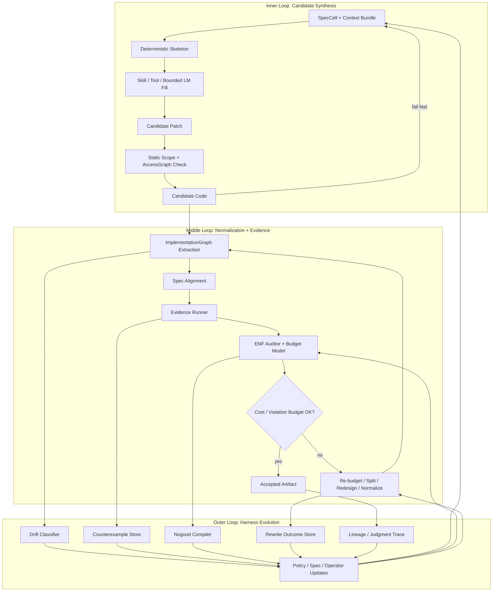

The important move is that failure does not merely trigger another prompt.

Failure becomes substrate material.

A failed patch can become:

```text
- a new static rule,
- a new property test,
- a new forbidden pattern,
- a new skeleton constraint,
- a revised SpecCell,
- a changed budget,
- a changed cost weight,
- a new benchmark case,
- a labeled judgment trajectory,
- a narrowed capability bundle,
- a new context initialization mode.
```

---

## 4. The Substrate Surface

The system’s center is not the LM.

The center is the graph substrate.

Every load-bearing artifact projects into the substrate:

```text
specification
code
runtime topology
tests
telemetry
adversarial failures
normalization rewrites
human decisions
skill executions
LM attempts
acceptance records
credentialed effects
capability decisions
```

These are not stored as disconnected logs. They become graph facts.

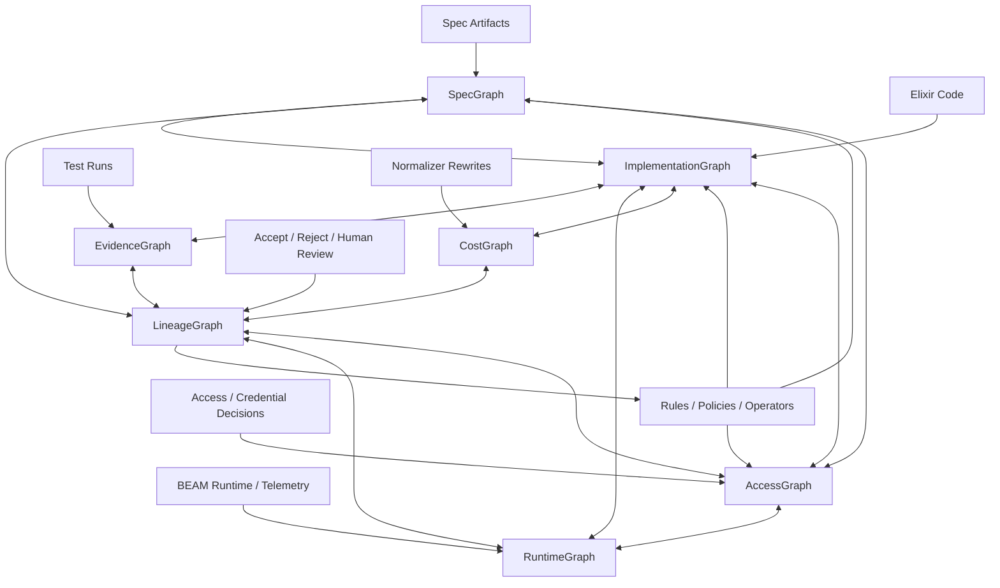

The substrate is a continuously maintained surface of engineering truth.

The codebase is one projection.

The spec is another projection.

The tests are another projection.

The runtime is another projection.

The AccessGraph is the authority projection.

The LineageGraph records why each projection changed.

---

## 5. Scope: Lifetime Engineering Memory, Not Total Activity Capture

The substrate persists information according to engineering load-bearing value.

### Persist by default

```text
- SpecCell definitions and versions
- domain entities and boundary edges
- capability grants, denials, delegations, and exceptions
- credential lease lifecycle records at the policy/evidence level
- accepted and rejected patch trajectories
- ENF violations and normalization outcomes
- adversarial counterexamples
- evidence summaries and invariant coverage
- runtime anomalies tied to semantic contracts
- policy changes and their evaluation metrics
- human-approved exceptions and expiration conditions
```

### Persist only when promoted

```text
- LM reasoning summaries
- exploratory notes
- scratch plans
- failed local attempts
- proposed but unvalidated invariants
- experimental ENF rules
- speculative architecture alternatives
```

### Do not persist as substrate truth

```text
- unvalidated chat text
- incidental prompt artifacts
- arbitrary model self-commentary
- transient search output not used in a decision
- stale context not tied to a versioned artifact
```

The substrate should aggressively distinguish:

```text
candidate fact
hypothesis
validated static fact
mutation-proven fact
runtime-observed fact
human-approved exception
deprecated fact
```

This is the difference between a living engineering substrate and an ever-growing pile of context sludge.

---

## 6. The Five Living Graphs Plus AccessGraph

### 6.1 `SpecGraph`

Represents what should exist.

Contains:

```text
charter invariants
entities
relationships
capabilities
boundaries
contracts
protocols
effects
runtime expectations
SpecCells
test obligations
budgets
ENF layer bindings
```

### 6.2 `ImplementationGraph`

Represents what code actually built.

Contains:

```text
modules
functions
public APIs
calls
behaviours
protocols
GenServers
Supervisors
DynamicSupervisors
Registries
ETS tables
effects
config reads
telemetry emissions
credential materialization paths
source anchors
```

### 6.3 `EvidenceGraph`

Represents what has been tested, falsified, proven, or observed.

Contains:

```text
unit tests
property tests
state-machine tests
adversarial tests
fault-injection outcomes
redaction tests
runtime invariant checks
coverage of spec obligations
mutation kill reports
```

### 6.4 `RuntimeGraph`

Represents what the running BEAM system actually does.

Contains:

```text
process trees
supervision restarts
messages
pool checkouts
sandbox spawns
connector invocations
credential redemptions
telemetry events
latency/memory/backpressure
crash behavior
runtime authority checks
```

### 6.5 `LineageGraph`

Represents why each artifact exists.

Contains:

```text
which SpecCell caused which module
which skill/operator produced which patch
which LM generated which candidate
which detector rejected which artifact
which normalizer rewrote which structure
which test falsified which invariant
which human accepted which exception
which rule was born from which failure
which metric justified which harness change
```

This is the most valuable graph.

GitHub contains final code.

The living substrate contains engineering judgment.

### 6.6 `AccessGraph`

Represents authority over both **code** and **effects**.

Contains:

```text
actors
skills
agents
human operators
capability bundles
read rights
modify rights
execute rights
delegate rights
credential lease rights
trust zones
context boundaries
Π-token derivations
denial records
exception grants
```

The AccessGraph is not only for runtime credentials. It governs the whole substrate.

It answers:

```text
Who may read this SpecCell?
Who may modify this module?
Who may execute this skill?
Who may delegate this capability?
Who may issue this credential lease?
Who may redeem this lease?
Who may approve this ENF exception?
Who may change the harness policy?
```

---

## 7. AccessGraph as the Common Primitive

The deepest convergence is that several apparent systems collapse into one substrate primitive.

```text
identity
capabilities
session scope
effect ordering
credential authority
connector access
sandbox boundaries
proof tokens
runtime graph edges
spec projection edges
code write permissions
harness policy mutation rights
```

These are not parallel layers.

They are views over a governed graph.

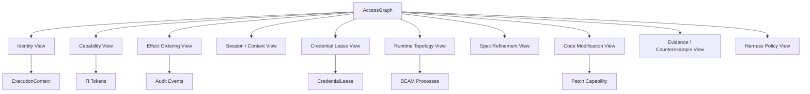

### Consequence

Capabilities replace personas.

Credentials become governed effects.

Session types become edge attributes.

Proof tokens become capability derivations.

Runtime topology becomes graph projection.

Spec-to-code traceability becomes graph refinement.

Code edits become authorized graph mutations.

---

## 8. Skills First, Agents Optional

The living substrate is not an agent swarm.

Traditional agent systems distribute judgment across personas:

```text
Planner
Explorer
Coder
Reviewer
Critic
Arbiter
```

The living substrate collapses role theater into **capability-bounded operators**.

An operator may be:

```text
- a deterministic skill,
- a Mix task,
- a static analyzer,
- a property-test generator,
- a normalizer,
- a human reviewer,
- a local LM call,
- a frontier LM call,
- a fully autonomous agent.
```

Autonomous agents are optional. Skills can be the primary operators.

```text
role = capability bundle + allowed graph operations + allowed artifact writes
```

A persona saying “I cannot edit code” is weak.

A capability boundary that prevents code writes is strong.

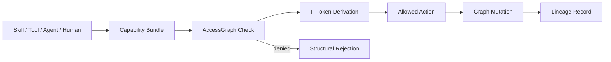

A skill-centered setup is fully compatible with the living substrate:

```text
Skill reads ContextBundle.
Skill executes deterministic or bounded operation.
Skill emits patch/evidence/report.
AccessGraph checks authority.
LineageGraph records output.
Consistency gates accept or reject.
```

The system should not require agent autonomy for correctness. Autonomy is an execution mode, not the architecture.

---

## 9. Context Initialization

Context initialization must be explicit, reproducible, and mode-switchable.

A context is not hidden conversation residue. It is a declared runtime artifact.

```yaml
context_initialization:
  id: ctx_init.credential_fabric.local_dev.v1
  mode: local_dev
  substrate_version: living_substrate_v2
  spec_graph_hash: sha256:...
  access_graph_hash: sha256:...
  enf_policy_hash: sha256:...
  skill_set:
    - spec.audit
    - spec.bundle
    - spec.accept
    - stacklab.adversary
  trust_zone: host
  default_actor: local_developer
  credential_policy: fake_or_local_dev_only
  allowed_effects:
    - read_repo
    - write_allowed_files
    - run_tests
  forbidden_effects:
    - external_provider_call
    - production_secret_materialization
```

### Required properties

```text
explicit:
  Every run declares its context, mode, authority, graph hashes, and allowed effects.

reproducible:
  A prior run can be reconstructed from graph version, bundle hash, policy hash, and skill versions.

mode-switchable:
  The same SpecCell can run under local_dev, ci, sandboxed_agent, human_review,
  production_migration, or adversarial_test modes with different authority.
```

### Core modes

| Mode | Purpose | Typical authority |
|---|---|---|
| `local_dev` | developer iteration | read/write local allowed files; fake credentials |
| `ci` | deterministic validation | read repo; run checks; no source mutation |
| `sandboxed_agent` | bounded autonomous patching | write only allowed files; no credential material |
| `human_review` | exception or policy review | inspect lineage; approve/reject exception |
| `adversarial_test` | StackLab counterexample search | mutate test fixtures; cannot merge code |
| `production_migration` | governed live migration | strict credential/effect controls |

Bad:

```text
implicit singleton context hidden in config
```

Good:

```text
Citadel.start(mode: :local_dev) returns a generated default ExecutionContext.
```

Promotion to enterprise 1:N becomes:

```text
pass different contexts
```

not:

```text
retrofit context into hidden globals
```

---

## 10. Engineering Normal Form v2

Engineering Normal Form is not one monolithic style guide.

It has four layers.

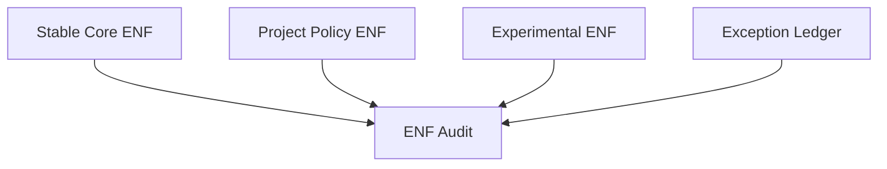

### 10.1 Stable Core ENF

Stable core rules are durable, conservative, and rarely changed.

Examples:

```text
- no GenServer without state ownership, lifecycle, concurrency, or resource justification
- no public function without contract trace
- no undeclared external effect
- no credential material outside trusted materializer boundary
- no raw secret in logs, telemetry, crash output, or agent-visible state
- no lower layer silently widens authority
```

Stable core changes require high-friction review because they define the substrate’s engineering constitution.

### 10.2 Project Policy ENF

Project policy rules encode local design preferences and budgets.

Examples:

```text
- max public functions per BoundaryAPI
- max module count for a SpecCell
- preferred adapter style
- project-specific naming projections
- default call vs cast policy
- tolerated supervision depth
```

These may evolve across project phases.

### 10.3 Experimental ENF

Experimental rules are hypotheses.

Examples:

```text
- new cost weights
- new normalizer rewrite
- new detector for bloated modules
- new heuristic for context residual
- new budget shape for a module kind
```

Experimental ENF cannot block merges until promoted. It can emit warnings, collect metrics, and run in shadow mode.

### 10.4 Exception Ledger

Exceptions are explicit, scoped, justified, expiring facts.

```yaml
enf_exception:
  id: exception.credential_fabric.lease_registry.genserver.v1
  rule: no_genserver_without_state_ownership
  scope: credential_fabric.lease_registry
  reason: serializes lease redemption and revocation epoch updates
  approved_by: human_architecture_owner
  expires_on: 2026-06-01
  revalidation_required:
    - runtime contention metrics
    - property test for redemption serialization
```

An exception is not a silent override. It is lineage material.

---

## 11. Budgets: Per SpecCell and Module Kind

Budgets are not global arbitrary size caps.

They are assigned by **SpecCell**, **module kind**, and **risk class**.

```yaml
budget:
  spec_cell: credential_fabric.lease_registry
  module_kind: StatefulProcess
  risk_class: security_critical
  limits:
    modules: 3
    public_functions: 12
    genservers: 1
    behaviours: 0
    external_effects: 0
    callback_complexity: low
  evidence_required:
    - wrong_connector_cannot_redeem
    - revoked_lease_cannot_redeem
    - no_secret_material_in_state
    - redemption_serialization_property
```

### Budget outcomes

When a candidate exceeds budget, the substrate does not blindly reject. It classifies the overrun.

| Outcome | Meaning | Action |
|---|---|---|
| `normalize` | bloat without load-bearing need | run normalizer / reduce abstractions |
| `split_spec_cell` | SpecCell is too broad | split into smaller cells |
| `re_budget` | original budget was too strict | require evidence and approval |
| `redesign` | wrong runtime or boundary shape | return to architecture tournament |
| `exception` | justified one-off excess | ledger entry with expiration |
| `reject` | invalid or unjustified structure | block |

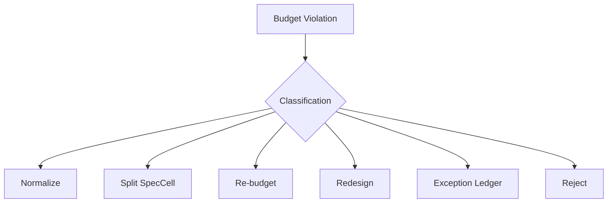

### Why this matters

If a solution cannot fit the budget, there are several possibilities:

```text
- the generated implementation is bloated,
- the SpecCell is too large,
- the architecture decision is wrong,
- the problem is genuinely more complex than estimated,
- the budget is stale,
- the project policy needs adjustment.
```

Budgets are control signals, not blunt instruments.

---

## 12. Harness Evolution Without Fuzzy HPO

Harness evolution should be deterministic-metric driven, not open-ended fuzzy hyperparameter search.

The substrate may compare harness versions, but only through declared metrics and bounded experiments.

### Pipeline as versioned artifact

```yaml
pipeline: credential_fabric_v7

operators:
  - parse_spec_cell
  - generate_runtime_candidates
  - choose_runtime_shape
  - generate_skeleton
  - generate_property_tests
  - bounded_lm_fill
  - extract_impl_graph
  - run_evidence
  - run_enf_audit
  - normalize
  - re_run_evidence
  - record_lineage

cost_weights:
  module_count: 0.25
  public_function_count: 0.30
  process_count: 0.75
  single_impl_behaviour: 1.00
  undeclared_effect: inf
```

### Allowed optimization targets

```text
- accepted candidates per token
- frontier calls per accepted component
- normalization delta
- module bloat ratio
- ENF violation rate
- false positive rate
- human review defect rate
- runtime failure rate
- spec drift rate
- mutation kill rate
- context residual reduction
```

### Disallowed evolution

```text
- unconstrained prompt tweaking with no metric target
- weakening ENF rules because agents fail
- accepting fuzzy LLM quality rankings as final truth
- optimizing for first-pass success over accepted-normal-form quality
- changing budgets without lineage and evidence
```

### Promotion ladder

```text
experimental detector
  -> shadow-mode metrics
  -> mutation validation
  -> false-positive review
  -> project-policy rule
  -> stable-core candidate only after repeated cross-project success
```

The harness evolves like an engineering system, not like a prompt search toy.

---

## 13. Continuous Reverse Extraction

The previous architecture treated extraction as a stage.

The living substrate treats extraction as continuous.

Every code change projects back into the ImplementationGraph.

Every graph delta is classified.

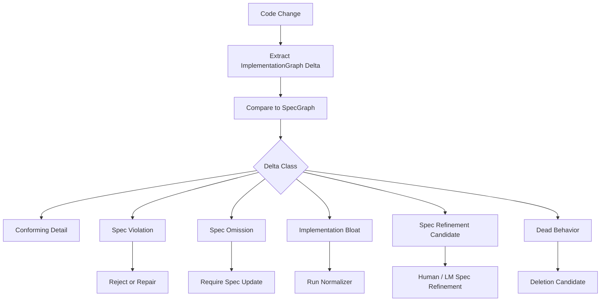

### Delta classes

| Class | Meaning | Action |
|---|---|---|
| `conforming_detail` | Code changed but tracked architecture did not. | Allow after evidence. |
| `spec_violation` | Code now does something the spec forbids. | Reject or repair. |
| `spec_omission` | Code may be legitimate but spec lacks it. | Require spec update. |
| `implementation_bloat` | Structure added without load-bearing reason. | Normalize or reject. |
| `spec_refinement_candidate` | Code reveals a real missing concept. | Human/LM spec refinement. |
| `dead_behavior` | Code implements behavior no spec references. | Delete or justify. |

This prevents every feature update from becoming a forensic investigation.

---

## 14. Multigranular Living SpecCells

A SpecCell is not a static document.

It is a living node in the substrate.

SpecCells are **multigranular**.

| Level | Example | Purpose |
|---|---|---|
| System | AI Engineering Substrate | top-level invariants and product mission |
| Domain | Credential Fabric | domain ownership and boundaries |
| Component | Lease Registry | state ownership and public operations |
| Process | LeaseRegistry GenServer | runtime lifecycle and concurrency |
| Module | CredentialLease | data shape and pure behavior |
| Operation | `redeem/3` | preconditions, effects, errors |
| Test obligation | wrong connector cannot redeem | evidence requirement |
| Invariant | no raw secret exposure | durable safety fact |
| Budget | lease registry module budget | complexity control |

A mature SpecCell accumulates:

```text
spec declarations
implementation projections
evidence coverage
known counterexamples
normalization history
runtime observations
human decisions
operator performance
budgets
exceptions
context initialization requirements
```

```mermaid
flowchart TD
    Cell[SpecCell]
    Cell --> Purpose[Purpose]
    Cell --> Domain[Domain References]
    Cell --> Boundary[Boundary]
    Cell --> Contracts[Contracts]
    Cell --> State[State / Protocols]
    Cell --> Effects[Effects]
    Cell --> Runtime[Runtime Shape]
    Cell --> Tests[Test Obligations]
    Cell --> Budget[Budget]
    Cell --> Impl[Implementation Projection]
    Cell --> Evidence[Evidence Coverage]
    Cell --> Counter[Counterexamples]
    Cell --> Cost[Cost History]
    Cell --> Exceptions[Exception Ledger]
    Cell --> Lineage[Lineage]
```

### Automated SpecCells

SpecCells should be automatable in both directions.

#### Spec-to-projection

```text
SpecCell -> ContextBundle
SpecCell -> skeleton
SpecCell -> generated tests
SpecCell -> budget
SpecCell -> AccessGraph obligations
SpecCell -> telemetry contract
```

#### Projection-to-spec

```text
code extraction -> candidate SpecCell
runtime trace -> missing effect/protocol candidate
test failure -> missing invariant candidate
normalizer rewrite -> budget/policy candidate
```

Automation does not mean automatic authority. Candidate SpecCells must be validated before becoming substrate truth.

---

## 15. Context Is the Universal Runtime Primitive

`ExecutionContext` is the primitive.

1:N emerges when the system stops assuming singleton context.

```elixir
%ExecutionContext{
  tenant_id: TenantId.t(),
  principal_id: PrincipalId.t(),
  session_id: SessionId.t(),
  actor_id: ActorId.t(),
  trace_id: TraceId.t(),
  causality_id: CausalityId.t(),
  capability_set_id: CapabilitySetId.t(),
  pi_head: Pi.Token.t(),
  governance_epoch: non_neg_integer(),
  trust_zone: :host | :connector | :sandbox | :external,
  boundary: BoundaryRef.t(),
  parent_context: ExecutionContext.id() | nil,
  delegation_depth: non_neg_integer(),
  metadata: map()
}
```

Every serious operation carries context:

```text
session creation
pool checkout
sandbox spawn
connector invocation
credential lease issuance
provider API call
CLI execution
telemetry emission
audit event
spec lowering operator
normalizer rewrite
acceptance decision
harness policy change
```

Defaults must be explicit but generated.

---

## 16. Credentials as Governed Effects

Credential handling is not a secret-storage subsystem.

It is a governed effect system.

A credentialed call is not:

```text
use API key
```

It is:

```text
actor A, in session S, under tenant T, using capability C,
performs operation O on resource R through connector K,
with Π-chain P, AccessGraph edge E, credential lease L,
inside boundary B, producing audit event Q.
```

### Credential Fabric

```text
CredentialFabric.Supervisor
├── CredentialAuthority
├── CredentialCatalog
├── LeaseIssuer
├── LeaseRegistry
├── RevocationIndex
├── SecretBackendSupervisor
├── MaterializerSupervisor
├── AuditSink
└── RedactionPolicy
```

### The central object is `CredentialLease`

```elixir
%CredentialLease{
  lease_id: LeaseId.t(),
  tenant_id: TenantId.t(),
  principal_id: PrincipalId.t(),
  session_id: SessionId.t(),
  actor_id: ActorId.t(),
  credential_handle: CredentialHandle.t(),
  capability_id: CapabilityId.t(),
  connector_id: ConnectorId.t(),
  operation: Operation.t(),
  resource: ResourceRef.t(),
  issued_at: DateTime.t(),
  expires_at: DateTime.t(),
  revocation_epoch: non_neg_integer(),
  pi_head: Pi.Token.t(),
  access_graph_edge: AccessGraph.EdgeId.t(),
  constraints: CredentialConstraints.t(),
  redeemable_by: ConnectorId.t() | ProxyId.t(),
  exportable?: false
}
```

The agent may hold a lease reference.

Only a trusted connector or materializer may redeem it.

The secret exists only at the final effect boundary.

---

## 17. Projection, Not Cache

Most code intelligence systems build a graph from code and treat it as a cache.

The living substrate inverts this.

```text
The graph is the source of engineering truth.
Code is a projection.
Specs are projections.
Tests are projections.
Runtime evidence is a projection.
```

For brownfield code, extraction bootstraps the graph.

For greenfield code, the graph constrains generation.

For ongoing development, graph deltas govern change.

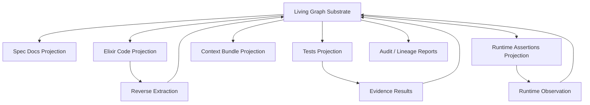

The graph may initially be incomplete.

But the direction of truth is clear.

Every artifact is either:

```text
1. a projection of the graph,
2. a proposed mutation to the graph,
3. evidence about the graph,
4. or rejected drift.
```

---

## 18. The Adversary Is a First-Class Subsystem

A generator-verifier loop is insufficient.

The missing third party is the adversary.

```text
Generator proposes.
Verifier checks declared obligations.
Adversary tries to falsify invariants.
```

StackLab is not just a test harness.

StackLab is the adversarial engine that turns latent design gaps into counterexamples.

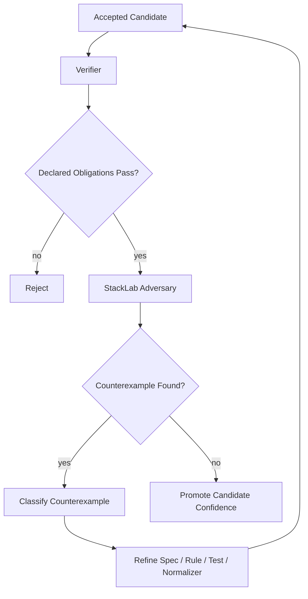

Counterexamples refine specifications, not just code.

That is the CEGAR loop:

```text
counterexample -> abstraction refinement -> constrained regeneration
```

The substrate learns from the adversary.

---

## 19. The Real Product: Judgment Traces

The output is not merely accepted code.

The output is a **lowering trajectory**.

```yaml
trajectory:
  task_id: credential_lease_registry.issue

  input:
    spec_cell: credential_fabric.lease_registry
    context_bundle_hash: abc123
    enf_policy_hash: def456
    access_graph_hash: ghi789

  candidate:
    generator: bounded_lm_fill
    model: local_or_frontier_model
    patch_hash: c01

  extraction:
    modules: 8
    genservers: 3
    behaviours: 2
    public_functions: 41
    effects: []

  evaluation:
    compile: pass
    tests: pass
    property_tests: pass
    spec_alignment: pass
    access_graph: pass
    enf: fail

  rejection:
    reasons:
      - single_implementation_behaviour
      - unjustified_genserver
      - public_api_budget_exceeded
      - duplicated_validation_logic

  normalization:
    rewrites:
      - collapse_single_impl_behaviour
      - remove_stateless_genserver
      - reduce_public_api
      - merge_validator_modules

  result:
    modules: 3
    genservers: 1
    behaviours: 0
    public_functions: 14
    cost_delta: -63%
    evidence_preserved: true

  accepted: true
```

This is richer than ordinary training data because it includes:

```text
- rejected alternatives,
- reasons for rejection,
- simplification paths,
- invariant failures,
- evidence outcomes,
- accepted normal form,
- context and authority state.
```

The strategic value is the dataset of engineering judgment traces.

---

## 20. Living Acceptance

Acceptance is not a single gate.

Acceptance is a state with provenance.

```text
unseen
  -> candidate
  -> structurally_valid
  -> evidence_passing
  -> normal_form_passing
  -> adversarially_challenged
  -> accepted
  -> runtime_observed
  -> stale_or_refined
```

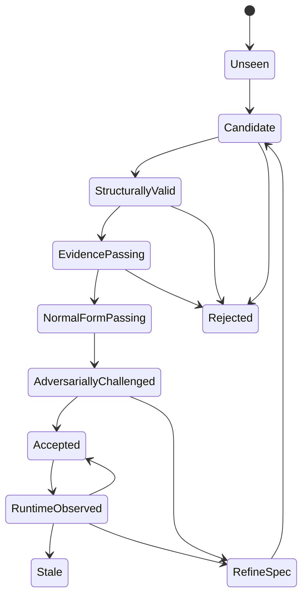

Accepted code can become stale when:

```text
- the spec changes,
- runtime evidence contradicts assumptions,
- new adversarial counterexamples appear,
- ENF policy evolves,
- dependencies change,
- Elixir/OTP version changes,
- domain model changes,
- AccessGraph policy changes,
- context initialization mode changes.
```

Living acceptance means the system knows when previously accepted code needs revalidation.

---

## 21. Resource-Constrained Intelligence

The substrate assumes frontier calls are expensive.

It therefore minimizes semantic uncertainty per dollar.

Escalation ladder:

```text
1. deterministic rule
2. static analysis
3. generated test
4. property / state-machine test
5. cheap LM classifier
6. local LM repair
7. frontier LM repair
8. human review
```

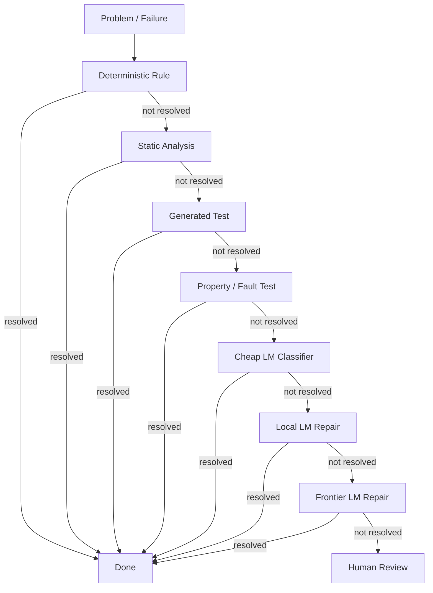

A frontier model is not the default engine.

It is the escalation path for ambiguity, novelty, or repeated failure.

---

## 22. The Innovation in One Sentence

```text
A living substrate for AI software engineering where load-bearing specs, code,
runtime behavior, authority, evidence, and engineering judgment are continuously
projected into shared graphs; skills and optional agents propose bounded mutations;
deterministic and adversarial systems verify, compress, and classify those mutations;
and every consequential failure evolves the harness through measured policy changes.
```

---

## 23. The Innovation in Lab Language

Current coding agents optimize for producing plausible patches.

This system optimizes the **acceptance and normalization loop** around generated code.

It produces training-grade trajectories:

```text
spec -> context -> authority -> candidate -> extracted graph -> violation -> rewrite -> evidence -> accepted normal form
```

The strategic contribution is not another agent.

It is a **data engine for engineering judgment**.

Every rejected abstraction, every failed invariant, every compression rewrite, every accepted normal form, every adversarial counterexample, and every authority denial becomes labeled supervision for future coding systems.

---

## 24. The Concrete Build Pivot

Do not build the whole living substrate at once.

Build the first living loop.

### MVP loop

```text
SpecCell
  -> Context Bundle
  -> AccessGraph authorization
  -> Candidate Patch
  -> ImplementationGraph Extraction
  -> ENF Audit
  -> Evidence Run
  -> Normalization Report
  -> Lineage Record
  -> Rule/Test/Spec Update
```

### First commands

```bash
mix spec.audit
mix spec.bundle <cell>
mix spec.accept
mix spec.trace
```

### First five detectors

```text
1. GenServer without state ownership justification.
2. Behaviour with one implementation.
3. Public function without contract trace.
4. External effect without declaration.
5. Domain term absent from domain model.
```

### First proof slice

```text
Governed provider invocation through Credential Fabric + Connector Fabric.
```

### First adversarial suite

```text
agent cannot read provider credential
wrong connector cannot redeem lease
revoked lease cannot be redeemed
missing Π-chain fails
missing AccessGraph edge fails
provider call without audit fails
logs/telemetry/crash output contain no secret
```

### First quantitative claim

```text
Compared to naive AI-generated Elixir for the same slice, the harness produces
accepted BEAM-normal-form code with fewer modules, fewer public functions,
fewer unjustified OTP primitives, preserved behavior, explicit traceability,
and explicit authority lineage.
```

---

## 25. What Changes from v1

| v1 / static phrasing | v2 clarification |
|---|---|
| Lifetime project frame sounded like all activity. | Lifetime scope applies to load-bearing engineering facts only. |
| ENF sounded like a single evolving style guide. | ENF has stable core, project policy, experimental, and exception layers. |
| Size budget sounded arbitrary. | Budgets are per SpecCell/module kind and trigger normalize/split/re-budget/redesign/exception/reject. |
| Agents sounded central. | Skills and deterministic operators can be primary; agents are optional. |
| AccessGraph sounded mostly runtime/security-specific. | AccessGraph governs read/modify/execute/delegate over code, specs, policies, credentials, and effects. |
| Context sounded like prompt setup. | Context initialization is explicit, reproducible, and mode-switchable. |
| Harness evolution sounded like open-ended HPO. | Harness evolution is bounded, metric-driven, versioned, and promotion-gated. |
| SpecCells sounded project-wide. | SpecCells are multigranular, living, and automatable in both directions. |

---

## 26. Final Form

The living substrate eventually becomes:

```text
Spec compiler
+ implementation graph extractor
+ BEAM runtime observer
+ Engineering Normal Form normalizer
+ AccessGraph capability substrate
+ Credentialed effect fabric
+ StackLab adversary
+ lineage/judgment trace store
+ harness evolution engine
```

But the bootstrapping path is small:

```text
1. Build graph extraction.
2. Build five slop detectors.
3. Build context bundle compilation.
4. Build AccessGraph enforcement for read/modify/execute/delegate.
5. Build one governed credentialed connector slice.
6. Build lineage records.
7. Build one safe normalizer.
8. Let failures create the next rules.
```

The living system begins when the first consequential failure becomes a rule instead of a note.
