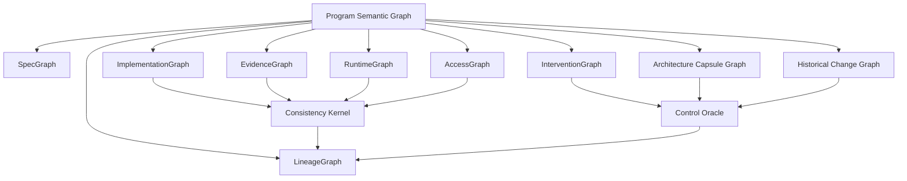
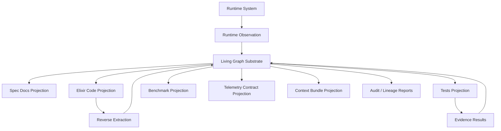
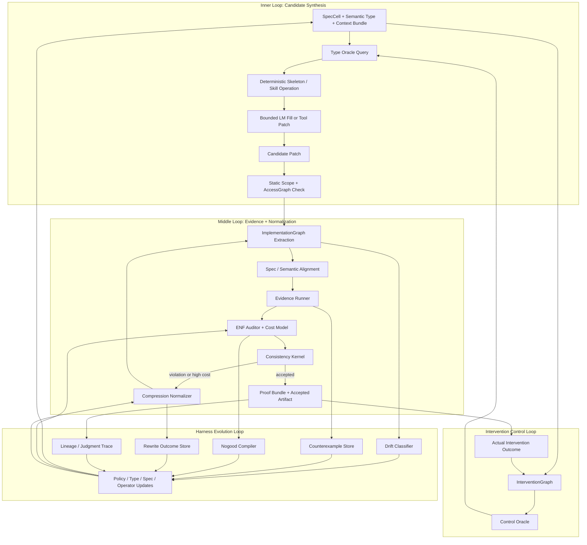
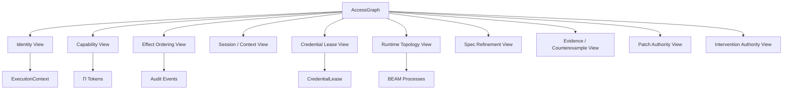
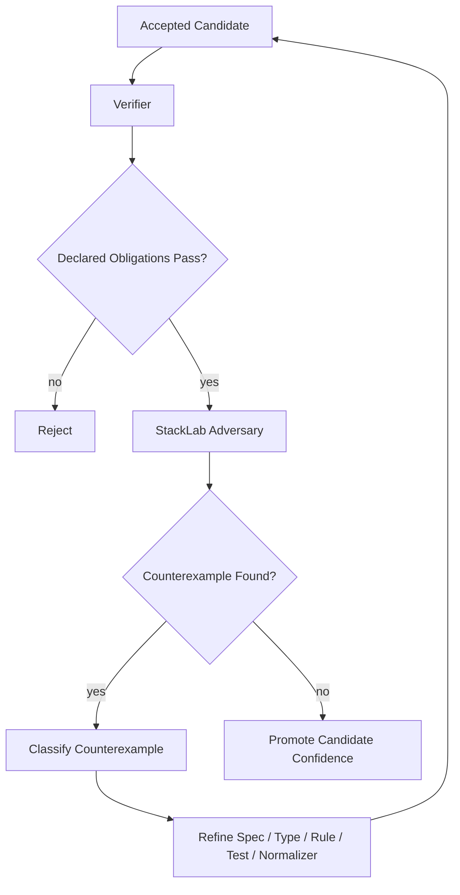
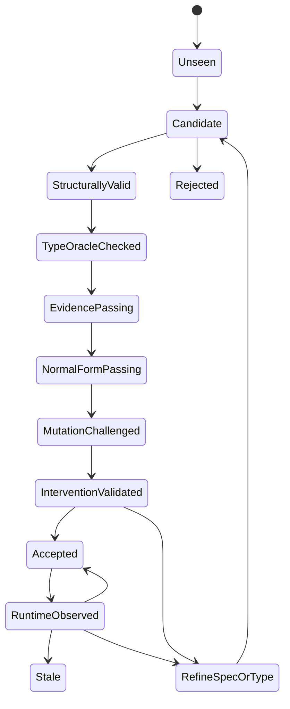

# Living Substrate Architecture v2

**Companion diagram:** `0007_living_substrate_v2_format_fixed.svg`  
**Document role:** standalone v2 architecture note  
**Recommended post path:** `20260505/living_substrate_architecture_v2.md`

---

## 0. Core Claim

The Elixir AI Engineer is not a coding agent, not a static spec compiler, and not a one-shot workflow.

It is a **living, executable, intervention-aware engineering substrate**: a continuously maintained control surface that projects specifications, code, runtime behavior, evidence, credentials, capability boundaries, semantic types, interventions, and engineering judgment into shared graphs.

Its purpose is to use those graphs to:

```text
1. constrain generation,
2. query valid change space before code is written,
3. reject invalid structure,
4. compress bloated candidates,
5. falsify invariants adversarially,
6. refine specifications and semantic types,
7. govern authority over code, tools, runtime effects, and credentials,
8. evaluate architecture by the interventions it can survive,
9. evolve the harness that performs lowering, verification, and acceptance.
```

The system is not primarily a pipeline from spec to code.

It is a **multi-timescale feedback and control system** where skills, tools, LMs, and optional autonomous agents are bounded proposal operators inside a governed substrate.

The compact thesis is:

```text
Living Substrate + Executable Architecture + Intervention Control
= governed software change under bounded AI operators.
```

---

## 1. What v2 Changes

Version 1 established the Living Substrate as a continuously graph-projected engineering harness:

```text
SpecGraph + ImplementationGraph + EvidenceGraph + RuntimeGraph + LineageGraph
+ ENF normalizer
+ context bundles
+ bounded LM fill
+ adversarial evidence
+ living SpecCells
```

Version 2 adds the missing theory of control:

```text
repair-shape classification
executable invariants
cost-refined semantic types
type oracles
capability-scoped repair
semantic source maps
architecture capsules
intervention graphs
control oracles
consistency kernels
proof bundles
mutation-validated architecture claims
```

The important reframing is:

> The substrate should not merely know what code exists. It should know what changes are valid, who may perform them, what they should touch, what they must preserve, what evidence proves them, and how failures update the substrate.

---

## 2. How to Read the v2 SVG

The companion SVG should be read as a control surface, not as a linear workflow.

The center of gravity is the **Living Graph Substrate**. Around it are four major forces:

```text
left:    context initialization + bounded proposal / synthesis
right:   evidence + adversary + consistency kernel
bottom:  normalization + proof bundles + lineage
upper:   type/control oracle + intervention governance
```

The diagram’s most important arrows are not the forward arrows. They are the feedback arrows:

```text
counterexample -> spec/type refinement
runtime anomaly -> cost-type calibration
normalization outcome -> ENF policy update
rejected patch -> nogood / invariant / mutant
accepted proof bundle -> lineage / judgment trace
intervention result -> architecture capsule and control-policy update
```

The SVG is therefore showing a living control system:

```text
bounded proposal -> graph projection -> executable checks -> adversarial falsification
-> proof bundle -> accepted artifact or refined substrate
```

---

## 3. The Missing Shift

The static architecture implied:

```text
spec -> bundle -> skeleton -> LM -> audit -> accept
```

That is useful, but incomplete.

The v2 architecture says:

```text
software development becomes a continuously observed, graph-projected,
mutation-tested, adversarially challenged, self-normalizing,
intervention-aware control system.
```

The harness is not just something that runs before merge.

The harness is the environment in which software change is made possible, bounded, measured, and remembered.

---

## 4. Architecture as Controllability

The deepest v2 turn is that architecture is not primarily about what the system is.

Architecture is about what changes the system can survive.

The central unit is the **intervention**:

```text
add feature
fix bug
replace backend
enforce policy
optimize hot path
remove subsystem
change protocol
migrate data
recover from failure
scale traffic
upgrade dependency
```

A good architecture has a friendly intervention surface:

```text
local
bounded
typed
observable
reversible
cheap enough
blast-radius proportional
consistent with the existing semantic model
```

A bad architecture has a hostile intervention surface:

```text
local intent requires global edits
abstractions are fake control handles
prediction error is high
rollback is unclear
change requires arbitrary archaeology
small fixes mutate global contracts
```

So the final substrate is not only a semantic graph. It is:

```text
Program Semantic Graph
+ Architecture Capsule Graph
+ Historical Change Graph
+ Runtime Observation Graph
+ Intervention Graph
+ AccessGraph
+ Type Oracle
+ Control Oracle
+ Consistency Kernel
```

The **Type Oracle** asks:

```text
What valid morphisms exist for this intent, current semantic type, and capability bundle?
```

The **Control Oracle** asks:

```text
What intervention should steer this system safely from current state to desired state?
```

The Control Oracle is the deeper object. It reasons about change, not just terms.

---

## 5. Lifetime Scope: Engineering Memory, Not Total Activity Capture

The substrate is lifetime-scoped for load-bearing engineering facts.

It should not become a total activity recorder. It should not persist every chat token, scratch thought, or transient model attempt as truth.

### Persist by default

```text
- approved SpecCells and semantic type declarations
- graph deltas that affect architecture, authority, effects, runtime shape, or public contracts
- AccessGraph grants, denials, delegations, and exceptions
- credential lease lifecycle records at the policy/evidence level
- accepted and rejected patch trajectories
- ENF violations and normalization outcomes
- adversarial counterexamples
- invariant mutation coverage summaries
- runtime anomalies tied to semantic contracts
- proof bundles
- policy changes and evaluation metrics
- human-approved exceptions and expiration conditions
```

### Persist only when promoted

```text
- exploratory notes
- LM reasoning summaries
- proposed but unvalidated invariants
- speculative architecture alternatives
- failed local attempts
- experimental ENF rules
- untrusted semantic type candidates
```

### Do not persist as substrate truth

```text
- unvalidated chat text
- incidental prompt artifacts
- arbitrary model self-commentary
- transient search output not used in a decision
- stale context not tied to a versioned artifact
```

The substrate must distinguish:

```text
candidate fact
hypothesis
validated static fact
measured runtime fact
accepted policy
exception
expired assumption
```

---

## 6. The Graph Substrate

The v2 substrate has several graph views over the same engineering reality.

They do not all need to be separate databases. They are separate semantic views.



### 6.1 Program Semantic Graph

Represents the typed meaning of the software system.

Contains:

```text
stable identities
semantic kinds
operations
effects
capabilities
resources
cost envelopes
protocol ordering
observations
invariants
projection contracts
mutations
proof obligations
semantic source maps
```

Core denotation:

```text
⟦P⟧ = Behavior × Effects × Capabilities × Resources × Cost × Protocol × Observation
```

A component is not only what it returns. It is also what it touches, what authority it consumes, what resources it uses, what cost shape it has, what protocol order it obeys, and what runtime observations must exist.

### 6.2 SpecGraph

Represents what should exist.

Contains:

```text
charter invariants
entities
relationships
capabilities
boundaries
contracts
protocols
effects
runtime expectations
SpecCells
test obligations
semantic type declarations
```

### 6.3 ImplementationGraph

Represents what code actually built.

Contains:

```text
modules
functions
public APIs
calls
behaviours
protocols
GenServers
Supervisors
DynamicSupervisors
Registries
ETS tables
effects
config reads
telemetry emissions
credential materialization paths
semantic source anchors
```

### 6.4 EvidenceGraph

Represents what has been tested, falsified, proven, or observed.

Contains:

```text
unit tests
property tests
state-machine tests
adversarial tests
fault-injection outcomes
redaction tests
runtime invariant checks
coverage of spec obligations
invariant mutation kill rates
proof bundle results
```

### 6.5 RuntimeGraph

Represents what the running BEAM system actually does.

Contains:

```text
process trees
supervision restarts
messages
pool checkouts
sandbox spawns
connector invocations
credential redemptions
telemetry events
latency / memory / backpressure
crash behavior
runtime anomalies
```

### 6.6 LineageGraph

Represents why each artifact exists.

Contains:

```text
which SpecCell caused which module
which semantic type caused which projection
which operator produced which patch
which LM generated which candidate
which detector rejected which artifact
which normalizer rewrote which structure
which test falsified which invariant
which human accepted which exception
which rule was born from which failure
which proof bundle accepted which intervention
```

This is the most valuable graph.

GitHub contains final code.

The living substrate contains engineering judgment.

### 6.7 AccessGraph

Represents authority.

Contains read/modify/execute/delegate edges across:

```text
source files
semantic objects
SpecCells
runtime operations
external tools
credential leases
sandboxes
connectors
normalizers
oracles
acceptance decisions
```

The AccessGraph unifies code-edit authority and credentialed-effect authority.

### 6.8 InterventionGraph

Represents possible and historical changes.

Contains:

```text
intervention kind
intent
expected scope
actual scope
repair shape
blast radius
files touched
components touched
capability bundle required
proof obligations
rollback path
runtime risk
prediction error
outcome
```

This graph is what lets the system evaluate architecture by how safely it can be changed.

### 6.9 Architecture Capsule Graph

Represents compressed, bounded summaries of system areas.

A capsule should predict:

```text
owned behavior
state
boundaries
runtime shape
effects
capabilities
cost envelope
failure modes
expected intervention paths
likely tests and proof obligations
```

Good architecture admits accurate capsules.

Bad architecture has high context residual: every intervention needs arbitrary code archaeology.

---

## 7. Projection, Not Cache

Most code-intelligence systems build a graph from code and treat it as a cache.

The living substrate inverts this.

```text
The graph substrate is the source of engineering truth.
Code is a projection.
Specs are projections.
Tests are projections.
Benchmarks are projections.
Telemetry is a projection.
Runtime observations are feedback into the graph.
```

For brownfield code, extraction bootstraps the graph.

For greenfield code, the graph constrains generation.

For ongoing development, graph deltas govern change.



Every artifact is either:

```text
1. a projection of the graph,
2. a proposed mutation to the graph,
3. evidence about the graph,
4. or rejected drift.
```

---

## 8. Executable Architecture

Architecture documents are not enough.

Architecture must compile into:

```text
semantic types
capability bundles
protocol constraints
performance envelopes
generated tests
generated static checks
generated benchmarks
telemetry contracts
mutation suites
proof bundle templates
runtime observation contracts
```

The v2 unit is not an architecture paragraph. It is an executable invariant:

```text
invariant = statement + scope + projection obligations + deterministic checks + mutation tests
```

Example:

```yaml
id: otp.session_pool.checkout_requires_capability
kind: capability_invariant
scope:
  semantic_objects:
    - session_pool.checkout
    - agent_capability_bundle
statement: checkout may not succeed without Capability<session.worker.checkout>
projections:
  code:
    - capability check before worker checkout
  tests:
    - denial test without capability
    - property test over arbitrary sessions
  telemetry:
    - checkout_denied event
mutation_tests:
  - remove capability check
  - use wrong capability
  - bypass public API and call worker directly
required_on_patch:
  when_touches:
    - SessionPool.checkout
    - capability derivation
```

If an architecture rule has no deterministic check and no mutant, it is not yet operational. It is design prose.

---

## 9. Cost-Refined Semantic Types

The substrate treats performance and resource shape as part of program meaning.

A function is not merely:

```elixir
SessionId.t() -> {:ok, WorkerRef.t()} | {:error, term()}
```

It is typed as:

```text
SessionPool.checkout/2 :
  SessionId -> WorkerRef
  @ requires Capability<session.worker.checkout>
  @ effects [registry_lookup, worker_checkout, telemetry_emit]
  @ forbids [db_write, network_call, unsupervised_spawn]
  @ protocol session_open -> worker_checked_out
  @ resource mailbox_delta <= 1
  @ cost p95 <= 20ms
  @ observation emits checkout start/stop/exception events
```

This makes AI-bad patches type errors:

```text
remove capability check              -> capability type violation
spawn unsupervised process           -> resource/effect type violation
DB write in hot path                  -> forbidden effect violation
skip telemetry                        -> observation type violation
unbounded cast/mailbox growth         -> cost/resource violation
mutate global capability derivation   -> capability-scoped repair violation
```

The type is not only behavior. It is:

```text
Behavior × Effects × Capabilities × Resources × Cost × Protocol × Observation
```

---

## 10. Type Oracle and Control Oracle

A checker is reactive.

An oracle is proactive.

### Type Oracle

The Type Oracle answers:

```text
Given this intent, semantic type, and capability bundle,
what valid morphisms are available before code generation?
```

Example:

```text
Intent: adjust SessionPool checkout timeout behavior
Capability: local session-pool repair
Valid morphisms:
  - add bounded retry policy
  - refine timeout error classification
  - add telemetry around timeout path
  - add property test for eventual checkin
Invalid under current capability:
  - modify global capability derivation
  - bypass Registry contract
  - spawn unsupervised worker
  - change SessionProtocol lifecycle
```

### Control Oracle

The Control Oracle answers:

```text
Given the desired intervention and current system state,
what intervention path is local, reversible, observable, and safe?
```

It uses:

```text
InterventionGraph
Architecture Capsule Graph
Historical Change Graph
Runtime Observation Graph
AccessGraph
SpecGraph
EvidenceGraph
```

The Control Oracle is how the substrate stops asking the LM to “have taste.”

It turns engineering taste into a queryable change surface.

---

## 11. Consistency Kernel

The Consistency Kernel is the deterministic court.

It must never call an LLM to decide a verdict.

It accepts or rejects a proposed graph/code/runtime change based on evidence.

```text
accept(patch) =
  well_typed(model_after(patch))
  AND projection_complete(model_after(patch))
  AND access_authorized(patch.actor, patch.action)
  AND invariant_preserving(model_before, model_after, patch)
  AND mutants_killed(implicated_invariants)
  AND evidence_passes(required_obligations)
  AND benchmarks_within_envelope(implicated_hot_paths)
  AND telemetry_contracts_preserved(model_after)
  AND intervention_blast_radius_is_proportional(patch)
```

The LLM can propose:

```text
model edits
code edits
tests
benchmarks
repair candidates
invariant candidates
explanations
```

The kernel decides whether they count.

---

## 12. Three Nested Loops Plus the Intervention Loop

The v1 substrate had three nested feedback loops.

v2 keeps them and adds an explicit intervention loop.

```text
Inner loop: Candidate synthesis
  seconds to minutes
  produces and repairs local implementation candidates

Middle loop: Normalization and evidence
  minutes to hours
  compresses working code into Engineering Normal Form and proof bundles

Outer loop: Harness evolution
  hours to weeks
  converts failures into new rules, tests, operators, cost weights, and lowering strategies

Intervention loop: Control and architecture fitness
  across tasks and releases
  measures whether the system can be changed safely, locally, and reversibly
```



Failure does not merely trigger another prompt.

Failure becomes substrate material:

```text
new static rule
new property test
new forbidden pattern
new semantic type refinement
new skeleton constraint
new SpecCell revision
changed cost weight
new benchmark case
new mutant
new architecture capsule update
new intervention prediction
labeled training trajectory
```

---

## 13. Engineering Normal Form v2

Engineering Normal Form is not one monolithic style guide.

It is layered policy.

### 13.1 Stable Core ENF

These are hard invariants that should rarely change.

Examples:

```text
no GenServer without state/lifecycle/concurrency/resource justification
no business logic in GenServer callbacks
no unsupervised process spawn
no public API without contract trace
no external effect without effect declaration
no raw secret material outside trusted materializer boundary
no patch outside actor capability bundle
no LLM verdict inside Consistency Kernel
```

### 13.2 Project Policy ENF

These are project-specific engineering preferences.

Examples:

```text
module size budgets
public function budgets
preferred module kinds
telemetry naming conventions
connector structure
persistence mode policy
adapter seam policy
```

### 13.3 Experimental ENF

These are candidate rules being evaluated.

Examples:

```text
new duplicate-concept detector
new semantic-type inference rule
new cost weight
new normalizer rewrite
new architecture capsule heuristic
```

Experimental rules may warn, annotate, or produce report-only evidence before promotion.

### 13.4 Exception Ledger

Exceptions are allowed, but they must be explicit.

```yaml
exception:
  id: enf.exception.session_pool.single_impl_behaviour.001
  rule: single_implementation_behaviour
  reason: declared future provider seam for MVP
  approved_by: human_owner
  expires_at: 2026-06-01
  required_revalidation:
    - second implementation added
    - seam removed
    - ADR updated
```

Exceptions are not holes in the system. They are versioned facts.

---

## 14. Budgets: Per SpecCell and Module Kind

Budgets are explicit design controls, not arbitrary line-count caps.

Budget examples:

```yaml
budget:
  spec_cell: session_pool.checkout
  module_kind: BoundaryProcess
  max_modules: 3
  max_public_functions: 8
  max_processes: 1
  max_behaviours: 0
  max_external_effects: 0
  p95_latency_ms: 20
  mailbox_delta: 1
  permitted_runtime_shape:
    - BoundaryProcess
    - PureDomainModule
    - TestModule
```

Budget outcomes:

```text
within budget            -> continue
slightly over budget     -> require justification / compression challenge
materially over budget   -> split SpecCell, re-budget, or redesign
violates hard invariant  -> reject
```

The point is not “short code good.”

The point is:

```text
Every expensive mechanism must prove why it exists.
```

---

## 15. Compression and Predictive Architecture

The senior-engineer rewrite problem remains central.

AI can write 1,000 lines where a senior engineer writes 250.

v2 treats this as a failure of predictive compression.

Good architecture admits bounded summaries that predict:

```text
behavior
change impact
cost
ownership
failure modes
dependency flow
intervention paths
```

Bad architecture forces every question to load the world.

The normalizer therefore asks:

```text
Can this be made smaller?
Can this be made more local?
Can this be made more boring?
Can this expose fewer public contracts?
Can this use fewer processes?
Can this remove fake extensibility?
Can this preserve the same behavior with lower mechanism?
```

Compression is accepted only if evidence and semantic types still pass.

---

## 16. AccessGraph as the Common Primitive

Several apparent systems collapse into one substrate primitive:

```text
identity
capabilities
session scope
effect ordering
credential authority
connector access
sandbox boundaries
proof tokens
runtime graph edges
spec projection edges
patch authority
intervention capability
```

These are views over a governed graph.



Consequences:

```text
capabilities replace personas
credentials become governed effects
session types become edge attributes
proof tokens become capability derivations
runtime topology becomes graph projection
spec-to-code traceability becomes graph refinement
patch scope becomes agent capability
interventions become authorized graph moves
```

---

## 17. Skills First, Agents Optional

The substrate does not require agent swarms.

A skill-driven implementation can be primary.

```text
skill = deterministic or bounded operator with explicit inputs, outputs,
        permissions, evidence obligations, and lineage records
```

Examples:

```text
spec.audit
spec.bundle
spec.accept
spec.trace
spec.extract
spec.compress
type.oracle
control.oracle
mutation.run
proof.bundle
runtime.observe
```

Agents, if used, are just operators with capability bundles.

```text
role = capability bundle + allowed graph operations + allowed artifact writes
```

A persona saying “I cannot edit code” is weak.

A capability boundary that prevents code writes is strong.

---

## 18. Context Is the Universal Runtime Primitive

“1:N everywhere” is not the primitive.

`ExecutionContext` is the primitive.

1:N emerges when the system stops assuming singleton context.

```elixir
%ExecutionContext{
  tenant_id: TenantId.t(),
  principal_id: PrincipalId.t(),
  session_id: SessionId.t(),
  actor_id: ActorId.t(),
  trace_id: TraceId.t(),
  causality_id: CausalityId.t(),
  capability_set_id: CapabilitySetId.t(),
  pi_head: Pi.Token.t(),
  governance_epoch: non_neg_integer(),
  trust_zone: :host | :connector | :sandbox | :external,
  boundary: BoundaryRef.t(),
  parent_context: ExecutionContext.id() | nil,
  delegation_depth: non_neg_integer(),
  metadata: map()
}
```

Every serious operation carries context:

```text
session creation
pool checkout
sandbox spawn
connector invocation
credential lease issuance
provider API call
CLI execution
telemetry emission
audit event
spec lowering operator
normalizer rewrite
acceptance decision
control-oracle intervention
```

Defaults must be explicit but generated.

Bad:

```text
implicit singleton context hidden in config
```

Good:

```text
Citadel.start() returns a generated default context
```

Promotion to enterprise 1:N is then:

```text
pass different contexts
```

not:

```text
retrofit context into hidden globals
```

---

## 19. Credentials as Governed Effects

Credential handling is not a secret-storage subsystem.

It is a governed effect system.

A credentialed call is not:

```text
use API key
```

It is:

```text
actor A, in session S, under tenant T, using capability C,
performs operation O on resource R through connector K,
with Π-chain P, AccessGraph edge E, credential lease L,
inside boundary B, producing audit event Q.
```

### Credential Fabric

```text
CredentialFabric.Supervisor
├── CredentialAuthority
├── CredentialCatalog
├── LeaseIssuer
├── LeaseRegistry
├── RevocationIndex
├── SecretBackendSupervisor
├── MaterializerSupervisor
├── AuditSink
└── RedactionPolicy
```

### CredentialLease

```elixir
%CredentialLease{
  lease_id: LeaseId.t(),
  tenant_id: TenantId.t(),
  principal_id: PrincipalId.t(),
  session_id: SessionId.t(),
  actor_id: ActorId.t(),
  credential_handle: CredentialHandle.t(),
  capability_id: CapabilityId.t(),
  connector_id: ConnectorId.t(),
  operation: Operation.t(),
  resource: ResourceRef.t(),
  issued_at: DateTime.t(),
  expires_at: DateTime.t(),
  revocation_epoch: non_neg_integer(),
  pi_head: Pi.Token.t(),
  access_graph_edge: AccessGraph.EdgeId.t(),
  constraints: CredentialConstraints.t(),
  redeemable_by: ConnectorId.t() | ProxyId.t(),
  exportable?: false
}
```

The agent may hold a lease reference.

Only a trusted connector or materializer may redeem it.

The secret exists only at the final effect boundary.

---

## 20. StackLab as Adversary

A generator-verifier loop is insufficient.

The missing third party is the adversary.

```text
Generator proposes.
Verifier checks declared obligations.
Adversary tries to falsify invariants and semantic types.
```

StackLab is the adversarial engine that turns latent design gaps into counterexamples.



Counterexamples refine specifications, semantic types, and projection contracts.

That is the CEGAR loop:

```text
counterexample -> abstraction refinement -> constrained regeneration
```

---

## 21. Proof Bundles and Judgment Traces

The output is not merely accepted code.

The output is a **lowering and intervention trajectory**.

```yaml
proof_bundle:
  task_id: session_pool.checkout_timeout_refinement

  input:
    spec_cell: session_pool.checkout
    semantic_type: BoundaryProcess + HotPathOperation + SessionProtocol
    context_bundle_hash: abc123
    access_graph_grant: repair.session_pool.local
    enf_policy_hash: def456

  oracle:
    type_oracle_valid_moves:
      - refine timeout error classification
      - add bounded retry policy
      - add telemetry around timeout path
    control_oracle_path:
      - local SessionPool change
      - no capability-kernel change
      - no supervision-topology migration

  candidate:
    generator: bounded_lm_fill
    patch_hash: c01

  extraction:
    modules: 2
    genservers: 1
    behaviours: 0
    public_functions: 4
    effects:
      - registry_lookup
      - telemetry_emit

  evidence:
    compile: pass
    unit_tests: pass
    property_tests: pass
    mutation_tests:
      killed:
        - remove_capability_check
        - bypass_checkout_protocol
        - omit_telemetry_event
    spec_alignment: pass
    enf: pass
    cost_envelope: pass

  normalization:
    rewrites:
      - inline_one_call_timeout_wrapper
    cost_delta: -18%
    evidence_preserved: true

  intervention_result:
    expected_scope: local_session_pool
    actual_scope: local_session_pool
    prediction_error: low
    rollback_path: revert_patch_only

  accepted: true
```

This is richer than ordinary training data because it includes:

```text
rejected alternatives
reasons for rejection
valid move-space query results
control path
simplification paths
invariant failures
mutation outcomes
evidence outcomes
accepted normal form
```

The strategic value is the dataset of engineering judgment traces.

---

## 22. Living Acceptance

Acceptance is not a single gate.

Acceptance is a state with provenance.

```text
unseen
  -> candidate
  -> structurally_valid
  -> type_oracle_checked
  -> evidence_passing
  -> normal_form_passing
  -> mutation_challenged
  -> intervention_validated
  -> accepted
  -> runtime_observed
  -> stale_or_refined
```



Accepted code can become stale when:

```text
spec changes
semantic type changes
runtime evidence contradicts assumptions
new adversarial counterexamples appear
ENF policy evolves
dependencies change
Elixir/OTP version changes
domain model changes
intervention history changes architecture predictions
```

Living acceptance means the system knows when previously accepted code needs revalidation.

---

## 23. Harness Evolution Without Fuzzy HPO

Harness evolution is bounded, metric-driven, versioned, and promotion-gated.

A lowering pipeline is a versioned artifact:

```yaml
pipeline: session_pool_v7

operators:
  - parse_spec_cell
  - resolve_semantic_type
  - query_type_oracle
  - query_control_oracle
  - generate_skeleton
  - generate_property_tests
  - bounded_lm_fill
  - extract_impl_graph
  - run_evidence
  - run_mutation_suite
  - run_enf_audit
  - normalize
  - re_run_evidence
  - record_proof_bundle

models:
  bounded_lm_fill: local_model
  hard_repair: frontier_model
  ambiguity_detection: cheap_classifier

cost_weights:
  module_count: 0.25
  public_function_count: 0.30
  process_count: 0.75
  single_impl_behaviour: 1.00
  undeclared_effect: inf

promotion_policy:
  minimum_benchmark_tasks: 20
  lower_or_equal_false_positive_rate: true
  lower_frontier_calls_per_accept: true
  no_regression_on_known_bad_mutants: true
```

Allowed optimization targets:

```text
accepted candidates per token
frontier calls per accepted component
normalization delta
module bloat ratio
ENF violation rate
false positive rate
human review defects
runtime failure rate
spec drift rate
invariant mutation kill rate
prediction error on interventions
```

Disallowed evolution:

```text
weakening hard invariants silently
auto-approving semantic type relaxations from runtime anomalies
allowing an LLM to decide final verdicts
optimizing for pass rate by reducing coverage
```

---

## 24. Resource-Constrained Intelligence

The substrate assumes frontier calls are expensive.

It minimizes semantic uncertainty per dollar.

Escalation ladder:

```text
1. deterministic rule
2. static analysis
3. generated test
4. property / state-machine test
5. mutation test
6. cheap LM classifier
7. local LM repair
8. frontier LM repair
9. human review
```

A frontier model is not the default engine.

It is the escalation path for ambiguity, novelty, or repeated failure.

---

## 25. MVP Build Pivot

Do not build the whole living substrate at once.

Build the first living intervention loop.

### MVP loop

```text
SpecCell
  -> semantic type declaration
  -> context bundle
  -> type oracle query
  -> candidate patch
  -> ImplementationGraph extraction
  -> ENF audit
  -> evidence run
  -> mutation run
  -> normalization report
  -> consistency-kernel verdict
  -> proof bundle
  -> lineage record
  -> rule/type/test/spec update
```

### First commands

```bash
mix spec.audit
mix spec.bundle <cell>
mix spec.accept
mix spec.trace
mix spec.typecheck
mix spec.oracle <intent>
mix spec.mutate <invariant>
mix spec.proof <patch>
```

### First five detectors

```text
1. GenServer without state ownership justification.
2. Behaviour with one implementation.
3. Public function without contract trace.
4. External effect without declaration.
5. Domain term absent from domain model.
```

### First four semantic types

```text
AgentCapabilityBundle
BoundaryProcess
SessionProtocol
HotPathOperation
```

### First proof slice

```text
Supervised SessionPool checkout/checkin
```

Then extend to:

```text
Governed provider invocation through Credential Fabric + Connector Fabric.
```

### First adversarial suite

```text
remove capability check from checkout
spawn unsupervised process from local repair
perform forbidden db_write in hot path
skip required telemetry event
break session protocol ordering
allow unbounded mailbox growth
modify global capability rules from local repair scope
agent cannot read provider credential
wrong connector cannot redeem lease
revoked lease cannot be redeemed
provider call without audit fails
logs/telemetry/crash output contain no secret
```

### First quantitative claim

```text
Compared to naive AI-generated Elixir for the same slice, the substrate produces
accepted normal-form code with fewer modules, fewer public functions,
fewer unjustified OTP primitives, preserved behavior, explicit traceability,
and mutation-tested architecture constraints.
```

---

## 26. What Changes from v1

| v1 | v2 |
|---|---|
| Living feedback substrate | Intervention-aware executable architecture substrate |
| Five living graphs | Program Semantic Graph plus projection, access, intervention, capsule, history views |
| ENF as evolving policy | ENF layered into stable core, project policy, experimental rules, and exceptions |
| Context bundles constrain LM work | Context bundles plus type/control oracle bound valid move space |
| StackLab adversary tests accepted code | StackLab mutation-tests invariants and semantic types |
| AccessGraph governs credentials/capabilities | AccessGraph governs read/modify/execute/delegate across code and credentials |
| Acceptance gate/state | Consistency Kernel plus proof bundle plus living acceptance state |
| Normalizer compresses code | Normalizer reduces mechanism while preserving semantic denotation |
| Harness evolves from failures | Harness evolution is versioned, metric-driven, and promotion-gated |
| Architecture as graph projection | Architecture as controllability over interventions |
| Judgment traces as product | Proof bundles + intervention outcomes as training-grade engineering judgment data |

---

## 27. Final Form

The living substrate eventually becomes:

```text
Spec compiler
+ Program Semantic Graph
+ implementation graph extractor
+ BEAM runtime observer
+ Engineering Normal Form normalizer
+ AccessGraph capability substrate
+ executable invariant harness
+ semantic type system
+ type oracle
+ intervention graph
+ control oracle
+ consistency kernel
+ Credentialed effect fabric
+ StackLab adversary
+ proof bundle generator
+ lineage/judgment trace store
+ harness evolution engine
```

But the bootstrapping path is small:

```text
1. Build graph extraction.
2. Build five slop detectors.
3. Build context bundle compilation.
4. Build AccessGraph enforcement for read/modify/execute/delegate.
5. Build four semantic types for SessionPool.
6. Build a type-oracle query over those types.
7. Build mutation tests for known-bad AI patches.
8. Build consistency-kernel verdicts.
9. Build proof bundles.
10. Build one safe normalizer.
11. Let failures create the next rules, mutants, and semantic type refinements.
```

The living system begins when the first consequential failure becomes a rule instead of a note.

The v2 system matures when valid interventions become queryable before code is written.
